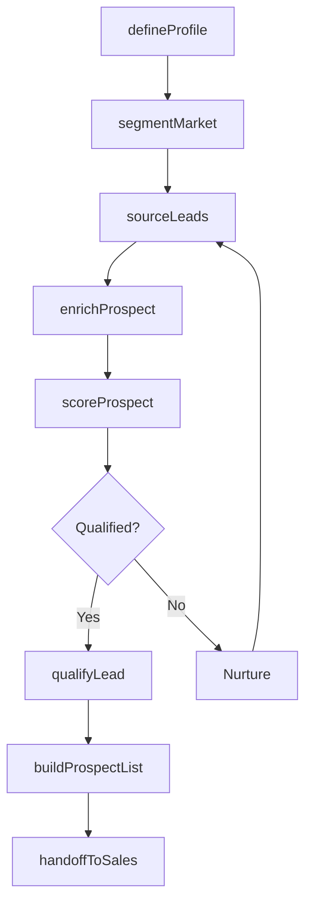
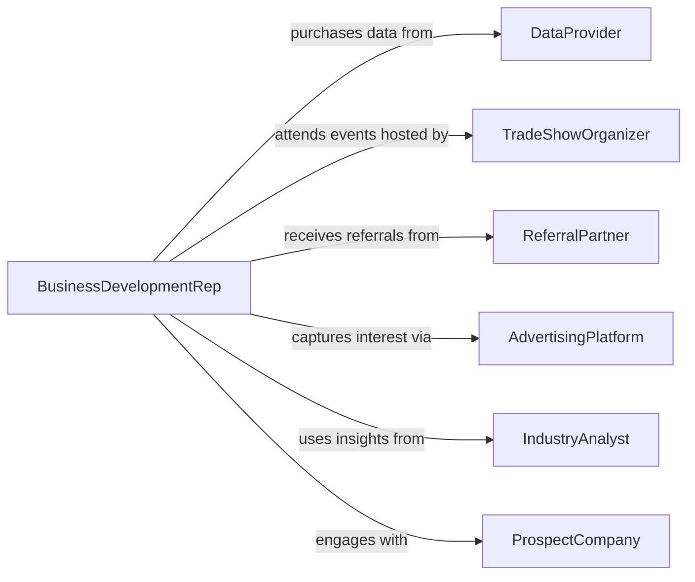

# Identify Potential Customers

> Business-as-Code definition for identifying potential customers. Models the process of discovering, qualifying, and segmenting prospective buyers through market research, data analysis, and lead generation activities.

## Overview

Identifying potential customers involves systematic research and analysis to discover individuals or organizations that match an ideal customer profile. This definition covers the full prospect discovery lifecycle from market segmentation and lead sourcing through qualification scoring and pipeline handoff. It integrates with CRM systems, marketing automation platforms, and third-party data providers to build a reliable stream of qualified prospects.

## Actors

| Actor | Description |
|-------|-------------|
| DataProvider | Supplies firmographic, demographic, and intent data for prospect research |
| TradeShowOrganizer | Hosts industry events where potential customers can be identified |
| ReferralPartner | Recommends prospects through existing business relationships |
| AdvertisingPlatform | Generates inbound interest through targeted campaigns |
| IndustryAnalyst | Publishes market reports identifying growth segments and buyer trends |
| ProspectCompany | An organization being evaluated as a potential customer |

## Roles

| Role | Description |
|------|-------------|
| BusinessDevelopmentRep | Sources and qualifies new leads through outbound prospecting |
| MarketingAnalyst | Segments markets and identifies target audiences using data analysis |
| SalesManager | Oversees pipeline development and prospect qualification standards |
| AccountExecutive | Engages qualified prospects to advance them through the sales funnel |

## Entities

| Entity | Description |
|--------|-------------|
| Prospect | An individual or organization identified as a potential customer |
| IdealCustomerProfile | A set of attributes defining the target buyer persona |
| LeadSource | The channel or method through which a prospect was discovered |
| QualificationScore | A composite rating of a prospect's fit and purchase intent |
| MarketSegment | A defined group of buyers sharing common characteristics |
| ProspectList | A curated collection of prospects for targeted outreach |
| IntentSignal | Behavioral data indicating a prospect's interest in a product or service |
| EnrichmentRecord | Additional firmographic or contact data appended to a prospect profile |

## Actions

| Action | Description |
|--------|-------------|
| defineProfile | Create or update an ideal customer profile with target attributes |
| segmentMarket | Divide the addressable market into targetable segments |
| sourceLeads | Discover new prospects from data providers, events, or referrals |
| enrichProspect | Append firmographic, technographic, or contact data to a prospect record |
| scoreProspect | Evaluate a prospect against the ideal customer profile and intent signals |
| qualifyLead | Determine if a prospect meets threshold criteria for sales engagement |
| buildProspectList | Compile a filtered and scored list of prospects for outreach campaigns |
| handoffToSales | Transfer a qualified prospect to the sales pipeline |

## Events

| Event | Description |
|-------|-------------|
| profileDefined | An ideal customer profile has been created or updated |
| marketSegmented | A market has been divided into targetable buyer segments |
| leadsSourced | New prospects have been discovered from a given source |
| prospectEnriched | Additional data has been appended to a prospect record |
| prospectScored | A qualification score has been assigned to a prospect |
| leadQualified | A prospect has passed qualification thresholds |
| prospectListBuilt | A curated list of prospects has been compiled |
| leadHandedOff | A qualified lead has been transferred to the sales team |

## Searches

| Search | Description |
|--------|-------------|
| findProspects | Search prospects by industry, size, location, or score |
| getLeadsBySource | Retrieve prospects grouped by their originating lead source |
| getQualifiedLeads | List prospects that have passed qualification thresholds |
| getIntentSignals | Find prospects exhibiting specific buying intent behaviors |
| getSegments | Retrieve defined market segments with prospect counts |

## Workflow



## Actor Relationships



## Usage

### Calling Actions

```typescript
import { identifyPotentialCustomers } from '@headlessly/identify-potential-customers'

const prospecting = identifyPotentialCustomers()

// Define the ideal customer profile
const profile = await prospecting.defineProfile({
  industry: ['SaaS', 'FinTech'],
  companySize: { min: 50, max: 500 },
  revenue: { min: 5000000, max: 100000000 },
  geography: ['US', 'CA', 'UK'],
  technographics: ['Salesforce', 'AWS']
})

// Source leads from a data provider
const leads = await prospecting.sourceLeads({
  profileId: profile.id,
  source: 'ZoomInfo',
  limit: 500
})

// Enrich and score each prospect
for (const lead of leads.items) {
  await prospecting.enrichProspect({
    prospectId: lead.id,
    providers: ['Clearbit', 'Bombora']
  })

  await prospecting.scoreProspect({
    prospectId: lead.id,
    profileId: profile.id
  })
}
```

### Event-Driven Automation

```typescript
// Auto-qualify and route high-scoring leads
prospecting.prospectScored(async ({ prospectId, score }) => {
  if (score.overall >= 80) {
    await prospecting.qualifyLead({ prospectId })
    await prospecting.handoffToSales({
      prospectId,
      assignTo: 'round-robin',
      priority: 'high'
    })
  }
})

// Notify sales when a prospect list is ready for outreach
prospecting.prospectListBuilt(async ({ listId, count, segment }) => {
  await notify({
    to: 'sales-team',
    message: `New prospect list ready: ${count} qualified leads in ${segment}`
  })
})
```
