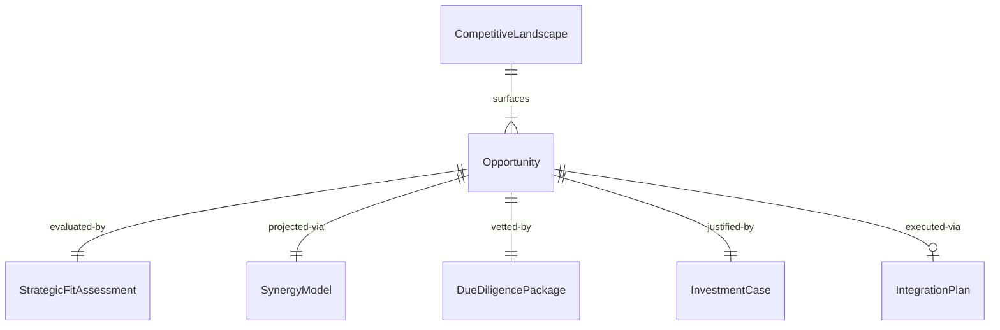
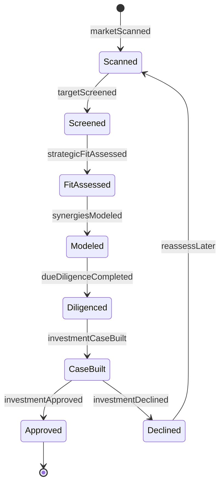
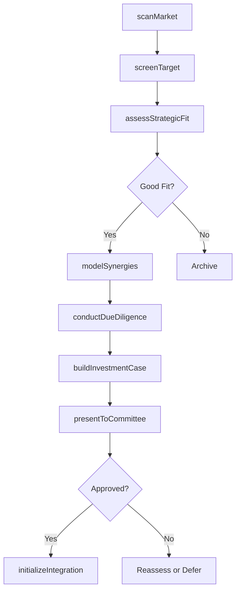
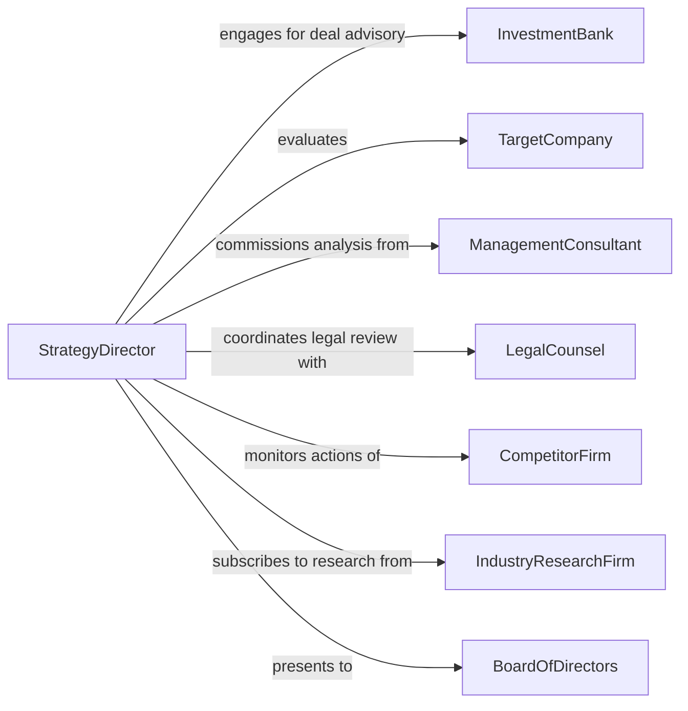

# Identify Strategic Business Investment Opportunities

> Business-as-Code definition for identifying strategic business investment opportunities. Models the process of evaluating mergers, acquisitions, joint ventures, and capital expenditure projects that align with long-term corporate strategy and competitive positioning.

## Overview

Identifying strategic business investment opportunities focuses on discovering and evaluating corporate-level investments such as acquisitions, partnerships, market expansions, and transformative capital projects. Unlike portfolio-level financial investing, this definition addresses operational synergies, competitive moats, market positioning, and organizational capabilities. It provides actions for opportunity scanning, strategic fit assessment, due diligence orchestration, and investment committee presentation.

## Actors

| Actor | Description |
|-------|-------------|
| InvestmentBank | Advises on deal structure, valuation, and transaction execution |
| TargetCompany | An organization being evaluated as a potential acquisition or partnership candidate |
| ManagementConsultant | Provides strategic analysis and market positioning insights |
| LegalCounsel | Reviews regulatory, antitrust, and contractual implications of proposed investments |
| CompetitorFirm | Rival organization whose actions influence the strategic landscape |
| IndustryResearchFirm | Publishes market size, growth forecasts, and competitive intelligence |
| BoardOfDirectors | Provides governance oversight and final approval on major investments |

## Roles

| Role | Description |
|------|-------------|
| StrategyDirector | Leads the identification and evaluation of strategic investments |
| CorporateDevelopmentAnalyst | Conducts financial modeling, synergy analysis, and target screening |
| ChiefFinancialOfficer | Assesses capital allocation and balance sheet impact of proposed investments |
| BusinessUnitHead | Evaluates operational fit and integration potential for their domain |

## Entities

| Entity | Description |
|--------|-------------|
| Opportunity | A strategic investment candidate such as an acquisition target or joint venture |
| StrategicFitAssessment | An evaluation of how well an opportunity aligns with corporate strategy |
| SynergyModel | A financial projection of cost savings or revenue uplift from an investment |
| DueDiligencePackage | A comprehensive review of financial, legal, and operational risks |
| InvestmentCase | A documented business case summarizing rationale, risks, and expected returns |
| CompetitiveLandscape | An analysis of market dynamics and competitor positioning |
| TermSheet | A preliminary agreement outlining key deal terms and conditions |
| IntegrationPlan | A post-investment roadmap for combining operations and realizing synergies |

## Actions

| Action | Description |
|--------|-------------|
| scanMarket | Survey the competitive landscape for potential strategic investments |
| screenTarget | Apply quantitative and qualitative filters to identify viable candidates |
| assessStrategicFit | Evaluate how an opportunity aligns with corporate objectives and capabilities |
| modelSynergies | Project financial benefits from combining operations with a target |
| conductDueDiligence | Perform comprehensive financial, legal, and operational review |
| buildInvestmentCase | Assemble the business case with financials, risks, and strategic rationale |
| presentToCommittee | Submit the investment case for executive or board review |
| initializeIntegration | Create the post-close integration plan and assign workstreams |

## Events

| Event | Description |
|-------|-------------|
| marketScanned | A strategic landscape survey has been completed |
| targetScreened | A candidate has passed initial screening criteria |
| strategicFitAssessed | An opportunity's alignment with corporate strategy has been evaluated |
| synergiesModeled | Financial projections for an investment have been completed |
| dueDiligenceCompleted | A comprehensive review of the target has been finalized |
| investmentCaseBuilt | The business case for an investment is ready for review |
| investmentApproved | The board or executive committee has approved the investment |
| investmentDeclined | The investment has been rejected or deferred |

## Searches

| Search | Description |
|--------|-------------|
| findTargets | Search potential acquisition or partnership targets by industry, size, or geography |
| getStrategicAssessments | Retrieve fit assessments for candidates under evaluation |
| getSynergyModels | Query synergy projections by target or investment type |
| getDueDiligenceStatus | Check the progress and findings of active due diligence reviews |
| getInvestmentCases | List investment cases by status, sector, or deal size |
| getCompetitiveLandscape | Retrieve current competitive positioning analysis for a market segment |


## Entity Relationships



## State Diagram



## Workflow



## Actor Relationships



## Usage

### Calling Actions

```typescript
import { identifyStrategicBusinessInvestmentOpportunities } from '@headlessly/identify-strategic-business-investment-opportunities'

const strategy = identifyStrategicBusinessInvestmentOpportunities()

// Scan market for acquisition targets in the healthcare SaaS space
const landscape = await strategy.scanMarket({
  sectors: ['Healthcare IT', 'Clinical SaaS'],
  geography: 'North America',
  revenueRange: { min: 10000000, max: 100000000 }
})

// Screen and assess a specific target
const target = await strategy.screenTarget({
  companyId: landscape.candidates[0].id,
  criteria: { minGrossMargin: 0.65, maxChurnRate: 0.08, minRevenueGrowth: 0.20 }
})

const fit = await strategy.assessStrategicFit({
  targetId: target.id,
  objectives: ['market-expansion', 'product-portfolio', 'talent-acquisition']
})

// Model synergies and build the investment case
await strategy.modelSynergies({
  targetId: target.id,
  scenarios: ['conservative', 'base', 'optimistic'],
  integrationCosts: 5000000
})

await strategy.buildInvestmentCase({
  targetId: target.id,
  dealStructure: 'all-cash',
  proposedValuation: 85000000
})
```

### Event-Driven Automation

```typescript
// Route approved investments to integration planning
strategy.investmentApproved(async ({ targetId, dealValue, closingDate }) => {
  await strategy.initializeIntegration({
    targetId,
    workstreams: ['finance', 'technology', 'people', 'operations'],
    targetCloseDate: closingDate
  })
})

// Alert strategy team when due diligence reveals material findings
strategy.dueDiligenceCompleted(async ({ targetId, findings }) => {
  if (findings.materialRisks.length > 0) {
    await notify({
      to: 'corporate-development',
      message: `Material risks found in DD for ${targetId}: ${findings.materialRisks.length} items require review`
    })
  }
})
```
