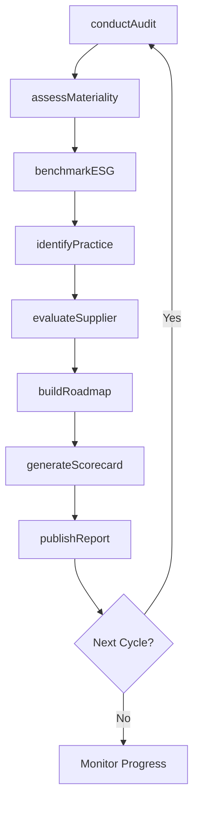
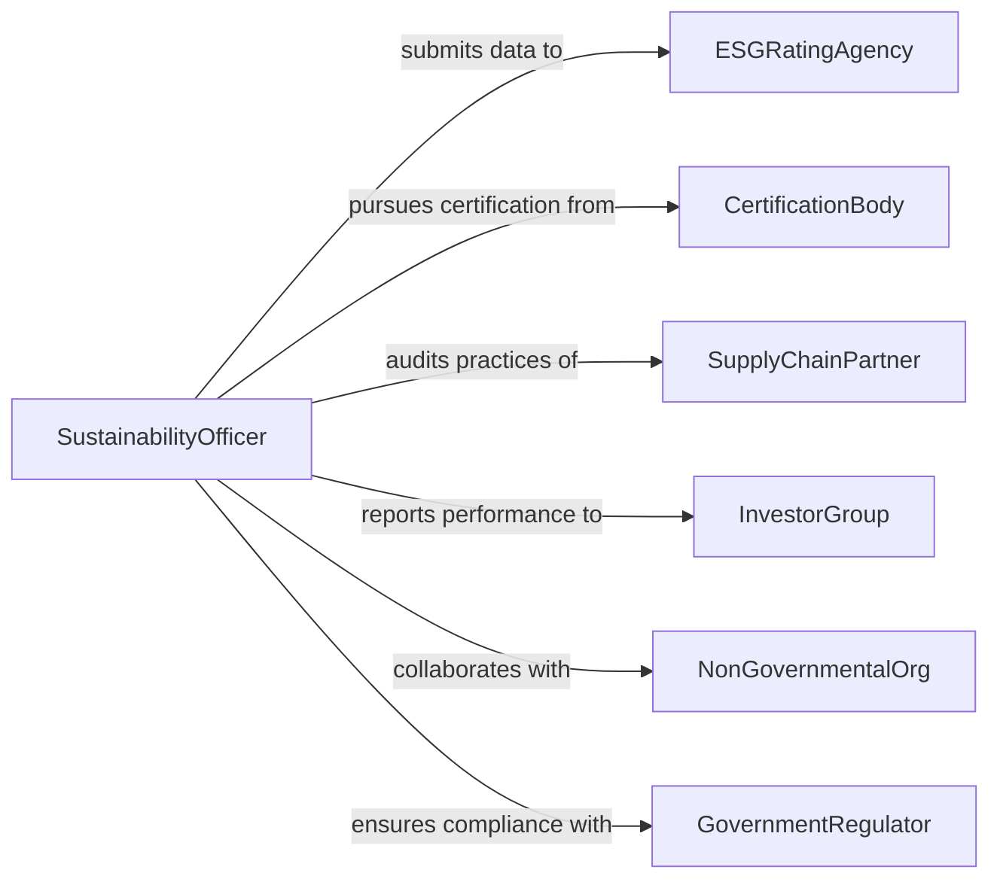

# Identify Sustainable Business Practices

> Business-as-Code definition for identifying sustainable business practices. Models the process of evaluating organizational operations against environmental, social, and governance criteria to discover practices that balance profitability with long-term sustainability.

## Overview

Identifying sustainable business practices involves assessing supply chains, manufacturing processes, workforce policies, and corporate governance against ESG (Environmental, Social, and Governance) frameworks to find opportunities for responsible operations. This definition provides actions for conducting sustainability audits, mapping material issues, benchmarking against reporting standards, and building an adoption roadmap. It supports alignment with frameworks such as GRI, SASB, UN Sustainable Development Goals, and B Corp certification requirements.

## Actors

| Actor | Description |
|-------|-------------|
| ESGRatingAgency | Evaluates and rates organizations on environmental, social, and governance performance |
| CertificationBody | Issues sustainability certifications such as B Corp, ISO 14001, or Fair Trade |
| SupplyChainPartner | Provides materials or services whose practices affect overall sustainability |
| InvestorGroup | Demands ESG disclosures and responsible business practices |
| NonGovernmentalOrg | Advocates for environmental or social standards and monitors corporate behavior |
| GovernmentRegulator | Sets sustainability reporting requirements and environmental legislation |

## Roles

| Role | Description |
|------|-------------|
| SustainabilityOfficer | Leads the identification and adoption of sustainable business practices |
| ESGAnalyst | Evaluates organizational practices against ESG frameworks and benchmarks |
| SupplyChainManager | Assesses supplier sustainability and identifies responsible sourcing opportunities |
| CorporateSecretary | Manages governance disclosures and stakeholder reporting requirements |

## Entities

| Entity | Description |
|--------|-------------|
| Practice | A specific operational behavior or policy evaluated for sustainability |
| MaterialityAssessment | An analysis identifying which sustainability topics are most significant |
| ESGScorecard | A composite rating of organizational performance across ESG dimensions |
| SustainabilityFramework | A reference standard such as GRI, SASB, or TCFD used for evaluation |
| AdoptionRoadmap | A phased plan for implementing identified sustainable practices |
| StakeholderReport | A disclosure document communicating sustainability performance and goals |
| SupplierAudit | An evaluation of a supply chain partner's sustainability practices |
| ImpactMetric | A quantitative measure of environmental or social performance |

## Actions

| Action | Description |
|--------|-------------|
| conductAudit | Evaluate current business practices against sustainability criteria |
| assessMateriality | Identify which sustainability topics are most significant for the organization |
| benchmarkESG | Compare organizational ESG performance against industry peers and standards |
| identifyPractice | Flag a specific sustainable practice suitable for adoption |
| evaluateSupplier | Audit a supply chain partner's sustainability performance |
| buildRoadmap | Create a phased plan for adopting identified sustainable practices |
| generateScorecard | Produce a composite ESG performance rating for the organization |
| publishReport | Prepare and distribute a stakeholder sustainability report |

## Events

| Event | Description |
|-------|-------------|
| auditCompleted | A sustainability audit of business practices has been finalized |
| materialityAssessed | Key sustainability topics have been identified and prioritized |
| esgBenchmarked | Organizational ESG performance has been compared against peers |
| practiceIdentified | A specific sustainable practice has been flagged for adoption |
| supplierEvaluated | A supply chain partner's sustainability audit is complete |
| roadmapBuilt | An adoption plan for sustainable practices has been created |
| scorecardGenerated | An ESG performance scorecard has been produced |
| reportPublished | A stakeholder sustainability report has been released |

## Searches

| Search | Description |
|--------|-------------|
| findPractices | List identified sustainable practices by category, impact, or adoption status |
| getMaterialityResults | Retrieve materiality assessment outcomes by topic or stakeholder group |
| getESGBenchmarks | Look up peer ESG performance for comparison |
| getSupplierAudits | Query supplier sustainability evaluations by partner or rating |
| getRoadmap | Retrieve the current sustainable practice adoption plan |

## Workflow



## Actor Relationships



## Usage

### Calling Actions

```typescript
import { identifySustainableBusinessPractices } from '@headlessly/identify-sustainable-business-practices'

const sustainability = identifySustainableBusinessPractices()

// Conduct a sustainability audit across operations
const audit = await sustainability.conductAudit({
  scope: ['manufacturing', 'supply-chain', 'workforce', 'governance'],
  framework: 'GRI-Standards',
  period: { start: '2025-01-01', end: '2025-12-31' }
})

// Assess materiality to prioritize focus areas
const materiality = await sustainability.assessMateriality({
  auditId: audit.id,
  stakeholders: ['investors', 'employees', 'communities', 'customers'],
  method: 'double-materiality'
})

// Benchmark and identify specific practices
await sustainability.benchmarkESG({
  auditId: audit.id,
  peerGroup: 'SP500-Manufacturing',
  frameworks: ['SASB', 'TCFD']
})

const practice = await sustainability.identifyPractice({
  category: 'circular-economy',
  description: 'Implement closed-loop packaging return program',
  estimatedImpact: { wasteReduction: 0.40, costSavings: 120000 }
})
```

### Event-Driven Automation

```typescript
// Notify stakeholders when ESG scorecard improves
sustainability.scorecardGenerated(async ({ scorecardId, overall, previous }) => {
  if (overall > previous) {
    await notify({
      to: 'investor-relations',
      message: `ESG score improved from ${previous} to ${overall}`
    })
  }
})

// Trigger corrective action when a supplier falls below standards
sustainability.supplierEvaluated(async ({ supplierId, score, threshold }) => {
  if (score < threshold) {
    await procurement.initiateCorrectiveAction({
      supplierId,
      reason: 'sustainability-non-compliance',
      deadline: '30-days'
    })
  }
})
```
