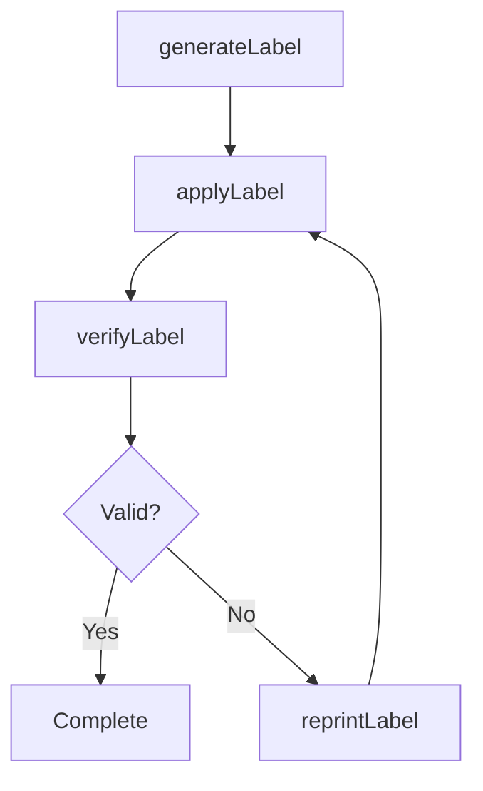
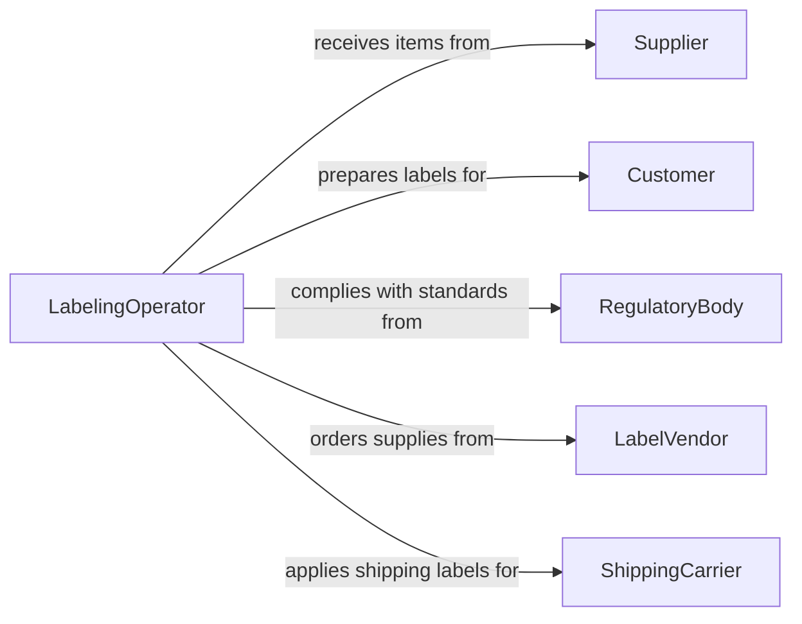

# Apply Identification Labels Tags

> Business-as-Code definition for applying identification labels or tags to materials and objects. Models the full lifecycle of label and tag application including design, printing, placement, verification, and tracking for inventory, compliance, and traceability purposes.

## Overview

Applying identification labels or tags involves selecting, generating, and affixing labels, barcodes, RFID tags, or other identifiers to products, materials, equipment, and assets. This activity ensures items can be tracked, inventoried, and traced throughout their lifecycle. It spans industries from manufacturing and warehousing to healthcare and retail, supporting regulatory compliance, quality control, and supply chain visibility.

## Actors

| Actor | Description |
|-------|-------------|
| Supplier | Provides raw materials or products requiring identification |
| Customer | Receives labeled goods and relies on tags for product information |
| RegulatoryBody | Mandates labeling standards and conducts audits |
| LabelVendor | Supplies label stock, printers, and tagging equipment |
| ShippingCarrier | Uses labels for routing, tracking, and delivery |

## Roles

| Role | Description |
|------|-------------|
| LabelingOperator | Applies labels and tags to items on the production or warehouse floor |
| QualityInspector | Verifies label accuracy, placement, and readability |
| InventoryCoordinator | Manages label assignments and tracks labeled inventory |
| ComplianceSpecialist | Ensures labels meet regulatory and customer requirements |

## Entities

| Entity | Description |
|--------|-------------|
| Label | A printed or electronic identifier affixed to an item |
| Tag | A physical or RFID-based identifier attached to a product or asset |
| LabelTemplate | A predefined design specifying label layout, content, and format |
| LabelBatch | A group of labels generated for a production run or shipment |
| ScanRecord | A log entry captured when a label or tag is scanned |
| LabelingStandard | Specification defining required label content, size, and placement |

## Actions

| Action | Description |
|--------|-------------|
| generateLabel | Create a label or tag based on a template and item data |
| applyLabel | Affix a label or tag to a specific item or container |
| verifyLabel | Scan and validate that a label is accurate and readable |
| reprintLabel | Generate a replacement for a damaged or incorrect label |
| assignTagToAsset | Link an RFID or barcode tag to an asset record |
| deactivateTag | Remove a tag from active tracking |
| updateLabelTemplate | Modify the design or content of a label template |

## Events

| Event | Description |
|-------|-------------|
| labelGenerated | A new label or tag has been created |
| labelApplied | A label or tag has been affixed to an item |
| labelVerified | A label has been confirmed as accurate and scannable |
| labelVerificationFailed | A label scan revealed errors or unreadability |
| labelReprinted | A replacement label has been generated |
| tagAssigned | An RFID or barcode tag has been linked to an asset |
| tagDeactivated | A tag has been removed from active tracking |

## Searches

| Search | Description |
|--------|-------------|
| findLabels | Retrieve labels by item, batch, date, or status |
| getScanHistory | List scan records for a specific label or tag |
| findUnlabeledItems | Locate items that have not yet been labeled |
| getLabelTemplates | Retrieve available label templates by product type or standard |

## Workflow



## Actor Relationships



## Usage

### Calling Actions

```typescript
import { applyIdentificationLabelsTags } from '@headlessly/apply-identification-labels-tags'

const labeling = applyIdentificationLabelsTags()

// Generate a label for a product
const label = await labeling.generateLabel({
  templateId: 'warehouse-barcode-v2',
  itemData: {
    sku: 'WH-48291',
    description: 'Steel Bracket Assembly',
    lotNumber: 'LOT-2026-0315',
    weight: '2.4kg'
  }
})

// Apply the label to the item
await labeling.applyLabel({
  labelId: label.id,
  itemId: 'item-93847',
  location: 'front-panel',
  appliedBy: 'operator-1142'
})

// Verify the label is scannable
const verification = await labeling.verifyLabel({
  labelId: label.id,
  scanMethod: 'barcode-reader'
})
```

### Event-Driven Automation

```typescript
// Automatically reprint on verification failure
labeling.labelVerificationFailed(async ({ labelId, itemId, reason }) => {
  await labeling.reprintLabel({ labelId })
  await notify({
    to: 'quality-team',
    message: `Label ${labelId} failed verification on item ${itemId}: ${reason}`
  })
})

// Track label application for inventory
labeling.labelApplied(async ({ labelId, itemId }) => {
  await updateInventory({
    itemId,
    status: 'labeled',
    labelId
  })
})
```
