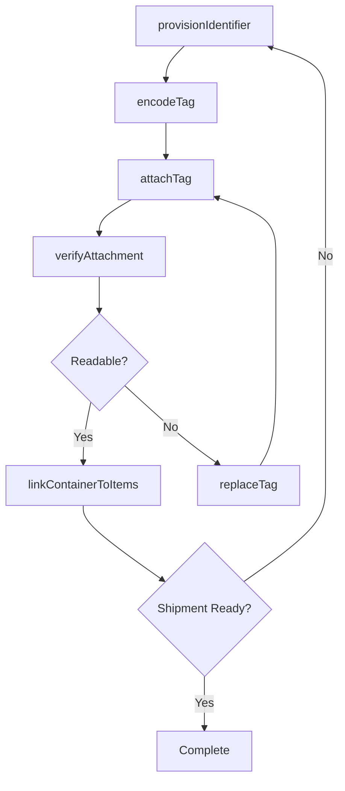
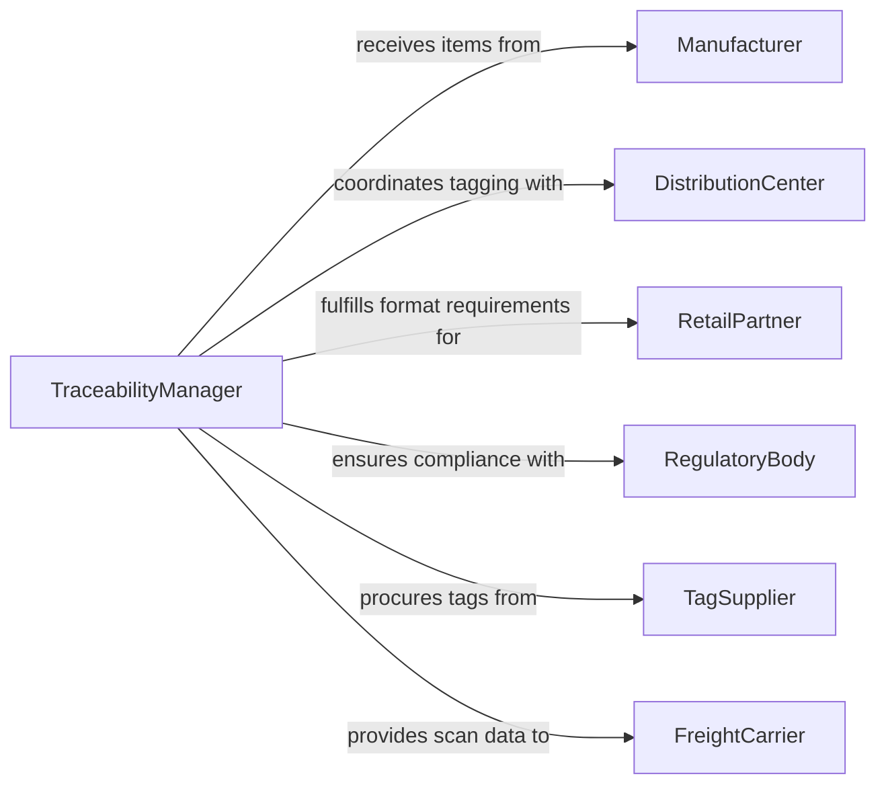

# Attach Identification Information to Products, Items, or Containers

> Business-as-Code definition for attaching identification information to products, items, or containers. Models the process of tagging, marking, and encoding assets with unique identifiers for traceability across supply chain, warehousing, and retail operations.

## Overview

Attaching identification information encompasses the physical and digital processes of affixing barcodes, RFID tags, serial numbers, and compliance markings to products, components, or shipping containers. This definition covers tag provisioning, encoding, attachment verification, and lifecycle management. It enables end-to-end traceability from manufacturing origin through distribution to the point of sale or end consumer.

## Actors

| Actor | Description |
|-------|-------------|
| Manufacturer | Produces items that require unique identification before shipment |
| DistributionCenter | Receives tagged items and may apply additional container-level identifiers |
| RetailPartner | Requires specific identification formats for shelf-ready merchandise |
| RegulatoryBody | Mandates identification standards such as UDI for medical devices or serialization for pharmaceuticals |
| TagSupplier | Provides RFID tags, barcode labels, and encoding hardware |
| FreightCarrier | Scans container identifiers for shipment tracking |

## Roles

| Role | Description |
|------|-------------|
| TaggingTechnician | Applies identification tags or labels to items and containers |
| TraceabilityManager | Oversees identification standards and data integrity across the supply chain |
| WarehouseAssociate | Verifies identification on inbound and outbound shipments |
| ComplianceOfficer | Ensures identification practices meet regulatory and customer requirements |

## Entities

| Entity | Description |
|--------|-------------|
| Identifier | A unique code assigned to a product, item, or container |
| Tag | A physical medium such as an RFID chip, barcode label, or engraved plate |
| Container | A shipping unit such as a pallet, carton, or crate requiring identification |
| Product | A finished good or component requiring traceability marking |
| EncodingProfile | Configuration defining the data structure and format for an identifier |
| AttachmentRecord | An audit entry confirming when and where identification was applied |
| VerificationScan | A record of a scan event confirming tag readability and data accuracy |
| ComplianceStandard | A regulatory or industry specification governing identification requirements |

## Actions

| Action | Description |
|--------|-------------|
| provisionIdentifier | Generate a unique identifier for a product, item, or container |
| encodeTag | Write data to an RFID tag or generate a printable barcode |
| attachTag | Record that identification has been physically applied to an item |
| verifyAttachment | Scan an attached tag to confirm readability and data correctness |
| replaceTag | Remove a damaged or unreadable tag and apply a replacement |
| decommissionTag | Mark an identifier as retired when a product is consumed or disposed |
| bulkProvision | Generate identifiers for an entire batch or shipment in one operation |
| linkContainerToItems | Associate item-level identifiers with a parent container identifier |

## Events

| Event | Description |
|-------|-------------|
| identifierProvisioned | A unique identifier has been generated and registered |
| tagEncoded | Data has been successfully written to a tag or label |
| tagAttached | Identification has been confirmed as applied to the target item |
| attachmentVerified | A verification scan confirmed the tag is readable and accurate |
| tagFailed | A tag was found unreadable or incorrectly encoded during verification |
| tagReplaced | A damaged tag has been replaced with a new one |
| tagDecommissioned | An identifier has been retired from active use |
| containerLinked | Item-level identifiers have been associated with a container |

## Searches

| Search | Description |
|--------|-------------|
| findByIdentifier | Look up the product, item, or container associated with a given identifier |
| findTagsByBatch | Retrieve all tags provisioned for a specific production batch |
| getAttachmentHistory | Query the timeline of tagging events for a specific item |
| getFailedTags | List tags that failed verification within a given period |
| findContainerContents | List all item identifiers linked to a specific container |

## Workflow



## Actor Relationships



## Usage

### Calling Actions

```typescript
import { attachIdentificationInformationProductsItems } from '@headlessly/attach-identification-information-products-items'

const identification = attachIdentificationInformationProductsItems()

// Provision identifiers for a batch of medical devices
const identifiers = await identification.bulkProvision({
  batchId: 'BATCH-2026-MED-0193',
  quantity: 1000,
  encodingProfile: 'UDI-GUDID',
  productCode: 'MDX-4500'
})

// Encode and attach a tag to a specific unit
await identification.encodeTag({
  identifierId: identifiers.items[0].id,
  format: 'RFID-EPC-Gen2',
  data: { gtin: '00812345678901', serial: 'SN-00001' }
})

await identification.attachTag({
  identifierId: identifiers.items[0].id,
  location: 'packaging-line-03',
  operator: 'tech-jsmith'
})

// Verify the attachment
const result = await identification.verifyAttachment({
  identifierId: identifiers.items[0].id,
  scannerId: 'rfid-portal-07'
})
```

### Event-Driven Automation

```typescript
// Route failed tags for immediate replacement
identification.tagFailed(async ({ identifierId, reason, location }) => {
  await notify({
    to: 'tagging-station',
    message: `Tag verification failed at ${location}: ${reason}`
  })
  await identification.replaceTag({ identifierId, reason })
})

// Update inventory system when container is fully linked
identification.containerLinked(async ({ containerId, itemCount }) => {
  await warehouse.markContainerReady({
    containerId,
    itemCount,
    status: 'ready-for-shipment'
  })
})
```
