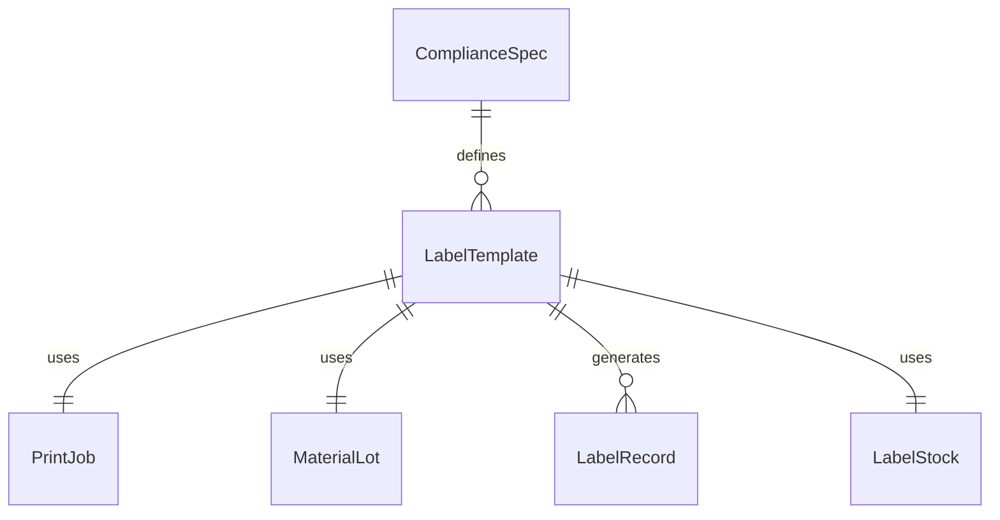
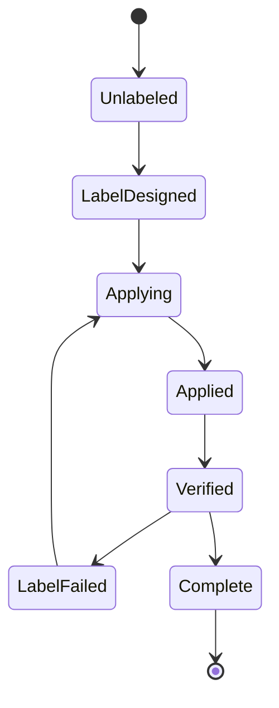
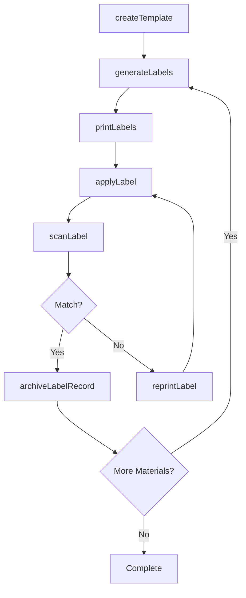
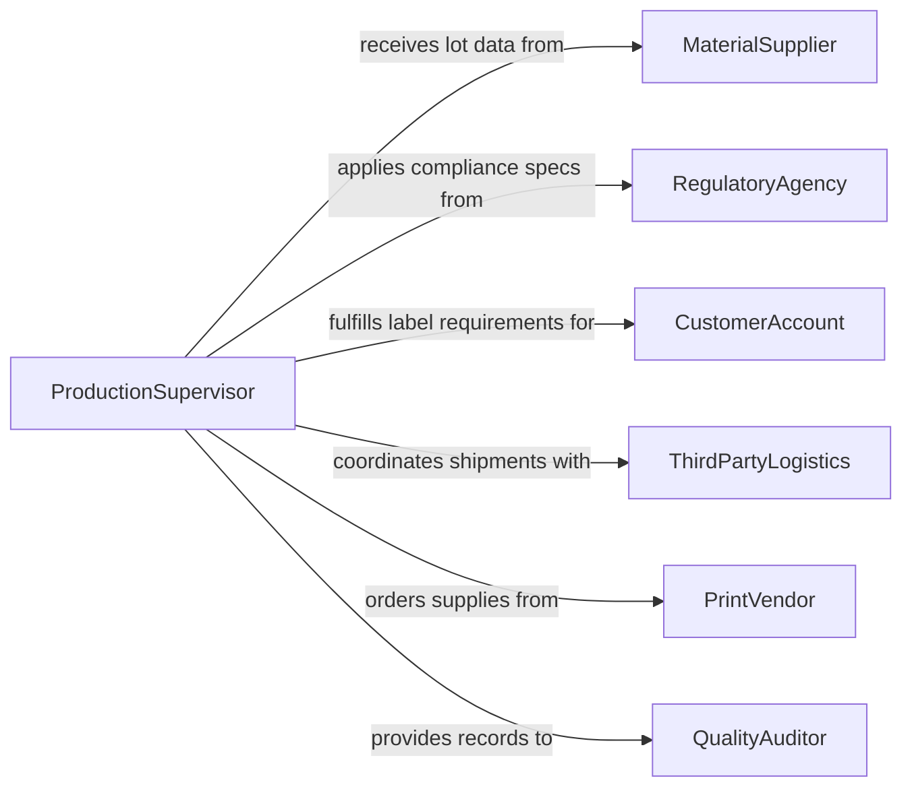

# Label Production Materials

> Business-as-Code definition for production material labeling. Models the end-to-end process of generating, applying, and verifying labels on raw materials, work-in-progress, and finished goods within manufacturing and warehousing operations.

## Overview

Production material labeling ensures that every item moving through a supply chain or manufacturing facility carries accurate identification, traceability codes, and regulatory compliance markings. This definition exposes actions for creating label templates, printing and applying labels, scanning for verification, and managing label inventories. It supports barcode, QR code, RFID, and human-readable label formats across diverse material types.

## Actors

| Actor | Description |
|-------|-------------|
| MaterialSupplier | Provides raw materials along with certificates of analysis and lot numbers |
| RegulatoryAgency | Sets labeling requirements for hazardous materials, food safety, or pharmaceuticals |
| CustomerAccount | Specifies custom labeling requirements for outbound shipments |
| ThirdPartyLogistics | Handles labeled materials for warehousing and distribution |
| PrintVendor | Supplies label stock, ribbons, and printing consumables |
| QualityAuditor | Verifies labeling accuracy during periodic compliance audits |

## Roles

| Role | Description |
|------|-------------|
| LabelingOperator | Applies labels to materials on the production line |
| QualityInspector | Verifies label accuracy and adhesion standards |
| ProductionSupervisor | Oversees labeling operations and resolves exceptions |
| InventoryController | Manages label stock and reorder thresholds |

## Entities

| Entity | Description |
|--------|-------------|
| LabelTemplate | A reusable design specifying layout, data fields, and barcode format |
| PrintJob | A batch request to produce a set of labels for specific materials |
| MaterialLot | A group of production materials sharing a common origin and lot number |
| LabelRecord | An audit trail entry linking a label to its applied material |
| ComplianceSpec | Regulatory or customer requirements governing label content |
| LabelStock | Physical inventory of blank label media and printing supplies |
| ScanEvent | A verification record from barcode or RFID scanning after application |

## Actions

| Action | Description |
|--------|-------------|
| createTemplate | Define a new label layout with data fields and formatting rules |
| generateLabels | Produce label data for a batch of materials based on a template |
| printLabels | Send label data to a printer or encoding device |
| applyLabel | Record that a label has been physically attached to a material |
| scanLabel | Verify label content by scanning barcode, QR code, or RFID tag |
| reprintLabel | Reissue a label due to damage, error, or misapplication |
| archiveLabelRecord | Store completed label records for traceability and audit |
| updateTemplate | Modify an existing label template to reflect new requirements |

## Events

| Event | Description |
|-------|-------------|
| templateCreated | A new label template has been registered in the system |
| labelsGenerated | Label data for a material batch has been produced |
| labelsPrinted | A print job has completed successfully |
| labelApplied | A label has been confirmed attached to a specific material lot |
| labelScanned | A label scan verification has been recorded |
| labelMismatchDetected | Scanned label data does not match expected material information |
| labelReprinted | A replacement label has been issued |
| labelStockLow | Label media inventory has fallen below reorder threshold |

## Searches

| Search | Description |
|--------|-------------|
| findLabelsByLot | Retrieve all labels associated with a specific material lot |
| findTemplates | List label templates filtered by product type or compliance spec |
| getPrintHistory | Query print jobs by date range, printer, or operator |
| getMismatches | Find all label mismatch events within a given period |
| getLabelStock | Check current inventory levels of label media and supplies |


## Entity Relationships



## State Diagram



## Workflow



## Actor Relationships



## Usage

### Calling Actions

```typescript
import { labelProductionMaterials } from '@headlessly/label-production-materials'

const labeling = labelProductionMaterials()

// Create a label template for chemical raw materials
const template = await labeling.createTemplate({
  name: 'Chemical Raw Material Label',
  fields: ['lotNumber', 'materialName', 'hazardClass', 'expirationDate'],
  barcodeFormat: 'GS1-128',
  complianceSpec: 'GHS-2024'
})

// Generate and print labels for an incoming lot
const labels = await labeling.generateLabels({
  templateId: template.id,
  lotId: 'LOT-2026-04821',
  quantity: 500
})

await labeling.printLabels({
  printJobId: labels.printJobId,
  printer: 'warehouse-zebra-03'
})

// Verify applied labels
const scan = await labeling.scanLabel({
  labelId: labels.items[0].id,
  scannerId: 'handheld-rf-12'
})
```

### Event-Driven Automation

```typescript
// Alert when a label mismatch is detected on the line
labeling.labelMismatchDetected(async ({ lotId, labelId, expected, actual }) => {
  await notify({
    to: 'quality-team',
    message: `Label mismatch on lot ${lotId}: expected ${expected}, scanned ${actual}`
  })
  await labeling.reprintLabel({ labelId, reason: 'mismatch' })
})

// Auto-reorder label stock when inventory is low
labeling.labelStockLow(async ({ stockType, currentLevel, reorderThreshold }) => {
  await purchaseOrder.create({
    vendor: 'PrintVendor',
    item: stockType,
    quantity: reorderThreshold * 2
  })
})
```
