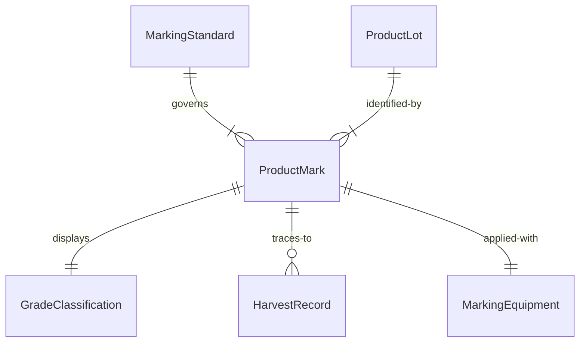
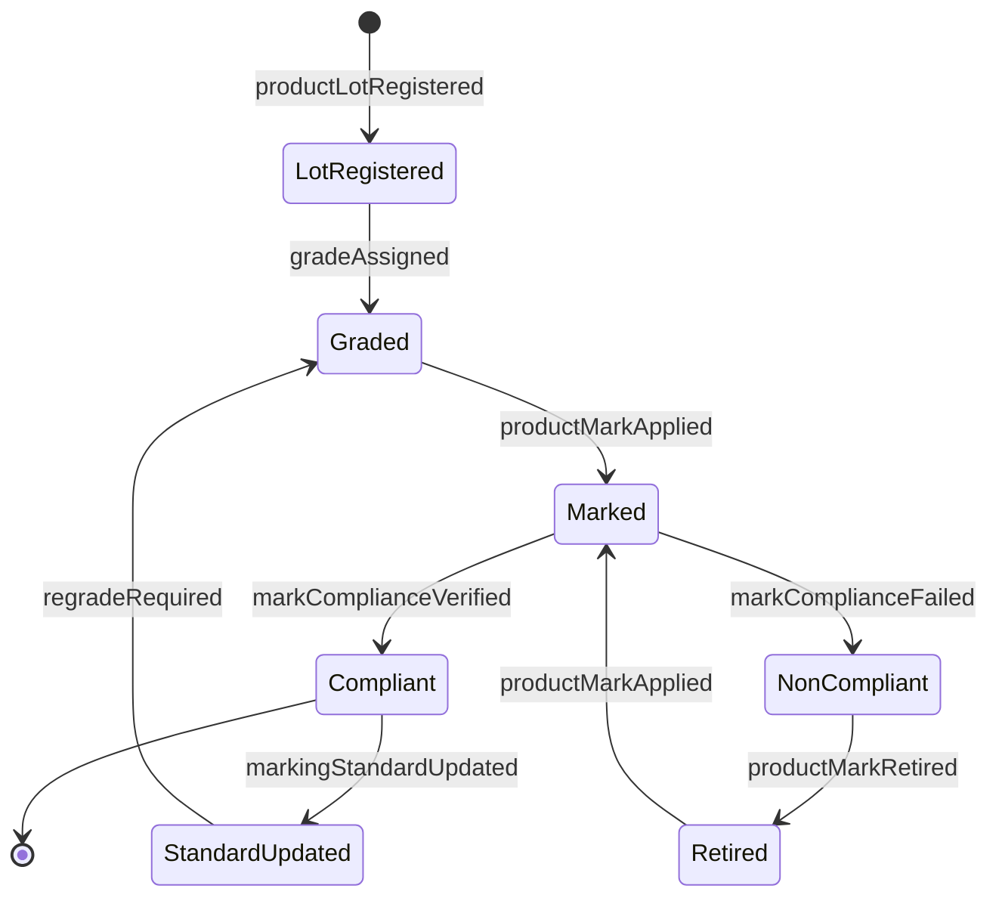
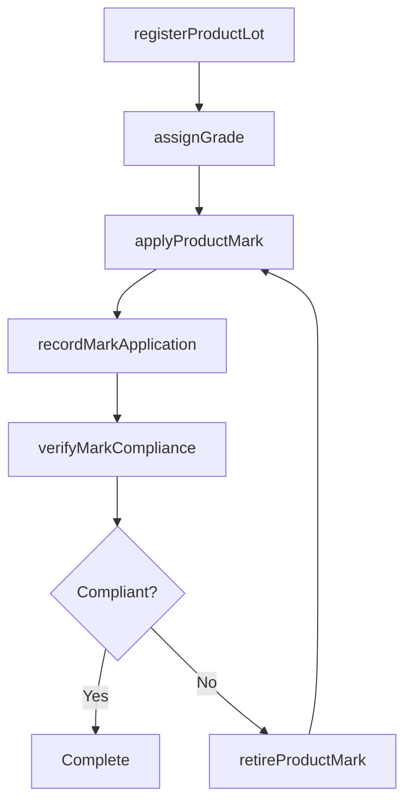
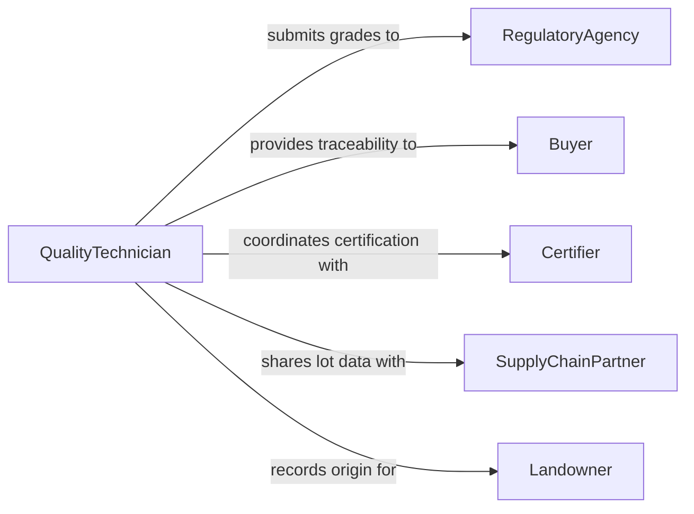

# Mark Agricultural Forestry Products Identification

> Business-as-Code definition for marking agricultural and forestry products for identification. Models the complete process of applying marks, stamps, grades, and tags to crops, timber, livestock, and other agricultural or forestry products for traceability, grading, and regulatory compliance.

## Overview

Marking agricultural and forestry products for identification encompasses the processes of grading, stamping, tagging, and branding raw and processed agricultural and forestry goods. This ensures traceability throughout the supply chain, compliance with regulatory standards, and accurate quality classification. The activity covers timber marking for harvest operations, livestock branding, produce grading stamps, and origin labeling for agricultural commodities.

## Actors

| Actor | Description |
|-------|-------------|
| RegulatoryAgency | Government body that sets marking standards and conducts inspections |
| Buyer | Purchaser who relies on marks for quality and origin verification |
| Certifier | Third-party organization that validates organic, sustainable, or grade certifications |
| SupplyChainPartner | Distributor or processor who uses marks for traceability |
| Landowner | Owner of agricultural or forestry land where products originate |

## Roles

| Role | Description |
|------|-------------|
| GradingInspector | Evaluates product quality and assigns grades |
| ForestryMarker | Marks trees and timber for harvest or inventory |
| QualityTechnician | Applies identification marks to agricultural products |
| ComplianceOfficer | Ensures marking practices meet regulatory requirements |

## Entities

| Entity | Description |
|--------|-------------|
| ProductMark | A stamp, brand, tag, or label applied to an agricultural or forestry product |
| GradeClassification | Quality rating assigned to a product based on inspection criteria |
| MarkingStandard | Regulatory or industry specification for how products must be marked |
| ProductLot | A batch of products grouped for identification and traceability |
| HarvestRecord | Documentation linking marked products to their origin and harvest details |
| MarkingEquipment | Tools and devices used to apply marks such as stamps, brands, or paint |

## Actions

| Action | Description |
|--------|-------------|
| applyProductMark | Stamp, brand, or tag an agricultural or forestry product |
| assignGrade | Classify a product based on quality inspection results |
| registerProductLot | Create a traceable lot record for a batch of marked products |
| verifyMarkCompliance | Check that applied marks meet regulatory standards |
| updateMarkingStandard | Modify marking specifications for a product category |
| recordMarkApplication | Log the details of a marking event for audit purposes |
| retireProductMark | Decommission or replace an outdated product mark |

## Events

| Event | Description |
|-------|-------------|
| productMarkApplied | A mark has been applied to an agricultural or forestry product |
| gradeAssigned | A quality grade has been assigned to a product |
| productLotRegistered | A new product lot has been created for traceability |
| markComplianceVerified | Applied marks have been confirmed as meeting standards |
| markingStandardUpdated | A marking specification has been revised |
| markComplianceFailed | Applied marks did not meet regulatory requirements |
| productMarkRetired | A product mark has been decommissioned |

## Searches

| Search | Description |
|--------|-------------|
| findProductMarks | Retrieve marks by product type, lot, or date range |
| getGradeClassifications | List grade assignments by product category or inspector |
| findNonCompliantMarks | Locate products with marks that failed compliance verification |
| getMarkingHistory | Retrieve the marking audit trail for a specific product lot |


## Entity Relationships



## State Diagram



## Workflow



## Actor Relationships



## Usage

### Calling Actions

```typescript
import { markAgriculturalForestryProductsIdentification } from '@headlessly/mark-agricultural-forestry-products-identification'

const marking = markAgriculturalForestryProductsIdentification()

// Register a new product lot
const lot = await marking.registerProductLot({
  productType: 'Douglas Fir Timber',
  origin: 'Pacific Northwest Region',
  harvestDate: '2026-03-15',
  quantity: 500,
  unit: 'board-feet'
})

// Assign a grade to the lot
await marking.assignGrade({
  lotId: lot.id,
  grade: 'Select Structural',
  inspectorId: 'inspector-2847',
  criteria: { moistureContent: 12, knots: 'minimal', warp: 'none' }
})

// Apply the product mark
await marking.applyProductMark({
  lotId: lot.id,
  markType: 'grade-stamp',
  markValue: 'SEL STR - DF',
  equipment: 'lumber-crayon-marker'
})
```

### Event-Driven Automation

```typescript
// Alert on compliance failure
marking.markComplianceFailed(async ({ lotId, markId, violations }) => {
  await notify({
    to: 'quality-team',
    message: `Mark compliance failed for lot ${lotId}: ${violations.join(', ')}`
  })
  await marking.retireProductMark({ markId })
})

// Notify supply chain when lot is fully marked and compliant
marking.markComplianceVerified(async ({ lotId }) => {
  await notifySupplyChain({
    lotId,
    status: 'ready-for-distribution'
  })
})
```
