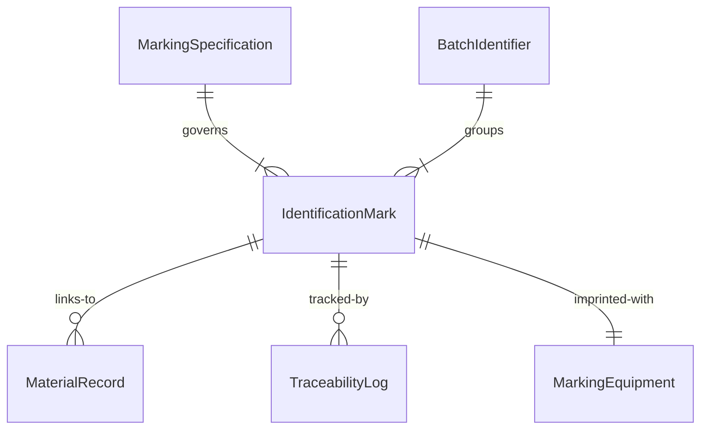
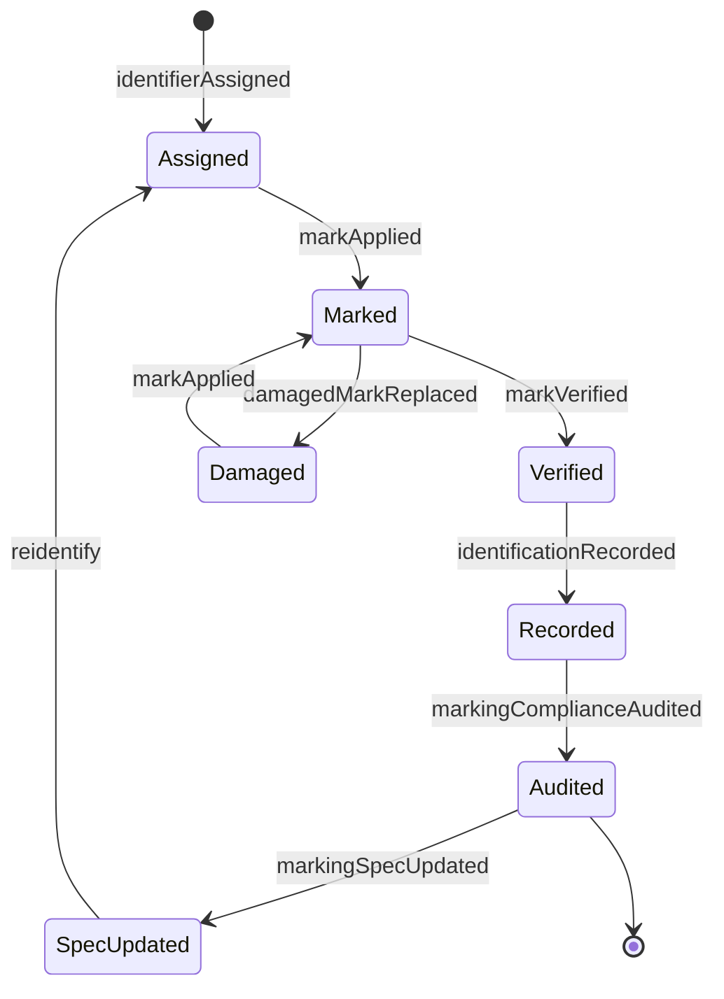
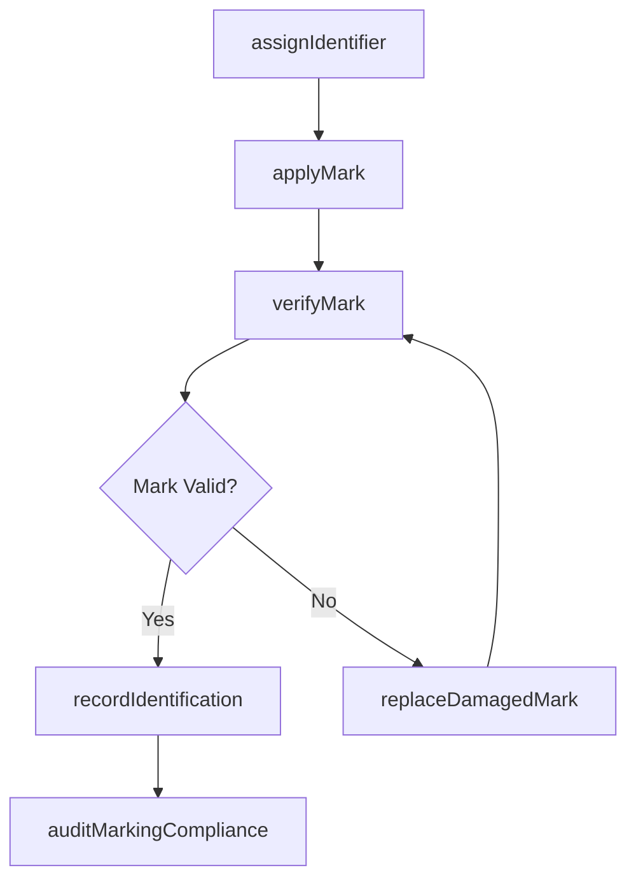
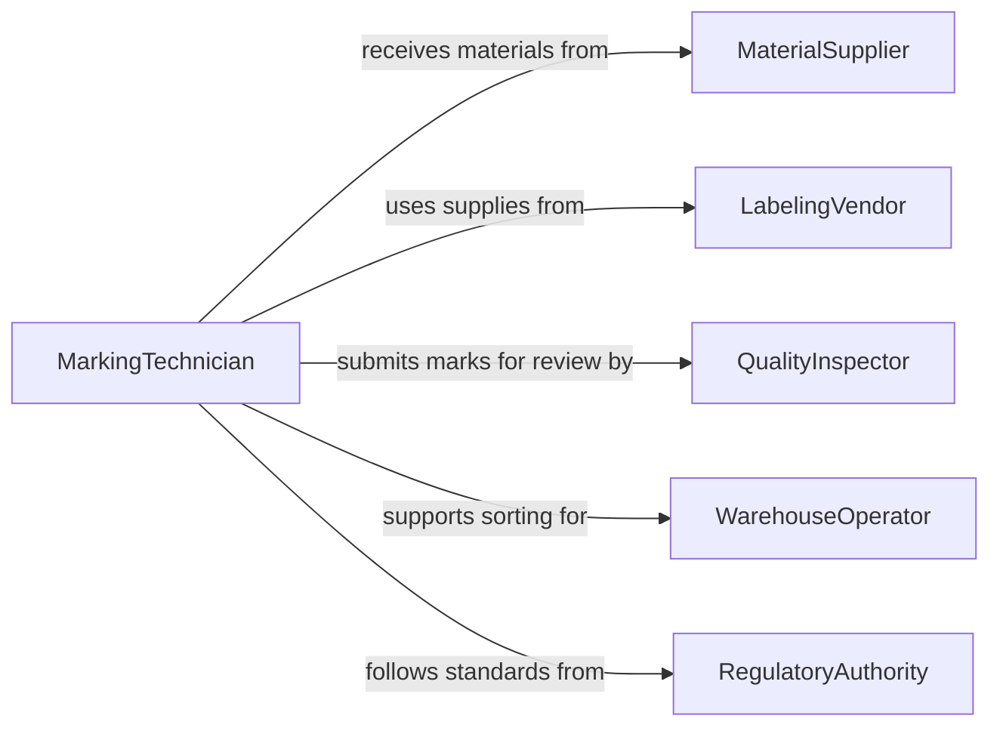

# Mark Materials Objects Identification

> Business-as-Code definition for marking materials or objects for identification. Models the labeling, tagging, and coding of physical materials and objects to enable tracking, sorting, and traceability throughout operational workflows.

## Overview

Marking materials or objects for identification involves applying labels, tags, codes, stamps, or other identifiers to physical items so they can be tracked, sorted, and traced through production, storage, and distribution processes. This activity ensures materials are correctly classified, routed, and accounted for by maintaining a consistent identification system across the operational lifecycle.

## Actors

| Actor | Description |
|-------|-------------|
| MaterialSupplier | Delivers raw materials that require identification upon receipt |
| LabelingVendor | Provides marking equipment, labels, tags, and coding supplies |
| QualityInspector | Verifies that identification marks are accurate and legible |
| WarehouseOperator | Uses identification marks to sort, store, and retrieve materials |
| RegulatoryAuthority | Mandates specific marking standards for compliance and traceability |

## Roles

| Role | Description |
|------|-------------|
| MarkingTechnician | Applies identification marks to materials and objects |
| InventoryController | Manages the identification system and ensures consistency |
| ProductionSupervisor | Oversees marking operations within the manufacturing process |
| ComplianceSpecialist | Ensures marking practices meet regulatory requirements |

## Entities

| Entity | Description |
|--------|-------------|
| IdentificationMark | A label, tag, barcode, or stamp applied to an item |
| MaterialRecord | A data entry linking a physical item to its identification code |
| MarkingSpecification | The standard defining how items should be marked |
| BatchIdentifier | A code grouping related materials from the same production lot |
| TraceabilityLog | A record tracking an item's journey through identification checkpoints |
| MarkingEquipment | Tools and devices used to apply identification marks |

## Actions

| Action | Description |
|--------|-------------|
| assignIdentifier | Generate and assign a unique identification code to a material or object |
| applyMark | Physically attach or imprint an identification mark on an item |
| verifyMark | Check that an applied mark is accurate, legible, and compliant |
| recordIdentification | Log the identification details in the material tracking system |
| updateMarkingSpec | Modify the marking specification for a material type or process |
| replaceDamagedMark | Remove and reapply an identification mark that has become unreadable |
| auditMarkingCompliance | Review marking practices against regulatory and internal standards |

## Events

| Event | Description |
|-------|-------------|
| identifierAssigned | A unique identification code has been generated for an item |
| markApplied | An identification mark has been attached to a material or object |
| markVerified | An applied mark has been confirmed as accurate and legible |
| identificationRecorded | Marking details have been logged in the tracking system |
| markingSpecUpdated | A marking specification has been modified |
| damagedMarkReplaced | An unreadable identification mark has been reapplied |
| markingComplianceAudited | Marking practices have been reviewed for compliance |

## Searches

| Search | Description |
|--------|-------------|
| findMaterialsByMark | Retrieve materials by identification code, batch, or mark type |
| getMarkingSpecifications | Query active marking standards by material type or regulation |
| getTraceabilityLog | Trace an item's identification history through checkpoints |
| findUnmarkedItems | List materials or objects awaiting identification marks |


## Entity Relationships



## State Diagram



## Workflow



## Actor Relationships



## Usage

### Calling Actions

```typescript
import { markMaterialsObjectsIdentification } from '@headlessly/mark-materials-objects-identification'

const marking = markMaterialsObjectsIdentification()

// Assign an identifier to incoming material
const identifier = await marking.assignIdentifier({
  materialType: 'steel-plate',
  batchNumber: 'B-2026-0412',
  supplierId: 'sup-metalworks-inc'
})

// Apply and verify the mark
await marking.applyMark({
  identifierId: identifier.id,
  method: 'barcode-label',
  location: 'upper-left-corner',
  equipmentId: 'printer-warehouse-3'
})

const verification = await marking.verifyMark({
  identifierId: identifier.id,
  checkLegibility: true,
  checkCompliance: true
})

// Record in tracking system
await marking.recordIdentification({
  identifierId: identifier.id,
  verificationId: verification.id,
  storageLocation: 'warehouse-3-bay-12'
})
```

### Event-Driven Automation

```typescript
// Auto-record identification when marks are verified
marking.markVerified(async ({ identifierId, isValid }) => {
  if (isValid) {
    await marking.recordIdentification({
      identifierId,
      timestamp: new Date().toISOString()
    })
  }
})

// Alert on compliance audit findings
marking.markingComplianceAudited(async ({ findings, nonConformances }) => {
  if (nonConformances > 0) {
    await notify({
      to: 'quality-team',
      message: `Marking audit found ${nonConformances} non-conformance(s)`
    })
  }
})
```
