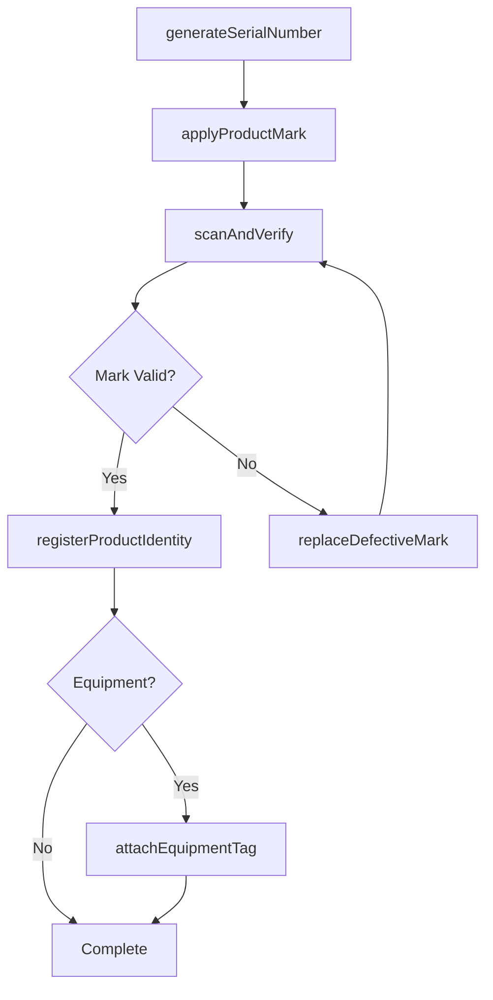
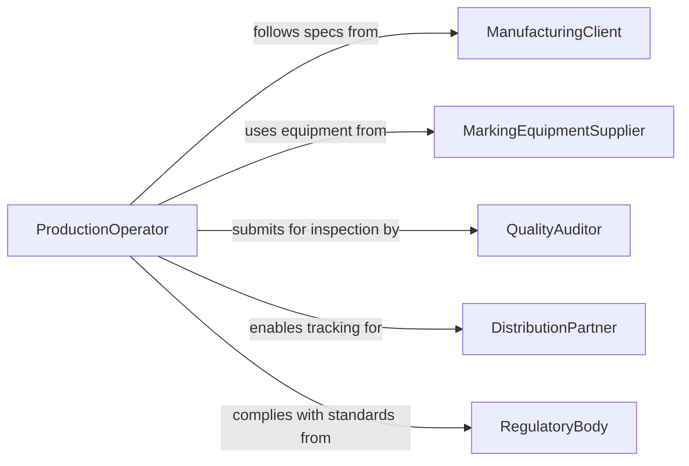

# Mark Products Workpieces Equipment Identifying

> Business-as-Code definition for marking products, workpieces, or equipment with identifying information. Models the application of serial numbers, barcodes, RFID tags, and other identifiers to manufactured goods, in-process items, and equipment for tracking and traceability.

## Overview

Marking products, workpieces, or equipment with identifying information ensures that manufactured items and production assets can be tracked throughout their lifecycle. This includes engraving serial numbers, printing barcodes, attaching RFID tags, and stamping lot codes on finished products, work-in-progress items, and operational equipment. Accurate marking supports quality control, warranty tracking, regulatory compliance, and asset management.

## Actors

| Actor | Description |
|-------|-------------|
| ManufacturingClient | Specifies marking requirements for products and workpieces |
| MarkingEquipmentSupplier | Provides engraving, printing, and tagging equipment and consumables |
| QualityAuditor | Inspects marking accuracy and adherence to specifications |
| DistributionPartner | Relies on product markings for logistics and inventory management |
| RegulatoryBody | Mandates specific marking standards for product compliance |
| AssetManager | Tracks equipment using applied identification markings |

## Roles

| Role | Description |
|------|-------------|
| ProductionOperator | Applies identifying marks during the manufacturing process |
| QualityControlTechnician | Verifies mark accuracy, placement, and durability |
| ProductionEngineer | Designs marking specifications and selects marking methods |
| AssetAdministrator | Maintains equipment identification records and asset registers |

## Entities

| Entity | Description |
|--------|-------------|
| SerialNumber | A unique identifier assigned to an individual product or equipment unit |
| Barcode | A machine-readable optical label encoding product information |
| RFIDTag | A radio-frequency identification device attached to an item |
| MarkingTemplate | A specification defining mark content, placement, and method |
| ProductRecord | A database entry linking a product to its identification markings |
| EquipmentAssetTag | An identifier linking a piece of equipment to its asset register entry |

## Actions

| Action | Description |
|--------|-------------|
| generateSerialNumber | Create a unique serial number for a product or equipment unit |
| applyProductMark | Engrave, print, or attach an identifier to a product or workpiece |
| attachEquipmentTag | Affix an asset identification tag to a piece of equipment |
| scanAndVerify | Read an applied mark and confirm it matches the expected value |
| registerProductIdentity | Link the applied marking to the product record in the system |
| updateMarkingTemplate | Modify the specification for how items should be marked |
| replaceDefectiveMark | Remove and reapply a damaged or incorrect identification mark |

## Events

| Event | Description |
|-------|-------------|
| serialNumberGenerated | A unique serial number has been created for an item |
| productMarkApplied | An identifier has been applied to a product or workpiece |
| equipmentTagAttached | An asset tag has been affixed to a piece of equipment |
| markScannedAndVerified | An applied mark has been read and confirmed accurate |
| productIdentityRegistered | A marking has been linked to the product record |
| markingTemplateUpdated | A marking specification has been modified |
| defectiveMarkReplaced | A damaged or incorrect mark has been corrected |

## Searches

| Search | Description |
|--------|-------------|
| findProductsBySerial | Retrieve products by serial number, batch, or manufacturing date |
| getEquipmentByTag | Look up equipment details by asset tag identifier |
| getMarkingTemplates | Query marking specifications by product type or regulation |
| findUnverifiedMarks | List items with marks that have not yet been scan-verified |

## Workflow



## Actor Relationships



## Usage

### Calling Actions

```typescript
import { markProductsWorkpiecesEquipmentIdentifying } from '@headlessly/mark-products-workpieces-equipment-identifying'

const marking = markProductsWorkpiecesEquipmentIdentifying()

// Generate serial number and apply mark
const serial = await marking.generateSerialNumber({
  productType: 'electric-motor',
  batchId: 'batch-2026-0415',
  format: 'PREFIX-YYYY-NNNNNN'
})

await marking.applyProductMark({
  serialNumber: serial.value,
  method: 'laser-engraving',
  location: 'nameplate',
  productId: 'prod-em-7842'
})

// Scan and verify
const verification = await marking.scanAndVerify({
  productId: 'prod-em-7842',
  expectedValue: serial.value,
  scanMethod: 'barcode-reader'
})

// Register in system
await marking.registerProductIdentity({
  productId: 'prod-em-7842',
  serialNumber: serial.value,
  verificationId: verification.id,
  manufacturingDate: '2026-04-15'
})

// Attach equipment tag if needed
await marking.attachEquipmentTag({
  equipmentId: 'equip-cnc-mill-04',
  tagType: 'RFID',
  assetNumber: 'AST-2026-1042'
})
```

### Event-Driven Automation

```typescript
// Auto-register product identity after successful verification
marking.markScannedAndVerified(async ({ productId, serialNumber, isValid }) => {
  if (isValid) {
    await marking.registerProductIdentity({
      productId,
      serialNumber,
      verifiedAt: new Date().toISOString()
    })
  }
})

// Alert quality team on defective marks
marking.defectiveMarkReplaced(async ({ productId, reason }) => {
  await notify({
    to: 'quality-control',
    message: `Defective mark replaced on ${productId}: ${reason}`
  })
})
```
