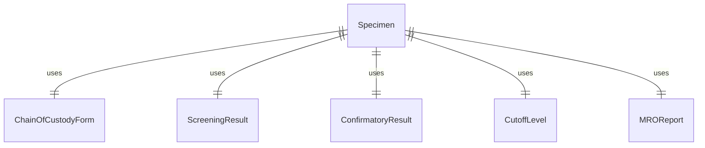
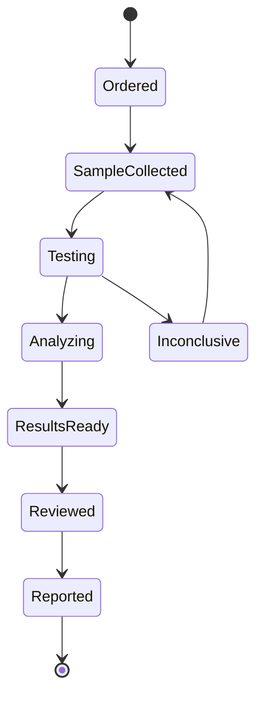
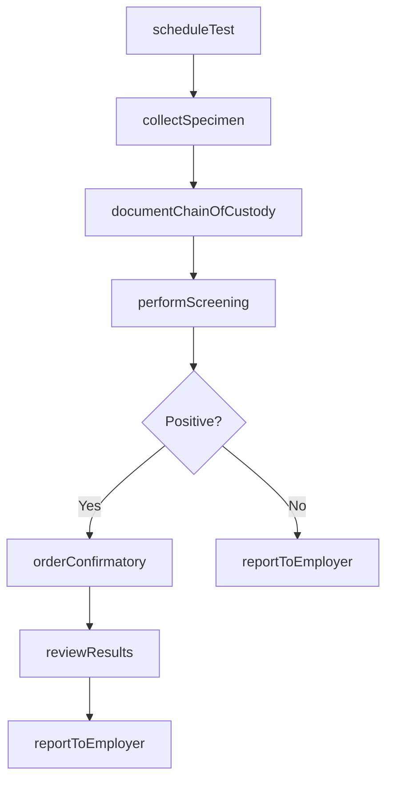
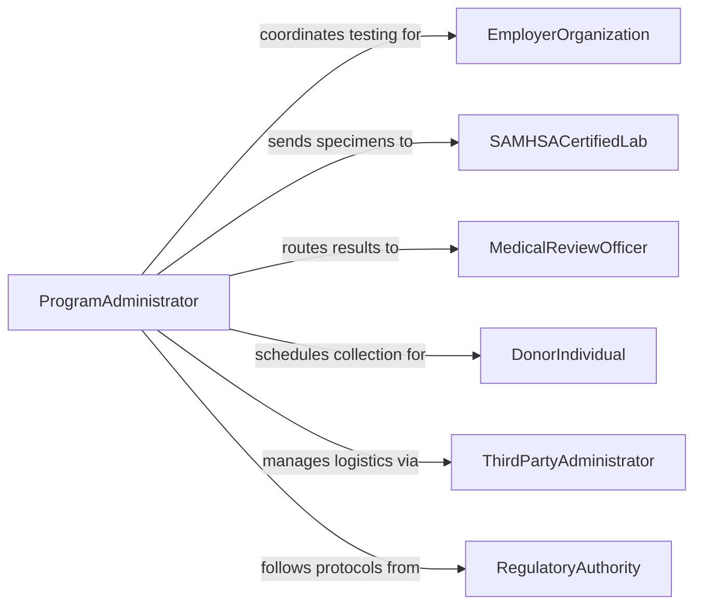

# Administer Drug Screening Tests

> Business-as-Code definition for administering drug screening tests. Models the specimen collection, chain-of-custody management, immunoassay screening, confirmatory testing, and Medical Review Officer reporting workflows used in workplace, clinical, and forensic drug testing programs.

## Overview

Administering drug screening tests involves collecting biological specimens under controlled conditions, maintaining strict chain-of-custody documentation, performing initial immunoassay screening and GC-MS or LC-MS/MS confirmatory analysis, and reporting results through a Medical Review Officer. This definition supports pre-employment testing, random workplace screening, clinical substance abuse monitoring, DOT-regulated testing, and court-ordered programs. It integrates with SAMHSA guidelines, employer policies, and electronic reporting systems.

## Actors

| Actor | Description |
|-------|-------------|
| EmployerOrganization | Mandates drug testing as part of workplace safety or hiring requirements |
| SAMHSACertifiedLab | Performs confirmatory analysis on specimens that screen positive |
| MedicalReviewOfficer | Reviews and verifies laboratory results before releasing to the employer |
| DonorIndividual | The person providing a specimen for drug screening |
| ThirdPartyAdministrator | Manages the drug testing program logistics for the employer |
| RegulatoryAuthority | Sets testing protocols and cutoff levels such as DOT or SAMHSA |

## Roles

| Role | Description |
|------|-------------|
| CollectionTechnician | Collects specimens under observed or unobserved conditions per protocol |
| LaboratoryScientist | Performs immunoassay and confirmatory analysis on collected specimens |
| ProgramAdministrator | Coordinates testing schedules, random selection, and result routing |
| ComplianceOfficer | Ensures the drug testing program meets regulatory requirements |

## Entities

| Entity | Description |
|--------|-------------|
| Specimen | A biological sample such as urine, oral fluid, or hair collected for analysis |
| ChainOfCustodyForm | Documentation tracking specimen handling from collection to final disposition |
| ScreeningResult | The outcome of an initial immunoassay test for target drug classes |
| ConfirmatoryResult | The outcome of a GC-MS or LC-MS/MS analysis confirming or negating initial findings |
| CutoffLevel | The concentration threshold above which a result is considered positive |
| MROReport | The Medical Review Officer's verified interpretation of laboratory results |
| TestingPanel | The specific drug classes included in the screening such as a 5-panel or 10-panel |
| RandomSelectionPool | The group of employees eligible for random testing in a given period |

## Actions

| Action | Description |
|--------|-------------|
| scheduleTest | Assign a donor to a specific testing appointment or random selection |
| collectSpecimen | Obtain a biological specimen following chain-of-custody protocols |
| performScreening | Run the initial immunoassay panel on the collected specimen |
| orderConfirmatory | Submit a presumptive positive specimen for GC-MS or LC-MS/MS analysis |
| reviewResults | Have the Medical Review Officer evaluate and verify laboratory findings |
| reportToEmployer | Deliver the verified result to the requesting organization |
| documentChainOfCustody | Record every handoff and storage event for the specimen |
| flagAdulteration | Identify a specimen that has been tampered with or substituted |

## Events

| Event | Description |
|-------|-------------|
| testScheduled | A drug screening appointment has been created |
| specimenCollected | A biological specimen has been obtained under controlled conditions |
| screeningCompleted | Initial immunoassay results are available |
| confirmatoryOrdered | A positive screening result has been sent for confirmatory analysis |
| confirmatoryCompleted | GC-MS or LC-MS/MS analysis results are available |
| resultVerified | The Medical Review Officer has reviewed and signed off on the result |
| resultReported | The verified result has been delivered to the employer |
| adulterationDetected | A specimen has been identified as tampered with or substituted |

## Searches

| Search | Description |
|--------|-------------|
| findTests | List drug screening records by donor, employer, or date range |
| getPositiveResults | Retrieve confirmed positive results awaiting MRO review |
| getChainOfCustody | Look up the custody trail for a specific specimen |
| getRandomPool | Query the current random selection pool for a testing period |
| getProgramCompliance | Check program adherence to regulatory testing frequency requirements |


## Entity Relationships



## State Diagram



## Workflow



## Actor Relationships



## Usage

### Calling Actions

```typescript
import { administerDrugScreeningTests } from '@headlessly/administer-drug-screening-tests'

const drugTesting = administerDrugScreeningTests()

// Schedule a pre-employment drug test
const test = await drugTesting.scheduleTest({
  donorId: 'DONOR-2026-4521',
  employer: 'ACME-Transport',
  reason: 'pre-employment',
  panel: '10-panel-DOT',
  collectionSite: 'clinic-north-03'
})

// Collect specimen with chain of custody
const specimen = await drugTesting.collectSpecimen({
  testId: test.id,
  specimenType: 'urine',
  observed: false,
  temperature: { value: 96.2, unit: 'F', withinRange: true }
})

await drugTesting.documentChainOfCustody({
  specimenId: specimen.id,
  event: 'collected',
  handler: 'TECH-SMITH',
  location: 'clinic-north-03'
})

// Run initial screening
const screening = await drugTesting.performScreening({
  specimenId: specimen.id,
  panel: '10-panel-DOT',
  cutoffs: 'SAMHSA-standard'
})
```

### Event-Driven Automation

```typescript
// Auto-route positive screens to confirmatory testing
drugTesting.screeningCompleted(async ({ specimenId, results }) => {
  const positives = results.filter(r => r.outcome === 'presumptive-positive')
  if (positives.length > 0) {
    await drugTesting.orderConfirmatory({
      specimenId,
      analytes: positives.map(p => p.drugClass)
    })
  }
})

// Alert compliance when adulteration is detected
drugTesting.adulterationDetected(async ({ specimenId, donorId, indicator }) => {
  await notify({
    to: 'compliance-officer',
    message: `Specimen adulteration detected for donor ${donorId}: ${indicator}`,
    priority: 'high'
  })
})
```
