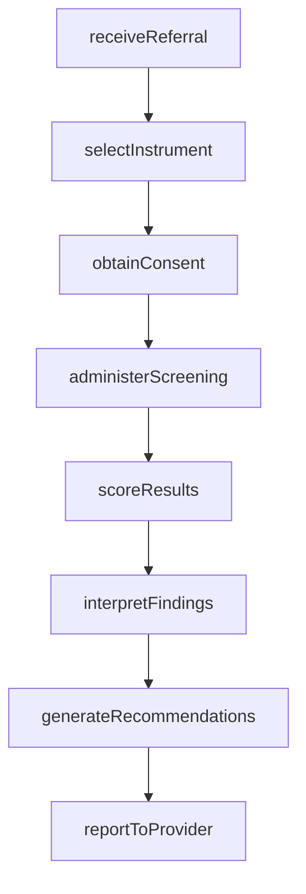
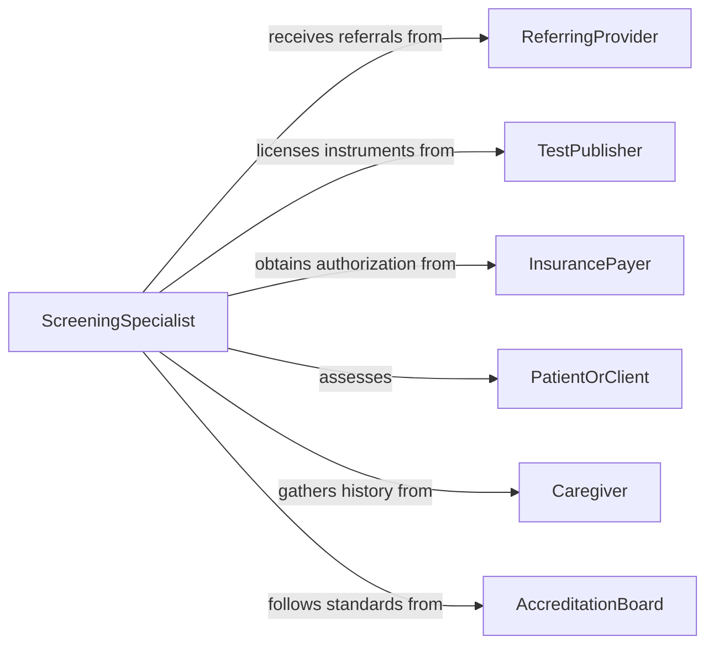

# Administer Screening Tests to Determine Abilities or Treatment Needs

> Business-as-Code definition for administering screening tests to determine abilities or treatment needs. Models the clinical and rehabilitation workflow of selecting, administering, scoring, and interpreting standardized assessments that guide care planning and intervention decisions.

## Overview

Administering screening tests to determine abilities or treatment needs involves selecting validated assessment instruments, conducting standardized evaluations of cognitive, physical, developmental, or functional capacity, and using the results to guide therapeutic intervention. This definition covers the workflow from referral and instrument selection through test administration, scoring, and care plan integration. It supports occupational therapy, physical therapy, speech-language pathology, psychology, and rehabilitation medicine settings.

## Actors

| Actor | Description |
|-------|-------------|
| ReferringProvider | Orders the screening based on clinical observations or patient complaints |
| TestPublisher | Develops and licenses standardized assessment instruments |
| InsurancePayer | Authorizes and reimburses screening procedures |
| PatientOrClient | The individual being assessed for abilities or treatment needs |
| Caregiver | Provides collateral information about the patient's functional abilities |
| AccreditationBoard | Sets professional standards for screening administration and interpretation |

## Roles

| Role | Description |
|------|-------------|
| ScreeningSpecialist | Selects and administers appropriate assessment instruments |
| OccupationalTherapist | Evaluates functional capacity and recommends adaptive strategies |
| ClinicalPsychologist | Administers cognitive and psychological assessments |
| RehabilitationCoordinator | Integrates screening results into comprehensive care plans |

## Entities

| Entity | Description |
|--------|-------------|
| ScreeningOrder | A referral requesting assessment of specific abilities or needs |
| AssessmentInstrument | A validated tool used to measure a specific ability or functional domain |
| TestSession | A record of a completed screening administration with timing and conditions |
| ScoreReport | Quantitative results and normative comparisons from a screening |
| ClinicalInterpretation | A professional analysis of screening results with recommendations |
| CarePlanRecommendation | Suggested interventions or services based on screening outcomes |
| NormativeData | Reference population data used to contextualize individual scores |
| ConsentRecord | Documentation of patient or guardian authorization for the assessment |

## Actions

| Action | Description |
|--------|-------------|
| receiveReferral | Accept and review a screening order from a referring provider |
| selectInstrument | Choose the appropriate standardized assessment for the clinical question |
| obtainConsent | Secure patient or guardian authorization before administering the test |
| administerScreening | Conduct the standardized assessment following published protocols |
| scoreResults | Calculate raw and standardized scores from test responses |
| interpretFindings | Analyze scores against normative data and clinical context |
| generateRecommendations | Produce care plan suggestions based on screening outcomes |
| reportToProvider | Communicate findings and recommendations to the referring provider |

## Events

| Event | Description |
|-------|-------------|
| referralReceived | A screening order has been accepted for processing |
| instrumentSelected | An assessment tool has been chosen for the evaluation |
| consentObtained | Patient or guardian authorization has been documented |
| screeningAdministered | The standardized assessment has been completed |
| resultsScored | Test scores have been calculated and recorded |
| findingsInterpreted | A clinical interpretation of the screening results is available |
| recommendationsGenerated | Care plan suggestions based on the assessment have been produced |
| reportDelivered | Screening results and recommendations have been sent to the referrer |

## Searches

| Search | Description |
|--------|-------------|
| findScreenings | List screening sessions by patient, instrument, or date |
| getScoreReports | Retrieve scored results by patient, assessment type, or date range |
| getRecommendations | Look up care plan recommendations by screening or patient |
| findInstruments | Search available assessment instruments by domain or age group |
| getPatientScreeningHistory | Retrieve all prior screening results for a specific patient |

## Workflow



## Actor Relationships



## Usage

### Calling Actions

```typescript
import { administerScreeningTestsDetermineAbilities } from '@headlessly/administer-screening-tests-determine-abilities'

const screening = administerScreeningTestsDetermineAbilities()

// Receive a referral for cognitive screening
const referral = await screening.receiveReferral({
  patientId: 'PT-2026-03291',
  reason: 'memory-complaints-post-stroke',
  referringProvider: 'DR-MARTINEZ',
  domains: ['cognition', 'executive-function', 'memory']
})

// Select and administer the assessment
const instrument = await screening.selectInstrument({
  referralId: referral.id,
  domain: 'cognition',
  population: 'adult-neurological',
  instrument: 'MoCA'
})

await screening.obtainConsent({ referralId: referral.id, method: 'verbal-with-witness' })

const session = await screening.administerScreening({
  referralId: referral.id,
  instrumentId: instrument.id,
  setting: 'outpatient-rehab',
  duration: 20
})

// Score, interpret, and report
const scores = await screening.scoreResults({ sessionId: session.id })
await screening.interpretFindings({
  sessionId: session.id,
  normativeGroup: 'age-education-matched'
})
```

### Event-Driven Automation

```typescript
// Auto-generate recommendations when findings are interpreted
screening.findingsInterpreted(async ({ sessionId, patientId, severity }) => {
  await screening.generateRecommendations({
    sessionId,
    includeServices: ['occupational-therapy', 'speech-therapy', 'neuropsychology']
  })
})

// Escalate significant deficits to the care team
screening.resultsScored(async ({ patientId, scores, cutoffs }) => {
  const significantDeficits = scores.filter(s => s.value < cutoffs[s.domain])
  if (significantDeficits.length > 0) {
    await notify({
      to: 'care-team',
      message: `Significant deficits detected in ${significantDeficits.map(d => d.domain).join(', ')} for patient ${patientId}`
    })
  }
})
```
