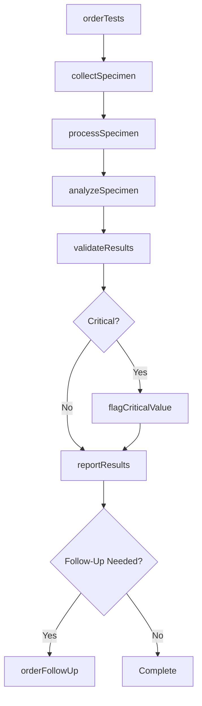
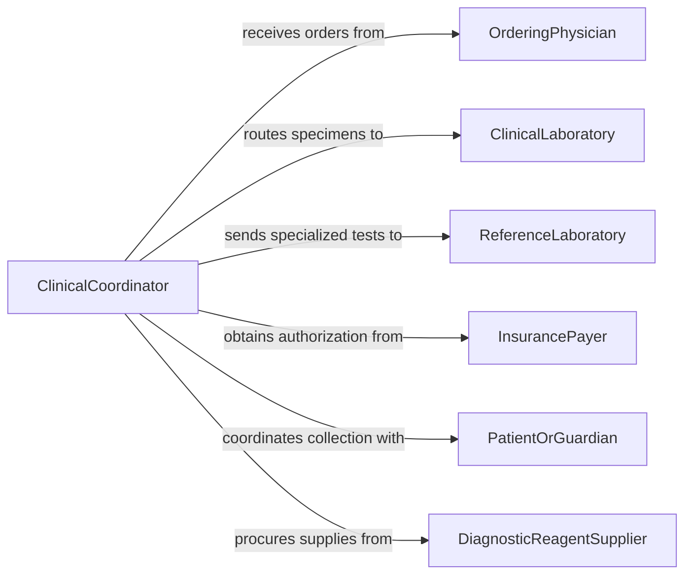

# Conduct Diagnostic Tests to Determine Patient Health

> Business-as-Code definition for conducting diagnostic tests to determine patient health. Models the general clinical diagnostics workflow from test ordering through specimen collection, laboratory analysis, result reporting, and clinical decision support.

## Overview

Conducting diagnostic tests to determine patient health encompasses the broad spectrum of clinical laboratory and point-of-care testing used to evaluate a patient's physiological status, detect disease, and monitor treatment response. This definition covers blood chemistry panels, hematology, microbiology cultures, urinalysis, and imaging-guided biopsies. It provides actions for ordering tests, collecting specimens, tracking laboratory processing, and integrating results into clinical decision-making workflows.

## Actors

| Actor | Description |
|-------|-------------|
| OrderingPhysician | Requests diagnostic tests based on clinical assessment and differential diagnosis |
| ClinicalLaboratory | Processes specimens and performs analytical testing |
| ReferenceLaboratory | Handles specialized or esoteric tests not available at the primary lab |
| InsurancePayer | Authorizes and reimburses diagnostic testing procedures |
| PatientOrGuardian | Provides consent and presents for specimen collection |
| DiagnosticReagentSupplier | Provides reagents, controls, and consumables for laboratory analyzers |

## Roles

| Role | Description |
|------|-------------|
| Phlebotomist | Collects blood specimens and other biological samples from patients |
| MedicalTechnologist | Performs laboratory analysis and validates test results |
| Pathologist | Interprets complex diagnostic findings and provides consultative opinions |
| ClinicalCoordinator | Manages test ordering, specimen routing, and result delivery |
| PointOfCareTester | Administers rapid diagnostic tests at the bedside or clinic |

## Entities

| Entity | Description |
|--------|-------------|
| TestOrder | A physician request specifying the diagnostic tests to be performed |
| Specimen | A biological sample such as blood, urine, or tissue collected for analysis |
| LabResult | The quantitative or qualitative outcome of a laboratory test |
| ReferenceRange | Normal value boundaries used to interpret test results |
| CriticalValue | A result that requires immediate notification to the ordering provider |
| TestPanel | A predefined group of related tests ordered together |
| ChainOfCustody | Documentation tracking specimen handling from collection to analysis |
| QualityControlRecord | Data from control sample testing that validates analytical accuracy |

## Actions

| Action | Description |
|--------|-------------|
| orderTests | Submit a request for one or more diagnostic tests with clinical indications |
| collectSpecimen | Obtain a biological sample from the patient following standard protocols |
| processSpecimen | Prepare, label, and route the specimen to the appropriate laboratory |
| analyzeSpecimen | Perform the analytical procedure and generate raw result data |
| validateResults | Review results against quality controls and reference ranges |
| reportResults | Deliver validated results to the ordering provider and patient record |
| flagCriticalValue | Immediately notify the provider of a result requiring urgent action |
| orderFollowUp | Request additional testing based on initial findings |

## Events

| Event | Description |
|-------|-------------|
| testsOrdered | Diagnostic test requests have been submitted |
| specimenCollected | A biological sample has been obtained from the patient |
| specimenProcessed | The specimen has been prepared and routed to the laboratory |
| analysisCompleted | Laboratory analysis has produced raw results |
| resultsValidated | Results have been reviewed and confirmed for accuracy |
| resultsReported | Validated results have been delivered to the ordering provider |
| criticalValueFlagged | A result requiring immediate clinical action has been identified |
| followUpOrdered | Additional testing has been requested based on initial results |

## Searches

| Search | Description |
|--------|-------------|
| findOrders | List test orders by patient, provider, or date range |
| getResults | Retrieve lab results by test type, patient, or panel |
| getCriticalValues | Find all flagged critical results awaiting acknowledgment |
| getSpecimenStatus | Track the processing status of collected specimens |
| getPatientLabHistory | Look up all prior lab results for a specific patient |

## Workflow



## Actor Relationships



## Usage

### Calling Actions

```typescript
import { conductDiagnosticTestsDeterminePatient } from '@headlessly/conduct-diagnostic-tests-determine-patient'

const diagnostics = conductDiagnosticTestsDeterminePatient()

// Order a comprehensive metabolic panel and CBC
const order = await diagnostics.orderTests({
  patientId: 'PT-2026-11205',
  tests: ['CMP', 'CBC-with-differential', 'TSH', 'HbA1c'],
  indication: 'annual-wellness-exam',
  fasting: true,
  orderingPhysician: 'DR-PATEL'
})

// Collect and process specimens
const specimen = await diagnostics.collectSpecimen({
  orderId: order.id,
  type: 'venous-blood',
  tubes: ['SST', 'EDTA', 'gray-top'],
  collector: 'PHLEBOTOMIST-JONES'
})

await diagnostics.processSpecimen({
  specimenId: specimen.id,
  laboratory: 'main-lab',
  centrifuge: true
})

// Results flow automatically through analysis and validation
const results = await diagnostics.analyzeSpecimen({ specimenId: specimen.id })
await diagnostics.validateResults({ resultId: results.id })
```

### Event-Driven Automation

```typescript
// Immediate provider notification for critical values
diagnostics.criticalValueFlagged(async ({ patientId, test, value, referenceRange }) => {
  await notify({
    to: 'ordering-physician',
    message: `CRITICAL: ${test} = ${value} (ref: ${referenceRange}) for patient ${patientId}`,
    priority: 'stat',
    requireAcknowledgment: true
  })
})

// Auto-order confirmatory tests when screening results are abnormal
diagnostics.resultsReported(async ({ patientId, results }) => {
  const abnormal = results.filter(r => r.flag === 'abnormal')
  for (const result of abnormal) {
    if (result.test === 'TSH' && result.value > 10) {
      await diagnostics.orderFollowUp({
        patientId,
        tests: ['Free-T4', 'TPO-antibodies'],
        indication: 'elevated-TSH-follow-up'
      })
    }
  }
})
```
