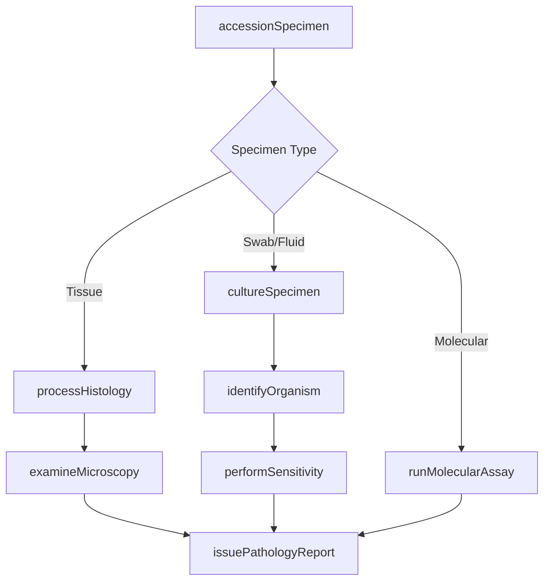
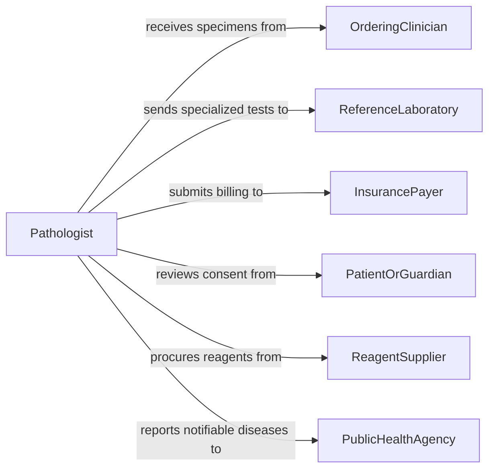

# Test Biological Specimens to Gather Information about Patient Conditions

> Business-as-Code definition for testing biological specimens to gather information about patient conditions. Models the laboratory workflow of receiving specimens, performing histopathology, cytology, microbiology, and molecular testing, and delivering diagnostic reports to clinical teams.

## Overview

Testing biological specimens to gather information about patient conditions involves processing tissue biopsies, cytology samples, body fluids, and microbiology cultures through specialized laboratory procedures to identify disease processes, infectious agents, and genetic markers. This definition covers specimen accessioning, gross and microscopic examination, culture and sensitivity testing, molecular diagnostics, and pathology reporting. It supports surgical pathology, clinical microbiology, cytopathology, and molecular diagnostics laboratories.

## Actors

| Actor | Description |
|-------|-------------|
| OrderingClinician | Submits specimens with clinical history and diagnostic questions |
| ReferenceLaboratory | Processes specialized tests such as genetic sequencing or rare pathogen identification |
| InsurancePayer | Authorizes and reimburses laboratory diagnostic procedures |
| PatientOrGuardian | Provides consent for biopsy, culture, or molecular testing |
| ReagentSupplier | Provides stains, culture media, molecular probes, and other laboratory consumables |
| PublicHealthAgency | Receives reportable disease notifications from microbiology results |

## Roles

| Role | Description |
|------|-------------|
| Pathologist | Examines tissue and cytology specimens and renders diagnostic opinions |
| Microbiologist | Cultures and identifies infectious organisms and determines antimicrobial susceptibility |
| Histotechnologist | Prepares tissue sections, applies stains, and maintains embedding and cutting equipment |
| MolecularTechnologist | Performs PCR, sequencing, and other molecular diagnostic assays |
| LaboratoryDirector | Oversees quality assurance, compliance, and laboratory accreditation |

## Entities

| Entity | Description |
|--------|-------------|
| Specimen | A tissue biopsy, body fluid, swab, or cytology sample submitted for analysis |
| AccessionRecord | A registration entry assigning a unique identifier and linking specimen to patient |
| HistologySlide | A prepared tissue section mounted on glass for microscopic examination |
| CultureResult | The identification of organisms grown from a microbiology specimen |
| SensitivityReport | Antimicrobial susceptibility results for an identified organism |
| MolecularResult | Findings from PCR, FISH, or sequencing assays |
| PathologyReport | A documented diagnosis with microscopic descriptions and clinical correlation |
| SpecialStain | A targeted histochemical or immunohistochemical stain applied for specific markers |

## Actions

| Action | Description |
|--------|-------------|
| accessionSpecimen | Register the specimen, verify labeling, and assign a laboratory identifier |
| processHistology | Embed, section, and stain tissue for microscopic examination |
| examineMicroscopy | Review prepared slides under the microscope and document findings |
| cultureSpecimen | Inoculate culture media and incubate for organism growth |
| identifyOrganism | Determine the species of organisms isolated from cultures |
| performSensitivity | Test isolated organisms against antimicrobial agents |
| runMolecularAssay | Execute PCR, sequencing, or hybridization protocols on extracted nucleic acids |
| issuePathologyReport | Finalize the diagnostic interpretation and distribute to the ordering clinician |

## Events

| Event | Description |
|-------|-------------|
| specimenAccessioned | A specimen has been registered and assigned a lab identifier |
| histologyProcessed | Tissue sections have been prepared and stained |
| microscopyCompleted | Microscopic examination and documentation are finished |
| cultureGrown | Organism growth has been detected on culture media |
| organismIdentified | A species identification for a cultured organism is available |
| sensitivityCompleted | Antimicrobial susceptibility testing results are finalized |
| molecularResultReady | Molecular assay results have been validated |
| reportIssued | The final pathology or microbiology report has been released |

## Searches

| Search | Description |
|--------|-------------|
| findSpecimens | List specimens by patient, type, accession date, or status |
| getCultureResults | Retrieve microbiology culture and sensitivity data by organism or patient |
| getMolecularResults | Query molecular diagnostic findings by assay type or gene target |
| getPathologyReports | Look up finalized pathology reports by patient or diagnosis |
| getPendingCases | List specimens awaiting processing, interpretation, or sign-out |

## Workflow



## Actor Relationships



## Usage

### Calling Actions

```typescript
import { testBiologicalSpecimensGatherInformation } from '@headlessly/test-biological-specimens-gather-information'

const labTesting = testBiologicalSpecimensGatherInformation()

// Accession a surgical biopsy specimen
const accession = await labTesting.accessionSpecimen({
  patientId: 'PT-2026-06318',
  specimenType: 'tissue-biopsy',
  source: 'colon-ascending',
  clinicalHistory: 'Polypoid mass found during colonoscopy',
  orderingClinician: 'DR-GARCIA'
})

// Process through histology
await labTesting.processHistology({
  accessionId: accession.id,
  embedding: 'paraffin',
  stains: ['H&E', 'PAS', 'Ki-67']
})

// Microscopic examination
const findings = await labTesting.examineMicroscopy({
  accessionId: accession.id,
  examiner: 'DR-ROBERTSON',
  findings: {
    architecture: 'tubular adenoma with high-grade dysplasia',
    margins: 'clear',
    invasion: 'none'
  }
})

// Issue final report
await labTesting.issuePathologyReport({
  accessionId: accession.id,
  diagnosis: 'Tubular adenoma with high-grade dysplasia, margins negative',
  recommendation: 'Follow-up colonoscopy in 6 months'
})
```

### Event-Driven Automation

```typescript
// Report notifiable organisms to public health
labTesting.organismIdentified(async ({ patientId, organism, accessionId }) => {
  const notifiable = ['Salmonella', 'Mycobacterium tuberculosis', 'Neisseria meningitidis']
  if (notifiable.some(n => organism.includes(n))) {
    await publicHealth.reportCase({
      patientId,
      organism,
      accessionId,
      reportingLab: 'main-micro-lab'
    })
  }
})

// Auto-order molecular confirmation for malignant findings
labTesting.microscopyCompleted(async ({ accessionId, findings }) => {
  if (findings.includes('carcinoma') || findings.includes('malignant')) {
    await labTesting.runMolecularAssay({
      accessionId,
      assays: ['KRAS', 'BRAF', 'MSI'],
      indication: 'tumor-profiling'
    })
  }
})
```
