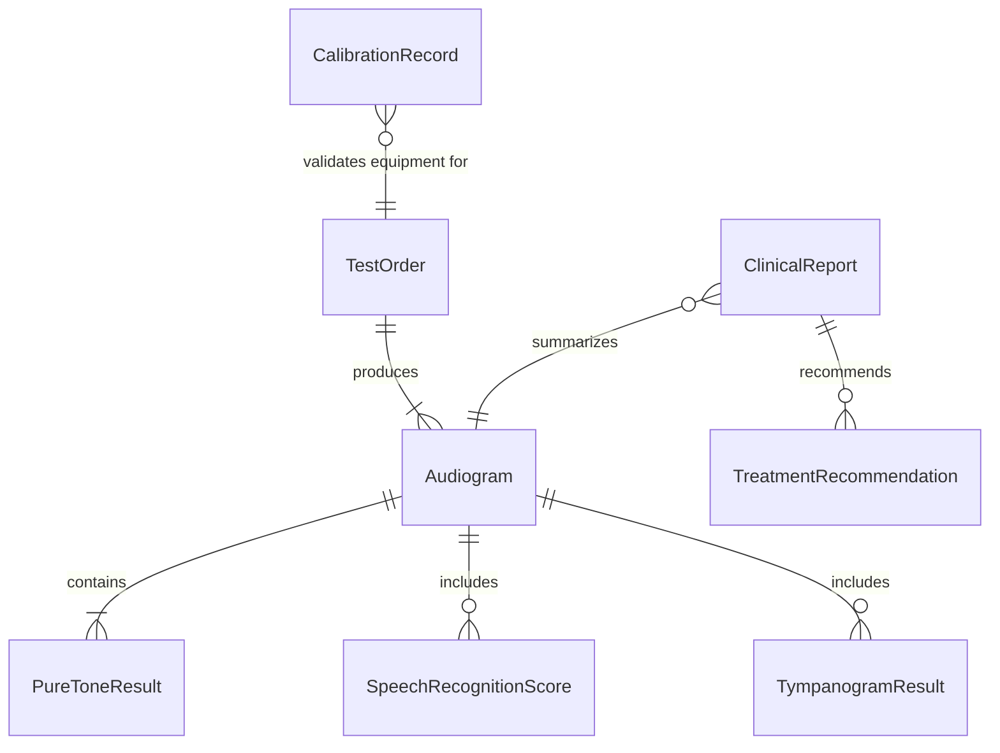
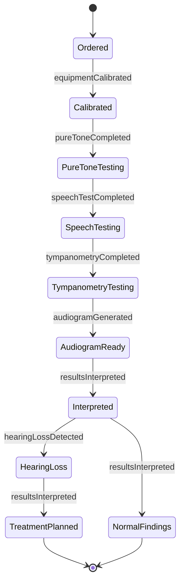
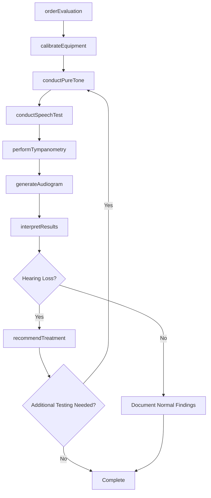
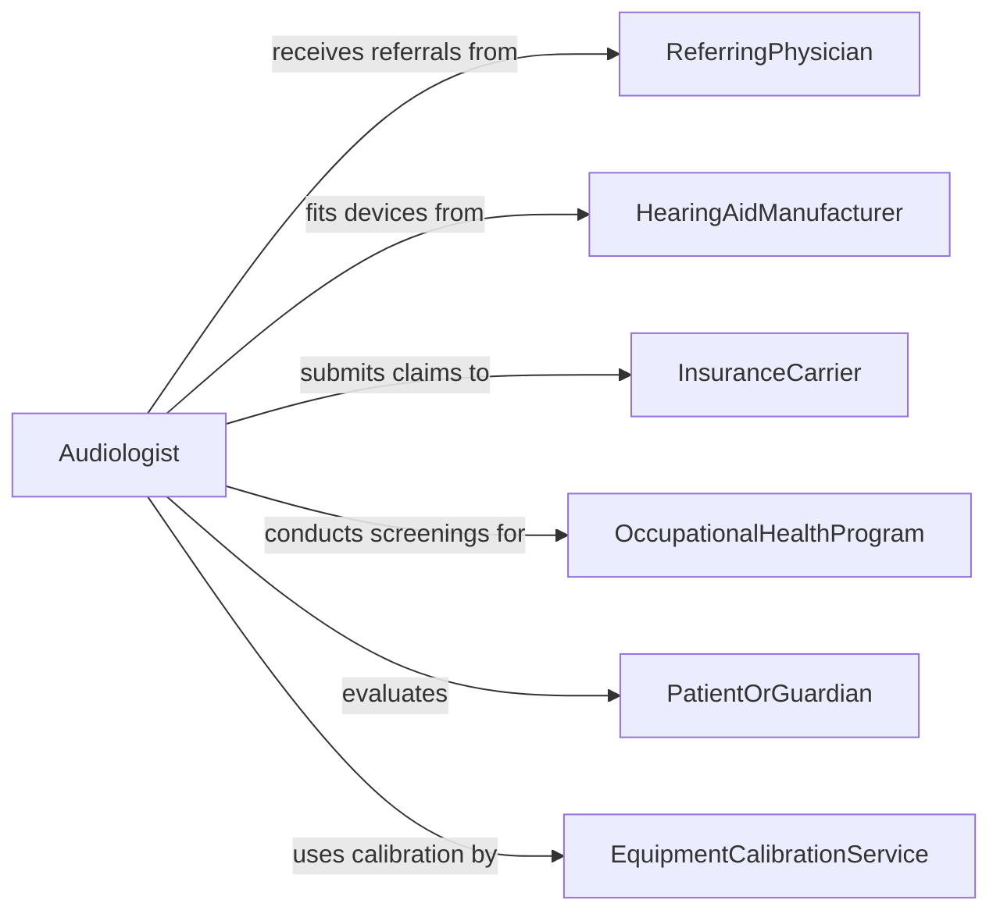

# Test Patient Hearing

> Business-as-Code definition for testing patient hearing. Models the audiological evaluation workflow from referral and patient preparation through pure-tone audiometry, speech recognition testing, tympanometry, and result interpretation for treatment planning.

## Overview

Testing patient hearing involves conducting standardized audiological assessments to measure hearing sensitivity, speech discrimination ability, and middle ear function. This definition covers the complete evaluation cycle including patient intake, booth calibration, audiometric testing, result analysis, and clinical reporting. It supports newborn hearing screening programs, occupational hearing conservation, and clinical audiology practices with integration to EHR systems and hearing device fitting workflows.

## Actors

| Actor | Description |
|-------|-------------|
| ReferringPhysician | Orders audiological evaluation based on patient symptoms or screening results |
| HearingAidManufacturer | Provides amplification devices fitted based on audiometric data |
| InsuranceCarrier | Authorizes and reimburses hearing evaluation procedures |
| OccupationalHealthProgram | Mandates hearing conservation testing for noise-exposed workers |
| PatientOrGuardian | Consents to testing and reports subjective hearing experiences |
| EquipmentCalibrationService | Certifies audiometric equipment meets ANSI standards |

## Roles

| Role | Description |
|------|-------------|
| Audiologist | Administers comprehensive hearing evaluations and interprets results |
| AudiometricTechnician | Conducts screening-level hearing tests under supervision |
| ENTSpecialist | Reviews audiological findings for medical or surgical intervention |
| HearingAidDispenser | Uses audiometric data to select and fit amplification devices |

## Entities

| Entity | Description |
|--------|-------------|
| Audiogram | A graphical representation of hearing thresholds across frequencies |
| TestOrder | A physician request for audiological evaluation |
| PureToneResult | Hearing threshold measurements at specific frequencies for air and bone conduction |
| SpeechRecognitionScore | A measure of the patient's ability to understand spoken words at various levels |
| TympanogramResult | A measure of middle ear compliance and acoustic reflex thresholds |
| CalibrationRecord | Documentation of audiometric equipment calibration status |
| ClinicalReport | A summary of audiological findings with diagnostic impressions |
| TreatmentRecommendation | Suggested interventions such as amplification, medical referral, or monitoring |

## Actions

| Action | Description |
|--------|-------------|
| orderEvaluation | Submit a request for audiological assessment |
| calibrateEquipment | Verify audiometer and booth meet calibration standards before testing |
| conductPureTone | Measure hearing thresholds across frequencies using air and bone conduction |
| conductSpeechTest | Assess speech recognition threshold and word discrimination ability |
| performTympanometry | Evaluate middle ear function and acoustic reflex pathways |
| generateAudiogram | Plot hearing threshold data on a standardized audiogram chart |
| interpretResults | Analyze audiometric data to determine type and degree of hearing loss |
| recommendTreatment | Suggest amplification, medical intervention, or monitoring based on findings |

## Events

| Event | Description |
|-------|-------------|
| evaluationOrdered | A hearing evaluation has been requested |
| equipmentCalibrated | Audiometric equipment has been verified for accuracy |
| pureToneCompleted | Air and bone conduction threshold testing is finished |
| speechTestCompleted | Speech recognition and discrimination testing is finished |
| tympanometryCompleted | Middle ear function assessment is complete |
| audiogramGenerated | A hearing threshold chart has been plotted |
| resultsInterpreted | A clinical interpretation of audiometric data is available |
| hearingLossDetected | A significant hearing deficit has been identified |

## Searches

| Search | Description |
|--------|-------------|
| findEvaluations | List hearing evaluations by patient, date, or referral source |
| getAudiograms | Retrieve audiogram data for a specific patient or date range |
| getHearingLossRecords | Find patients with detected hearing loss by type or severity |
| getCalibrationStatus | Check equipment calibration records and expiration dates |
| getPatientHistory | Look up all prior audiological evaluations for a patient |

## Entity Relationships



## State Diagram



## Workflow



## Actor Relationships



## Usage

### Calling Actions

```typescript
import { testPatientHearing } from '@headlessly/test-patient-hearing'

const audiology = testPatientHearing()

// Order a comprehensive hearing evaluation
const order = await audiology.orderEvaluation({
  patientId: 'PT-2026-05512',
  indication: 'progressive-bilateral-hearing-loss',
  referringPhysician: 'DR-CHEN',
  tests: ['pure-tone', 'speech', 'tympanometry']
})

// Conduct the evaluation
await audiology.calibrateEquipment({ booth: 'audiology-suite-01', audiometer: 'GSI-61' })

const pureTone = await audiology.conductPureTone({
  orderId: order.id,
  frequencies: [250, 500, 1000, 2000, 4000, 8000],
  conduction: ['air', 'bone']
})

const speech = await audiology.conductSpeechTest({
  orderId: order.id,
  tests: ['SRT', 'WRS']
})

// Generate audiogram and interpret
const audiogram = await audiology.generateAudiogram({ orderId: order.id })
const interpretation = await audiology.interpretResults({
  orderId: order.id,
  interpreter: 'AUD-THOMPSON'
})
```

### Event-Driven Automation

```typescript
// Auto-refer to ENT when medically treatable hearing loss is detected
audiology.hearingLossDetected(async ({ patientId, type, severity }) => {
  if (type === 'conductive' || type === 'mixed') {
    await referral.create({
      patientId,
      specialty: 'otolaryngology',
      reason: `${type} hearing loss - ${severity}`,
      urgency: 'within-4-weeks'
    })
  }
})

// Schedule hearing aid consultation for sensorineural loss
audiology.resultsInterpreted(async ({ patientId, lossType, avgThreshold }) => {
  if (lossType === 'sensorineural' && avgThreshold > 40) {
    await scheduling.bookAppointment({
      patientId,
      service: 'hearing-aid-consultation',
      urgency: 'within-2-weeks'
    })
  }
})
```
