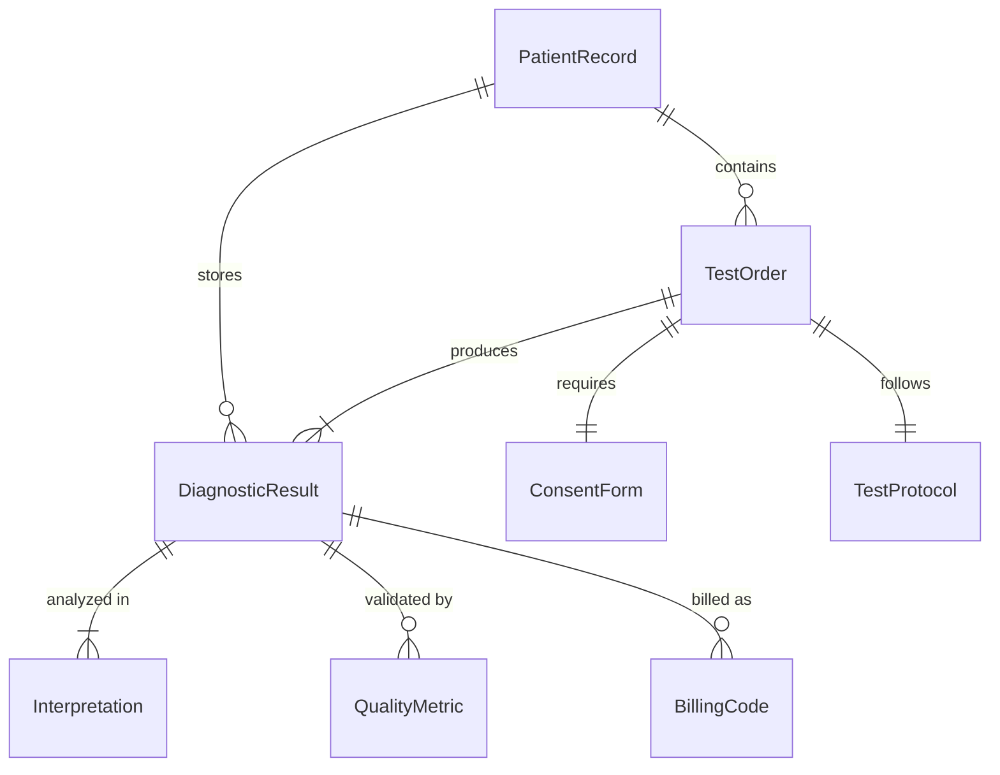
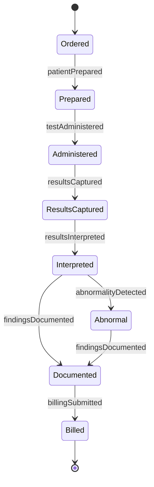
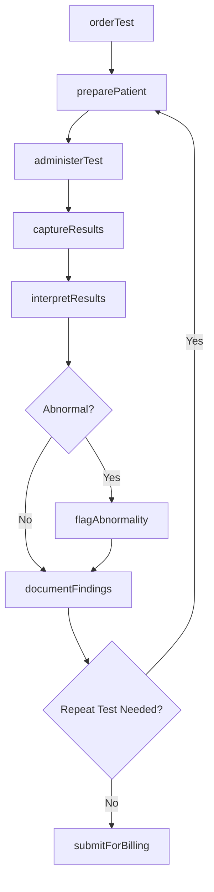
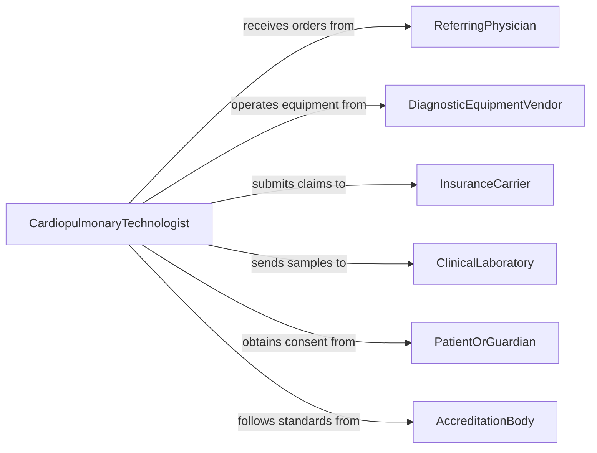

# Test Patient Heart or Lung Functioning

> Business-as-Code definition for testing patient heart and lung functioning. Models the clinical workflow of ordering, administering, interpreting, and documenting cardiopulmonary diagnostic tests including electrocardiograms, echocardiograms, spirometry, and stress tests.

## Overview

Testing patient heart or lung functioning involves performing a range of cardiopulmonary diagnostic procedures to evaluate cardiac rhythm, valve function, blood oxygenation, lung capacity, and exercise tolerance. This definition covers the full diagnostic cycle from physician order through test administration, result interpretation, and clinical documentation. It integrates with electronic health records, diagnostic equipment interfaces, and billing systems to support clinical decision-making and regulatory compliance.

## Actors

| Actor | Description |
|-------|-------------|
| ReferringPhysician | Orders cardiopulmonary tests based on clinical indications |
| DiagnosticEquipmentVendor | Provides and maintains ECG machines, spirometers, and imaging equipment |
| InsuranceCarrier | Authorizes and reimburses diagnostic testing procedures |
| ClinicalLaboratory | Processes blood gas samples and other laboratory components of cardiopulmonary workups |
| PatientOrGuardian | Consents to testing and provides relevant medical history |
| AccreditationBody | Sets standards for diagnostic testing quality and laboratory performance |

## Roles

| Role | Description |
|------|-------------|
| CardiopulmonaryTechnologist | Administers heart and lung function tests using specialized equipment |
| Cardiologist | Interprets cardiac test results and recommends treatment |
| Pulmonologist | Interprets pulmonary function test results and manages respiratory conditions |
| ClinicalNurse | Prepares patients for testing and monitors vital signs during procedures |

## Entities

| Entity | Description |
|--------|-------------|
| TestOrder | A physician request for a specific cardiopulmonary diagnostic procedure |
| DiagnosticResult | The measured values and waveform data produced by a test |
| PatientRecord | The clinical profile containing medical history and prior test results |
| TestProtocol | A standardized procedure defining equipment settings and patient preparation |
| Interpretation | A clinician's analysis of test results with diagnostic impressions |
| ConsentForm | A signed authorization from the patient for the testing procedure |
| BillingCode | A CPT or ICD code associated with the performed diagnostic test |
| QualityMetric | A measure of test accuracy, repeatability, or equipment calibration status |

## Actions

| Action | Description |
|--------|-------------|
| orderTest | Submit a request for a specific cardiopulmonary diagnostic test |
| preparePatient | Verify consent, review contraindications, and position the patient |
| administerTest | Execute the diagnostic procedure using calibrated equipment |
| captureResults | Record waveform data, measurements, and observations from the test |
| interpretResults | Analyze captured data and generate a clinical interpretation |
| documentFindings | Write the test results and interpretation into the patient record |
| submitForBilling | Generate and submit billing codes for the completed procedure |
| flagAbnormality | Mark a result that falls outside normal reference ranges for urgent review |

## Events

| Event | Description |
|-------|-------------|
| testOrdered | A cardiopulmonary diagnostic test has been requested |
| patientPrepared | The patient is ready for the testing procedure |
| testAdministered | The diagnostic procedure has been completed |
| resultsCaptured | Test data and measurements have been recorded |
| resultsInterpreted | A clinical interpretation of the test data is available |
| findingsDocumented | Test results have been written to the patient record |
| abnormalityDetected | A test result outside normal ranges has been flagged |
| billingSubmitted | Procedure codes have been submitted for reimbursement |

## Searches

| Search | Description |
|--------|-------------|
| findTestOrders | List pending or completed test orders by patient, physician, or date |
| getResults | Retrieve diagnostic results by test type, patient, or date range |
| getAbnormalities | Find flagged abnormal results requiring follow-up |
| getPatientHistory | Look up prior cardiopulmonary test results for a specific patient |
| getProtocols | Retrieve standardized test protocols by procedure type |

## Entity Relationships



## State Diagram



## Workflow



## Actor Relationships



## Usage

### Calling Actions

```typescript
import { testPatientHeartLungFunctioning } from '@headlessly/test-patient-heart-lung-functioning'

const cardiopulmonary = testPatientHeartLungFunctioning()

// Order a pulmonary function test
const order = await cardiopulmonary.orderTest({
  patientId: 'PT-2026-08421',
  testType: 'spirometry',
  indication: 'chronic-cough-evaluation',
  referringPhysician: 'DR-JOHNSON',
  urgency: 'routine'
})

// Administer the test and capture results
await cardiopulmonary.preparePatient({
  orderId: order.id,
  contraindications: [],
  consentObtained: true
})

const results = await cardiopulmonary.administerTest({
  orderId: order.id,
  protocol: 'ATS-ERS-Spirometry',
  equipment: 'spirometer-lab-02'
})

// Interpret and document
const interpretation = await cardiopulmonary.interpretResults({
  resultId: results.id,
  interpreter: 'DR-WILLIAMS',
  referenceStandard: 'NHANES-III'
})
```

### Event-Driven Automation

```typescript
// Escalate abnormal results for immediate physician review
cardiopulmonary.abnormalityDetected(async ({ patientId, testType, finding }) => {
  await notify({
    to: 'attending-physician',
    message: `Abnormal ${testType} result for patient ${patientId}: ${finding}`,
    priority: 'urgent'
  })
})

// Auto-schedule follow-up when results indicate progressive decline
cardiopulmonary.resultsInterpreted(async ({ patientId, testType, trend }) => {
  if (trend === 'declining') {
    await scheduling.bookAppointment({
      patientId,
      specialty: testType === 'spirometry' ? 'pulmonology' : 'cardiology',
      urgency: 'within-2-weeks'
    })
  }
})
```
