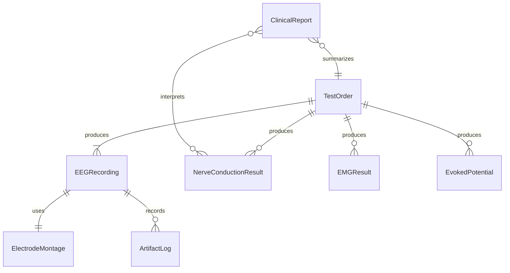
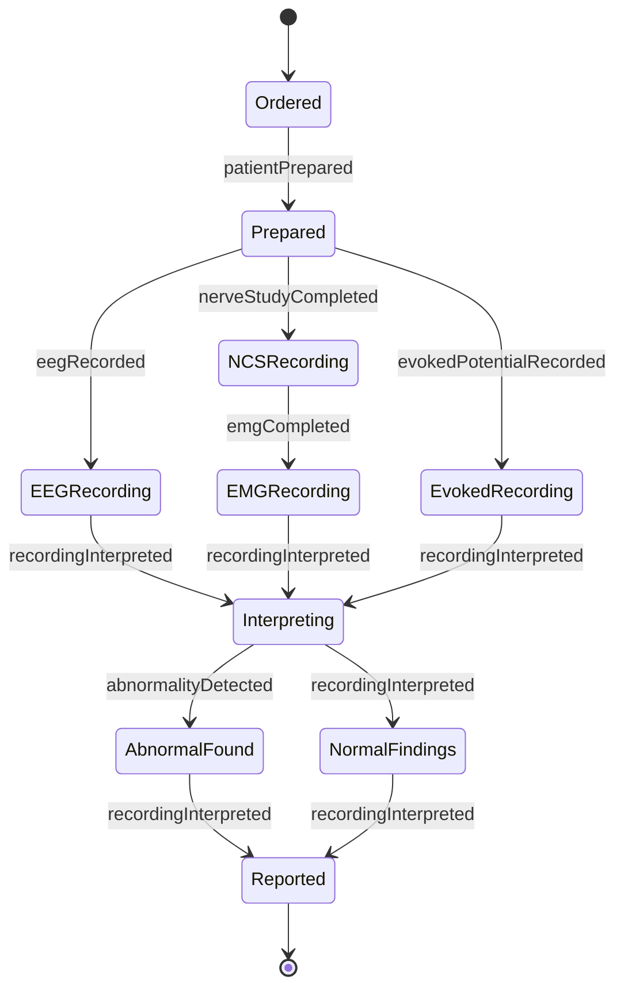
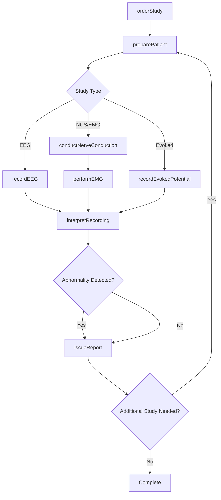
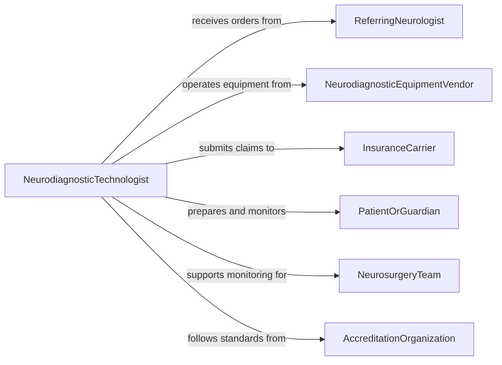

# Test Patient Nervous System Functioning

> Business-as-Code definition for testing patient nervous system functioning. Models the neurodiagnostic workflow of ordering, administering, recording, and interpreting electroencephalography, nerve conduction studies, electromyography, and evoked potential tests.

## Overview

Testing patient nervous system functioning involves performing specialized neurodiagnostic procedures to assess brain electrical activity, peripheral nerve conduction velocity, neuromuscular junction integrity, and sensory pathway function. This definition covers EEG monitoring, nerve conduction studies, needle EMG, and evoked potential testing from order entry through setup, recording, interpretation, and clinical reporting. It supports neurology clinics, epilepsy monitoring units, and intraoperative neurophysiology programs.

## Actors

| Actor | Description |
|-------|-------------|
| ReferringNeurologist | Orders neurodiagnostic tests based on clinical presentation |
| NeurodiagnosticEquipmentVendor | Provides EEG machines, EMG systems, and evoked potential equipment |
| InsuranceCarrier | Authorizes and reimburses neurodiagnostic procedures |
| PatientOrGuardian | Consents to testing and provides symptom history |
| NeurosurgeryTeam | Requests intraoperative monitoring during surgical procedures |
| AccreditationOrganization | Sets quality standards for neurodiagnostic laboratories |

## Roles

| Role | Description |
|------|-------------|
| NeurodiagnosticTechnologist | Sets up equipment, applies electrodes, and records neurodiagnostic data |
| Neurologist | Interprets neurodiagnostic recordings and issues clinical reports |
| Neurophysiologist | Oversees intraoperative monitoring and complex study protocols |
| ClinicalCoordinator | Manages test scheduling, patient preparation, and report distribution |

## Entities

| Entity | Description |
|--------|-------------|
| TestOrder | A physician request for a specific neurodiagnostic procedure |
| EEGRecording | A time-series recording of brain electrical activity from scalp electrodes |
| NerveConductionResult | Measurements of nerve impulse speed and amplitude across peripheral nerves |
| EMGResult | Needle electrode recordings of muscle electrical activity at rest and during contraction |
| EvokedPotential | A recording of nervous system responses to specific sensory stimuli |
| ElectrodeMontage | The specific arrangement and configuration of recording electrodes |
| ClinicalReport | A documented interpretation of neurodiagnostic findings with impressions |
| ArtifactLog | A record of technical artifacts encountered during the recording |

## Actions

| Action | Description |
|--------|-------------|
| orderStudy | Submit a request for a specific neurodiagnostic procedure |
| preparePatient | Apply electrodes, verify impedances, and position the patient |
| recordEEG | Capture brain electrical activity over a defined monitoring period |
| conductNerveConduction | Stimulate peripheral nerves and measure response latencies and amplitudes |
| performEMG | Insert needle electrodes and record muscle electrical activity |
| recordEvokedPotential | Administer sensory stimuli and capture nervous system responses |
| interpretRecording | Analyze waveform data and generate diagnostic impressions |
| issueReport | Finalize and distribute the clinical interpretation to the referring provider |

## Events

| Event | Description |
|-------|-------------|
| studyOrdered | A neurodiagnostic procedure has been requested |
| patientPrepared | Electrodes are applied and impedances verified |
| eegRecorded | Brain electrical activity has been captured |
| nerveStudyCompleted | Peripheral nerve conduction measurements are finished |
| emgCompleted | Needle EMG recordings are finished |
| evokedPotentialRecorded | Sensory evoked potential data has been captured |
| recordingInterpreted | A clinical interpretation of the neurodiagnostic data is available |
| abnormalityDetected | An abnormal finding requiring clinical attention has been identified |

## Searches

| Search | Description |
|--------|-------------|
| findStudies | List neurodiagnostic studies by patient, type, or date |
| getRecordings | Retrieve EEG, NCS, or EMG recordings for a specific study |
| getAbnormalities | Find studies with flagged abnormal findings |
| getPatientHistory | Look up prior neurodiagnostic studies for a patient |
| getEquipmentStatus | Check availability and calibration status of neurodiagnostic equipment |

## Entity Relationships



## State Diagram



## Workflow



## Actor Relationships



## Usage

### Calling Actions

```typescript
import { testPatientNervousSystemFunctioning } from '@headlessly/test-patient-nervous-system-functioning'

const neurodiag = testPatientNervousSystemFunctioning()

// Order an EEG for seizure evaluation
const order = await neurodiag.orderStudy({
  patientId: 'PT-2026-09107',
  studyType: 'routine-EEG',
  indication: 'new-onset-seizures',
  referringPhysician: 'DR-NAKAMURA',
  duration: 30
})

// Prepare and record
await neurodiag.preparePatient({
  orderId: order.id,
  montage: 'international-10-20',
  impedanceTarget: 5000
})

const recording = await neurodiag.recordEEG({
  orderId: order.id,
  activations: ['hyperventilation', 'photic-stimulation'],
  duration: 30
})

// Interpret and report
const interpretation = await neurodiag.interpretRecording({
  recordingId: recording.id,
  interpreter: 'DR-NAKAMURA'
})

await neurodiag.issueReport({
  orderId: order.id,
  interpretationId: interpretation.id
})
```

### Event-Driven Automation

```typescript
// Escalate epileptiform activity for urgent neurologist review
neurodiag.abnormalityDetected(async ({ patientId, studyType, finding }) => {
  if (finding.includes('epileptiform')) {
    await notify({
      to: 'on-call-neurologist',
      message: `Epileptiform activity detected on ${studyType} for patient ${patientId}`,
      priority: 'urgent'
    })
  }
})

// Auto-schedule follow-up for abnormal findings
neurodiag.recordingInterpreted(async ({ patientId, abnormal, studyType }) => {
  if (abnormal) {
    await scheduling.bookAppointment({
      patientId,
      specialty: 'neurology',
      reason: `Abnormal ${studyType} - follow-up`,
      urgency: 'within-1-week'
    })
  }
})
```
