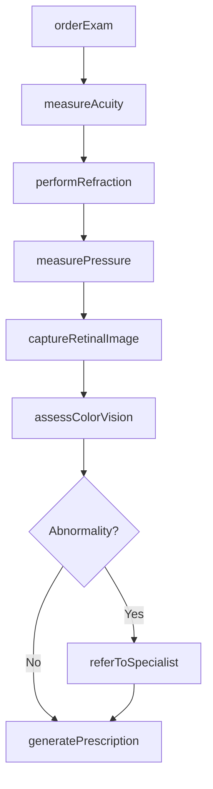
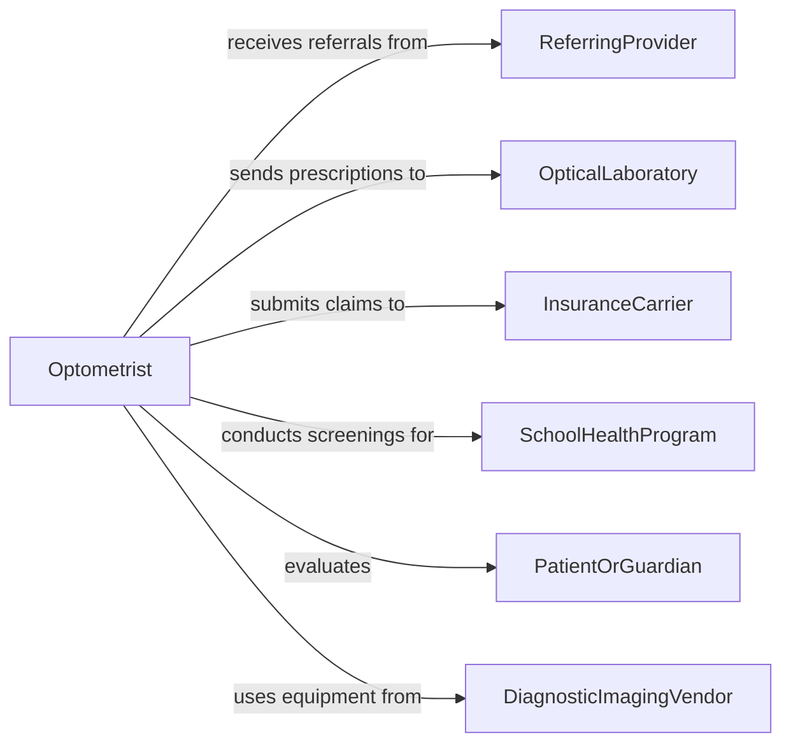

# Test Patient Vision

> Business-as-Code definition for testing patient vision. Models the ophthalmic evaluation workflow from visual acuity screening through refraction, tonometry, retinal imaging, and prescription generation for corrective lenses or treatment referral.

## Overview

Testing patient vision involves conducting standardized ophthalmic assessments to measure visual acuity, refractive error, intraocular pressure, color perception, and retinal health. This definition covers the complete eye examination workflow from patient intake through automated and manual testing, diagnostic imaging, result interpretation, and prescription or referral generation. It supports optometry clinics, ophthalmology practices, occupational vision screening, and school-based vision programs.

## Actors

| Actor | Description |
|-------|-------------|
| ReferringProvider | Orders vision testing based on patient complaints or screening results |
| OpticalLaboratory | Fabricates corrective lenses based on prescribed specifications |
| InsuranceCarrier | Authorizes and reimburses vision evaluation and corrective services |
| SchoolHealthProgram | Mandates vision screening for enrolled students |
| PatientOrGuardian | Reports visual symptoms and consents to diagnostic procedures |
| DiagnosticImagingVendor | Provides retinal cameras, OCT devices, and other ophthalmic imaging equipment |

## Roles

| Role | Description |
|------|-------------|
| Optometrist | Conducts comprehensive eye examinations and prescribes corrective lenses |
| Ophthalmologist | Diagnoses and treats eye diseases requiring medical or surgical intervention |
| OphtalmicTechnician | Performs preliminary testing and operates diagnostic imaging equipment |
| Optician | Interprets prescriptions and fits corrective eyewear |

## Entities

| Entity | Description |
|--------|-------------|
| VisualAcuityResult | A measurement of the patient's clarity of vision at specified distances |
| RefractionData | The optical measurements defining a patient's corrective lens prescription |
| TonometryReading | Intraocular pressure measurement used to screen for glaucoma |
| RetinalImage | A photograph or scan of the retina and optic nerve for disease detection |
| Prescription | A corrective lens specification including sphere, cylinder, axis, and add power |
| ExamRecord | A comprehensive record of all findings from the vision evaluation |
| ReferralOrder | A recommendation for specialist consultation based on exam findings |
| ColorVisionResult | An assessment of the patient's ability to distinguish colors |

## Actions

| Action | Description |
|--------|-------------|
| orderExam | Submit a request for a vision evaluation or specific ophthalmic test |
| measureAcuity | Test visual acuity using standardized charts at distance and near |
| performRefraction | Determine the optical correction needed using autorefractor and phoropter |
| measurePressure | Assess intraocular pressure using tonometry |
| captureRetinalImage | Obtain fundus photographs or OCT scans of the retina |
| assessColorVision | Test color discrimination using Ishihara plates or similar instruments |
| generatePrescription | Produce a corrective lens specification based on refraction results |
| referToSpecialist | Create a referral for ophthalmological or medical follow-up |

## Events

| Event | Description |
|-------|-------------|
| examOrdered | A vision evaluation has been requested |
| acuityMeasured | Visual acuity testing is complete |
| refractionCompleted | Optical correction measurements have been determined |
| pressureMeasured | Intraocular pressure readings have been recorded |
| retinalImageCaptured | Fundus or OCT imaging of the retina is complete |
| colorVisionAssessed | Color discrimination testing is finished |
| prescriptionGenerated | A corrective lens prescription has been issued |
| abnormalityDetected | An ophthalmic finding requiring follow-up has been identified |

## Searches

| Search | Description |
|--------|-------------|
| findExams | List vision evaluations by patient, date, or provider |
| getPrescriptions | Retrieve current and historical prescriptions for a patient |
| getAbnormalities | Find flagged findings requiring specialist referral |
| getRetinalImages | Access retinal imaging records for a specific patient |
| getAcuityTrends | Track visual acuity changes over time for a patient |

## Workflow



## Actor Relationships



## Usage

### Calling Actions

```typescript
import { testPatientVision } from '@headlessly/test-patient-vision'

const vision = testPatientVision()

// Order a comprehensive eye examination
const exam = await vision.orderExam({
  patientId: 'PT-2026-07834',
  indication: 'annual-comprehensive-exam',
  tests: ['acuity', 'refraction', 'tonometry', 'fundus-photo']
})

// Conduct the examination sequence
const acuity = await vision.measureAcuity({
  examId: exam.id,
  chart: 'Snellen',
  distances: ['20-feet', '16-inches']
})

const refraction = await vision.performRefraction({
  examId: exam.id,
  method: 'autorefractor-plus-subjective'
})

const pressure = await vision.measurePressure({
  examId: exam.id,
  method: 'non-contact-tonometry'
})

// Generate prescription
const rx = await vision.generatePrescription({
  examId: exam.id,
  refractionId: refraction.id,
  includeAdd: true
})
```

### Event-Driven Automation

```typescript
// Flag elevated intraocular pressure for glaucoma workup
vision.pressureMeasured(async ({ patientId, examId, iop }) => {
  if (iop.right > 21 || iop.left > 21) {
    await vision.referToSpecialist({
      patientId,
      specialty: 'glaucoma',
      reason: `Elevated IOP: OD=${iop.right} OS=${iop.left}`,
      urgency: 'within-2-weeks'
    })
  }
})

// Notify optical lab when new prescription is ready
vision.prescriptionGenerated(async ({ patientId, prescription }) => {
  await notify({
    to: 'optical-lab',
    message: `New prescription ready for patient ${patientId}: ${prescription.summary}`
  })
})
```
