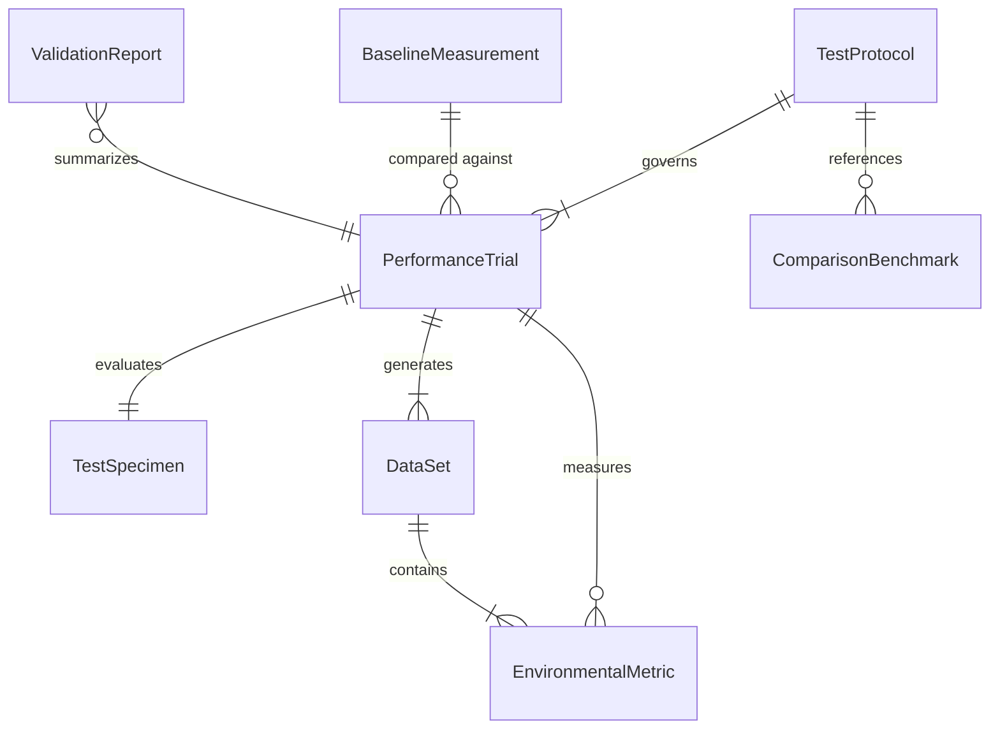
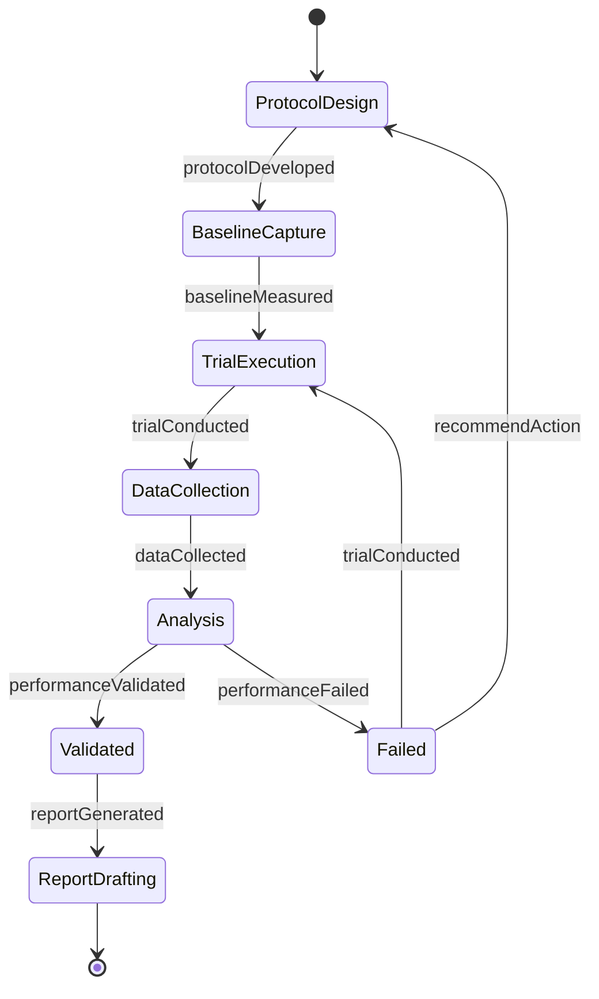
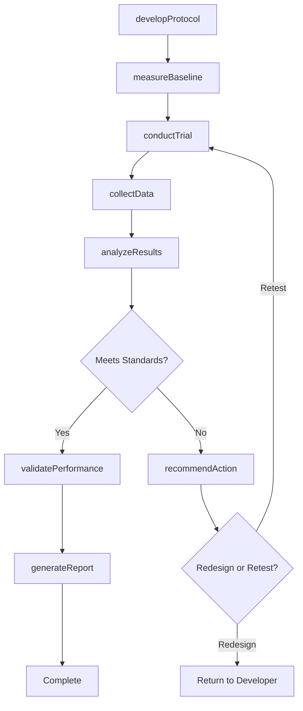
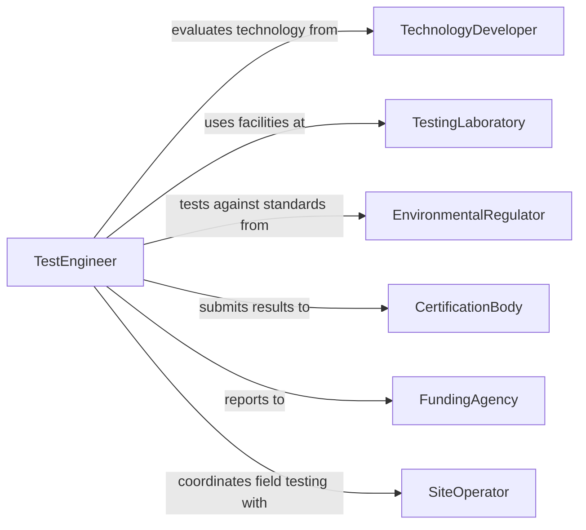

# Test Green Technologies or Processes

> Business-as-Code definition for testing green technologies or processes. Models the evaluation workflow of designing test protocols, conducting performance trials, measuring environmental metrics, and generating validation reports for sustainable technologies and processes.

## Overview

Testing green technologies or processes involves designing and executing controlled evaluations of renewable energy systems, waste reduction methods, water treatment technologies, and low-emission manufacturing processes. This definition provides actions for protocol development, baseline measurement, test execution, data collection, and comparative analysis. It supports technology readiness assessments, pilot program evaluations, and certification testing for environmental technologies ranging from solar panels and wind turbines to biofiltration systems and green chemistry processes.

## Actors

| Actor | Description |
|-------|-------------|
| TechnologyDeveloper | Creates the green technology or process being evaluated |
| TestingLaboratory | Provides controlled facilities and instrumentation for performance testing |
| EnvironmentalRegulator | Sets performance standards and certification requirements for green technologies |
| CertificationBody | Issues environmental performance certifications based on test results |
| FundingAgency | Provides grants or incentives contingent on validated performance data |
| SiteOperator | Manages the facility or location where field testing is conducted |

## Roles

| Role | Description |
|------|-------------|
| TestEngineer | Designs test protocols and operates measurement instrumentation |
| EnvironmentalScientist | Analyzes environmental impact data and validates performance claims |
| QualityAssuranceManager | Ensures testing procedures meet accuracy and reproducibility standards |
| ProjectLead | Coordinates the overall testing program and manages stakeholder reporting |

## Entities

| Entity | Description |
|--------|-------------|
| TestProtocol | A documented procedure specifying test conditions, measurements, and acceptance criteria |
| BaselineMeasurement | Pre-test environmental metrics used for comparison against test outcomes |
| PerformanceTrial | A controlled execution of the technology or process under specified conditions |
| EnvironmentalMetric | A quantitative measure such as energy yield, emissions reduction, or water savings |
| ValidationReport | A comprehensive document summarizing test results and performance conclusions |
| ComparisonBenchmark | An established standard or competing technology used as a reference point |
| TestSpecimen | A sample or prototype of the technology undergoing evaluation |
| DataSet | Collected measurements and observations from a performance trial |

## Actions

| Action | Description |
|--------|-------------|
| developProtocol | Create a detailed test plan with conditions, metrics, and acceptance thresholds |
| measureBaseline | Capture pre-test environmental and performance metrics for comparison |
| conductTrial | Execute the test procedure under controlled or field conditions |
| collectData | Record measurements, observations, and environmental readings during the trial |
| analyzeResults | Compare trial data against baselines, benchmarks, and acceptance criteria |
| validatePerformance | Determine whether the technology meets specified performance standards |
| generateReport | Compile findings into a formal validation or certification report |
| recommendAction | Suggest next steps such as deployment, redesign, or additional testing |

## Events

| Event | Description |
|-------|-------------|
| protocolDeveloped | A test protocol has been finalized and approved |
| baselineMeasured | Pre-test environmental metrics have been recorded |
| trialConducted | A performance trial has been completed |
| dataCollected | Measurement data from the trial has been recorded and stored |
| resultsAnalyzed | Trial data has been compared against benchmarks and acceptance criteria |
| performanceValidated | The technology has been confirmed to meet performance standards |
| performanceFailed | The technology did not meet specified acceptance criteria |
| reportGenerated | A formal validation report has been produced |

## Searches

| Search | Description |
|--------|-------------|
| findTrials | List performance trials by technology, date, or outcome |
| getProtocols | Retrieve test protocols by technology type or standard |
| getMetrics | Query environmental performance metrics from specific trials |
| getReports | Look up validation reports by technology or certification status |
| getBenchmarks | Access comparison benchmarks for a given technology category |

## Entity Relationships



## State Diagram



## Workflow



## Actor Relationships



## Usage

### Calling Actions

```typescript
import { testGreenTechnologiesProcesses } from '@headlessly/test-green-technologies-processes'

const greenTest = testGreenTechnologiesProcesses()

// Develop a test protocol for a new solar panel coating
const protocol = await greenTest.developProtocol({
  technology: 'anti-reflective-solar-coating',
  testType: 'performance-efficiency',
  conditions: { irradiance: 1000, temperature: 25, humidity: 50 },
  metrics: ['powerOutput', 'efficiency', 'degradationRate'],
  standard: 'IEC-61215',
  duration: '1000-hours'
})

// Measure baseline and conduct trial
const baseline = await greenTest.measureBaseline({
  protocolId: protocol.id,
  specimen: 'uncoated-reference-panel',
  metrics: ['powerOutput', 'efficiency']
})

const trial = await greenTest.conductTrial({
  protocolId: protocol.id,
  specimen: 'coated-test-panel',
  environment: 'controlled-solar-simulator'
})

// Analyze and validate
const analysis = await greenTest.analyzeResults({
  trialId: trial.id,
  baselineId: baseline.id,
  method: 'comparative-percentage'
})

await greenTest.validatePerformance({
  trialId: trial.id,
  standard: 'IEC-61215',
  acceptanceCriteria: { minEfficiencyGain: 0.03 }
})
```

### Event-Driven Automation

```typescript
// Notify certification body when performance is validated
greenTest.performanceValidated(async ({ trialId, technology, metrics }) => {
  await notify({
    to: 'certification-body',
    message: `${technology} passed performance validation - ready for certification review`
  })
})

// Alert development team when a trial fails
greenTest.performanceFailed(async ({ trialId, technology, failedMetrics }) => {
  await notify({
    to: 'r-and-d-team',
    message: `${technology} failed: ${failedMetrics.map(m => m.name).join(', ')} below threshold`
  })
})
```
