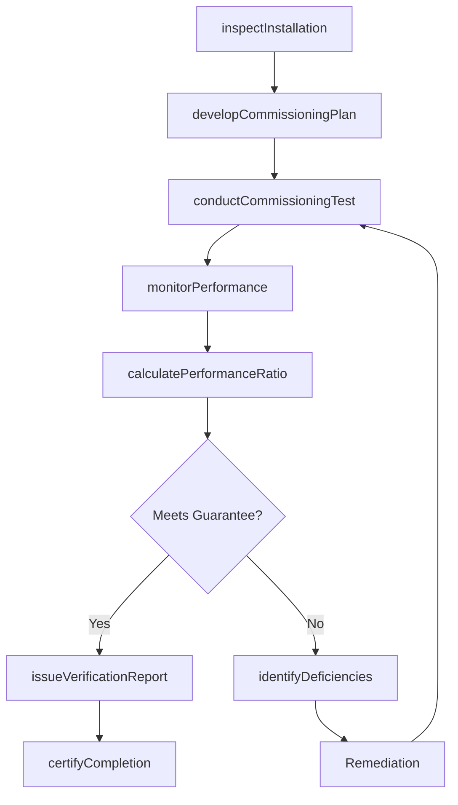
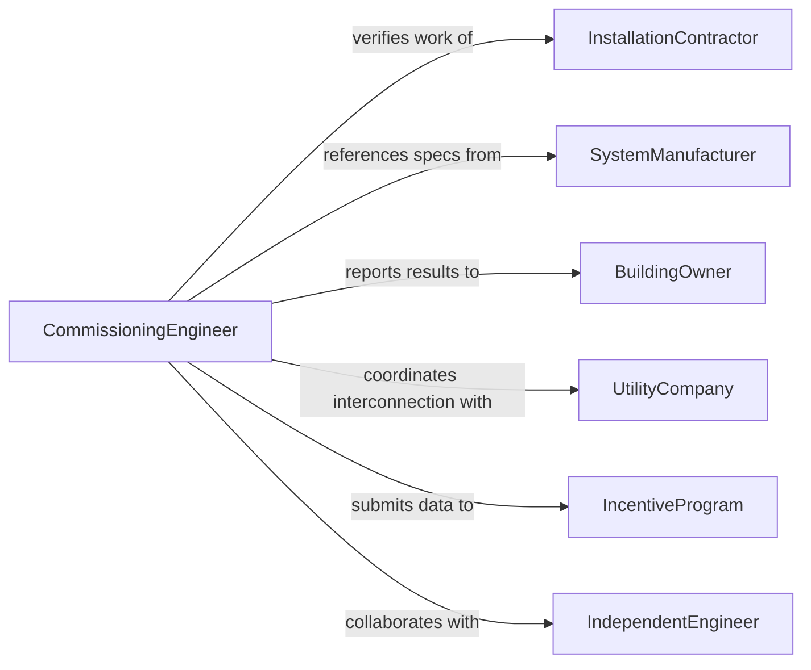

# Test Green Technology Installations to Verify Performance

> Business-as-Code definition for testing green technology installations to verify performance. Models the commissioning and post-installation verification workflow for renewable energy systems, energy efficiency upgrades, and sustainable infrastructure to confirm they meet design specifications and performance guarantees.

## Overview

Testing green technology installations to verify performance involves conducting commissioning tests, monitoring operational output, and comparing actual performance against design specifications and contractual guarantees. This definition covers solar photovoltaic systems, wind turbines, geothermal heat pumps, building energy management systems, and water recycling installations. It provides actions for pre-commissioning inspections, performance monitoring, efficiency calculations, and warranty compliance documentation.

## Actors

| Actor | Description |
|-------|-------------|
| InstallationContractor | Completes the physical installation and requests commissioning verification |
| SystemManufacturer | Provides performance specifications and warranty terms for the installed equipment |
| BuildingOwner | Commissions the verification to ensure the installation meets contractual guarantees |
| UtilityCompany | Provides interconnection requirements and monitors grid-tied system performance |
| IncentiveProgram | Requires verified performance data to release financial rebates or tax credits |
| IndependentEngineer | Conducts third-party verification when required by lenders or investors |

## Roles

| Role | Description |
|------|-------------|
| CommissioningEngineer | Designs and executes installation performance verification tests |
| EnergyAnalyst | Monitors operational data and calculates performance metrics |
| QualityInspector | Verifies that installed components match design specifications |
| ProjectManager | Coordinates verification activities and manages stakeholder communication |

## Entities

| Entity | Description |
|--------|-------------|
| Installation | A deployed green technology system under performance verification |
| CommissioningPlan | A documented sequence of tests and inspections for verifying installation performance |
| PerformanceGuarantee | Contractual specifications defining expected output or efficiency levels |
| MonitoringData | Time-series measurements of energy output, consumption, or environmental impact |
| VerificationReport | A formal document confirming whether the installation meets performance targets |
| DeficiencyLog | A list of identified issues preventing the installation from meeting specifications |
| PerformanceRatio | A calculated metric comparing actual output to theoretical maximum |
| CertificateOfCompletion | Documentation confirming successful commissioning and performance verification |

## Actions

| Action | Description |
|--------|-------------|
| inspectInstallation | Verify that physical installation matches design drawings and specifications |
| developCommissioningPlan | Create a structured test sequence for verifying system performance |
| conductCommissioningTest | Execute performance verification procedures on the installed system |
| monitorPerformance | Collect operational output data over a defined monitoring period |
| calculatePerformanceRatio | Compute actual versus expected performance metrics |
| identifyDeficiencies | Document any issues preventing the system from meeting performance targets |
| issueVerificationReport | Produce a formal report on installation performance results |
| certifyCompletion | Issue documentation confirming the installation has passed performance verification |

## Events

| Event | Description |
|-------|-------------|
| installationInspected | Physical inspection of the installed system is complete |
| commissioningPlanDeveloped | A verification test sequence has been finalized |
| commissioningTestConducted | Performance verification procedures have been executed |
| performanceMonitored | Operational data collection over the monitoring period is complete |
| performanceRatioCalculated | Actual versus expected performance metrics have been computed |
| deficiencyIdentified | An issue preventing performance targets from being met has been logged |
| verificationReportIssued | A formal performance verification report has been produced |
| completionCertified | The installation has been confirmed as meeting performance guarantees |

## Searches

| Search | Description |
|--------|-------------|
| findInstallations | List green technology installations by type, location, or verification status |
| getMonitoringData | Retrieve time-series performance data for a specific installation |
| getDeficiencies | Query identified deficiencies by installation, severity, or resolution status |
| getVerificationReports | Look up performance verification reports by project or outcome |
| getPerformanceRatios | Compare performance ratios across installations or time periods |

## Workflow



## Actor Relationships



## Usage

### Calling Actions

```typescript
import { testGreenTechnologyInstallationsVerify } from '@headlessly/test-green-technology-installations-verify'

const commissioning = testGreenTechnologyInstallationsVerify()

// Inspect a rooftop solar installation
const inspection = await commissioning.inspectInstallation({
  installationId: 'INST-2026-SOLAR-0412',
  type: 'solar-photovoltaic',
  designCapacity: 250, // kW
  location: 'warehouse-roof-atlanta',
  contractor: 'SunPower-Southeast'
})

// Develop and execute commissioning plan
const plan = await commissioning.developCommissioningPlan({
  installationId: inspection.installationId,
  tests: ['iv-curve-trace', 'inverter-efficiency', 'string-voltage', 'ground-fault'],
  monitoringPeriod: '30-days'
})

await commissioning.conductCommissioningTest({
  planId: plan.id,
  environment: { irradiance: 950, ambientTemp: 28 }
})

// Monitor and calculate performance
const monitoring = await commissioning.monitorPerformance({
  installationId: inspection.installationId,
  period: { start: '2026-03-01', end: '2026-03-31' },
  metrics: ['energyYield', 'specificYield', 'availability']
})

const ratio = await commissioning.calculatePerformanceRatio({
  monitoringId: monitoring.id,
  designYield: 32500 // kWh expected for period
})
```

### Event-Driven Automation

```typescript
// Release incentive payments when performance is certified
commissioning.completionCertified(async ({ installationId, performanceRatio }) => {
  await incentives.releasePayment({
    installationId,
    performanceRatio,
    program: 'state-solar-rebate'
  })
})

// Alert contractor when deficiencies are found
commissioning.deficiencyIdentified(async ({ installationId, deficiency }) => {
  await notify({
    to: 'installation-contractor',
    message: `Deficiency found at ${installationId}: ${deficiency.description}`,
    deadline: deficiency.remediationDeadline
  })
})
```
