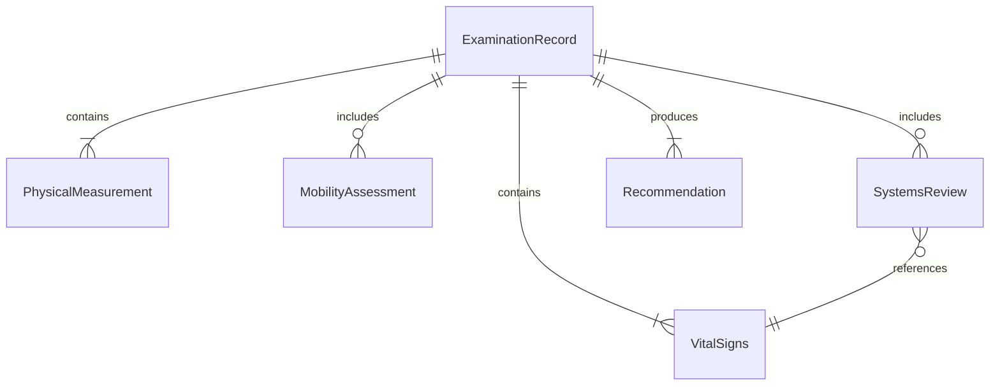
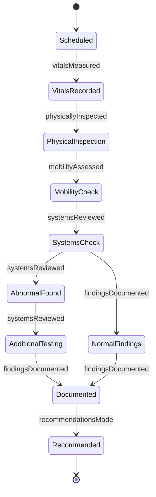
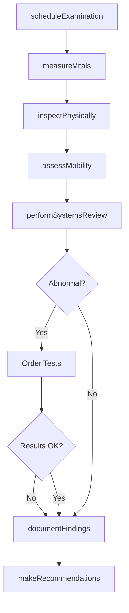
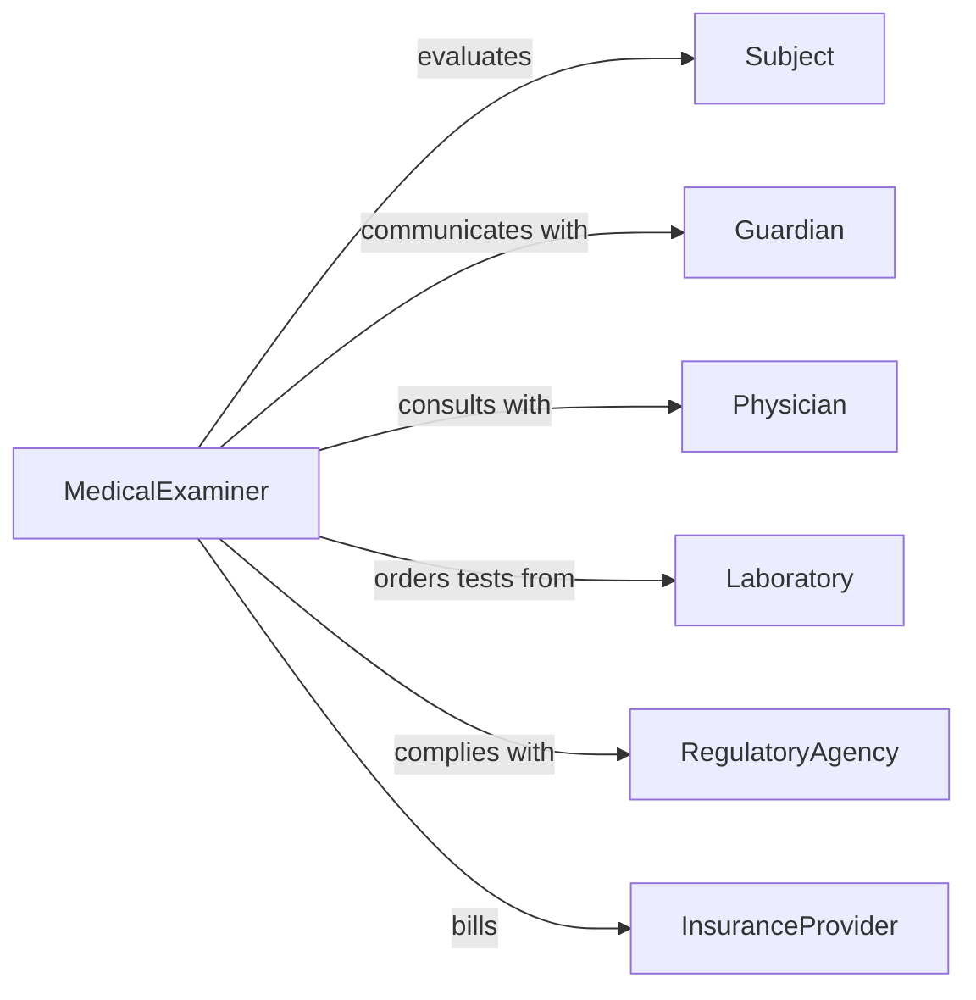

# Check Physical Condition People Animals

> Business-as-Code definition for physical condition assessment of people and animals. Models systematic evaluation of physical status, vital signs, mobility, and overall health indicators in healthcare, veterinary, athletic, and safety contexts.

## Overview

Physical condition checking involves systematic observation, measurement, and documentation of physical attributes and health indicators. This work spans medical examinations, veterinary assessments, athletic physicals, workplace fitness evaluations, and safety screenings. This definition exposes actions for assessment, measurement, documentation, and follow-up recommendations.

## Actors

| Actor | Description |
|-------|-------------|
| Subject | Person or animal being evaluated |
| Guardian | Parent, owner, or responsible party for subject |
| Physician | Licensed medical doctor conducting examinations |
| Laboratory | Provides diagnostic testing services |
| RegulatoryAgency | Sets standards for health and safety screenings |
| InsuranceProvider | Covers costs of medical examinations |

## Roles

| Role | Description |
|------|-------------|
| MedicalExaminer | Conducts physical assessments of people |
| Veterinarian | Evaluates animal health and condition |
| AthleticTrainer | Assesses physical fitness for sports participation |
| OccupationalHealthNurse | Screens workers for job fitness |

## Entities

| Entity | Description |
|--------|-------------|
| ExaminationRecord | Complete documentation of physical assessment |
| VitalSigns | Temperature, pulse, respiration, blood pressure |
| PhysicalMeasurement | Height, weight, body composition metrics |
| MobilityAssessment | Range of motion, gait, coordination evaluation |
| SystemsReview | Evaluation of organ systems and body functions |
| Recommendation | Follow-up actions or restrictions based on findings |

## Actions

| Action | Description |
|--------|-------------|
| scheduleExamination | Arrange appointment for physical assessment |
| measureVitals | Record temperature, pulse, respiration, pressure |
| assessMobility | Evaluate movement, flexibility, and coordination |
| inspectPhysically | Observe skin, posture, and physical appearance |
| performSystemsReview | Check cardiovascular, respiratory, neurological function |
| documentFindings | Record all observations and measurements |
| makeRecommendations | Provide guidance for follow-up or restrictions |

## Events

| Event | Description |
|-------|-------------|
| examinationScheduled | Appointment has been created |
| vitalsMeasured | Temperature, pulse, and pressure have been recorded |
| mobilityAssessed | Movement and coordination have been evaluated |
| physicallyInspected | Visual examination has been completed |
| systemsReviewed | Organ system function has been checked |
| findingsDocumented | Complete record has been saved |
| recommendationsMade | Guidance has been provided to subject |

## Searches

| Search | Description |
|--------|-------------|
| findExaminations | List assessments by subject, date, or type |
| getVitals | Retrieve vital sign history for a subject |
| getRecommendations | Find follow-up guidance by subject or examiner |
| getFitnessClearances | List subjects cleared for activity |

## Entity Relationships



## State Diagram



## Workflow



## Actor Relationships



## Usage

### Calling Actions

```typescript
import { checkPhysicalConditionPeopleAnimals } from '@headlessly/check-physical-condition-people-animals'

const exams = checkPhysicalConditionPeopleAnimals()

// Schedule pre-employment physical
const exam = await exams.scheduleExamination({
  subjectId: 'EMP-8471',
  type: 'pre-employment',
  date: '2026-03-15',
  examiner: 'dr-johnson'
})

// Measure vital signs
await exams.measureVitals({
  examinationId: exam.id,
  temperature: 98.6,
  pulse: 72,
  respiration: 16,
  bloodPressure: { systolic: 120, diastolic: 80 }
})

// Assess mobility and coordination
await exams.assessMobility({
  examinationId: exam.id,
  rangeOfMotion: 'normal',
  gait: 'steady',
  coordination: 'good',
  balance: 'stable'
})

// Perform systems review
await exams.performSystemsReview({
  examinationId: exam.id,
  cardiovascular: 'normal',
  respiratory: 'clear',
  neurological: 'intact',
  musculoskeletal: 'no limitations'
})

// Make recommendations
await exams.makeRecommendations({
  examinationId: exam.id,
  clearance: 'approved',
  restrictions: 'none',
  followUp: 'annual-physical'
})
```

### Event-Driven Automation

```typescript
// Trigger additional testing when vitals are abnormal
exams.vitalsMeasured(async ({ examinationId, bloodPressure, pulse }) => {
  if (bloodPressure.systolic > 140 || pulse > 100) {
    await orderAdditionalTests({
      examinationId,
      tests: ['ecg', 'blood-panel']
    })
  }
})

// Notify occupational health when clearance is issued
exams.recommendationsMade(async ({ examinationId, subjectId, clearance }) => {
  if (clearance === 'approved') {
    await notify({
      to: 'occupational-health',
      message: `Subject ${subjectId} cleared for work`,
      examinationId
    })
  }
})
```
