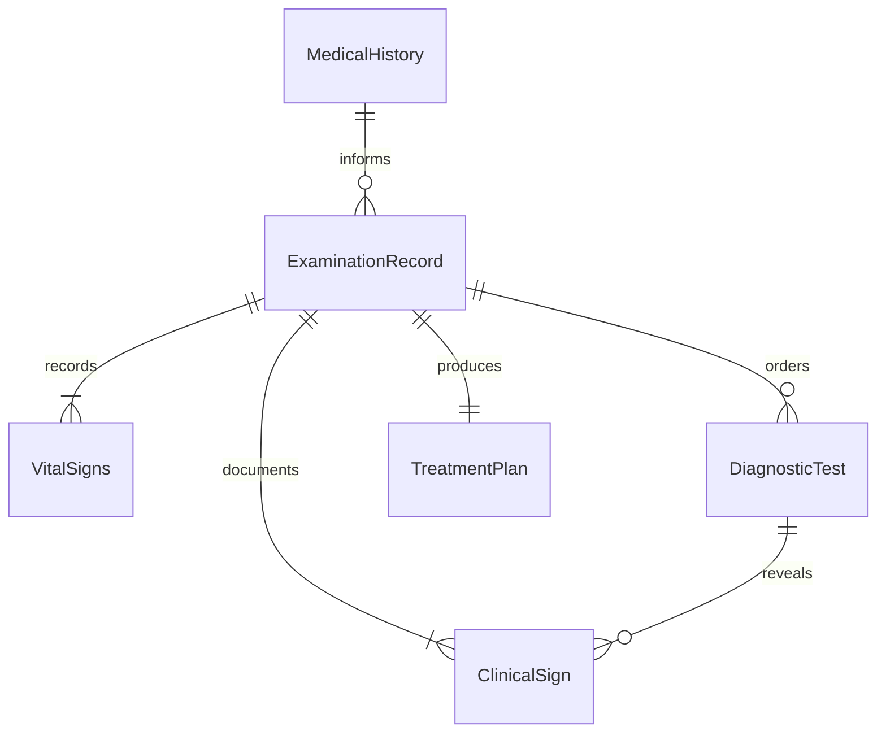
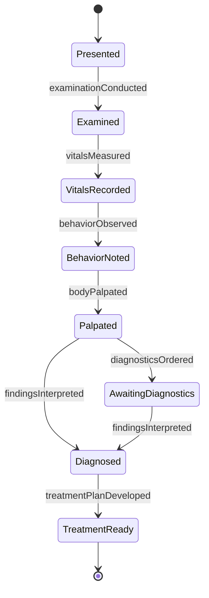
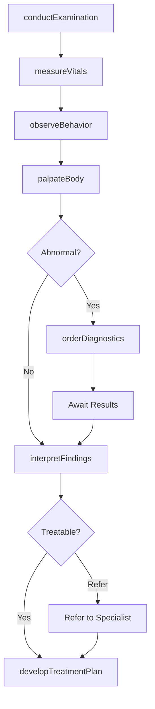
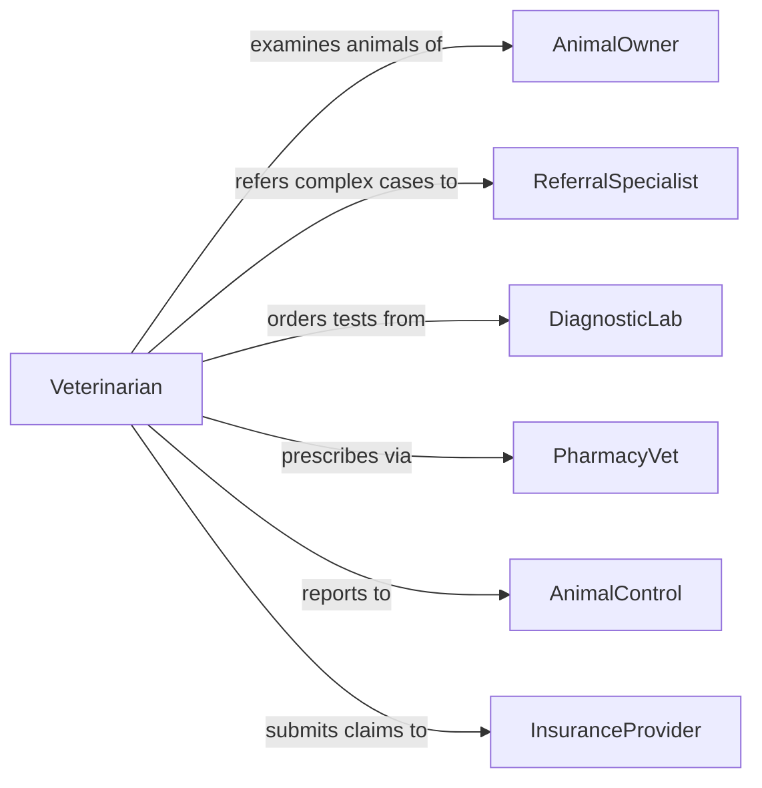

# Examine Animals Detect Illness Injury

> Business-as-Code definition for veterinary examination and diagnostic assessment. Models the systematic process of evaluating animals for signs of illness, injury, or health problems through physical examination, diagnostic testing, and clinical observation.

## Overview

Animal examination involves careful physical assessment, behavioral observation, diagnostic testing, and interpretation of clinical signs to identify health problems. This work is performed by veterinarians, veterinary technicians, animal health inspectors, and livestock specialists. This definition exposes actions for examination, diagnosis, treatment planning, and health documentation.

## Actors

| Actor | Description |
|-------|-------------|
| AnimalOwner | Person responsible for animal care and decisions |
| ReferralSpecialist | Veterinary specialist for complex cases |
| DiagnosticLab | Provides blood work, imaging, and test analysis |
| PharmacyVet | Dispenses medications and therapeutic supplies |
| AnimalControl | Enforces health and safety regulations |
| InsuranceProvider | Covers veterinary care costs for insured animals |

## Roles

| Role | Description |
|------|-------------|
| Veterinarian | Examines animals and makes diagnostic decisions |
| VetTechnician | Assists with examinations and sample collection |
| AnimalHealthInspector | Screens livestock and commercial animals |
| WildlifeBiologist | Assesses health of wild and endangered species |

## Entities

| Entity | Description |
|--------|-------------|
| ExaminationRecord | Complete documentation of veterinary visit |
| ClinicalSign | Observable symptom or abnormal finding |
| DiagnosticTest | Laboratory or imaging procedure |
| VitalSigns | Temperature, heart rate, respiratory rate |
| TreatmentPlan | Prescribed medications, procedures, and follow-up |
| MedicalHistory | Prior health records and vaccination status |

## Actions

| Action | Description |
|--------|-------------|
| conductExamination | Perform systematic physical assessment |
| measureVitals | Record temperature, pulse, respiration |
| observeBehavior | Note alertness, gait, appetite, and demeanor |
| palpateBody | Physically examine for swelling, pain, or masses |
| orderDiagnostics | Request blood work, imaging, or testing |
| interpretFindings | Analyze results to reach diagnosis |
| developTreatmentPlan | Prescribe medications and care instructions |

## Events

| Event | Description |
|-------|-------------|
| examinationConducted | Physical assessment has been completed |
| vitalsMeasured | Temperature, heart rate, and respiration recorded |
| behaviorObserved | Mental status and activity level documented |
| bodyPalpated | Physical examination for abnormalities completed |
| diagnosticsOrdered | Tests have been requested |
| findingsInterpreted | Clinical diagnosis has been determined |
| treatmentPlanDeveloped | Care plan has been prescribed |

## Searches

| Search | Description |
|--------|-------------|
| findExaminations | List visits by animal, owner, or date |
| getDiagnostics | Retrieve test results by animal or exam |
| getTreatmentPlans | Find prescribed care by diagnosis or medication |
| getMedicalHistory | Access prior health records for an animal |

## Entity Relationships



## State Diagram



## Workflow



## Actor Relationships



## Usage

### Calling Actions

```typescript
import { examineAnimalsDetectIllnessInjury } from '@headlessly/examine-animals-detect-illness-injury'

const vetExam = examineAnimalsDetectIllnessInjury()

// Conduct examination on dog with lethargy
const exam = await vetExam.conductExamination({
  animalId: 'DOG-4821',
  ownerId: 'OWNER-2847',
  chiefComplaint: 'lethargy-decreased-appetite',
  species: 'canine',
  breed: 'labrador-retriever',
  age: 7
})

// Measure vital signs
await vetExam.measureVitals({
  examinationId: exam.id,
  temperature: 103.2,
  heartRate: 110,
  respiratoryRate: 32,
  weight: 72
})

// Observe behavior and mental status
await vetExam.observeBehavior({
  examinationId: exam.id,
  alertness: 'dull',
  appetite: 'decreased',
  gait: 'stiff',
  demeanor: 'depressed'
})

// Palpate for abnormalities
await vetExam.palpateBody({
  examinationId: exam.id,
  abdomen: 'tense-painful',
  lymphNodes: 'normal',
  joints: 'mild-crepitus',
  skin: 'unremarkable'
})

// Order diagnostic tests
await vetExam.orderDiagnostics({
  examinationId: exam.id,
  tests: ['cbc', 'chemistry-panel', 'abdominal-radiographs']
})
```

### Event-Driven Automation

```typescript
// Auto-flag abnormal vital signs for veterinarian attention
vetExam.vitalsMeasured(async ({ examinationId, temperature, heartRate }) => {
  if (temperature > 103 || heartRate > 120) {
    await notify({
      to: 'attending-veterinarian',
      priority: 'high',
      message: `Abnormal vitals on exam ${examinationId}: Temp ${temperature}F, HR ${heartRate}`,
      requiresReview: true
    })
  }
})

// Trigger treatment plan notification when diagnosis is complete
vetExam.treatmentPlanDeveloped(async ({ examinationId, diagnosis, ownerId }) => {
  await notify({
    to: ownerId,
    message: `Diagnosis and treatment plan ready for your pet`,
    diagnosis,
    pickupInstructions: 'Medications available at front desk'
  })
})
```
