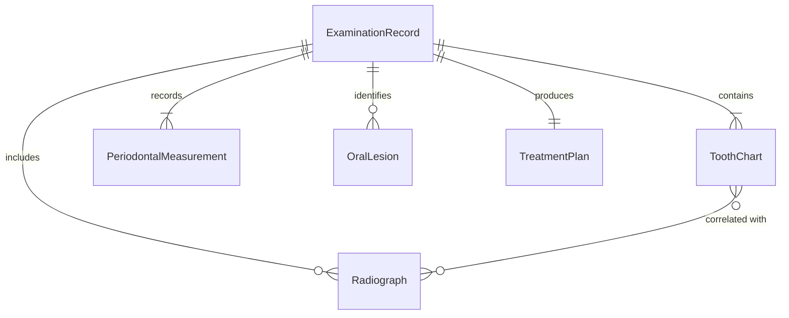
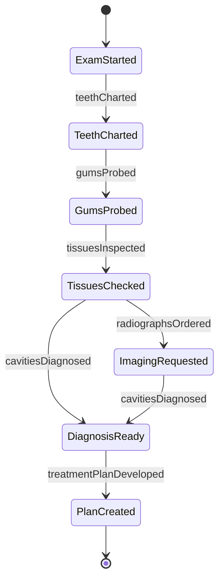
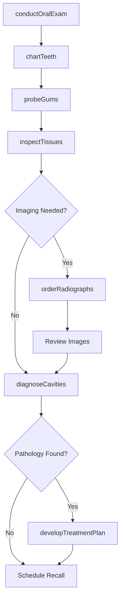
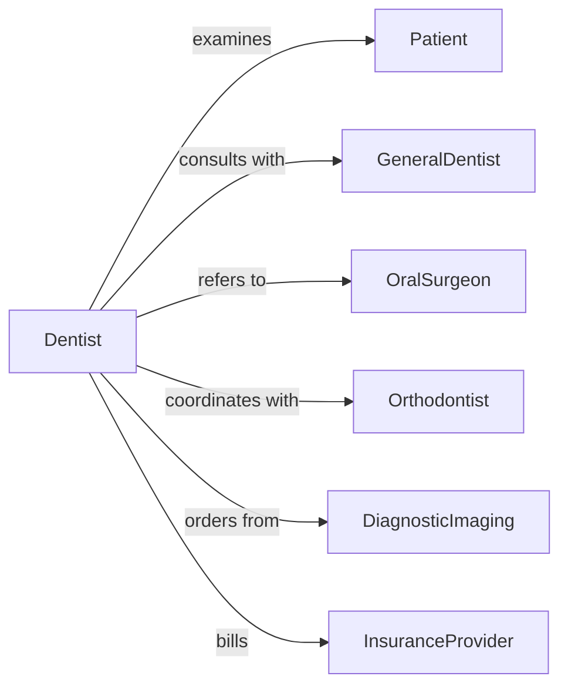

# Examine Mouth Teeth Gums Related

> Business-as-Code definition for oral and dental examination. Models the comprehensive assessment of teeth, gums, oral tissues, and related facial structures performed in dental and medical practices.

## Overview

Oral examination involves systematic visual inspection, palpation, probing, and diagnostic imaging of the mouth, teeth, gums, tongue, and surrounding structures. This work is performed by dentists, dental hygienists, oral surgeons, and maxillofacial specialists to detect decay, disease, trauma, and developmental abnormalities. This definition exposes actions for examination, charting, diagnosis, and treatment planning.

## Actors

| Actor | Description |
|-------|-------------|
| Patient | Individual receiving dental examination |
| GeneralDentist | Primary oral health care provider |
| OralSurgeon | Specialist for surgical oral procedures |
| Orthodontist | Specialist in tooth alignment and jaw relationships |
| DiagnosticImaging | Provides radiographs and advanced imaging |
| InsuranceProvider | Covers dental examination and treatment costs |

## Roles

| Role | Description |
|------|-------------|
| Dentist | Performs comprehensive oral examinations |
| DentalHygienist | Conducts initial screening and prophylaxis |
| OralPathologist | Diagnoses oral diseases and lesions |
| Periodontist | Specializes in gum and supporting tissue health |

## Entities

| Entity | Description |
|--------|-------------|
| ExaminationRecord | Complete documentation of oral assessment |
| ToothChart | Diagram showing condition of each tooth |
| PeriodontalMeasurement | Pocket depth and attachment level readings |
| OralLesion | Abnormal tissue finding requiring evaluation |
| Radiograph | X-ray image of teeth and surrounding bone |
| TreatmentPlan | Recommended procedures and timeline |

## Actions

| Action | Description |
|--------|-------------|
| conductOralExam | Perform comprehensive visual and tactile assessment |
| chartTeeth | Document condition of each tooth using notation system |
| probeGums | Measure periodontal pocket depths and bleeding |
| inspectTissues | Examine tongue, cheeks, palate, and throat |
| orderRadiographs | Request diagnostic imaging of teeth and bone |
| diagnoseCavities | Identify decay using visual, tactile, and imaging findings |
| developTreatmentPlan | Prescribe restorations, cleanings, or referrals |

## Events

| Event | Description |
|-------|-------------|
| oralExamConducted | Visual and tactile assessment completed |
| teethCharted | Condition of all teeth documented |
| gumsProbed | Periodontal measurements recorded |
| tissuesInspected | Soft tissue examination completed |
| radiographsOrdered | Imaging has been requested |
| cavitiesDiagnosed | Decay has been identified and documented |
| treatmentPlanDeveloped | Care recommendations have been prescribed |

## Searches

| Search | Description |
|--------|-------------|
| findExaminations | List visits by patient or date |
| getToothChart | Retrieve dental notation and condition history |
| getPeriodontalData | Find gum health measurements over time |
| getTreatmentPlans | List recommended procedures by patient |

## Entity Relationships



## State Diagram



## Workflow



## Actor Relationships



## Usage

### Calling Actions

```typescript
import { examineMouthTeethGumsRelated } from '@headlessly/examine-mouth-teeth-gums-related'

const dentalExam = examineMouthTeethGumsRelated()

// Conduct comprehensive oral examination
const exam = await dentalExam.conductOralExam({
  patientId: 'PAT-8471',
  visitType: 'periodic-exam',
  chiefComplaint: 'routine-checkup',
  lastVisit: '2025-08-10'
})

// Chart tooth conditions
await dentalExam.chartTeeth({
  examinationId: exam.id,
  findings: [
    { tooth: 14, condition: 'caries-occlusal', severity: 'moderate' },
    { tooth: 18, condition: 'amalgam-restoration', status: 'intact' },
    { tooth: 30, condition: 'crown-pfm', status: 'intact' }
  ]
})

// Probe periodontal health
await dentalExam.probeGums({
  examinationId: exam.id,
  measurements: [
    { tooth: 14, sites: [3, 3, 2, 3, 2, 3], bleeding: false },
    { tooth: 18, sites: [4, 5, 4, 4, 3, 4], bleeding: true }
  ]
})

// Order bitewing radiographs
await dentalExam.orderRadiographs({
  examinationId: exam.id,
  series: 'bitewings',
  reason: 'routine-caries-detection'
})

// Develop treatment plan
await dentalExam.developTreatmentPlan({
  examinationId: exam.id,
  procedures: [
    { code: 'D2391', description: 'Resin-based composite - one surface, posterior', tooth: 14 },
    { code: 'D4341', description: 'Periodontal scaling and root planing - quadrant', quadrant: 'UR' }
  ]
})
```

### Event-Driven Automation

```typescript
// Flag deep pockets for periodontist referral
dentalExam.gumsProbed(async ({ examinationId, measurements }) => {
  const deepPockets = measurements.filter(m => Math.max(...m.sites) >= 5)
  if (deepPockets.length > 3) {
    await notify({
      to: 'attending-dentist',
      message: `Multiple deep pockets detected, consider periodontal referral`,
      examinationId
    })
  }
})

// Auto-schedule follow-up when treatment plan is created
dentalExam.treatmentPlanDeveloped(async ({ examinationId, patientId, procedures }) => {
  if (procedures.length > 0) {
    await scheduleAppointment({
      patientId,
      type: 'treatment',
      duration: estimateDuration(procedures),
      priority: 'standard'
    })
  }
})
```
