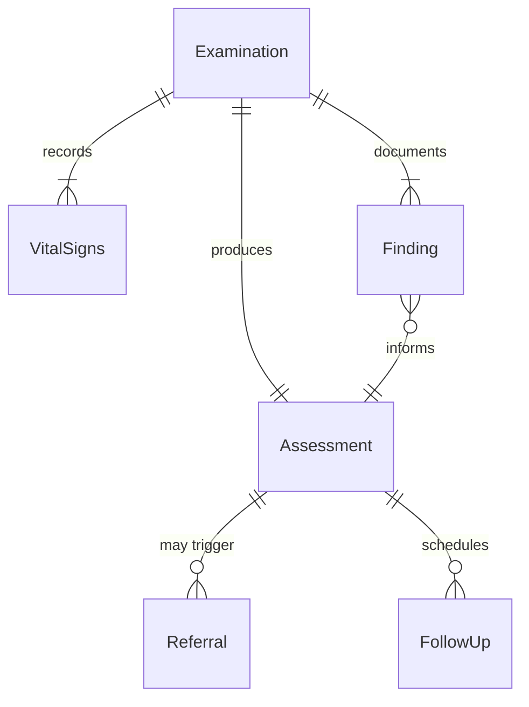
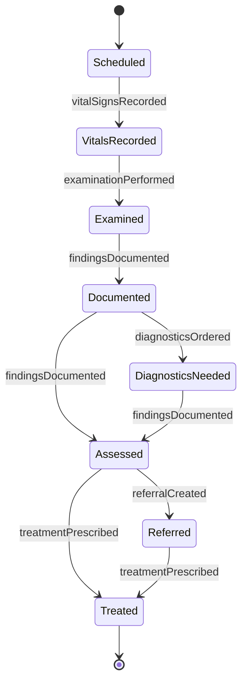
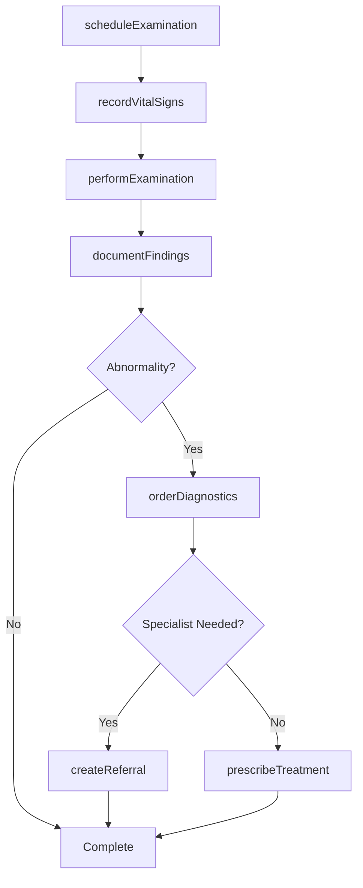
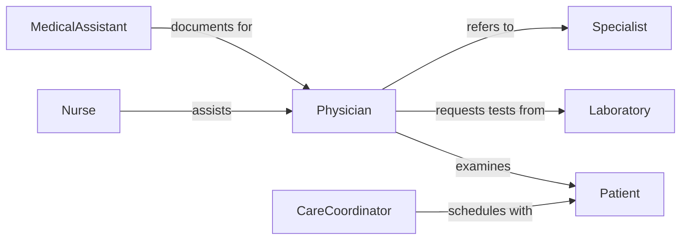

# Examine Patients Assess General Physical

> Business-as-Code definition for patient physical examination workflows. Models the complete examination process from initial assessment through documentation and follow-up recommendations.

## Overview

Patient physical examination involves systematic assessment of vital signs, organ systems, and overall health status. This definition exposes actions for conducting examinations, documenting findings, and coordinating care with specialists and diagnostic services.

## Actors

| Actor | Description |
|-------|-------------|
| Patient | Individual receiving medical examination |
| Laboratory | Provides diagnostic testing and results |
| Specialist | Receives referrals for advanced assessment |
| Pharmacy | Dispenses medications based on findings |
| Insurer | Reviews examination documentation for coverage |
| EmergencyServices | Responds to urgent findings requiring immediate care |

## Roles

| Role | Description |
|------|-------------|
| Physician | Conducts comprehensive physical examinations |
| Nurse | Assists with vital signs and patient preparation |
| MedicalAssistant | Records findings and manages documentation |
| CareCoordinator | Schedules follow-up appointments and referrals |

## Entities

| Entity | Description |
|--------|-------------|
| Examination | Complete physical assessment session |
| VitalSigns | Blood pressure, temperature, pulse, respiration |
| Finding | Specific observation or abnormality detected |
| Assessment | Clinical interpretation of examination results |
| Referral | Request for specialist consultation |
| FollowUp | Scheduled reexamination or monitoring plan |

## Actions

| Action | Description |
|--------|-------------|
| scheduleExamination | Book patient appointment for physical assessment |
| recordVitalSigns | Document blood pressure, temperature, pulse, respiration |
| performExamination | Conduct systematic physical assessment |
| documentFindings | Record observations and abnormalities |
| orderDiagnostics | Request laboratory tests or imaging studies |
| createReferral | Send patient to specialist for advanced evaluation |
| prescribeTreatment | Recommend medication or therapeutic intervention |

## Events

| Event | Description |
|-------|-------------|
| examinationScheduled | Patient appointment has been booked |
| vitalSignsRecorded | Initial measurements have been documented |
| examinationPerformed | Physical assessment has been completed |
| findingsDocumented | Observations have been recorded in medical record |
| diagnosticsOrdered | Laboratory or imaging tests have been requested |
| referralCreated | Specialist consultation has been initiated |
| treatmentPrescribed | Medication or therapy has been recommended |

## Searches

| Search | Description |
|--------|-------------|
| findExaminations | List examinations by patient, date, or provider |
| getFindings | Retrieve documented observations by category |
| getReferrals | List specialist consultations by status |
| getVitalTrends | Analyze vital sign patterns over time |

## Entity Relationships



## State Diagram



## Workflow



## Actor Relationships



## Usage

### Calling Actions

```typescript
import { examinePatientsAssessGeneralPhysical } from '@headlessly/examine-patients-assess-general-physical'

const examinations = examinePatientsAssessGeneralPhysical()

// Schedule annual physical examination
const exam = await examinations.scheduleExamination({
  patientId: 'PT-2891',
  providerId: 'DR-4567',
  appointmentDate: '2026-03-15T09:00:00Z',
  examinationType: 'annual_physical'
})

// Record vital signs at start of visit
await examinations.recordVitalSigns({
  examinationId: exam.id,
  bloodPressure: { systolic: 118, diastolic: 76 },
  temperature: 98.4,
  pulse: 72,
  respiration: 16
})

// Document findings after examination
await examinations.documentFindings({
  examinationId: exam.id,
  findings: [
    { system: 'cardiovascular', observation: 'Regular rate and rhythm, no murmurs' },
    { system: 'respiratory', observation: 'Clear to auscultation bilaterally' }
  ]
})
```

### Event-Driven Automation

```typescript
// Auto-order diagnostics for abnormal vital signs
examinations.vitalSignsRecorded(async ({ examinationId, bloodPressure }) => {
  if (bloodPressure.systolic > 140 || bloodPressure.diastolic > 90) {
    await examinations.orderDiagnostics({
      examinationId,
      tests: ['lipid_panel', 'metabolic_panel']
    })
  }
})

// Create referral for specialist evaluation
examinations.findingsDocumented(async ({ examinationId, findings }) => {
  const cardiac = findings.find(f => f.system === 'cardiovascular' && f.abnormal)
  if (cardiac) {
    await examinations.createReferral({
      examinationId,
      specialty: 'cardiology',
      urgency: 'routine'
    })
  }
})
```
