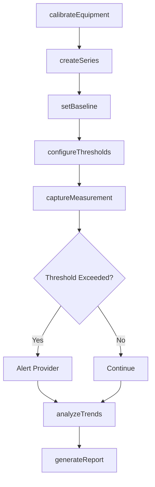
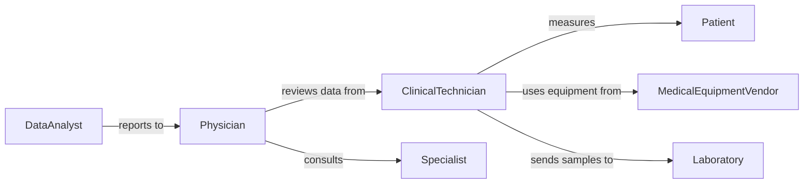

# Measure Physical Physiological Attributes Patients

> Business-as-Code definition for patient measurement and monitoring workflows. Models the complete measurement process from data collection through analysis and clinical interpretation.

## Overview

Patient physiological measurement involves capturing quantitative health data including vital signs, body composition, and functional capacity. This definition exposes actions for recording measurements, tracking trends over time, and identifying clinically significant changes requiring intervention.

## Actors

| Actor | Description |
|-------|-------------|
| Patient | Individual undergoing physiological measurements |
| MedicalEquipmentVendor | Provides calibrated measurement devices |
| Laboratory | Performs complex physiological testing |
| Specialist | Reviews abnormal measurements for consultation |
| Insurer | Requires documented measurements for treatment authorization |
| ResearchInstitute | Aggregates anonymized measurement data for studies |

## Roles

| Role | Description |
|------|-------------|
| ClinicalTechnician | Operates measurement equipment and records data |
| Nurse | Conducts routine vital sign measurements |
| Physician | Interprets measurements and orders additional testing |
| DataAnalyst | Tracks measurement trends and identifies patterns |

## Entities

| Entity | Description |
|--------|-------------|
| Measurement | Single data point captured at specific time |
| MeasurementSeries | Sequential measurements tracking change over time |
| Baseline | Reference value for comparison with current measurements |
| Threshold | Clinical boundary triggering alerts or interventions |
| Calibration | Equipment accuracy verification record |
| Trend | Pattern analysis of measurements over period |

## Actions

| Action | Description |
|--------|-------------|
| captureMeasurement | Record single physiological data point |
| createSeries | Initialize tracking for repeated measurements |
| setBaseline | Establish reference values for patient |
| configureThresholds | Define alert boundaries for abnormal values |
| calibrateEquipment | Verify accuracy of measurement devices |
| analyzeTrends | Identify patterns in measurement series |
| generateReport | Create summary of measurements for review |

## Events

| Event | Description |
|-------|-------------|
| measurementCaptured | New physiological data has been recorded |
| seriesCreated | Tracking sequence has been initialized |
| baselineSet | Reference values have been established |
| thresholdExceeded | Measurement outside normal clinical range |
| equipmentCalibrated | Device accuracy has been verified |
| trendDetected | Significant pattern identified in measurements |
| reportGenerated | Summary document has been created |

## Searches

| Search | Description |
|--------|-------------|
| findMeasurements | List measurements by patient, type, or date range |
| getSeries | Retrieve sequential measurements for trend analysis |
| getAbnormals | Find measurements exceeding threshold values |
| getCalibrations | List equipment verification records |

## Workflow



## Actor Relationships



## Usage

### Calling Actions

```typescript
import { measurePhysicalPhysiologicalAttributesPatients } from '@headlessly/measure-physical-physiological-attributes-patients'

const measurements = measurePhysicalPhysiologicalAttributesPatients()

// Create measurement series for blood pressure monitoring
const series = await measurements.createSeries({
  patientId: 'PT-5624',
  measurementType: 'blood_pressure',
  frequency: 'daily',
  duration: '30_days'
})

// Capture daily blood pressure reading
await measurements.captureMeasurement({
  seriesId: series.id,
  timestamp: '2026-02-05T08:00:00Z',
  values: {
    systolic: 128,
    diastolic: 82,
    pulse: 74
  },
  position: 'seated',
  arm: 'left'
})

// Analyze trends over monitoring period
const trends = await measurements.analyzeTrends({
  seriesId: series.id,
  metrics: ['mean', 'variance', 'slope']
})
```

### Event-Driven Automation

```typescript
// Alert on critical vital signs
measurements.measurementCaptured(async ({ patientId, values, type }) => {
  if (type === 'blood_pressure' && values.systolic > 180) {
    await notify({
      to: 'on_call_physician',
      priority: 'urgent',
      message: `Hypertensive crisis: ${values.systolic}/${values.diastolic} for patient ${patientId}`
    })
  }
})

// Auto-generate weekly summary reports
measurements.trendDetected(async ({ seriesId, trend }) => {
  if (trend.direction === 'increasing' && trend.significance > 0.95) {
    await measurements.generateReport({
      seriesId,
      reportType: 'trend_analysis',
      recipient: 'primary_physician'
    })
  }
})
```
