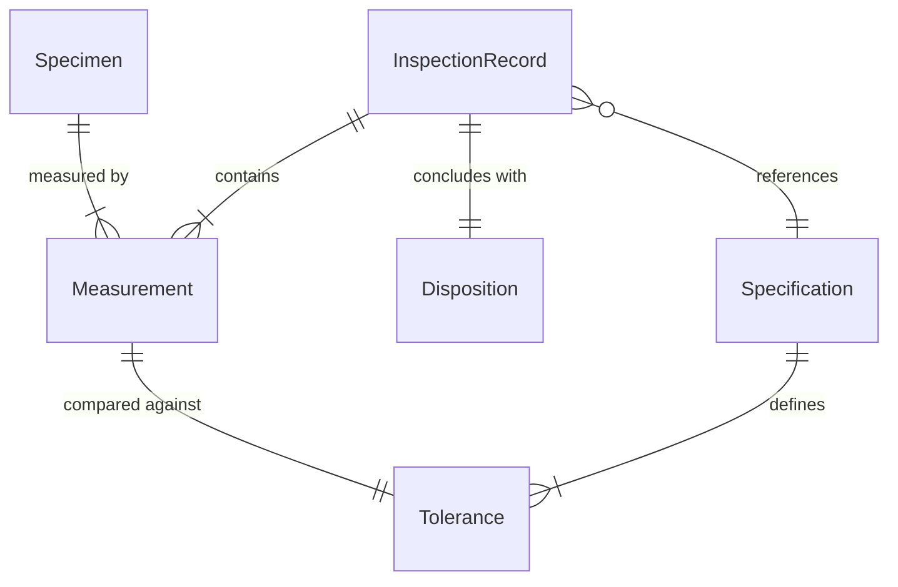
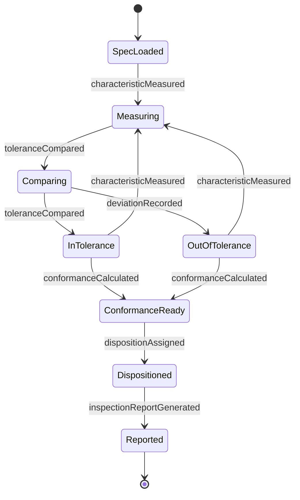
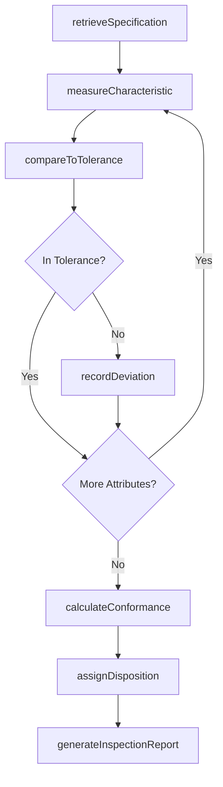
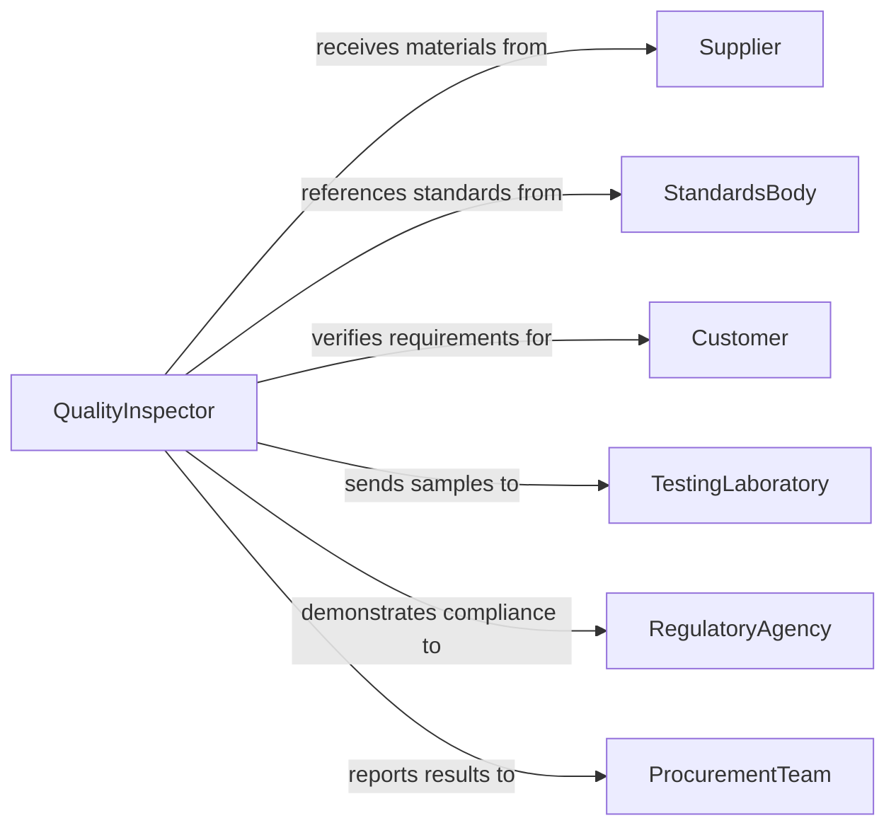

# Compare Physical Characteristics Materials Products

> Business-as-Code definition for comparing physical characteristics of materials or products against specifications and standards. Models the measurement, comparison, and disposition workflow used in quality control and incoming goods inspection.

## Overview

Comparing physical characteristics of materials and products to specifications involves measuring attributes such as dimensions, weight, color, hardness, tensile strength, surface finish, and chemical composition, then evaluating those measurements against defined tolerances and standards. This definition covers incoming material inspection, in-process quality checks, final product verification, and standards compliance testing across manufacturing, construction, and procurement workflows.

## Actors

| Actor | Description |
|-------|-------------|
| Supplier | Provides materials or products with accompanying specifications |
| StandardsBody | Publishes industry standards (ISO, ASTM, ANSI) that define acceptable ranges |
| Customer | Specifies product requirements and acceptance criteria |
| TestingLaboratory | Performs specialized physical testing beyond in-house capabilities |
| RegulatoryAgency | Enforces material and product compliance requirements |
| ProcurementTeam | Initiates incoming inspection for purchased materials |

## Roles

| Role | Description |
|------|-------------|
| QualityInspector | Performs measurements and compares results to specifications |
| MetrologistTechnician | Operates precision measurement instruments and calibrates equipment |
| QualityEngineer | Defines inspection plans, tolerances, and acceptance criteria |
| DispositionAuthority | Makes accept/reject/rework decisions based on inspection results |

## Entities

| Entity | Description |
|--------|-------------|
| Specimen | The material sample or product unit being evaluated |
| Specification | The documented standard defining acceptable physical characteristics |
| Measurement | A recorded value for a specific physical attribute of the specimen |
| Tolerance | The allowable range of deviation from the nominal specification value |
| InspectionRecord | Complete documentation of all measurements and comparison results |
| Disposition | The accept, reject, or conditional-use decision for the specimen |

## Actions

| Action | Description |
|--------|-------------|
| retrieveSpecification | Load the applicable specification or standard for comparison |
| measureCharacteristic | Take a physical measurement of a specific attribute |
| compareToTolerance | Evaluate the measurement against the specified tolerance range |
| recordDeviation | Document any out-of-tolerance measurement with magnitude and direction |
| calculateConformance | Compute overall conformance percentage across all measured attributes |
| assignDisposition | Make the accept, reject, or conditional-use determination |
| generateInspectionReport | Compile all measurements and comparisons into a formal record |

## Events

| Event | Description |
|-------|-------------|
| specificationRetrieved | The applicable standard has been loaded for comparison |
| characteristicMeasured | A physical attribute measurement has been recorded |
| toleranceCompared | Measurement has been evaluated against the specification range |
| deviationRecorded | An out-of-tolerance condition has been documented |
| conformanceCalculated | Overall conformance score has been computed |
| dispositionAssigned | Accept/reject decision has been made for the specimen |
| inspectionReportGenerated | Formal inspection record has been completed |

## Searches

| Search | Description |
|--------|-------------|
| findInspections | List inspection records by product, material, date, or result |
| getDeviations | Retrieve out-of-tolerance records by attribute, severity, or supplier |
| getSpecifications | Query applicable standards by material type or product category |
| getConformanceHistory | Track conformance trends by supplier, material, or production line |

## Entity Relationships



## State Diagram



## Workflow



## Actor Relationships



## Usage

### Calling Actions

```typescript
import { comparePhysicalCharacteristicsMaterialsProducts } from '@headlessly/compare-physical-characteristics-materials-products'

const qc = comparePhysicalCharacteristicsMaterialsProducts()

// Load specification for incoming steel plate
const spec = await qc.retrieveSpecification({
  standard: 'ASTM-A36',
  materialType: 'structural-steel-plate',
  revision: '2025'
})

// Measure and compare physical characteristics
const thickness = await qc.measureCharacteristic({
  specimenId: 'MAT-STEEL-PLATE-0442',
  attribute: 'thickness',
  measuredValue: 12.3,
  unit: 'mm',
  instrument: 'digital-micrometer-MIT-293'
})

await qc.compareToTolerance({
  specimenId: 'MAT-STEEL-PLATE-0442',
  attribute: 'thickness',
  measuredValue: 12.3,
  nominalValue: 12.0,
  tolerancePlus: 0.5,
  toleranceMinus: 0.3
})

// Assign disposition after all checks
await qc.assignDisposition({
  specimenId: 'MAT-STEEL-PLATE-0442',
  conformancePercentage: 98.5,
  disposition: 'accept',
  notes: 'All measurements within tolerance'
})
```

### Event-Driven Automation

```typescript
// Alert procurement on repeated supplier deviations
qc.deviationRecorded(async ({ specimenId, attribute, deviation }) => {
  const recent = await qc.getDeviations({ supplierId: deviation.supplierId, lastDays: 30 })
  if (recent.length > 5) {
    await notify({
      to: 'procurement-team',
      message: `Supplier ${deviation.supplierId} has ${recent.length} deviations in 30 days - review required`
    })
  }
})

// Auto-reject batches with critical non-conformance
qc.conformanceCalculated(async ({ specimenId, conformancePercentage }) => {
  if (conformancePercentage < 85) {
    await qc.assignDisposition({
      specimenId,
      disposition: 'reject',
      notes: `Auto-rejected: conformance ${conformancePercentage}% below 85% threshold`
    })
  }
})
```
