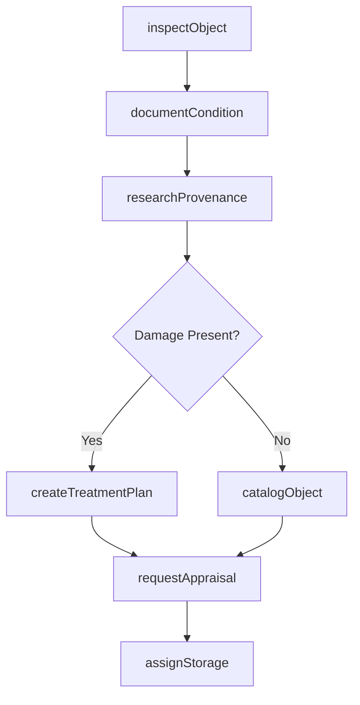
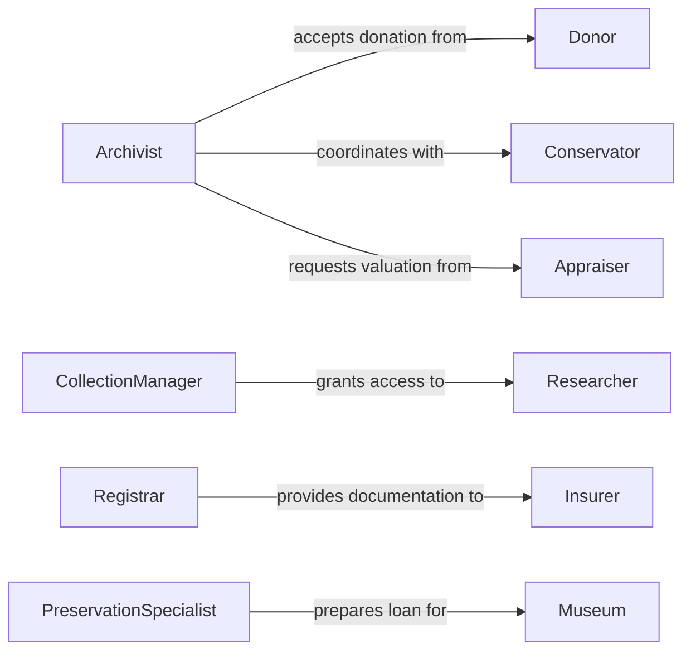

# Evaluate Characteristics Archival Historical Objects

> Business-as-Code definition for archival object assessment and conservation workflows. Models the complete evaluation process from initial inspection through documentation and preservation recommendations.

## Overview

Archival object evaluation involves systematic assessment of physical condition, provenance, historical significance, and conservation needs. This definition exposes actions for cataloging artifacts, documenting condition, and coordinating preservation activities with conservators and curators.

## Actors

| Actor | Description |
|-------|-------------|
| Donor | Provides historical objects for collection |
| Conservator | Performs restoration and preservation treatments |
| Appraiser | Determines monetary value of artifacts |
| Researcher | Accesses collection for scholarly study |
| Insurer | Underwrites coverage for valuable items |
| Museum | Requests items for exhibition or loan |

## Roles

| Role | Description |
|------|-------------|
| Archivist | Manages collection and cataloging standards |
| CollectionManager | Oversees acquisition and deaccession decisions |
| Registrar | Maintains legal and provenance documentation |
| PreservationSpecialist | Monitors environmental conditions and treatments |

## Entities

| Entity | Description |
|--------|-------------|
| Object | Physical artifact in archival collection |
| ConditionReport | Detailed assessment of physical state |
| Provenance | Documented history of ownership and custody |
| Appraisal | Professional valuation for insurance or sale |
| TreatmentPlan | Conservation intervention strategy |
| Catalog | Standardized descriptive metadata record |

## Actions

| Action | Description |
|--------|-------------|
| inspectObject | Conduct visual and tactile examination |
| documentCondition | Record physical state and damage |
| researchProvenance | Investigate ownership history and authenticity |
| requestAppraisal | Obtain professional valuation |
| createTreatmentPlan | Develop conservation intervention strategy |
| catalogObject | Create standardized metadata record |
| assignStorage | Determine optimal preservation environment |

## Events

| Event | Description |
|-------|-------------|
| objectInspected | Initial examination has been completed |
| conditionDocumented | Physical assessment has been recorded |
| provenanceResearched | Ownership history has been investigated |
| appraisalRequested | Valuation request has been submitted |
| treatmentPlanCreated | Conservation strategy has been developed |
| objectCataloged | Metadata record has been finalized |
| storageAssigned | Preservation location has been determined |

## Searches

| Search | Description |
|--------|-------------|
| findObjects | List items by acquisition date, condition, or category |
| getConditionReports | Retrieve assessments by severity or treatment need |
| getAppraisals | List valuations by date or appraiser |
| getTreatmentPlans | Find conservation strategies by priority |

## Workflow



## Actor Relationships



## Usage

### Calling Actions

```typescript
import { evaluateCharacteristicsArchivalHistoricalObjects } from '@headlessly/evaluate-characteristics-archival-historical-objects'

const archives = evaluateCharacteristicsArchivalHistoricalObjects()

// Inspect newly acquired manuscript
const inspection = await archives.inspectObject({
  accessionNumber: 'MS-2026-047',
  objectType: 'manuscript',
  era: '18th_century',
  material: 'paper'
})

// Document condition findings
await archives.documentCondition({
  objectId: inspection.id,
  overallCondition: 'fair',
  issues: [
    { type: 'foxing', severity: 'moderate', location: 'margins' },
    { type: 'tear', severity: 'minor', location: 'upper_right_corner' }
  ],
  photographicDocumentation: ['IMG_3421.jpg', 'IMG_3422.jpg']
})

// Create conservation treatment plan
await archives.createTreatmentPlan({
  objectId: inspection.id,
  interventions: [
    { action: 'surface_cleaning', priority: 'high' },
    { action: 'tear_repair', priority: 'medium' }
  ],
  estimatedCost: 850,
  timeframe: '6_weeks'
})
```

### Event-Driven Automation

```typescript
// Request appraisal for high-value items
archives.provenanceResearched(async ({ objectId, provenance }) => {
  if (provenance.notableOwners.length > 0 || provenance.historicalSignificance === 'high') {
    await archives.requestAppraisal({
      objectId,
      purpose: 'insurance',
      urgency: 'routine'
    })
  }
})

// Prioritize conservation for deteriorating items
archives.conditionDocumented(async ({ objectId, overallCondition, issues }) => {
  const criticalIssues = issues.filter(i => i.severity === 'severe')
  if (criticalIssues.length > 0) {
    await archives.createTreatmentPlan({
      objectId,
      priority: 'urgent',
      notifyConservator: true
    })
  }
})
```
