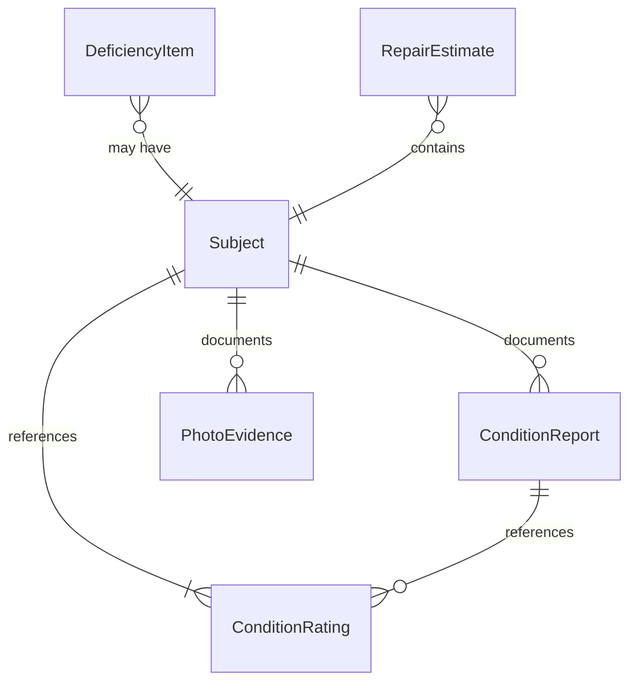
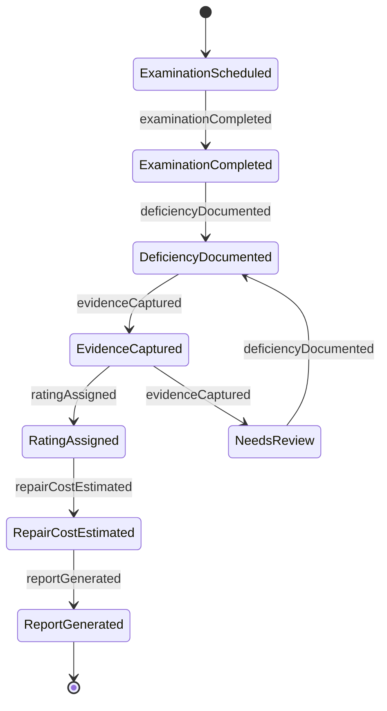
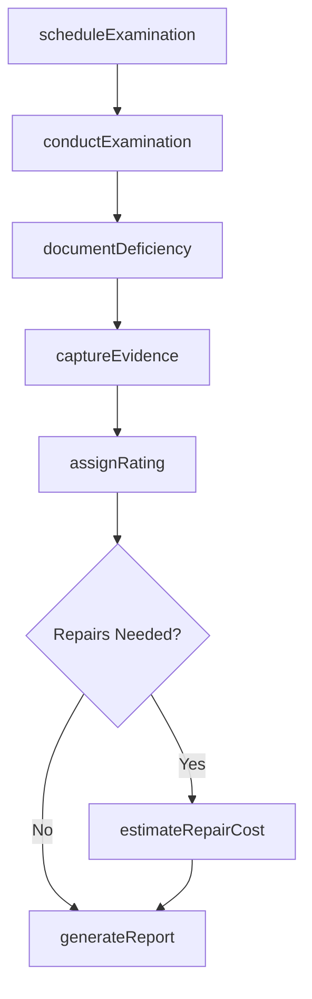
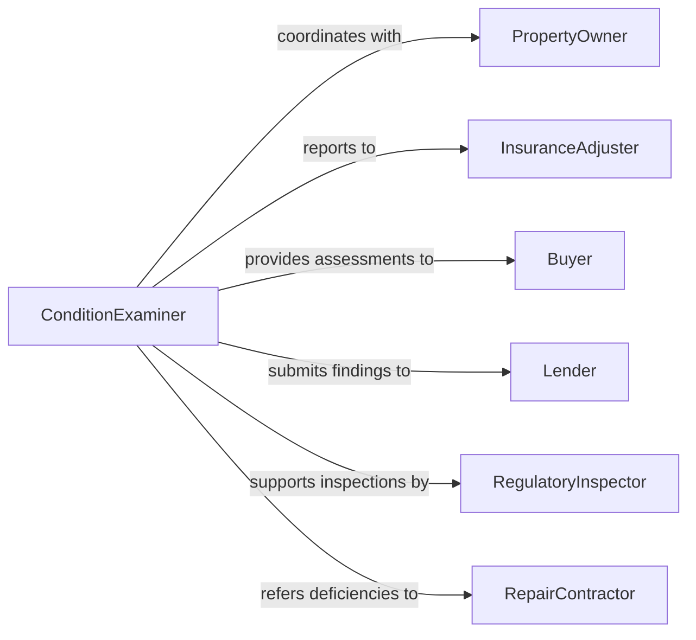

# Examine Condition Property Products

> Business-as-Code definition for examining the condition of property or products. Models the assessment workflow for evaluating physical state, functionality, wear, and damage of real property, equipment, and consumer or commercial goods.

## Overview

Examining the condition of property or products involves systematic assessment of physical state, functional integrity, wear patterns, and damage. This definition applies across domains including real estate property inspections, used vehicle evaluations, warehouse inventory condition checks, insurance damage assessments, and product return processing. It covers initial scheduling, multi-point examination, condition scoring, deficiency documentation, and report generation.

## Actors

| Actor | Description |
|-------|-------------|
| PropertyOwner | Individual or entity that owns the property or product being examined |
| InsuranceAdjuster | Requests condition examinations to process claims |
| Buyer | Prospective purchaser requiring condition assessment before acquisition |
| Lender | Financial institution requiring property condition for loan underwriting |
| RegulatoryInspector | Government official requiring condition verification for compliance |
| RepairContractor | Receives condition reports to scope remediation work |

## Roles

| Role | Description |
|------|-------------|
| ConditionExaminer | Performs the physical assessment and documents findings |
| SeniorAppraiser | Reviews examination results and assigns overall condition ratings |
| ReportWriter | Compiles findings into structured condition reports |
| FieldCoordinator | Schedules examinations and manages logistics |

## Entities

| Entity | Description |
|--------|-------------|
| Subject | The property, product, or asset being examined |
| ConditionReport | Formal document detailing the examination findings and ratings |
| DeficiencyItem | A specific issue, damage point, or wear area identified |
| ConditionRating | Standardized score reflecting overall or component-level condition |
| PhotoEvidence | Images documenting the condition of specific areas or deficiencies |
| RepairEstimate | Projected cost to remediate identified deficiencies |

## Actions

| Action | Description |
|--------|-------------|
| scheduleExamination | Arrange the date, time, and logistics for a condition assessment |
| conductExamination | Perform the multi-point physical inspection of the subject |
| documentDeficiency | Record a specific deficiency with description, location, and severity |
| captureEvidence | Take photographs or measurements to support condition findings |
| assignRating | Apply a standardized condition score to the subject or its components |
| estimateRepairCost | Calculate projected cost to address identified deficiencies |
| generateReport | Compile all findings into a formal condition report |

## Events

| Event | Description |
|-------|-------------|
| examinationScheduled | A condition examination has been booked and confirmed |
| examinationCompleted | The physical inspection has been performed |
| deficiencyDocumented | A specific condition issue has been recorded |
| evidenceCaptured | Photographic or measurement evidence has been collected |
| ratingAssigned | Condition score has been applied to the subject |
| repairCostEstimated | Remediation cost projection has been calculated |
| reportGenerated | Formal condition report has been completed and issued |

## Searches

| Search | Description |
|--------|-------------|
| findExaminations | List examinations by subject, date, status, or examiner |
| getDeficiencies | Retrieve deficiency items by subject, severity, or category |
| getConditionRatings | Query ratings by subject type, score range, or date |
| getRepairEstimates | Find repair estimates by subject, cost range, or deficiency type |

## Entity Relationships



## State Diagram



## Workflow



## Actor Relationships



## Usage

### Calling Actions

```typescript
import { examineConditionPropertyProducts } from '@headlessly/examine-condition-property-products'

const examination = examineConditionPropertyProducts()

// Schedule a property condition examination
const exam = await examination.scheduleExamination({
  subjectType: 'residential-property',
  address: '1240 Maple Drive, Portland, OR 97201',
  requestedBy: 'lender-pacific-mortgage',
  purpose: 'pre-purchase-inspection',
  preferredDate: '2026-03-15'
})

// Conduct and document examination
await examination.conductExamination({
  examinationId: exam.id,
  checkpoints: ['foundation', 'roofing', 'plumbing', 'electrical', 'HVAC', 'interior', 'exterior'],
  weatherConditions: 'clear-dry'
})

// Document a specific deficiency
await examination.documentDeficiency({
  examinationId: exam.id,
  area: 'roofing',
  description: 'Missing shingles on south-facing slope, approximately 15 sq ft affected',
  severity: 'moderate',
  recommendation: 'Replace damaged section before next rain season'
})
```

### Event-Driven Automation

```typescript
// Auto-generate report when all checkpoints are examined
examination.examinationCompleted(async ({ examinationId, subjectId }) => {
  const deficiencies = await examination.getDeficiencies({ examinationId })
  const hasRepairs = deficiencies.some(d => d.severity !== 'cosmetic')
  if (hasRepairs) {
    await examination.estimateRepairCost({ examinationId })
  }
  await examination.generateReport({ examinationId })
})

// Notify requesting party when report is ready
examination.reportGenerated(async ({ examinationId, reportId, requestedBy }) => {
  await notify({
    to: requestedBy,
    message: `Condition report ${reportId} for examination ${examinationId} is now available`
  })
})
```
