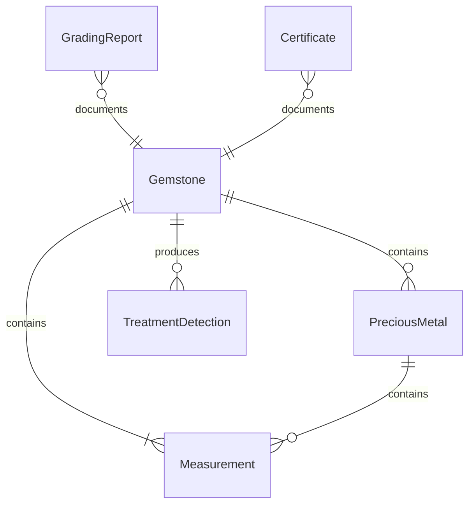
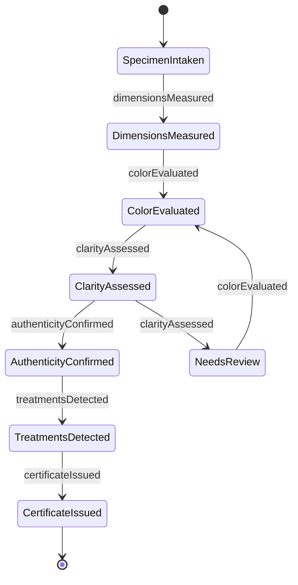
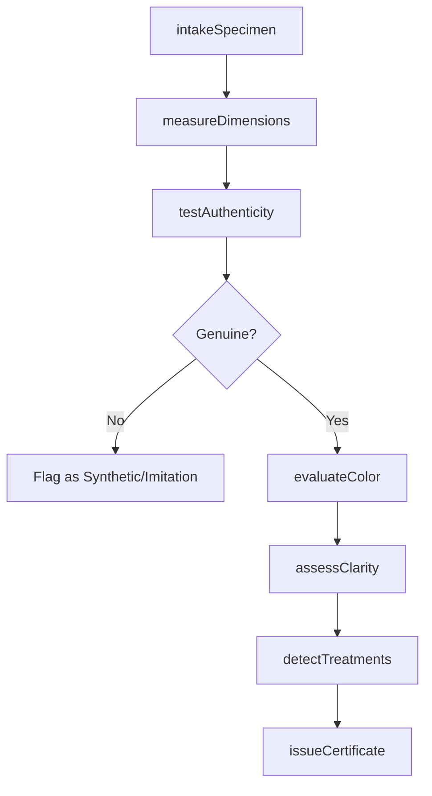
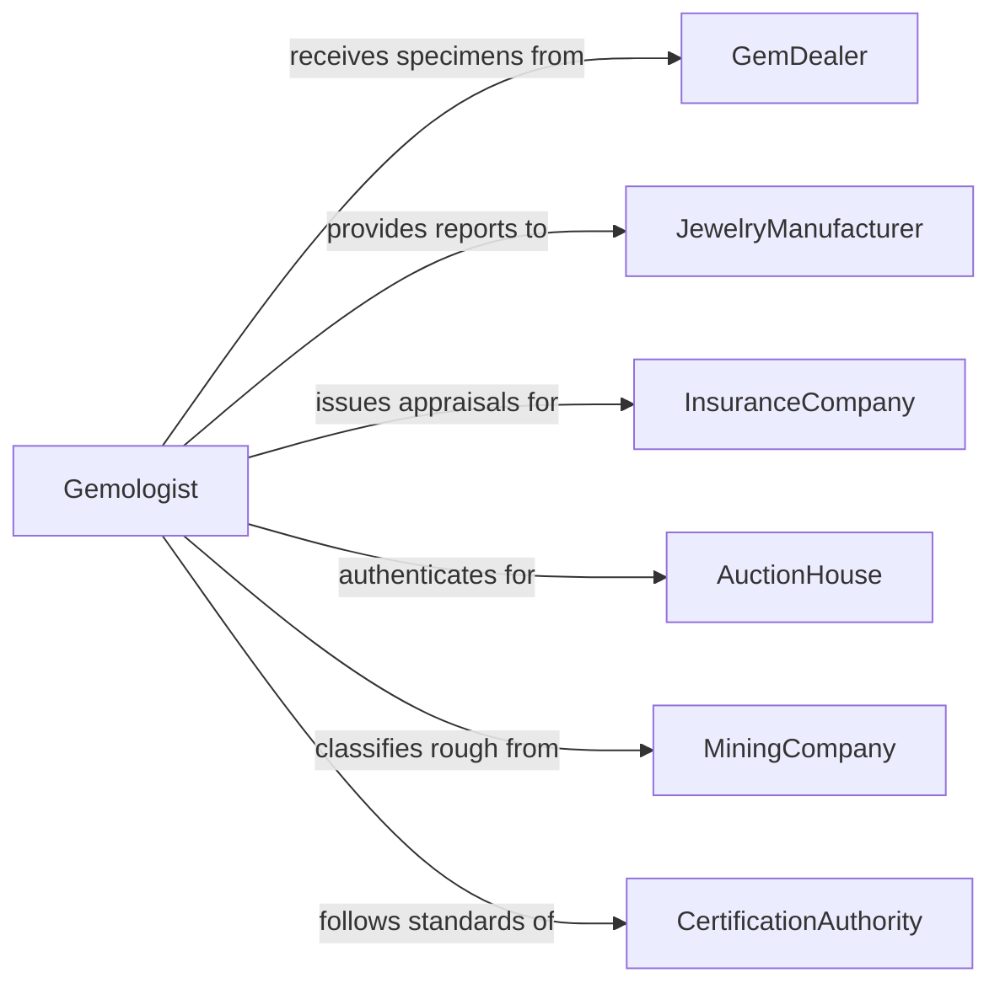

# Examine Physical Characteristics Gemstones Precious

> Business-as-Code definition for examining physical characteristics of gemstones and precious metals. Models the gemological and metallurgical assessment processes including grading, authenticity verification, and quality certification.

## Overview

Examining gemstones and precious metals involves systematic evaluation of physical properties such as color, clarity, cut, carat weight, hardness, luster, refractive index, and metal purity. This definition covers intake processing, instrument-based measurement, visual grading, authenticity testing, treatment detection, and certification issuance for diamonds, colored gemstones, gold, silver, platinum, and other precious materials used in jewelry, investment, and industrial applications.

## Actors

| Actor | Description |
|-------|-------------|
| GemDealer | Submits gemstones or precious metals for examination and grading |
| JewelryManufacturer | Requires grading reports for stones used in production |
| InsuranceCompany | Requests appraisals for coverage and claims valuation |
| AuctionHouse | Needs authentication and grading before sale listings |
| MiningCompany | Submits rough stones for initial classification and valuation |
| CertificationAuthority | Accredits laboratories and sets grading standards (GIA, AGS) |

## Roles

| Role | Description |
|------|-------------|
| Gemologist | Evaluates gemstones using standardized grading criteria |
| Assayer | Tests and certifies precious metal purity and composition |
| GradingSpecialist | Assigns formal quality grades based on examination findings |
| LaboratoryDirector | Oversees examination processes and certifies final reports |

## Entities

| Entity | Description |
|--------|-------------|
| Gemstone | An individual stone submitted for examination and grading |
| PreciousMetal | A metal specimen (gold, silver, platinum) submitted for assay |
| GradingReport | Formal documentation of physical characteristics and quality grade |
| Measurement | A specific quantitative reading (weight, dimensions, refractive index) |
| TreatmentDetection | Analysis results identifying any enhancements or treatments applied |
| Certificate | Official document certifying the examination results and grade |

## Actions

| Action | Description |
|--------|-------------|
| intakeSpecimen | Register and catalog a gemstone or metal specimen for examination |
| measureDimensions | Record weight, dimensions, and physical measurements |
| evaluateColor | Assess color grade using standardized lighting and comparison stones |
| assessClarity | Examine inclusions and blemishes under magnification |
| testAuthenticity | Verify the specimen is natural and not synthetic or imitation |
| detectTreatments | Identify heat treatment, irradiation, fracture filling, or coating |
| issueCertificate | Generate and sign a formal grading report or assay certificate |

## Events

| Event | Description |
|-------|-------------|
| specimenIntaken | Specimen has been registered and logged into the laboratory system |
| dimensionsMeasured | Physical measurements have been recorded |
| colorEvaluated | Color grading has been completed |
| clarityAssessed | Clarity grade has been determined |
| authenticityConfirmed | Specimen has been verified as genuine |
| treatmentsDetected | Treatments or enhancements have been identified |
| certificateIssued | Formal grading report or certificate has been generated |

## Searches

| Search | Description |
|--------|-------------|
| findSpecimens | List specimens by type, grade, status, or submission date |
| getGradingReports | Retrieve grading reports by specimen, dealer, or grade range |
| getTreatmentRecords | Find treatment detection results by specimen or treatment type |
| getCertificates | Query issued certificates by date, gemologist, or specimen type |

## Entity Relationships



## State Diagram



## Workflow



## Actor Relationships



## Usage

### Calling Actions

```typescript
import { examinePhysicalCharacteristicsGemstonesPrecious } from '@headlessly/examine-physical-characteristics-gemstones-precious'

const gemlab = examinePhysicalCharacteristicsGemstonesPrecious()

// Intake a diamond for grading
const specimen = await gemlab.intakeSpecimen({
  type: 'diamond',
  submittedBy: 'dealer-cartwright-gems',
  roughOrPolished: 'polished',
  estimatedCaratWeight: 2.15,
  purpose: 'full-grading'
})

// Measure physical dimensions
const measurements = await gemlab.measureDimensions({
  specimenId: specimen.id,
  caratWeight: 2.14,
  dimensions: { length: 8.42, width: 8.38, depth: 5.21 },
  tablePercentage: 57,
  depthPercentage: 62.1
})

// Evaluate color and clarity
await gemlab.evaluateColor({
  specimenId: specimen.id,
  colorGrade: 'F',
  fluorescence: 'none'
})

await gemlab.assessClarity({
  specimenId: specimen.id,
  clarityGrade: 'VS1',
  inclusionTypes: ['feather', 'crystal'],
  plotted: true
})
```

### Event-Driven Automation

```typescript
// Notify dealer when certificate is ready
gemlab.certificateIssued(async ({ specimenId, certificateId, grade }) => {
  const specimen = await gemlab.findSpecimens({ specimenId })
  await notify({
    to: specimen.submittedBy,
    message: `Certificate ${certificateId} ready for specimen ${specimenId} - Grade: ${grade}`
  })
})

// Flag suspicious specimens for senior review
gemlab.treatmentsDetected(async ({ specimenId, treatments }) => {
  if (treatments.includes('fracture-filling') || treatments.includes('lead-glass-filling')) {
    await escalate({
      to: 'laboratory-director',
      specimenId,
      reason: `Significant treatment detected: ${treatments.join(', ')}`
    })
  }
})
```
