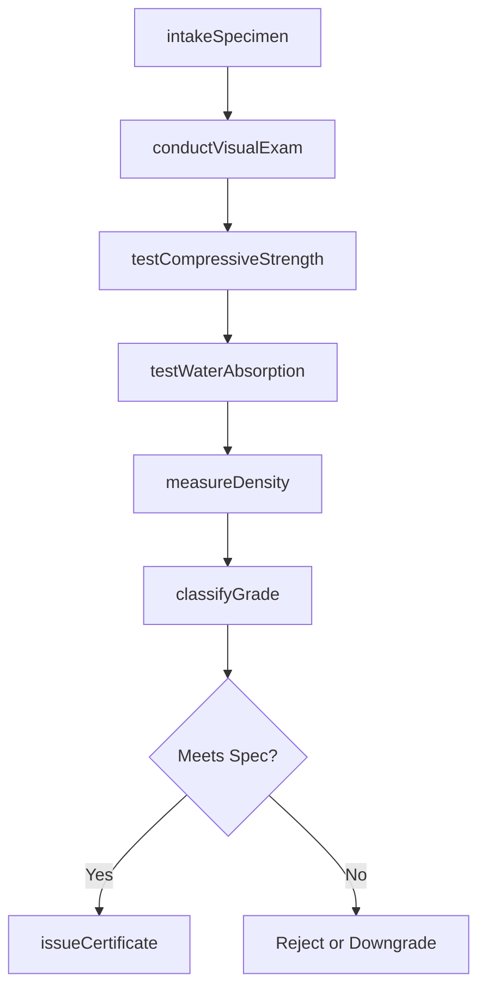
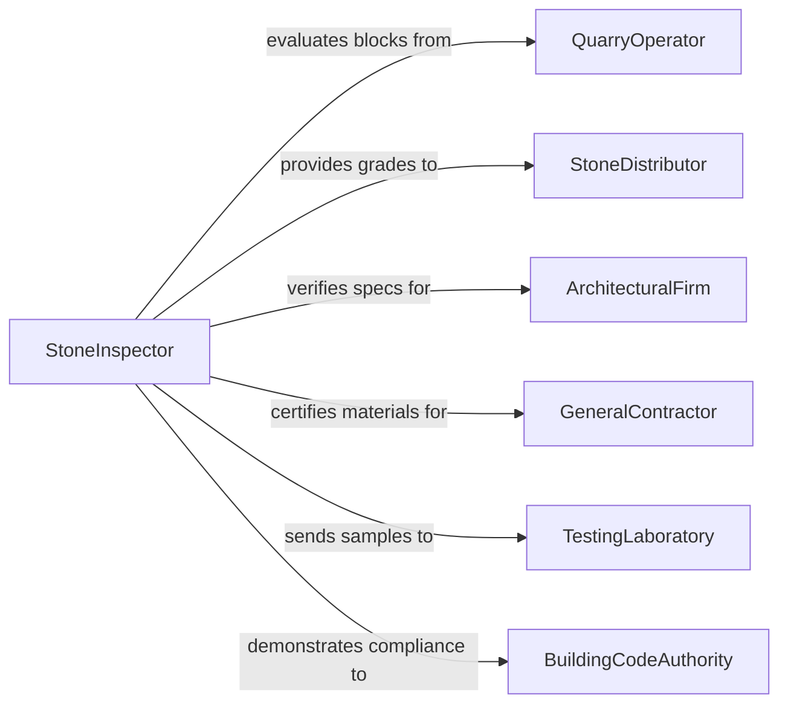

# Examine Physical Characteristics Natural Stone

> Business-as-Code definition for examining physical characteristics of natural stone and stone products. Models the evaluation process for dimension stone, building materials, and decorative stone including grading, structural testing, and classification.

## Overview

Examining natural stone involves assessing physical properties such as density, porosity, water absorption, compressive strength, flexural strength, hardness, color consistency, veining patterns, and surface finish quality. This definition covers quarry block evaluation, slab inspection, fabricated product testing, and compliance verification against ASTM, EN, and building code standards for materials including granite, marble, limestone, slate, sandstone, and engineered stone products used in construction, flooring, countertops, and monuments.

## Actors

| Actor | Description |
|-------|-------------|
| QuarryOperator | Extracts and supplies raw stone blocks for evaluation |
| StoneDistributor | Purchases graded stone for resale to fabricators |
| ArchitecturalFirm | Specifies stone requirements for building projects |
| GeneralContractor | Installs stone products and requires conformance verification |
| TestingLaboratory | Performs standardized physical property tests on stone samples |
| BuildingCodeAuthority | Enforces structural and safety requirements for stone installations |

## Roles

| Role | Description |
|------|-------------|
| StoneInspector | Performs visual and physical examination of stone specimens |
| MaterialsTester | Conducts laboratory-based physical property tests |
| Petrographer | Analyzes mineral composition and geological classification |
| GradingSpecialist | Assigns quality grades based on appearance and structural properties |

## Entities

| Entity | Description |
|--------|-------------|
| StoneSpecimen | A sample, block, slab, or finished piece of natural stone |
| PhysicalTest | A standardized test measuring a specific stone property |
| TestResult | The measured value from a physical property test |
| GradeClassification | The assigned quality grade based on examination findings |
| PetrographicAnalysis | Mineral composition and microstructure assessment report |
| ComplianceCertificate | Documentation confirming stone meets specified standards |

## Actions

| Action | Description |
|--------|-------------|
| intakeSpecimen | Register and catalog a stone specimen for examination |
| conductVisualExam | Assess color, veining, surface defects, and aesthetic quality |
| testCompressiveStrength | Measure the stone's resistance to crushing loads |
| testWaterAbsorption | Determine the percentage of water absorbed under standard conditions |
| measureDensity | Calculate the bulk density and specific gravity of the specimen |
| classifyGrade | Assign a quality grade based on visual and physical test results |
| issueCertificate | Generate a compliance certificate with all test results |

## Events

| Event | Description |
|-------|-------------|
| specimenIntaken | Stone specimen has been registered in the laboratory system |
| visualExamCompleted | Visual assessment of the specimen has been performed |
| compressiveStrengthTested | Compressive strength measurement has been recorded |
| waterAbsorptionTested | Water absorption test results have been documented |
| densityMeasured | Density and specific gravity values have been calculated |
| gradeClassified | Quality grade has been assigned to the specimen |
| certificateIssued | Compliance certificate has been generated and signed |

## Searches

| Search | Description |
|--------|-------------|
| findSpecimens | List stone specimens by type, quarry, grade, or examination date |
| getTestResults | Retrieve physical test results by specimen, test type, or value range |
| getGradeDistribution | Query grade classifications by stone type or quarry source |
| getCertificates | Find compliance certificates by project, standard, or stone type |

## Workflow



## Actor Relationships



## Usage

### Calling Actions

```typescript
import { examinePhysicalCharacteristicsNaturalStone } from '@headlessly/examine-physical-characteristics-natural-stone'

const stoneLab = examinePhysicalCharacteristicsNaturalStone()

// Intake a granite slab specimen
const specimen = await stoneLab.intakeSpecimen({
  stoneType: 'granite',
  variety: 'Absolute Black',
  source: 'quarry-karnataka-india',
  form: 'polished-slab',
  dimensions: { length: 3000, width: 1500, thickness: 20, unit: 'mm' }
})

// Conduct visual examination
await stoneLab.conductVisualExam({
  specimenId: specimen.id,
  colorConsistency: 'uniform',
  veiningPattern: 'minimal-speckling',
  surfaceDefects: [],
  finishQuality: 'high-polish-mirror'
})

// Run physical property tests
await stoneLab.testCompressiveStrength({
  specimenId: specimen.id,
  method: 'ASTM-C170',
  result: 186,
  unit: 'MPa'
})

await stoneLab.testWaterAbsorption({
  specimenId: specimen.id,
  method: 'ASTM-C97',
  result: 0.12,
  unit: 'percent'
})
```

### Event-Driven Automation

```typescript
// Auto-classify grade when all tests are complete
stoneLab.densityMeasured(async ({ specimenId }) => {
  const results = await stoneLab.getTestResults({ specimenId })
  const allTestsComplete = results.length >= 3
  if (allTestsComplete) {
    await stoneLab.classifyGrade({ specimenId })
  }
})

// Notify architect when certification is ready
stoneLab.certificateIssued(async ({ specimenId, certificateId, projectId }) => {
  if (projectId) {
    await notify({
      to: 'architectural-firm',
      message: `Stone certification ${certificateId} issued for project ${projectId}`
    })
  }
})
```
