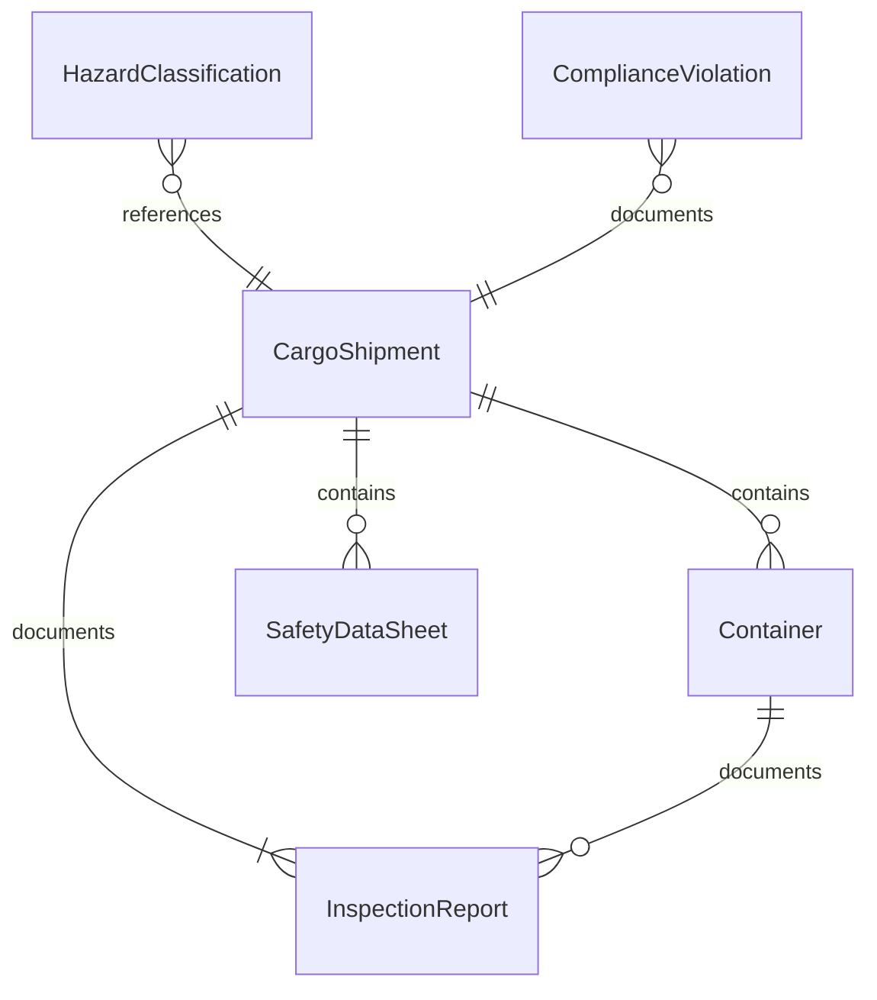
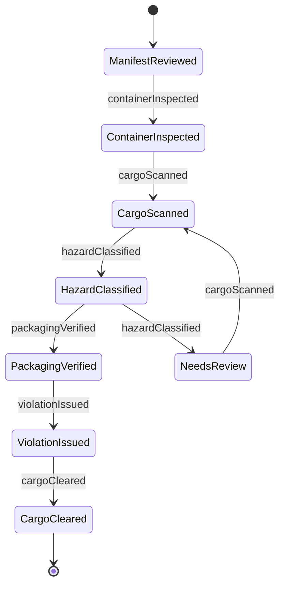
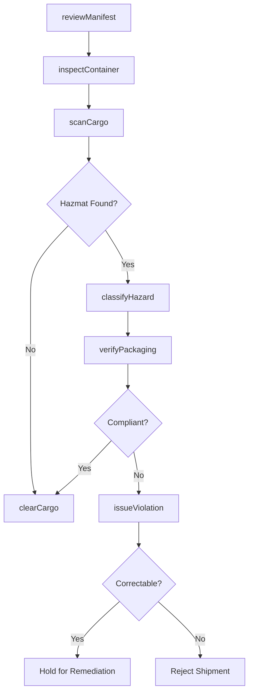
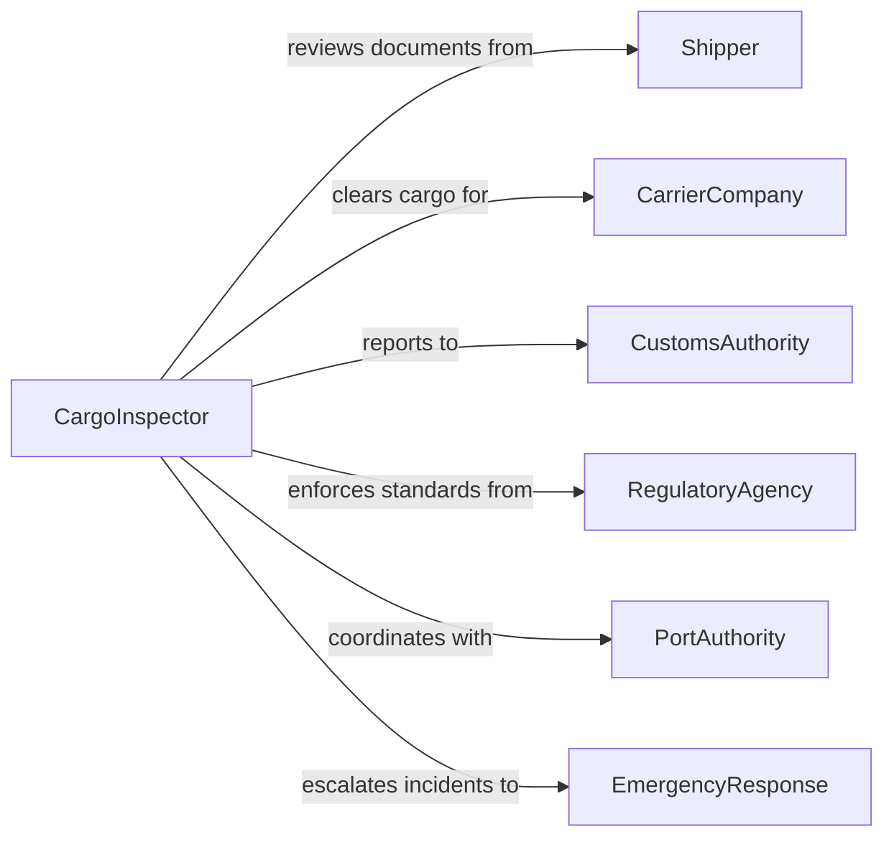

# Inspect Cargo Identify Potential Hazards

> Business-as-Code definition for cargo hazard inspection operations. Models the systematic examination of freight, shipments, and containers to identify dangerous goods, safety violations, and security threats before transport or storage.

## Overview

Cargo hazard inspection involves examining shipments, containers, and freight to detect dangerous goods, undeclared hazardous materials, structural integrity issues, and security threats. This definition covers documentation verification against actual contents, physical examination procedures, hazmat classification, compliance checks against transportation regulations (DOT, IMDG, IATA), and incident escalation protocols for facilities including ports, warehouses, airports, and distribution centers.

## Actors

| Actor | Description |
|-------|-------------|
| Shipper | Provides cargo manifests, safety data sheets, and packaging declarations |
| CarrierCompany | Transports cargo and requires hazard clearance before loading |
| CustomsAuthority | Enforces import/export regulations and contraband screening |
| RegulatoryAgency | Sets and enforces hazardous materials transportation standards |
| PortAuthority | Manages facility access and oversees dock-level cargo safety |
| EmergencyResponse | Responds to hazmat incidents discovered during inspection |

## Roles

| Role | Description |
|------|-------------|
| CargoInspector | Performs physical examination and documentation review of shipments |
| HazmatSpecialist | Classifies dangerous goods and determines handling requirements |
| ComplianceOfficer | Verifies shipments meet regulatory transportation standards |
| SecurityScreener | Conducts threat assessment and contraband detection scans |

## Entities

| Entity | Description |
|--------|-------------|
| CargoShipment | A consignment of goods being inspected for hazards |
| Container | The physical enclosure (shipping container, crate, drum) holding cargo |
| HazardClassification | The assigned danger category per DOT, IMDG, or IATA standards |
| InspectionReport | Documented findings from a cargo hazard examination |
| SafetyDataSheet | Chemical safety information provided for hazardous materials |
| ComplianceViolation | A documented failure to meet hazardous goods regulations |

## Actions

| Action | Description |
|--------|-------------|
| reviewManifest | Compare shipping documents against declared contents and classifications |
| inspectContainer | Physically examine container integrity, seals, and labeling |
| scanCargo | Perform X-ray, radiation, or chemical detection scanning |
| classifyHazard | Assign hazard classification based on material properties and regulations |
| verifyPackaging | Confirm hazardous materials are packaged per regulatory requirements |
| issueViolation | Document non-compliance and initiate enforcement action |
| clearCargo | Approve cargo for transport or storage after passing inspection |

## Events

| Event | Description |
|-------|-------------|
| manifestReviewed | Shipping documents have been verified against cargo contents |
| containerInspected | Physical container examination has been completed |
| cargoScanned | Detection scanning has been performed on the shipment |
| hazardClassified | Hazard classification has been assigned to materials found |
| packagingVerified | Hazmat packaging compliance has been confirmed |
| violationIssued | A regulatory violation has been documented |
| cargoCleared | Cargo has been approved for transport or storage |

## Searches

| Search | Description |
|--------|-------------|
| findInspections | List inspections by shipment, facility, date, or inspector |
| getHazardClassifications | Retrieve hazard classes by material type or UN number |
| getViolations | Find violations by shipper, type, or severity |
| getPendingClearances | List shipments awaiting hazard clearance |

## Entity Relationships



## State Diagram



## Workflow



## Actor Relationships



## Usage

### Calling Actions

```typescript
import { inspectCargoIdentifyPotentialHazards } from '@headlessly/inspect-cargo-identify-potential-hazards'

const inspection = inspectCargoIdentifyPotentialHazards()

// Review manifest against declared contents
const manifest = await inspection.reviewManifest({
  shipmentId: 'SHP-2026-44120',
  manifestNumber: 'MAN-HZM-08821',
  declaredContents: ['lithium-ion-batteries', 'consumer-electronics'],
  declaredHazardClass: 'Class-9-Miscellaneous'
})

// Physically inspect the container
const containerCheck = await inspection.inspectContainer({
  containerId: 'MSKU-7294810',
  sealNumber: 'CUS-44120-A',
  sealIntact: true,
  labelingCheck: ['UN3481-placard', 'Class-9-diamond', 'orientation-arrows']
})

// Classify and verify hazmat
await inspection.classifyHazard({
  shipmentId: 'SHP-2026-44120',
  material: 'lithium-ion-batteries',
  unNumber: 'UN3481',
  packingGroup: 'II',
  regulation: 'IMDG'
})
```

### Event-Driven Automation

```typescript
// Escalate high-severity violations immediately
inspection.violationIssued(async ({ shipmentId, severity, violationType }) => {
  if (severity === 'critical') {
    await notify({
      to: 'port-authority',
      message: `Critical hazmat violation on shipment ${shipmentId}: ${violationType}`
    })
    await quarantineShipment({ shipmentId })
  }
})

// Auto-notify carrier when cargo is cleared
inspection.cargoCleared(async ({ shipmentId, containerId }) => {
  await notify({
    to: 'carrier-dispatch',
    message: `Shipment ${shipmentId} (container ${containerId}) cleared for transport`
  })
})
```
