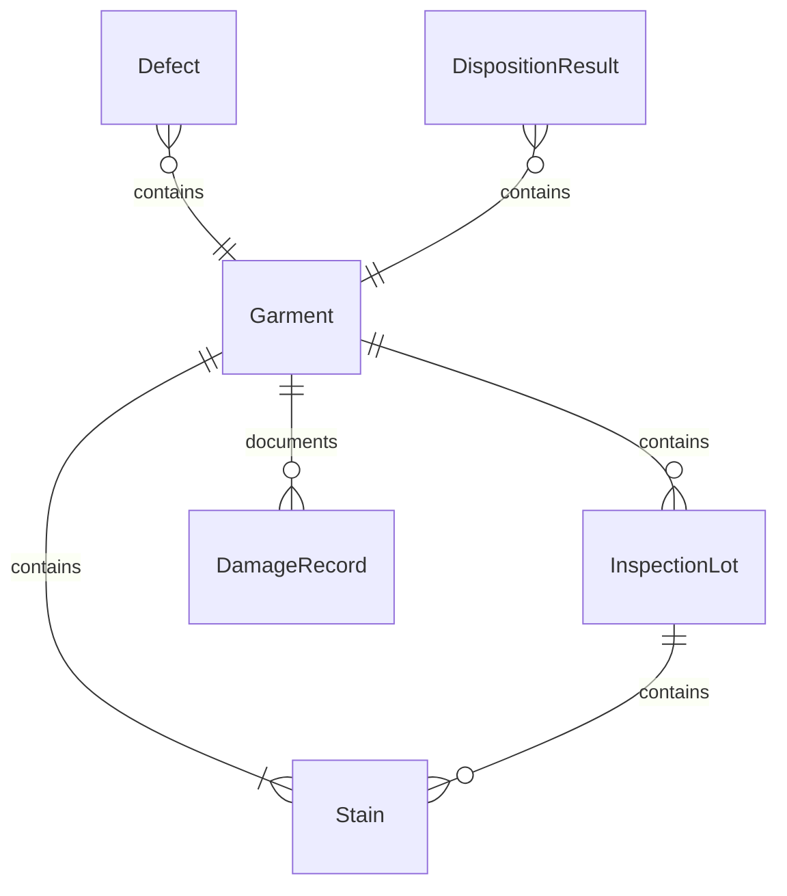
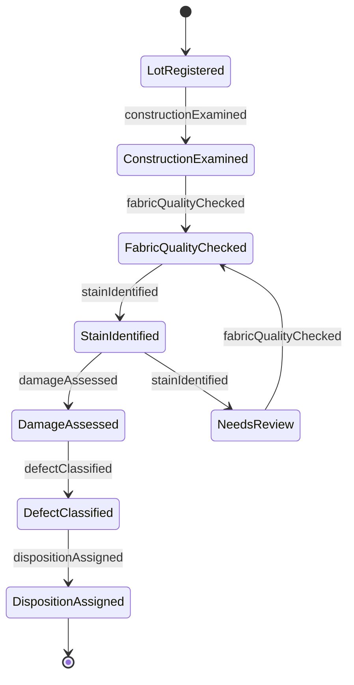
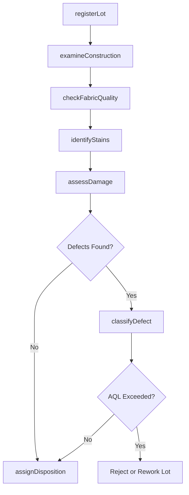
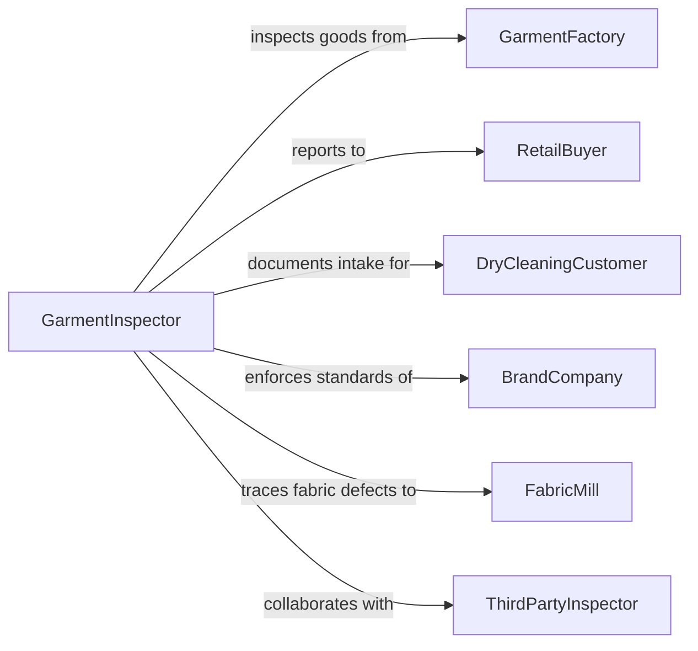

# Inspect Garments Defects Damage Stains

> Business-as-Code definition for inspecting garments for defects, damage, or stains. Models the quality control process used in garment manufacturing, dry cleaning, retail receiving, and laundry operations to identify and classify fabric and construction flaws.

## Overview

Garment inspection involves systematic visual and tactile examination of clothing items to identify manufacturing defects, physical damage, stains, and construction flaws. This definition covers pre-shipment factory inspection, incoming retail quality checks, dry cleaning intake assessment, and post-treatment verification. Inspectors evaluate stitching integrity, fabric quality, color consistency, print alignment, zipper and button function, and cleanliness against acceptance quality levels and customer specifications.

## Actors

| Actor | Description |
|-------|-------------|
| GarmentFactory | Manufactures garments and submits them for quality inspection |
| RetailBuyer | Receives shipments and requires incoming quality verification |
| DryCleaningCustomer | Submits garments and expects intake condition documentation |
| BrandCompany | Sets quality standards and acceptance criteria for private label goods |
| FabricMill | Supplies fabric that may contain pre-existing defects |
| ThirdPartyInspector | Independent inspection firm conducting on-behalf-of audits |

## Roles

| Role | Description |
|------|-------------|
| GarmentInspector | Performs visual and physical examination of garments |
| QualitySupervisor | Oversees inspection lines and makes lot disposition decisions |
| StainSpecialist | Identifies stain types and determines treatability |
| DefectClassifier | Categorizes defects by type, severity, and location |

## Entities

| Entity | Description |
|--------|-------------|
| Garment | An individual clothing item being inspected |
| InspectionLot | A batch of garments examined together under one order |
| Defect | A specific flaw identified during inspection (stitching, fabric, construction) |
| Stain | A discoloration or foreign substance found on the garment |
| DamageRecord | Documentation of physical damage such as tears, holes, or abrasion |
| DispositionResult | The accept, reject, or rework decision for the inspected garment or lot |

## Actions

| Action | Description |
|--------|-------------|
| registerLot | Create an inspection lot and assign garments for examination |
| examineConstruction | Check stitching, seams, hems, and structural integrity |
| checkFabricQuality | Evaluate fabric for weaving defects, pilling, or color variation |
| identifyStains | Locate and classify any stains or discoloration on the garment |
| assessDamage | Document tears, holes, snags, or other physical damage |
| classifyDefect | Categorize each defect by type, severity (critical, major, minor), and location |
| assignDisposition | Determine accept, reject, or rework status for the garment or lot |

## Events

| Event | Description |
|-------|-------------|
| lotRegistered | An inspection lot has been created and garments assigned |
| constructionExamined | Stitching and structural inspection has been completed |
| fabricQualityChecked | Fabric quality evaluation has been performed |
| stainIdentified | A stain has been found and classified on a garment |
| damageAssessed | Physical damage has been documented |
| defectClassified | A defect has been categorized by type and severity |
| dispositionAssigned | Accept/reject/rework decision has been made |

## Searches

| Search | Description |
|--------|-------------|
| findInspectionLots | List lots by factory, brand, date, or disposition status |
| getDefects | Retrieve defects by type, severity, garment style, or factory |
| getStainRecords | Find stain incidents by garment, stain type, or treatability |
| getDefectRates | Calculate defect rates by factory, style, or production run |

## Entity Relationships



## State Diagram



## Workflow



## Actor Relationships



## Usage

### Calling Actions

```typescript
import { inspectGarmentsDefectsDamageStains } from '@headlessly/inspect-garments-defects-damage-stains'

const inspection = inspectGarmentsDefectsDamageStains()

// Register an inspection lot from a factory shipment
const lot = await inspection.registerLot({
  factoryId: 'FAC-SHENZHEN-042',
  brand: 'brand-northwind',
  style: 'WMN-BLAZER-NW200',
  totalUnits: 500,
  sampleSize: 50,
  aqlLevel: 2.5
})

// Examine garment construction
await inspection.examineConstruction({
  lotId: lot.id,
  garmentId: 'GRM-NW200-0017',
  checkpoints: ['shoulder-seam', 'side-seam', 'hem', 'sleeve-attachment', 'buttonholes'],
  findings: { shoulderSeam: 'pass', sideSeam: 'pass', hem: 'minor-skip-stitch' }
})

// Classify a defect found during inspection
await inspection.classifyDefect({
  lotId: lot.id,
  garmentId: 'GRM-NW200-0017',
  defectType: 'skip-stitch',
  location: 'hem-left-front',
  severity: 'minor',
  measurementMM: 8
})
```

### Event-Driven Automation

```typescript
// Auto-reject lot when AQL threshold is exceeded
inspection.defectClassified(async ({ lotId, severity }) => {
  if (severity === 'critical' || severity === 'major') {
    const defects = await inspection.getDefects({ lotId })
    const majorCount = defects.filter(d => d.severity !== 'minor').length
    const lot = await inspection.findInspectionLots({ lotId })
    if (majorCount > lot.aqlThreshold) {
      await inspection.assignDisposition({ lotId, disposition: 'reject' })
    }
  }
})

// Notify brand when factory defect rate trends upward
inspection.dispositionAssigned(async ({ lotId, disposition, factoryId }) => {
  if (disposition === 'reject') {
    const rates = await inspection.getDefectRates({ factoryId, lastMonths: 3 })
    if (rates.averageDefectRate > 4.0) {
      await notify({
        to: 'brand-quality-team',
        message: `Factory ${factoryId} defect rate at ${rates.averageDefectRate}% over 3 months`
      })
    }
  }
})
```
