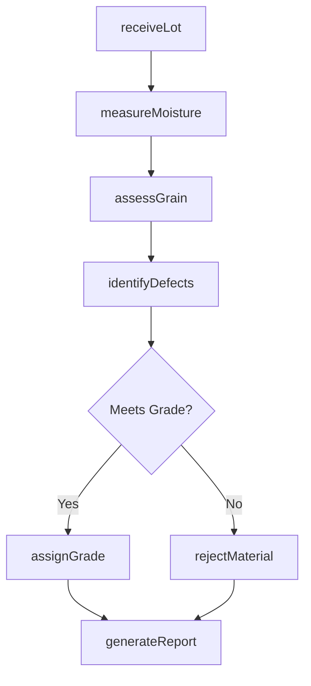
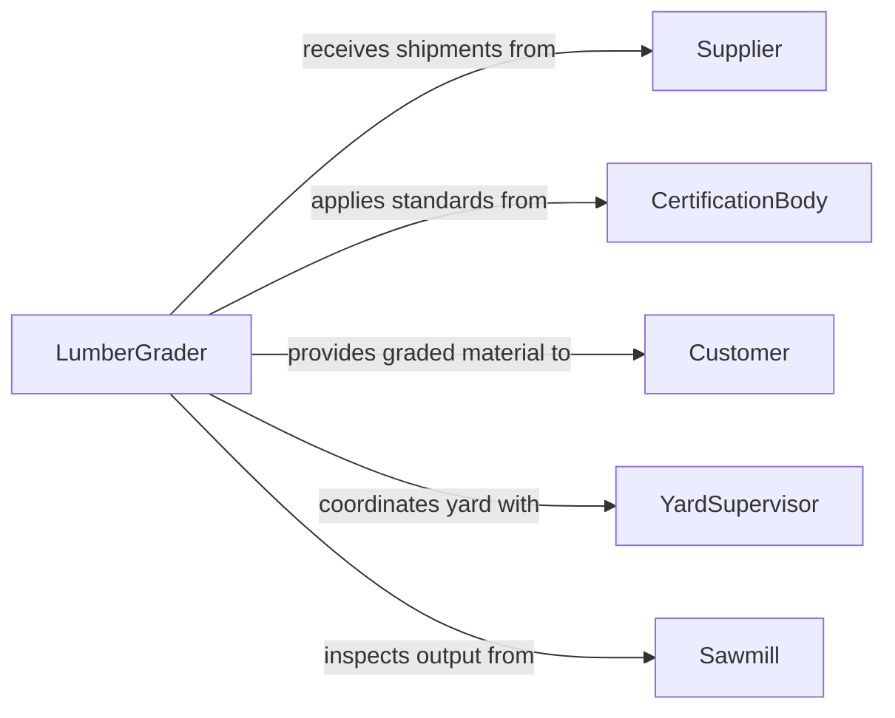

# Inspect Lumber Raw Woodstock

> Business-as-Code definition for lumber and raw woodstock inspection. Models the complete quality assessment process from receiving raw timber through grading, defect identification, and acceptance or rejection decisions.

## Overview

Lumber and raw woodstock inspection involves visually and physically examining timber, logs, and rough-sawn lumber to assess quality, grade, and suitability for intended use. Inspectors evaluate moisture content, grain patterns, structural integrity, and the presence of defects such as knots, splits, warping, or insect damage. This process ensures that only materials meeting specification thresholds enter production or are shipped to customers.

## Actors

| Actor | Description |
|-------|-------------|
| Supplier | Delivers raw lumber and woodstock to the facility |
| Sawmill | Processes raw logs into dimensional lumber for inspection |
| Customer | Receives graded lumber and relies on inspection accuracy |
| CertificationBody | Sets grading standards and certifies inspectors (e.g., NHLA, WWPA) |
| TransportCarrier | Moves lumber between facilities and may affect material condition |

## Roles

| Role | Description |
|------|-------------|
| LumberGrader | Evaluates and assigns grades to lumber based on industry standards |
| QualityInspector | Performs detailed defect analysis and moisture testing |
| ReceivingClerk | Logs incoming shipments and initiates inspection workflows |
| YardSupervisor | Oversees lumber yard operations and resolves grading disputes |

## Entities

| Entity | Description |
|--------|-------------|
| LumberLot | A batch of lumber received or staged for inspection |
| InspectionReport | Documented findings from a lumber inspection session |
| GradeAssignment | The quality grade assigned to inspected lumber (e.g., Select, No. 1 Common) |
| DefectRecord | A specific defect identified during inspection (knot, warp, split) |
| MoistureReading | Measured moisture content of a lumber sample |
| Species | The wood species classification (e.g., Douglas Fir, White Oak) |

## Actions

| Action | Description |
|--------|-------------|
| receiveLot | Register an incoming lumber lot for inspection |
| measureMoisture | Test moisture content using a pin or pinless meter |
| assessGrain | Evaluate grain pattern, direction, and consistency |
| identifyDefects | Catalog defects such as knots, checks, splits, or decay |
| assignGrade | Assign an industry-standard grade to the inspected lumber |
| rejectMaterial | Flag lumber that fails to meet minimum quality thresholds |
| generateReport | Produce a formal inspection report with findings and grades |

## Events

| Event | Description |
|-------|-------------|
| lotReceived | A new lumber lot has been registered for inspection |
| moistureMeasured | Moisture content reading has been recorded |
| defectIdentified | A defect has been found and cataloged |
| gradeAssigned | A quality grade has been applied to a lumber lot |
| materialRejected | Lumber has been flagged as below specification |
| reportGenerated | An inspection report has been finalized |
| lotApproved | A lumber lot has passed inspection and is cleared for use |

## Searches

| Search | Description |
|--------|-------------|
| findLots | List lumber lots by species, supplier, date, or inspection status |
| getDefects | Retrieve defect records by type, severity, or lot |
| getGrades | Look up grade assignments by lot, species, or grade level |
| getMoistureReadings | Query moisture readings by lot or acceptable range |

## Workflow



## Actor Relationships



## Usage

### Calling Actions

```typescript
import { inspectLumberRawWoodstock } from '@headlessly/inspect-lumber-raw-woodstock'

const lumber = inspectLumberRawWoodstock()

// Register an incoming lumber lot
const lot = await lumber.receiveLot({
  supplier: 'Pacific Northwest Timber Co.',
  species: 'Douglas Fir',
  quantity: 5000,
  unit: 'board-feet',
  purchaseOrder: 'PO-2026-1142'
})

// Measure moisture content
const moisture = await lumber.measureMoisture({
  lotId: lot.id,
  method: 'pin-meter',
  sampleCount: 10
})

// Assign grade based on findings
await lumber.assignGrade({
  lotId: lot.id,
  grade: 'No. 1 Common',
  standard: 'NHLA'
})
```

### Event-Driven Automation

```typescript
// Alert when moisture exceeds acceptable range
lumber.moistureMeasured(async ({ lotId, averageMoisture }) => {
  if (averageMoisture > 19) {
    await notify({
      to: 'yard-supervisor',
      message: `Lot ${lotId} moisture at ${averageMoisture}% - requires kiln drying`
    })
  }
})

// Auto-reject lots with critical defects
lumber.defectIdentified(async ({ lotId, defectType, severity }) => {
  if (severity === 'critical' && defectType === 'decay') {
    await lumber.rejectMaterial({ lotId, reason: 'Active decay detected' })
  }
})
```
