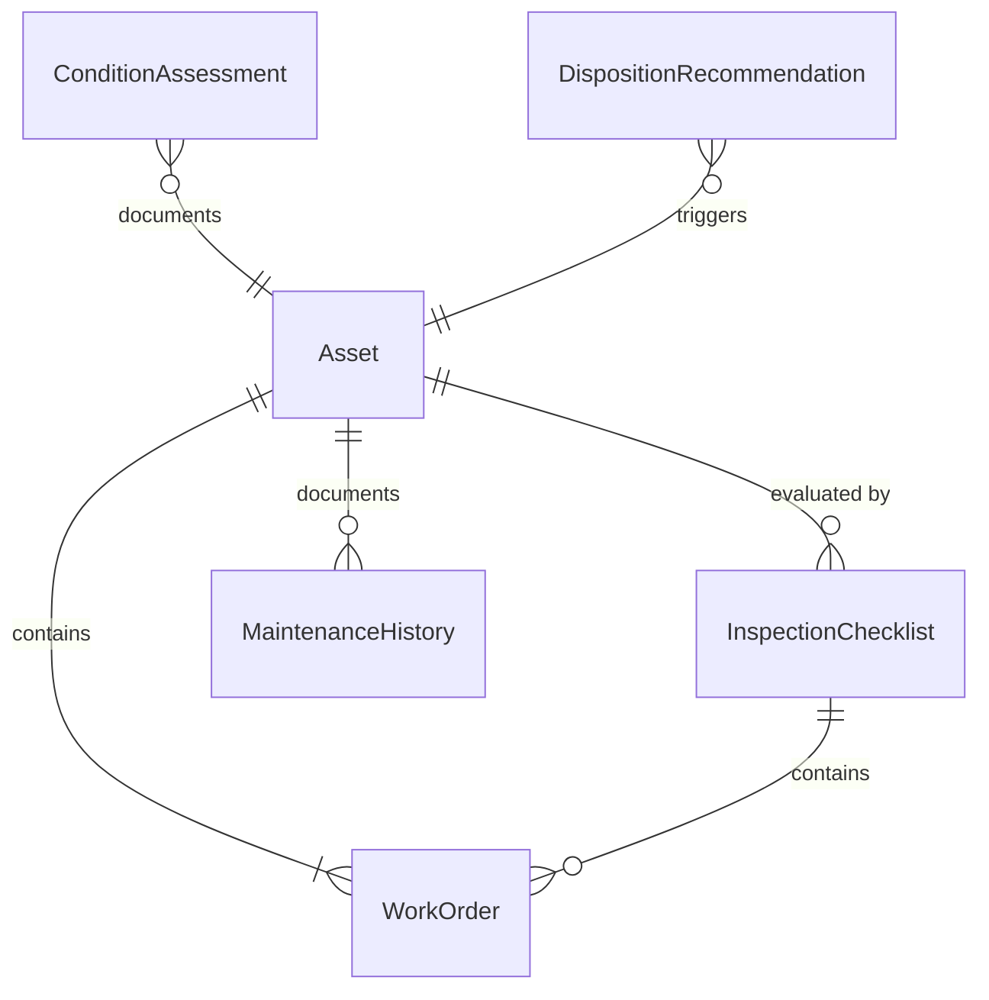
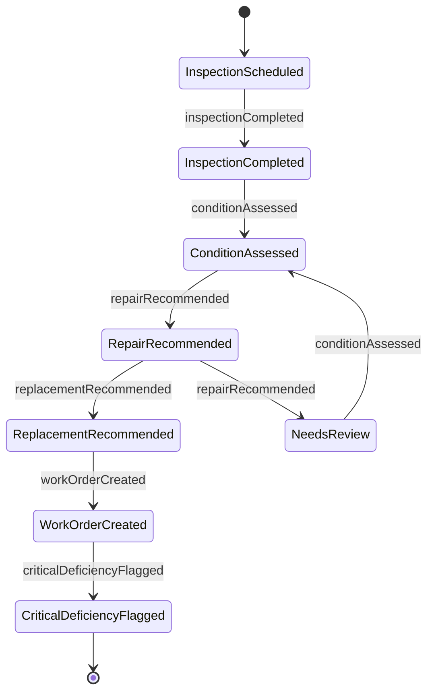
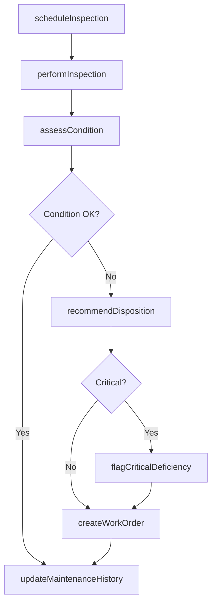
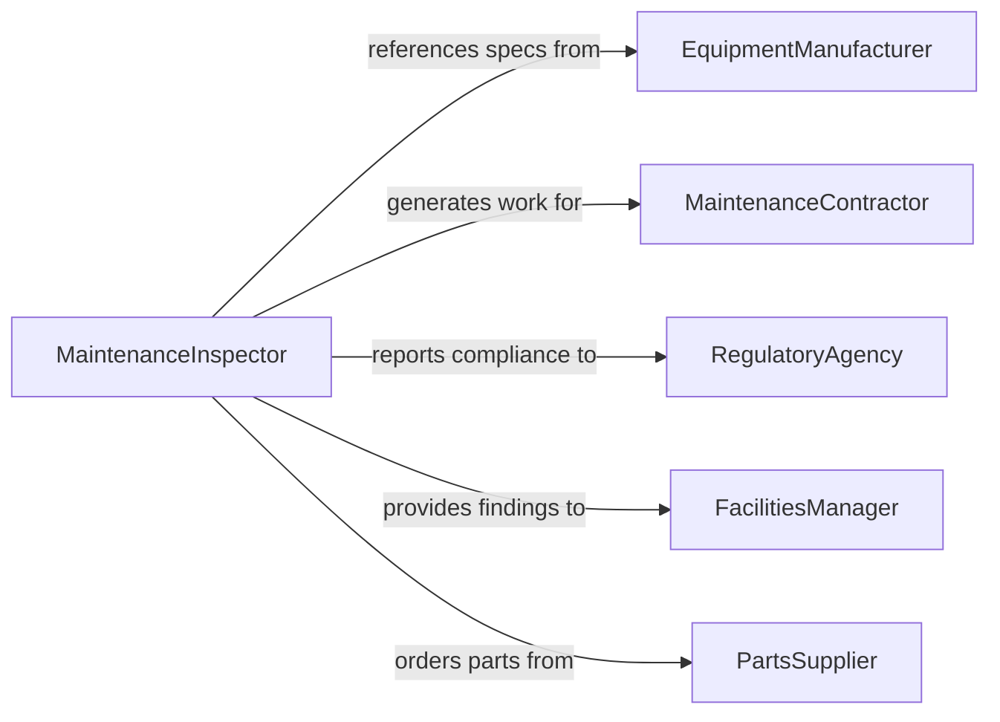

# Inspect Materials Equipment Determine Need

> Business-as-Code definition for inspecting materials and equipment to determine repair or replacement needs. Models the assessment lifecycle from scheduled inspection through condition evaluation, disposition recommendation, and work order generation.

## Overview

Inspecting materials and equipment to determine repair or replacement needs involves systematically examining physical assets for signs of wear, damage, corrosion, or functional degradation. Inspectors compare current condition against manufacturer specifications and operational requirements to decide whether an asset can continue in service, needs repair, or must be replaced. This process is fundamental to preventive maintenance programs and capital planning.

## Actors

| Actor | Description |
|-------|-------------|
| EquipmentManufacturer | Provides specifications, maintenance schedules, and replacement parts |
| MaintenanceContractor | Performs repairs or replacements based on inspection findings |
| InsuranceProvider | Requires periodic inspections for coverage compliance |
| RegulatoryAgency | Mandates inspection intervals for regulated equipment |
| PartsSupplier | Furnishes replacement components when equipment cannot be repaired |

## Roles

| Role | Description |
|------|-------------|
| MaintenanceInspector | Conducts physical inspections and documents findings |
| FacilitiesManager | Prioritizes repair and replacement decisions across the asset portfolio |
| MaintenancePlanner | Schedules inspections and coordinates resulting work orders |
| AssetEngineer | Evaluates technical data to determine repair feasibility versus replacement |

## Entities

| Entity | Description |
|--------|-------------|
| Asset | A piece of equipment or material subject to inspection |
| InspectionChecklist | Standardized criteria used to evaluate asset condition |
| ConditionAssessment | The documented evaluation of an asset's current state |
| WorkOrder | A formal request to repair or replace an identified asset |
| MaintenanceHistory | Historical record of past inspections, repairs, and replacements |
| DispositionRecommendation | The recommended action (continue, repair, replace, retire) |

## Actions

| Action | Description |
|--------|-------------|
| scheduleInspection | Plan an inspection for a specific asset or group of assets |
| performInspection | Execute the physical inspection using the checklist |
| assessCondition | Evaluate overall asset condition based on inspection data |
| recommendDisposition | Determine whether the asset should be repaired, replaced, or continued |
| createWorkOrder | Generate a maintenance work order for repair or replacement |
| updateMaintenanceHistory | Record inspection results in the asset's maintenance log |
| flagCriticalDeficiency | Escalate an asset with immediate safety or operational concerns |

## Events

| Event | Description |
|-------|-------------|
| inspectionScheduled | An inspection has been planned for an asset |
| inspectionCompleted | A physical inspection has been performed and documented |
| conditionAssessed | An asset's condition rating has been determined |
| repairRecommended | The asset has been flagged for repair |
| replacementRecommended | The asset has been flagged for replacement |
| workOrderCreated | A maintenance work order has been generated |
| criticalDeficiencyFlagged | An immediate safety or operational concern has been escalated |

## Searches

| Search | Description |
|--------|-------------|
| findAssets | List assets by type, location, condition rating, or inspection status |
| getInspectionHistory | Retrieve past inspection records for a specific asset |
| getPendingWorkOrders | Find open work orders resulting from inspections |
| getOverdueInspections | Identify assets past their scheduled inspection date |

## Entity Relationships



## State Diagram



## Workflow



## Actor Relationships



## Usage

### Calling Actions

```typescript
import { inspectMaterialsEquipmentDetermineNeed } from '@headlessly/inspect-materials-equipment-determine-need'

const inspection = inspectMaterialsEquipmentDetermineNeed()

// Schedule a routine inspection
const scheduled = await inspection.scheduleInspection({
  assetId: 'PUMP-4422',
  type: 'preventive',
  dueDate: '2026-03-15',
  checklist: 'centrifugal-pump-v3'
})

// Perform the inspection
const result = await inspection.performInspection({
  inspectionId: scheduled.id,
  findings: [
    { item: 'bearing-wear', rating: 'fair', notes: 'Slight vibration detected' },
    { item: 'seal-condition', rating: 'poor', notes: 'Visible leakage at shaft seal' }
  ]
})

// Generate a work order for repair
await inspection.createWorkOrder({
  assetId: 'PUMP-4422',
  type: 'repair',
  priority: 'high',
  description: 'Replace shaft seal and inspect bearings'
})
```

### Event-Driven Automation

```typescript
// Escalate critical deficiencies immediately
inspection.criticalDeficiencyFlagged(async ({ assetId, deficiency }) => {
  await notify({
    to: 'facilities-manager',
    message: `Critical deficiency on ${assetId}: ${deficiency}`,
    priority: 'urgent'
  })
})

// Auto-schedule follow-up after repair
inspection.workOrderCreated(async ({ assetId, workOrderId }) => {
  await inspection.scheduleInspection({
    assetId,
    type: 'post-repair-verification',
    dueDate: addDays(new Date(), 30),
    linkedWorkOrder: workOrderId
  })
})
```
