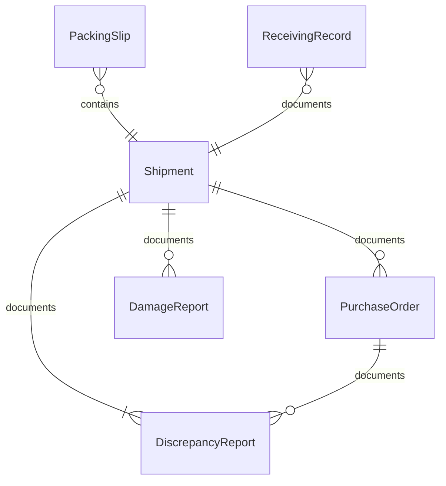
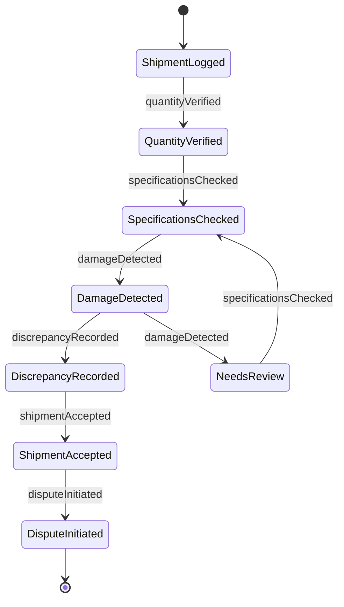
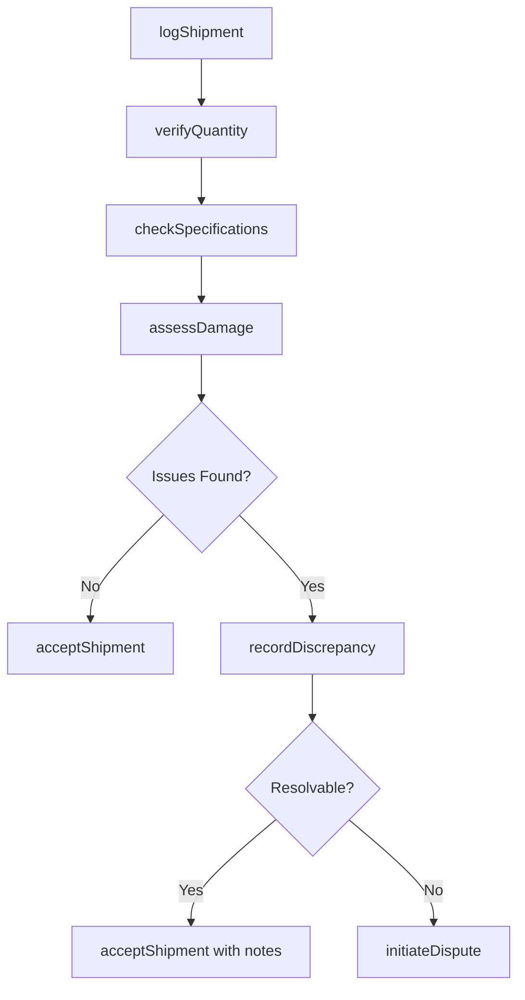
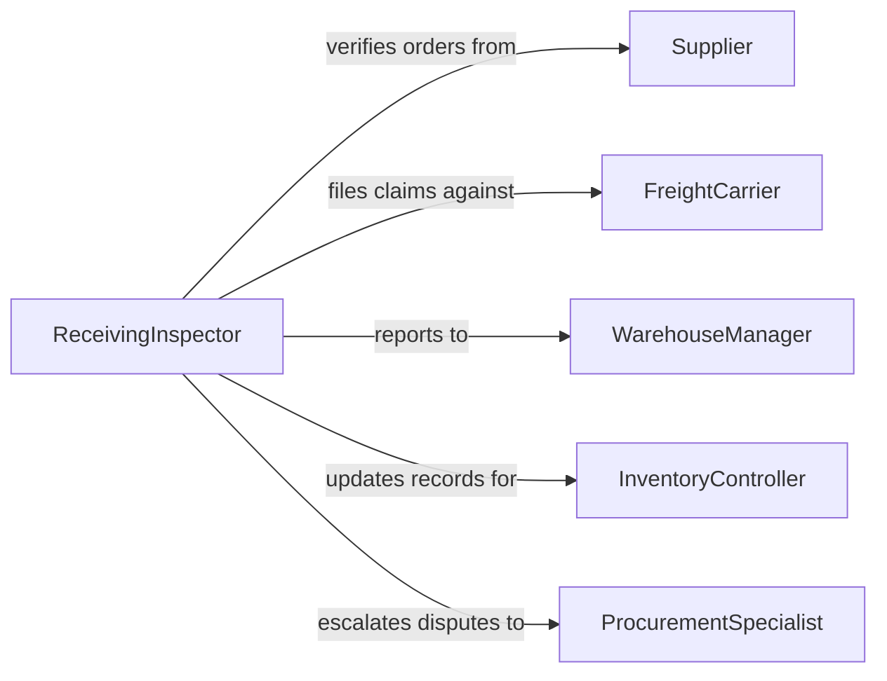

# Inspect Shipments Ensure Correct Order

> Business-as-Code definition for shipment inspection and order fulfillment verification. Models the complete receiving and verification process from shipment arrival through quantity checks, damage assessment, and acceptance or dispute resolution.

## Overview

Shipment inspection for order fulfillment involves verifying that received goods match purchase orders in terms of quantity, product specifications, packaging integrity, and delivery condition. Inspectors cross-reference packing slips, bills of lading, and order records to identify discrepancies such as shortages, overages, wrong items, or transit damage. This process protects the organization from accepting non-conforming deliveries and ensures accurate inventory records.

## Actors

| Actor | Description |
|-------|-------------|
| Supplier | Ships goods against purchase orders and resolves discrepancies |
| FreightCarrier | Transports shipments and is liable for transit damage |
| Customer | End recipient whose order accuracy depends on inspection |
| CustomsBroker | Handles import documentation for international shipments |
| InsuranceAdjuster | Processes claims for damaged or lost shipments |

## Roles

| Role | Description |
|------|-------------|
| ReceivingInspector | Physically examines shipments against order documentation |
| WarehouseManager | Oversees receiving operations and authorizes acceptance or rejection |
| ProcurementSpecialist | Initiates purchase orders and manages supplier disputes |
| InventoryController | Updates stock records based on verified receipt quantities |

## Entities

| Entity | Description |
|--------|-------------|
| Shipment | A delivery of goods arriving at the facility |
| PurchaseOrder | The original order document specifying items and quantities |
| PackingSlip | Supplier-provided list of items included in the shipment |
| DiscrepancyReport | Documentation of differences between ordered and received goods |
| DamageReport | Record of physical damage found during inspection |
| ReceivingRecord | Finalized acceptance record updating inventory |

## Actions

| Action | Description |
|--------|-------------|
| logShipment | Register an incoming shipment against its purchase order |
| verifyQuantity | Count received items and compare against order quantities |
| checkSpecifications | Confirm item numbers, sizes, colors, and other specifications match |
| assessDamage | Inspect packaging and goods for transit or handling damage |
| recordDiscrepancy | Document any differences between expected and received items |
| acceptShipment | Formally accept the shipment and update inventory records |
| initiateDispute | File a claim with the supplier or carrier for discrepancies or damage |

## Events

| Event | Description |
|-------|-------------|
| shipmentLogged | An incoming shipment has been registered in the system |
| quantityVerified | Item counts have been confirmed against the purchase order |
| specificationsChecked | Product specifications have been validated |
| damageDetected | Physical damage has been found on received goods |
| discrepancyRecorded | A mismatch between order and delivery has been documented |
| shipmentAccepted | The shipment has been formally accepted into inventory |
| disputeInitiated | A claim has been filed for non-conforming delivery |

## Searches

| Search | Description |
|--------|-------------|
| findShipments | List shipments by supplier, date, purchase order, or status |
| getDiscrepancies | Retrieve discrepancy reports by type, supplier, or severity |
| getPendingReceipts | Find shipments awaiting inspection or acceptance |
| getDamageReports | Query damage records by carrier, shipment, or claim status |

## Entity Relationships



## State Diagram



## Workflow



## Actor Relationships



## Usage

### Calling Actions

```typescript
import { inspectShipmentsEnsureCorrectOrder } from '@headlessly/inspect-shipments-ensure-correct-order'

const shipments = inspectShipmentsEnsureCorrectOrder()

// Register incoming shipment
const shipment = await shipments.logShipment({
  purchaseOrder: 'PO-2026-0887',
  supplier: 'Global Electronics Ltd.',
  carrier: 'FedEx Freight',
  trackingNumber: 'FX-99281004',
  expectedItems: 150
})

// Verify quantity against purchase order
const verification = await shipments.verifyQuantity({
  shipmentId: shipment.id,
  counts: [
    { sku: 'WIDGET-A100', expected: 100, received: 98 },
    { sku: 'WIDGET-B200', expected: 50, received: 50 }
  ]
})

// Record a shortage discrepancy
await shipments.recordDiscrepancy({
  shipmentId: shipment.id,
  type: 'shortage',
  sku: 'WIDGET-A100',
  expectedQty: 100,
  receivedQty: 98
})
```

### Event-Driven Automation

```typescript
// Notify procurement when discrepancies are found
shipments.discrepancyRecorded(async ({ shipmentId, type, sku }) => {
  await notify({
    to: 'procurement-team',
    message: `${type} on shipment ${shipmentId}: ${sku}`
  })
})

// Auto-update inventory on acceptance
shipments.shipmentAccepted(async ({ shipmentId, items }) => {
  for (const item of items) {
    await inventory.adjust({
      sku: item.sku,
      quantity: item.receivedQty,
      reference: shipmentId
    })
  }
})
```
