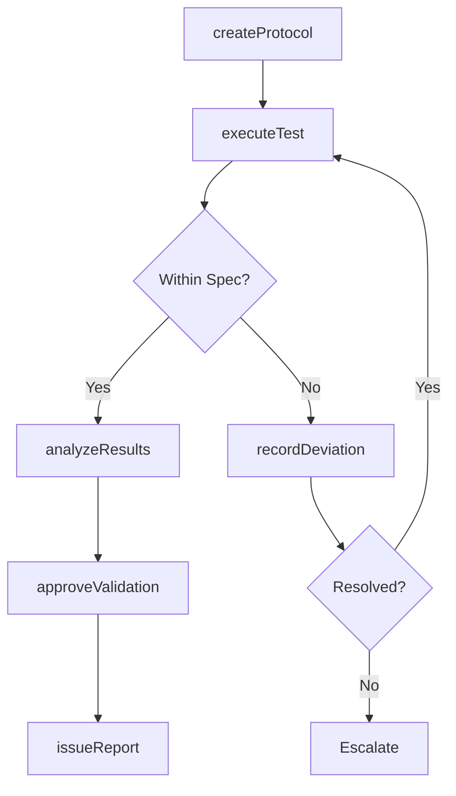
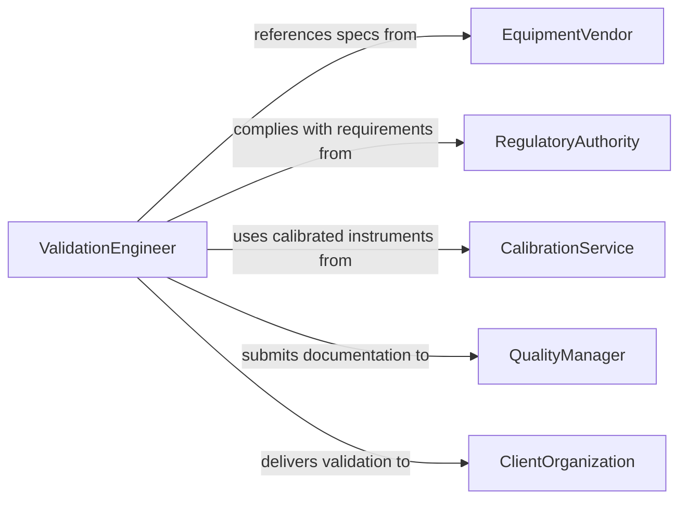

# Conduct Validation Tests Equipment Processes

> Business-as-Code definition for conducting validation tests of equipment and processes. Models the complete validation lifecycle from test protocol development through execution, data collection, analysis, and certification of validated status.

## Overview

Validation testing of equipment and processes confirms that systems perform within defined specifications and produce consistent, reliable results under operating conditions. This includes Installation Qualification (IQ), Operational Qualification (OQ), and Performance Qualification (PQ) protocols common in regulated industries such as pharmaceuticals, food manufacturing, and aerospace. Validation ensures compliance with regulatory requirements and provides documented evidence that equipment and processes are fit for their intended purpose.

## Actors

| Actor | Description |
|-------|-------------|
| EquipmentVendor | Provides equipment specifications, installation support, and calibration data |
| RegulatoryAuthority | Defines validation requirements and audits compliance (e.g., FDA, EMA) |
| CalibrationService | Certifies measurement instruments used during validation testing |
| AuditFirm | Conducts third-party validation audits and gap assessments |
| ClientOrganization | Commissions validation for new or modified equipment and processes |

## Roles

| Role | Description |
|------|-------------|
| ValidationEngineer | Develops protocols, executes tests, and analyzes results |
| QualityManager | Reviews and approves validation documentation |
| ProcessOwner | Defines acceptance criteria and operational requirements for validated systems |
| DocumentationSpecialist | Manages validation records, deviations, and change control |

## Entities

| Entity | Description |
|--------|-------------|
| ValidationProtocol | A documented plan specifying test procedures, acceptance criteria, and responsibilities |
| TestExecution | A single run of a validation test with recorded parameters and results |
| DeviationReport | Documentation of any out-of-specification result during validation |
| ValidationSummary | Final report compiling all test results and conclusions |
| AcceptanceCriteria | Predefined thresholds that equipment or processes must meet |
| ChangeControl | Formal process for managing modifications to validated systems |

## Actions

| Action | Description |
|--------|-------------|
| createProtocol | Develop a validation protocol with test steps and acceptance criteria |
| executeTest | Run a validation test and record measured parameters |
| recordDeviation | Document any result that falls outside acceptance criteria |
| analyzeResults | Evaluate test data against acceptance criteria for pass/fail determination |
| approveValidation | Formally approve the validation and certify the equipment or process |
| issueReport | Generate the final validation summary report |
| initiateRevalidation | Trigger revalidation due to equipment change or periodic review |

## Events

| Event | Description |
|-------|-------------|
| protocolCreated | A new validation protocol has been developed and reviewed |
| testExecuted | A validation test run has been completed with recorded data |
| deviationRecorded | An out-of-specification result has been documented |
| resultsAnalyzed | Test data has been evaluated against acceptance criteria |
| validationApproved | The equipment or process has been certified as validated |
| reportIssued | The final validation summary report has been published |
| revalidationTriggered | A revalidation cycle has been initiated |

## Searches

| Search | Description |
|--------|-------------|
| findProtocols | List validation protocols by equipment type, status, or due date |
| getTestResults | Retrieve test execution data by protocol, date range, or outcome |
| getDeviations | Query deviation reports by severity, status, or root cause |
| getValidationStatus | Check current validation status of equipment or processes |

## Workflow



## Actor Relationships



## Usage

### Calling Actions

```typescript
import { conductValidationTestsEquipmentProcesses } from '@headlessly/conduct-validation-tests-equipment-processes'

const validation = conductValidationTestsEquipmentProcesses()

// Create a validation protocol
const protocol = await validation.createProtocol({
  equipment: 'Autoclave-ST-200',
  type: 'Performance Qualification',
  acceptanceCriteria: {
    temperature: { min: 121, max: 123, unit: 'celsius' },
    holdTime: { min: 15, unit: 'minutes' },
    pressure: { min: 15, max: 17, unit: 'psi' }
  },
  runs: 3
})

// Execute a test run
const testRun = await validation.executeTest({
  protocolId: protocol.id,
  runNumber: 1,
  measurements: {
    temperature: 121.8,
    holdTime: 15.5,
    pressure: 15.9
  }
})

// Approve validation after all runs pass
await validation.approveValidation({
  protocolId: protocol.id,
  approver: 'quality-manager',
  validUntil: '2027-03-01'
})
```

### Event-Driven Automation

```typescript
// Alert quality team on deviations
validation.deviationRecorded(async ({ protocolId, parameter, measured, expected }) => {
  await notify({
    to: 'quality-team',
    message: `Deviation on protocol ${protocolId}: ${parameter} measured ${measured}, expected ${expected}`
  })
})

// Schedule revalidation before expiry
validation.validationApproved(async ({ protocolId, validUntil }) => {
  const revalidationDate = subtractDays(new Date(validUntil), 30)
  await validation.initiateRevalidation({
    protocolId,
    scheduledDate: revalidationDate
  })
})
```
