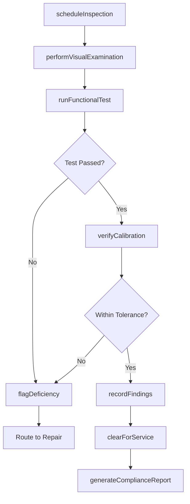
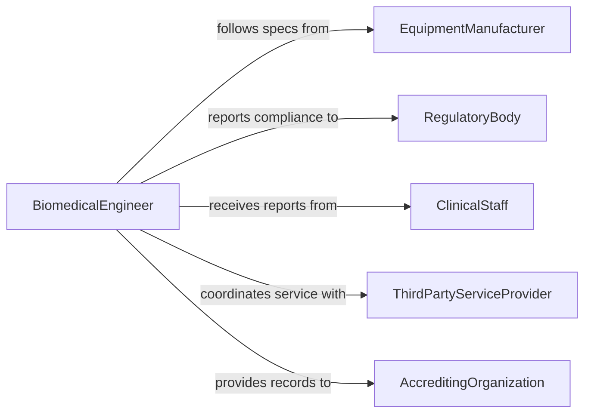

# Examine Medical Instruments and Equipment

> Business-as-Code definition for examining medical instruments and equipment to ensure proper operation. Models the inspection lifecycle from scheduled checks through calibration verification and compliance reporting.

## Overview

Examining medical instruments and equipment involves visually inspecting, functionally testing, and verifying calibration of devices used in patient care, diagnostics, and surgical procedures. This includes checking sterilization indicators, validating sensor accuracy, verifying alarm thresholds, and confirming that life-critical equipment meets manufacturer specifications and regulatory standards. The process spans everything from handheld diagnostic tools to complex imaging systems, ventilators, and infusion pumps.

## Actors

| Actor | Description |
|-------|-------------|
| EquipmentManufacturer | Provides specifications, service manuals, and calibration standards |
| RegulatoryBody | Enforces compliance with medical device regulations such as FDA and IEC standards |
| ClinicalStaff | Reports equipment malfunctions and operational concerns during patient care |
| ThirdPartyServiceProvider | Performs specialized calibration and maintenance under contract |
| AccreditingOrganization | Audits equipment management programs for healthcare facility accreditation |
| MedicalDeviceDistributor | Supplies replacement parts, accessories, and firmware updates |

## Roles

| Role | Description |
|------|-------------|
| BiomedicalEngineer | Leads technical inspection, calibration, and repair of medical devices |
| ClinicalEngineeringTechnician | Performs routine inspections and preventive maintenance tasks |
| QualityAssuranceManager | Oversees equipment compliance and maintains inspection documentation |
| InfectionControlOfficer | Verifies sterilization and decontamination of reusable instruments |
| DepartmentSupervisor | Coordinates equipment availability with clinical scheduling |

## Entities

| Entity | Description |
|--------|-------------|
| MedicalDevice | A registered instrument or piece of equipment used in patient care |
| InspectionRecord | Documentation of examination findings, measurements, and pass/fail status |
| CalibrationCertificate | Formal record confirming a device meets measurement accuracy standards |
| MaintenanceSchedule | Planned timeline for preventive inspections and servicing |
| DeficiencyReport | A documented finding where equipment does not meet operational standards |
| ServiceManual | Manufacturer documentation detailing inspection procedures and tolerances |
| ComplianceChecklist | Standardized list of regulatory and safety requirements for each device type |

## Actions

| Action | Description |
|--------|-------------|
| scheduleInspection | Create or update a planned inspection for a medical device |
| performVisualExamination | Conduct physical inspection for damage, wear, or contamination |
| runFunctionalTest | Execute operational tests to verify device performance against specifications |
| verifyCalibration | Compare device measurements against known reference standards |
| recordFindings | Document inspection results, measurements, and observations |
| flagDeficiency | Mark a device as non-compliant or requiring corrective action |
| clearForService | Approve a device for return to clinical use after successful inspection |
| generateComplianceReport | Produce summary documentation for regulatory or accreditation review |

## Events

| Event | Description |
|-------|-------------|
| inspectionScheduled | A new inspection has been added to the maintenance calendar |
| visualExaminationCompleted | Physical inspection of a device has been finished |
| functionalTestPassed | A device has met all operational performance criteria |
| functionalTestFailed | A device did not meet one or more performance criteria |
| calibrationVerified | Device measurements confirmed within acceptable tolerance |
| deficiencyFlagged | A non-compliance or malfunction has been documented |
| deviceClearedForService | A device has been approved for return to clinical use |
| complianceReportGenerated | A regulatory compliance summary has been produced |

## Searches

| Search | Description |
|--------|-------------|
| findDevicesDueForInspection | List medical devices with upcoming or overdue inspection dates |
| getInspectionHistory | Retrieve past inspection records for a specific device |
| findDeficiencies | Locate devices with open deficiency reports |
| getCalibrationStatus | Check current calibration status across a fleet of devices |
| findDevicesByDepartment | List all registered medical devices within a clinical department |

## Workflow



## Actor Relationships



## Usage

### Calling Actions

```typescript
import { examineMedicalInstrumentsAndEquipment } from '@headlessly/examine-medical-instruments-and-equipment'

const inspector = examineMedicalInstrumentsAndEquipment()

// Schedule a preventive inspection for an infusion pump
const inspection = await inspector.scheduleInspection({
  deviceId: 'DEV-4021',
  deviceType: 'InfusionPump',
  scheduledDate: '2026-03-15',
  inspectionType: 'preventive',
  assignedTo: 'tech-bmurphy'
})

// Run functional tests against manufacturer specifications
const testResult = await inspector.runFunctionalTest({
  inspectionId: inspection.id,
  tests: [
    { name: 'flowRateAccuracy', expected: 100, tolerance: 5, unit: 'mL/hr' },
    { name: 'occlusionAlarm', triggerPressure: 15, unit: 'psi' },
    { name: 'airbubbleDetector', sensitivity: 'standard' }
  ]
})

// Verify calibration against reference standard
await inspector.verifyCalibration({
  inspectionId: inspection.id,
  referenceStandardId: 'REF-NIST-2026-044',
  measurements: [
    { parameter: 'flowRate', measured: 99.7, reference: 100.0, unit: 'mL/hr' }
  ]
})
```

### Event-Driven Automation

```typescript
// Alert clinical engineering when a functional test fails
inspector.functionalTestFailed(async ({ deviceId, testName, result }) => {
  await notify({
    to: 'clinical-engineering',
    priority: 'high',
    message: `Device ${deviceId} failed ${testName}: measured ${result.measured} vs expected ${result.expected}`
  })
  await inspector.flagDeficiency({
    deviceId,
    category: 'functionalFailure',
    description: `${testName} out of specification`,
    severity: 'critical'
  })
})

// Auto-generate compliance reports on successful inspections
inspector.deviceClearedForService(async ({ deviceId, inspectionId }) => {
  await inspector.generateComplianceReport({
    inspectionId,
    format: 'pdf',
    includeCalibrationData: true
  })
})
```
