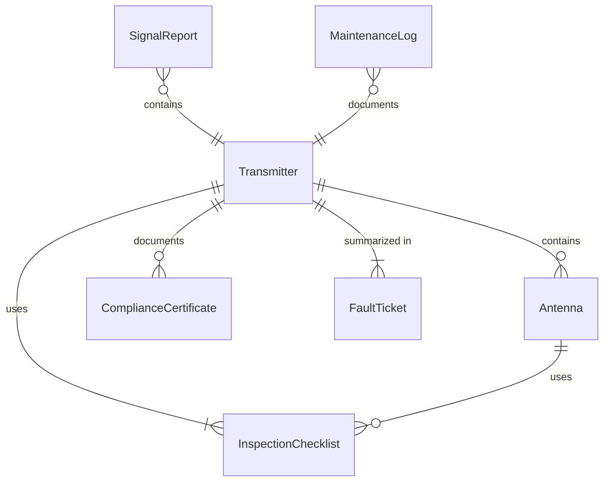
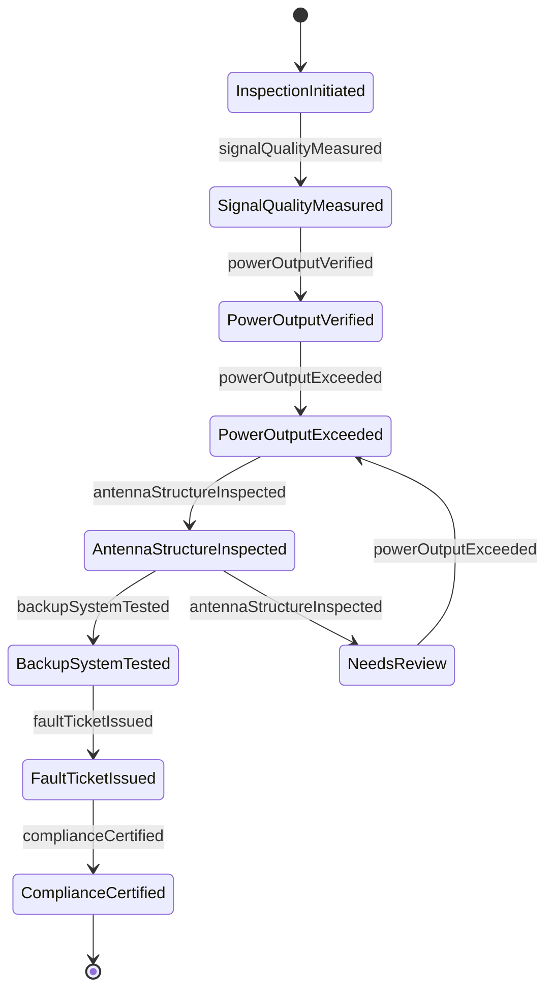
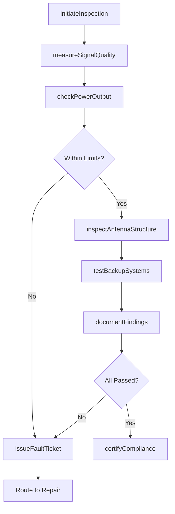
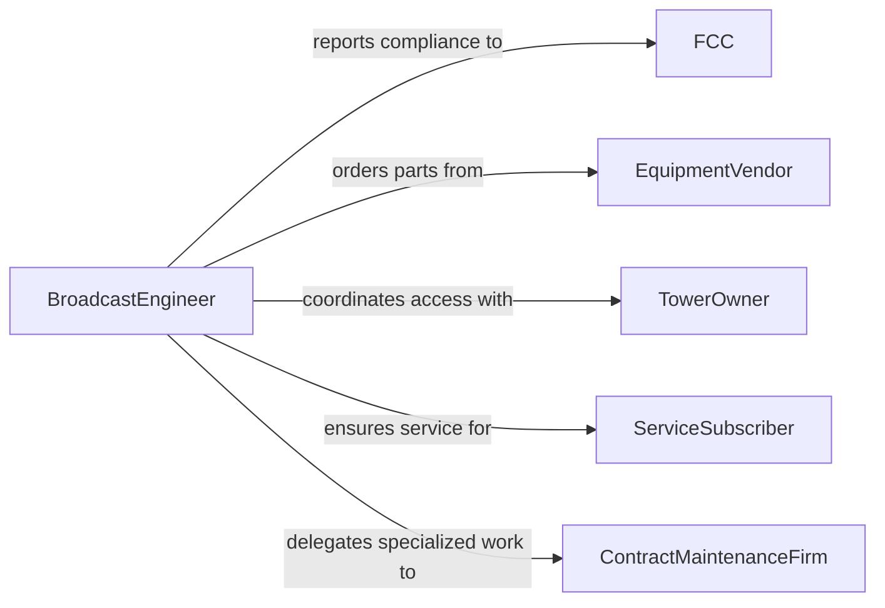

# Inspect Communications or Broadcasting Equipment

> Business-as-Code definition for inspecting communications and broadcasting equipment. Models the full inspection process from signal quality verification through transmitter compliance and infrastructure condition assessment.

## Overview

Inspecting communications or broadcasting equipment involves examining transmitters, receivers, antennas, satellite uplinks, fiber-optic nodes, and studio broadcast chains to verify signal integrity, power output, and regulatory compliance. Technicians measure parameters such as signal-to-noise ratio, frequency stability, modulation depth, and transmission power levels. The process covers terrestrial radio and television infrastructure, telecommunications relay stations, microwave links, and mobile communication tower equipment, ensuring uninterrupted service delivery and adherence to FCC or equivalent regulatory standards.

## Actors

| Actor | Description |
|-------|-------------|
| FCC | Federal Communications Commission or equivalent regulatory authority enforcing broadcast standards |
| EquipmentVendor | Supplies transmitters, amplifiers, antennas, and related broadcasting components |
| TowerOwner | Manages physical infrastructure where communications equipment is mounted |
| ServiceSubscriber | End consumer or organization relying on communications signal availability |
| InsuranceCarrier | Underwrites equipment and infrastructure risk requiring periodic inspection evidence |
| ContractMaintenanceFirm | Third-party provider performing specialized equipment servicing |

## Roles

| Role | Description |
|------|-------------|
| BroadcastEngineer | Leads technical inspection and performance measurement of broadcast systems |
| TelecommunicationsTechnician | Performs hands-on inspection of relay, switching, and transmission equipment |
| TransmitterOperator | Monitors day-to-day signal output and reports anomalies |
| ComplianceSpecialist | Ensures equipment meets regulatory emission and power output requirements |
| NetworkOperationsManager | Coordinates inspection schedules with service availability requirements |

## Entities

| Entity | Description |
|--------|-------------|
| Transmitter | A device that generates and sends radio, television, or data signals |
| Antenna | A structure that radiates or receives electromagnetic signals |
| SignalReport | Measured signal parameters including power, frequency, and quality metrics |
| InspectionChecklist | Standardized list of items and parameters to evaluate during equipment review |
| ComplianceCertificate | Documentation confirming equipment meets regulatory emission standards |
| MaintenanceLog | Historical record of inspections, repairs, and component replacements |
| FaultTicket | A reported issue requiring investigation or corrective action |

## Actions

| Action | Description |
|--------|-------------|
| initiateInspection | Begin a scheduled or ad-hoc inspection of communications equipment |
| measureSignalQuality | Record signal-to-noise ratio, modulation, and frequency stability |
| checkPowerOutput | Verify transmitter power levels against licensed thresholds |
| inspectAntennaStructure | Examine antenna mounts, cables, connectors, and weatherproofing |
| testBackupSystems | Verify failover paths, redundant transmitters, and emergency power |
| documentFindings | Record all measurements, observations, and photos in the inspection log |
| issueFaultTicket | Create a tracked issue for equipment requiring repair or adjustment |
| certifyCompliance | Confirm equipment meets regulatory standards and issue certification |

## Events

| Event | Description |
|-------|-------------|
| inspectionInitiated | An equipment inspection process has been started |
| signalQualityMeasured | Signal parameters have been recorded and evaluated |
| powerOutputVerified | Transmitter power levels confirmed within licensed range |
| powerOutputExceeded | Transmitter power levels found outside licensed thresholds |
| antennaStructureInspected | Physical condition of antenna system has been assessed |
| backupSystemTested | Failover and redundancy systems have been verified |
| faultTicketIssued | A defect or non-compliance has been formally reported |
| complianceCertified | Equipment confirmed as meeting all regulatory requirements |

## Searches

| Search | Description |
|--------|-------------|
| findEquipmentDueForInspection | List communications equipment with upcoming or overdue inspections |
| getSignalHistory | Retrieve historical signal quality measurements for a transmitter |
| findOpenFaults | Locate equipment with unresolved fault tickets |
| getComplianceStatus | Check regulatory certification status across broadcasting sites |
| findEquipmentBySite | List all communications equipment installed at a specific tower or facility |

## Entity Relationships



## State Diagram



## Workflow



## Actor Relationships



## Usage

### Calling Actions

```typescript
import { inspectCommunicationsOrBroadcastingEquipment } from '@headlessly/inspect-communications-or-broadcasting-equipment'

const inspector = inspectCommunicationsOrBroadcastingEquipment()

// Initiate a scheduled inspection of a UHF transmitter
const inspection = await inspector.initiateInspection({
  equipmentId: 'TX-UHF-2204',
  siteId: 'tower-north-ridge',
  inspectionType: 'scheduled',
  assignedTo: 'eng-jthomas'
})

// Measure signal quality parameters
const signalReport = await inspector.measureSignalQuality({
  inspectionId: inspection.id,
  measurements: [
    { parameter: 'signalToNoiseRatio', value: 48.2, unit: 'dB' },
    { parameter: 'frequencyStability', value: 0.003, unit: 'ppm' },
    { parameter: 'modulationDepth', value: 87.5, unit: 'percent' }
  ]
})

// Verify transmitter power output
await inspector.checkPowerOutput({
  inspectionId: inspection.id,
  measuredPower: 24.8,
  licensedMaxPower: 25.0,
  unit: 'kW'
})
```

### Event-Driven Automation

```typescript
// Alert operations when power output exceeds licensed limits
inspector.powerOutputExceeded(async ({ equipmentId, measuredPower, licensedMaxPower }) => {
  await notify({
    to: 'network-operations',
    priority: 'urgent',
    message: `Transmitter ${equipmentId} output ${measuredPower} kW exceeds licensed ${licensedMaxPower} kW`
  })
  await inspector.issueFaultTicket({
    equipmentId,
    category: 'regulatoryViolation',
    severity: 'critical',
    description: 'Transmitter power exceeds FCC licensed maximum'
  })
})

// Auto-notify subscribers when backup system tests fail
inspector.backupSystemTested(async ({ equipmentId, result }) => {
  if (!result.passed) {
    await notify({
      to: 'network-operations',
      message: `Backup system for ${equipmentId} failed: ${result.failureReason}`
    })
  }
})
```
