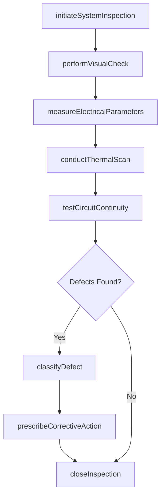
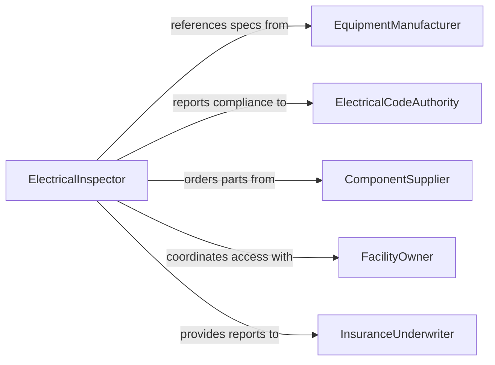

# Inspect Electrical or Electronic Systems for Defects

> Business-as-Code definition for inspecting electrical and electronic systems to identify defects. Models the inspection lifecycle from circuit testing through thermal analysis and defect classification.

## Overview

Inspecting electrical or electronic systems for defects involves systematically examining wiring, circuit boards, control panels, power distribution units, programmable logic controllers, and integrated electronic assemblies to identify faults such as short circuits, ground faults, insulation degradation, solder joint failures, and component drift. Technicians use multimeters, oscilloscopes, thermal imaging cameras, and insulation resistance testers to detect issues before they cause equipment failure, safety hazards, or production downtime. The process applies across manufacturing, building infrastructure, transportation, and industrial automation contexts.

## Actors

| Actor | Description |
|-------|-------------|
| EquipmentManufacturer | Provides wiring diagrams, component specifications, and known defect bulletins |
| ElectricalCodeAuthority | Enforces compliance with NEC, IEC, or local electrical safety codes |
| ComponentSupplier | Furnishes replacement parts, circuit boards, and electronic modules |
| FacilityOwner | Authorizes inspections and provides access to electrical infrastructure |
| InsuranceUnderwriter | Requires periodic electrical inspection reports for coverage eligibility |
| TestEquipmentCalibrationLab | Certifies accuracy of measurement instruments used during inspections |

## Roles

| Role | Description |
|------|-------------|
| ElectricalInspector | Conducts detailed examination of electrical systems and documents findings |
| ElectronicsTestTechnician | Performs bench-level testing of circuit boards and electronic assemblies |
| MaintenanceElectrician | Identifies and resolves electrical defects found during inspections |
| ReliabilityEngineer | Analyzes defect patterns to predict and prevent future failures |
| SafetyOfficer | Reviews inspection findings for workplace electrical hazard compliance |

## Entities

| Entity | Description |
|--------|-------------|
| ElectricalSystem | A defined set of wiring, panels, breakers, and connected components |
| Defect | A documented fault, degradation, or non-conformity in an electrical component |
| InspectionReport | Formal record of examination findings, measurements, and defect classifications |
| CircuitDiagram | Schematic showing component layout and electrical connections |
| ThermalImage | Infrared capture showing heat distribution patterns indicating potential faults |
| TestMeasurement | A recorded electrical parameter value from a diagnostic instrument |
| CorrectiveAction | A prescribed repair or replacement to resolve a documented defect |

## Actions

| Action | Description |
|--------|-------------|
| initiateSystemInspection | Begin a planned or triggered inspection of an electrical or electronic system |
| performVisualCheck | Examine components for visible damage, discoloration, arcing marks, or corrosion |
| measureElectricalParameters | Record voltage, current, resistance, and insulation values at test points |
| conductThermalScan | Use infrared imaging to detect hotspots indicating loose connections or overloads |
| testCircuitContinuity | Verify unbroken electrical paths through wiring and connectors |
| classifyDefect | Categorize a discovered fault by type, severity, and affected component |
| prescribeCorrectiveAction | Define the repair, replacement, or adjustment needed to resolve a defect |
| closeInspection | Finalize the inspection report and update system status |

## Events

| Event | Description |
|-------|-------------|
| systemInspectionInitiated | An electrical system inspection has been started |
| visualCheckCompleted | Physical examination of components has been finished |
| electricalParametersMeasured | Voltage, current, or resistance values have been recorded |
| thermalAnomalyDetected | Infrared scan revealed an abnormal temperature pattern |
| continuityFaultFound | A break in an expected electrical path has been identified |
| defectClassified | A fault has been categorized and severity assigned |
| correctiveActionPrescribed | A repair or replacement has been defined for a defect |
| inspectionClosed | The inspection has been finalized and report completed |

## Searches

| Search | Description |
|--------|-------------|
| findSystemsDueForInspection | List electrical systems with upcoming or overdue inspection dates |
| getDefectsBySystem | Retrieve all documented defects for a specific electrical system |
| findOpenDefects | Locate defects awaiting corrective action across all systems |
| getThermalScanHistory | Retrieve infrared images and thermal trend data for a system |
| getDefectTrends | Analyze defect frequency and type patterns over time |

## Workflow



## Actor Relationships



## Usage

### Calling Actions

```typescript
import { inspectElectricalOrElectronicSystemsForDefects } from '@headlessly/inspect-electrical-or-electronic-systems-for-defects'

const inspector = inspectElectricalOrElectronicSystemsForDefects()

// Start inspection of a motor control center
const inspection = await inspector.initiateSystemInspection({
  systemId: 'MCC-BLDG4-PANEL-A',
  systemType: 'motorControlCenter',
  inspectionType: 'scheduled',
  assignedTo: 'tech-rwilliams'
})

// Record electrical measurements at test points
await inspector.measureElectricalParameters({
  inspectionId: inspection.id,
  measurements: [
    { testPoint: 'TP-01', parameter: 'insulationResistance', value: 2.1, unit: 'megaohms' },
    { testPoint: 'TP-02', parameter: 'voltage', value: 479.3, unit: 'V', phase: 'A-B' },
    { testPoint: 'TP-03', parameter: 'current', value: 42.7, unit: 'A', phase: 'A' }
  ]
})

// Conduct thermal scan and classify any anomalies
const scan = await inspector.conductThermalScan({
  inspectionId: inspection.id,
  scanArea: 'main-bus-connections',
  ambientTemp: 24.5,
  unit: 'celsius'
})
```

### Event-Driven Automation

```typescript
// Escalate when thermal anomalies are detected
inspector.thermalAnomalyDetected(async ({ systemId, location, temperature, threshold }) => {
  await notify({
    to: 'electrical-maintenance',
    priority: 'high',
    message: `Thermal anomaly at ${location} on ${systemId}: ${temperature}C exceeds ${threshold}C threshold`
  })
})

// Track defect trends for reliability analysis
inspector.defectClassified(async ({ systemId, defectType, severity }) => {
  if (severity === 'critical') {
    await notify({
      to: 'reliability-engineering',
      message: `Critical ${defectType} defect on ${systemId} requires immediate attention`
    })
  }
})
```
