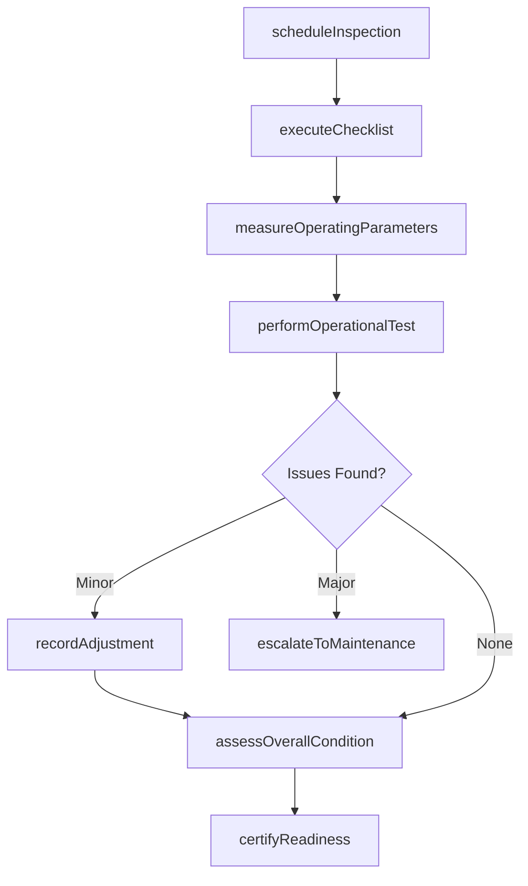
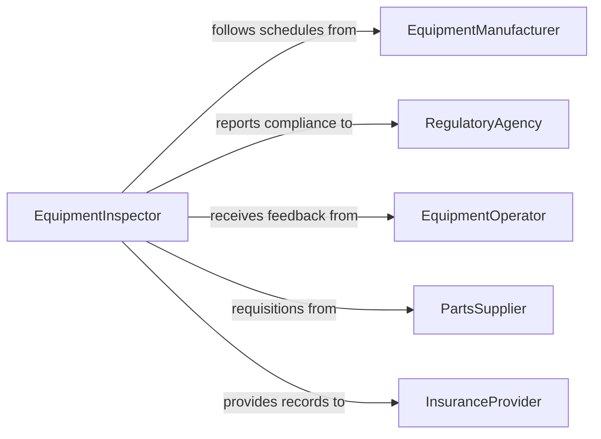

# Inspect Equipment to Ensure Proper Functioning

> Business-as-Code definition for inspecting general equipment to ensure proper functioning. Models the preventive inspection process from scheduling through operational verification and readiness certification.

## Overview

Inspecting equipment to ensure proper functioning encompasses the routine and condition-based examination of machinery, tools, vehicles, and operational systems to confirm they perform within expected parameters. This activity spans industries from construction and transportation to food service and office operations, covering everything from verifying fluid levels and belt tension on heavy machinery to confirming calibration on precision instruments. The goal is to identify wear, misalignment, or degradation before they cause failure, ensuring operational continuity and worker safety.

## Actors

| Actor | Description |
|-------|-------------|
| EquipmentManufacturer | Provides maintenance schedules, operating manuals, and warranty specifications |
| RegulatoryAgency | Mandates periodic inspections for safety-critical equipment categories |
| EquipmentOperator | Uses equipment daily and reports abnormal behavior or performance changes |
| PartsSupplier | Furnishes consumables, filters, lubricants, and replacement components |
| InsuranceProvider | Requires documented inspection records as a condition of equipment coverage |
| LeaseCompany | Stipulates maintenance and inspection obligations for leased equipment |

## Roles

| Role | Description |
|------|-------------|
| EquipmentInspector | Performs systematic examinations and documents equipment condition |
| MaintenanceTechnician | Conducts inspections and makes minor adjustments or repairs on the spot |
| FleetManager | Oversees inspection scheduling across a portfolio of equipment assets |
| SafetyCoordinator | Reviews inspection findings for workplace safety implications |
| AssetManager | Tracks equipment lifecycle, depreciation, and maintenance investment |

## Entities

| Entity | Description |
|--------|-------------|
| EquipmentAsset | A tracked piece of equipment with serial number and maintenance history |
| InspectionChecklist | A standardized list of items to verify during a specific equipment inspection |
| InspectionResult | The pass, fail, or conditional outcome for each checklist item |
| ConditionReport | A summary assessment of overall equipment health and readiness |
| MaintenanceSchedule | The planned timeline of preventive inspections for an equipment fleet |
| AdjustmentRecord | Documentation of minor corrections made during an inspection |
| ReadinessCertification | Formal confirmation that equipment is approved for continued operation |

## Actions

| Action | Description |
|--------|-------------|
| scheduleInspection | Plan an inspection based on time interval, usage hours, or condition triggers |
| executeChecklist | Work through each item on the inspection checklist and record results |
| measureOperatingParameters | Check fluid levels, pressures, temperatures, and output metrics |
| performOperationalTest | Run the equipment through its functions to verify correct operation |
| recordAdjustment | Document any minor corrections or tightening performed during inspection |
| assessOverallCondition | Evaluate cumulative findings to determine equipment health rating |
| certifyReadiness | Approve equipment for continued use or flag for maintenance |
| escalateToMaintenance | Refer equipment with significant findings for corrective maintenance |

## Events

| Event | Description |
|-------|-------------|
| inspectionScheduled | A new inspection has been placed on the maintenance calendar |
| checklistExecuted | All checklist items for an inspection have been evaluated |
| operatingParametersMeasured | Fluid levels, pressures, and temperatures have been recorded |
| operationalTestCompleted | Equipment has been run through functional verification |
| adjustmentRecorded | A minor correction made during inspection has been documented |
| conditionAssessed | Overall equipment health rating has been determined |
| readinessCertified | Equipment has been approved for continued operation |
| maintenanceEscalated | Equipment has been referred for corrective maintenance |

## Searches

| Search | Description |
|--------|-------------|
| findEquipmentDueForInspection | List assets with upcoming or overdue inspection dates |
| getInspectionHistory | Retrieve past inspection results and condition reports for an asset |
| findEquipmentByCondition | Locate equipment rated below a specified health threshold |
| getChecklistsByEquipmentType | Retrieve applicable inspection checklists for a category of equipment |
| findEscalatedItems | List equipment currently referred for corrective maintenance |

## Workflow



## Actor Relationships



## Usage

### Calling Actions

```typescript
import { inspectEquipmentToEnsureProperFunctioning } from '@headlessly/inspect-equipment-to-ensure-proper-functioning'

const inspector = inspectEquipmentToEnsureProperFunctioning()

// Schedule a preventive inspection based on usage hours
const inspection = await inspector.scheduleInspection({
  assetId: 'FORKLIFT-022',
  trigger: 'usageHours',
  threshold: 250,
  currentHours: 248,
  assignedTo: 'tech-agarcia'
})

// Execute the inspection checklist
const results = await inspector.executeChecklist({
  inspectionId: inspection.id,
  items: [
    { item: 'hydraulicFluidLevel', result: 'pass' },
    { item: 'brakePadThickness', result: 'pass', measurement: 4.2, unit: 'mm' },
    { item: 'mastChainTension', result: 'conditional', note: 'Slight slack, adjusted on-site' },
    { item: 'hornAndLights', result: 'pass' }
  ]
})

// Assess overall condition and certify
await inspector.assessOverallCondition({
  inspectionId: inspection.id,
  rating: 'good',
  notes: 'All items pass or adjusted. No corrective maintenance required.'
})
```

### Event-Driven Automation

```typescript
// Auto-schedule next inspection when current one completes
inspector.readinessCertified(async ({ assetId, inspectionId }) => {
  const asset = await getAsset(assetId)
  await inspector.scheduleInspection({
    assetId,
    trigger: 'usageHours',
    threshold: asset.inspectionInterval,
    currentHours: 0
  })
})

// Notify fleet manager when equipment is escalated
inspector.maintenanceEscalated(async ({ assetId, findings }) => {
  await notify({
    to: 'fleet-management',
    message: `${assetId} requires corrective maintenance: ${findings.summary}`
  })
})
```
