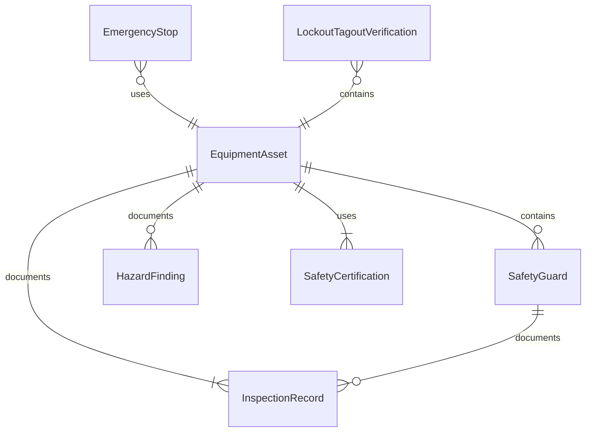
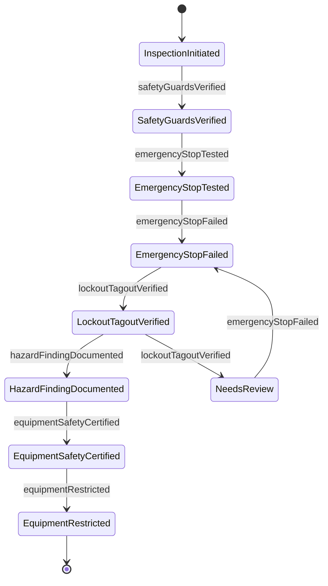
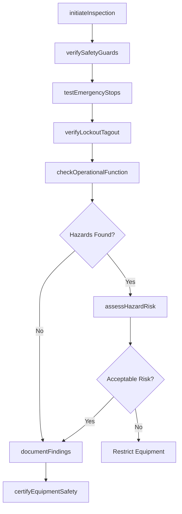
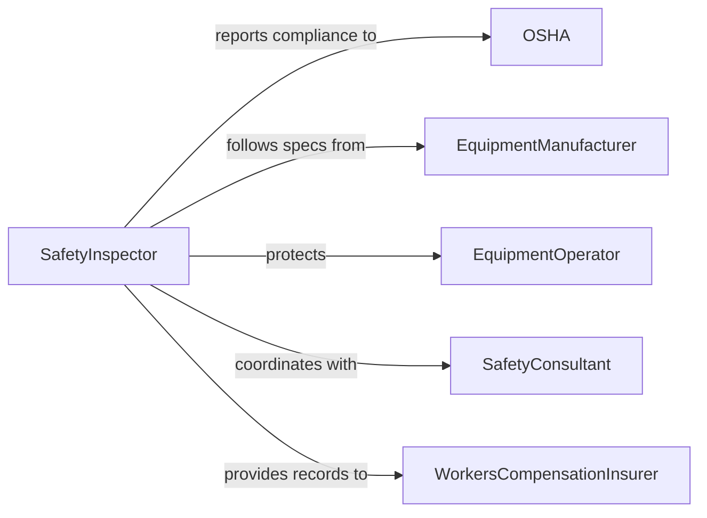

# Inspect Equipment to Ensure Safety or Proper Functioning

> Business-as-Code definition for inspecting equipment with a focus on both safety compliance and operational performance. Models the dual-purpose inspection process covering safety guard verification, lockout/tagout compliance, and functional readiness.

## Overview

Inspecting equipment to ensure safety or proper functioning combines operational verification with safety-specific checks. This activity goes beyond confirming that machinery works correctly to also verify that safety guards are in place, emergency stops function, lockout/tagout procedures are viable, and that equipment does not present electrical, mechanical, or ergonomic hazards. It applies to industrial machinery, construction equipment, commercial kitchen appliances, agricultural implements, and any equipment where operator safety depends on proper condition and functioning of protective features.

## Actors

| Actor | Description |
|-------|-------------|
| OSHA | Occupational Safety and Health Administration or equivalent workplace safety authority |
| EquipmentManufacturer | Defines safety specifications, guard requirements, and maintenance intervals |
| EquipmentOperator | Uses the equipment and must be protected from hazards |
| SafetyConsultant | Provides third-party assessment of equipment safety posture |
| WorkersCompensationInsurer | Requires safety inspection documentation as a condition of coverage |
| UnionRepresentative | Advocates for worker safety standards regarding equipment condition |

## Roles

| Role | Description |
|------|-------------|
| SafetyInspector | Examines equipment for both operational and safety compliance |
| MaintenanceTechnician | Performs inspections and corrects safety deficiencies on the spot |
| PlantSafetyManager | Oversees the equipment safety inspection program across a facility |
| RiskAssessmentSpecialist | Evaluates hazard severity and likelihood for equipment deficiencies |
| OperationsManager | Balances production needs with equipment safety requirements |

## Entities

| Entity | Description |
|--------|-------------|
| EquipmentAsset | A tracked piece of machinery or equipment subject to safety inspection |
| SafetyGuard | A physical barrier or interlock designed to protect operators from hazards |
| EmergencyStop | A device that immediately halts equipment operation in an emergency |
| InspectionRecord | Documentation of safety and functional findings for a specific inspection |
| HazardFinding | A documented condition that presents a risk to operator safety |
| LockoutTagoutVerification | Confirmation that energy isolation procedures can be properly executed |
| SafetyCertification | Formal approval that equipment meets safety standards for operation |

## Actions

| Action | Description |
|--------|-------------|
| initiateInspection | Begin a combined safety and functional inspection of equipment |
| verifySafetyGuards | Check that all physical guards, shields, and interlocks are present and functional |
| testEmergencyStops | Activate emergency stop mechanisms to confirm immediate shutdown |
| verifyLockoutTagout | Confirm that energy isolation points are accessible and procedures are viable |
| checkOperationalFunction | Run equipment through normal operations to verify performance |
| assessHazardRisk | Evaluate the severity and likelihood of identified safety deficiencies |
| documentFindings | Record all safety and functional observations in the inspection record |
| certifyEquipmentSafety | Approve equipment for use or restrict operation pending corrective action |

## Events

| Event | Description |
|-------|-------------|
| inspectionInitiated | A combined safety and functional inspection has been started |
| safetyGuardsVerified | All physical guards and interlocks have been checked |
| emergencyStopTested | Emergency shutdown mechanisms have been activated and verified |
| emergencyStopFailed | An emergency stop mechanism did not function as required |
| lockoutTagoutVerified | Energy isolation procedures have been confirmed as viable |
| hazardFindingDocumented | A safety deficiency has been identified and recorded |
| equipmentSafetyCertified | Equipment has been approved as safe for continued operation |
| equipmentRestricted | Equipment has been taken out of service due to safety concerns |

## Searches

| Search | Description |
|--------|-------------|
| findEquipmentDueForSafetyInspection | List assets with upcoming or overdue safety inspection dates |
| getHazardFindings | Retrieve open safety deficiencies for a piece of equipment or facility |
| findRestrictedEquipment | Locate equipment currently removed from service for safety reasons |
| getSafetyInspectionHistory | Retrieve past safety inspection records for an asset |
| getHazardTrends | Analyze patterns in safety findings across equipment categories |

## Entity Relationships



## State Diagram



## Workflow



## Actor Relationships



## Usage

### Calling Actions

```typescript
import { inspectEquipmentToEnsureSafetyOrProperFunctioning } from '@headlessly/inspect-equipment-to-ensure-safety-or-proper-functioning'

const inspector = inspectEquipmentToEnsureSafetyOrProperFunctioning()

// Start a combined safety and functional inspection
const inspection = await inspector.initiateInspection({
  assetId: 'CNC-LATHE-014',
  inspectionType: 'quarterly',
  assignedTo: 'safety-jmartinez'
})

// Verify all safety guards and interlocks
await inspector.verifySafetyGuards({
  inspectionId: inspection.id,
  guards: [
    { name: 'chuckGuardInterlock', status: 'functional' },
    { name: 'spindleShield', status: 'functional' },
    { name: 'chipGuard', status: 'damaged', note: 'Crack in polycarbonate panel' }
  ]
})

// Test emergency stop mechanisms
await inspector.testEmergencyStops({
  inspectionId: inspection.id,
  stops: [
    { location: 'operatorPanel', responseTime: 0.3, unit: 'seconds', passed: true },
    { location: 'rearAccess', responseTime: 0.4, unit: 'seconds', passed: true }
  ]
})
```

### Event-Driven Automation

```typescript
// Immediately restrict equipment when emergency stops fail
inspector.emergencyStopFailed(async ({ assetId, location }) => {
  await inspector.certifyEquipmentSafety({
    assetId,
    status: 'restricted',
    reason: `Emergency stop failure at ${location}`
  })
  await notify({
    to: 'plant-safety',
    priority: 'critical',
    message: `${assetId} RESTRICTED: Emergency stop at ${location} non-functional`
  })
})

// Track safety hazard trends for management review
inspector.hazardFindingDocumented(async ({ assetId, hazardType, severity }) => {
  if (severity === 'high') {
    await notify({
      to: 'operations-management',
      message: `High-severity ${hazardType} finding on ${assetId} requires immediate attention`
    })
  }
})
```
