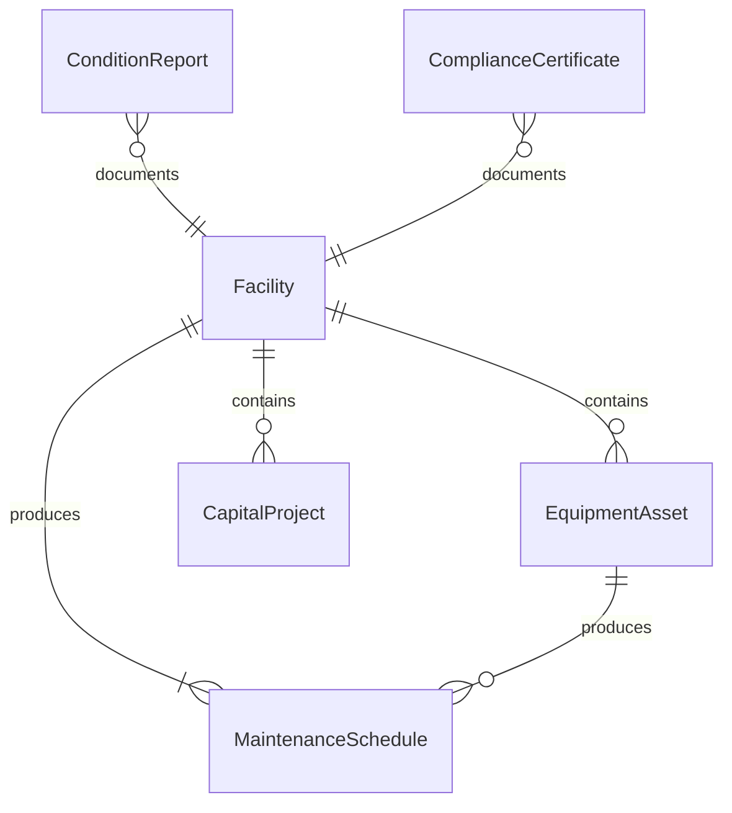
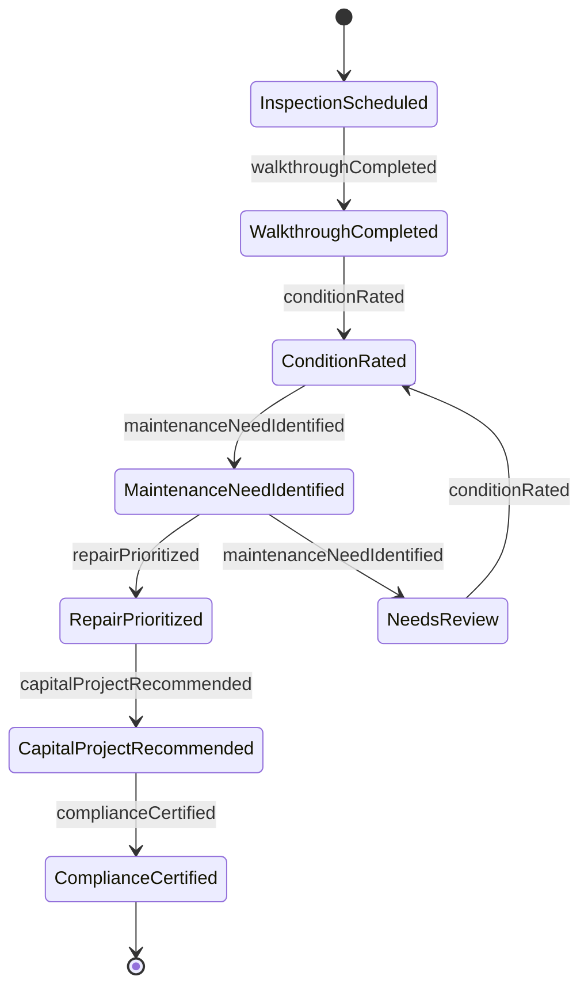
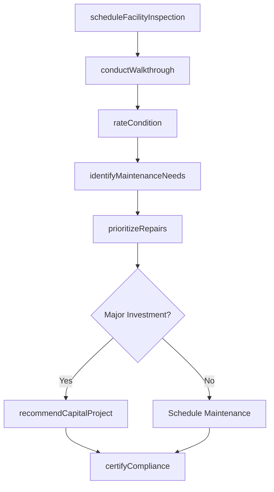
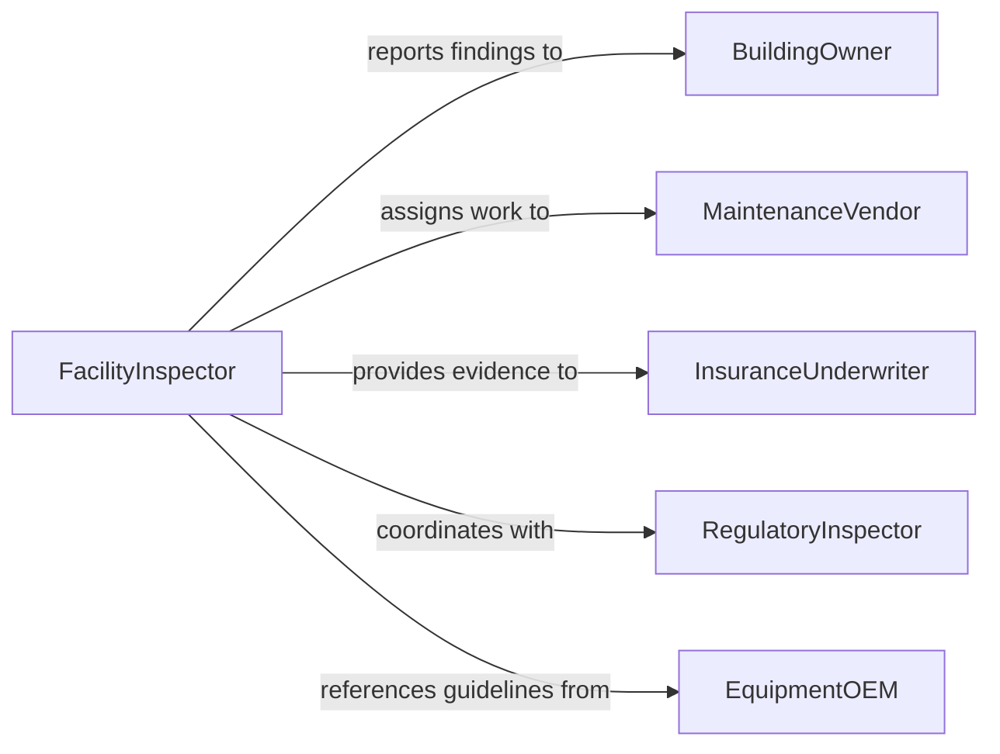

# Inspect Equipment Facilities Determine Condition

> Business-as-Code definition for inspecting equipment and facilities to determine condition and maintenance needs. Models the assessment process from scheduling routine inspections through condition evaluation, maintenance prioritization, and capital planning recommendations.

## Overview

Inspecting equipment and facilities to determine condition involves conducting systematic assessments of building systems, production equipment, and infrastructure to evaluate operational fitness, safety compliance, and remaining useful life. Inspectors use visual examination, diagnostic instruments, and testing procedures to identify wear patterns, structural deterioration, and functional degradation. Findings drive preventive maintenance schedules, capital improvement budgets, and operational risk mitigation strategies.

## Actors

| Actor | Description |
|-------|-------------|
| BuildingOwner | Responsible for overall facility condition and capital investment decisions |
| MaintenanceVendor | Provides specialized repair and maintenance services |
| InsuranceUnderwriter | Evaluates facility condition for risk assessment and premium setting |
| RegulatoryInspector | Conducts mandated inspections for code compliance |
| EquipmentOEM | Provides maintenance guidelines, parts, and technical support |
| TenantOccupant | Reports operational issues and is affected by facility condition |

## Roles

| Role | Description |
|------|-------------|
| FacilityInspector | Conducts physical assessments and documents findings |
| FacilitiesDirector | Oversees facility management strategy and budget allocation |
| MaintenanceTechnician | Performs hands-on diagnostics and routine servicing |
| CapitalPlanner | Translates inspection findings into long-term investment plans |

## Entities

| Entity | Description |
|--------|-------------|
| Facility | A building, plant, or campus subject to inspection |
| EquipmentAsset | A specific machine, system, or component within a facility |
| ConditionReport | Documented assessment of current condition with ratings |
| MaintenanceSchedule | Planned preventive maintenance activities based on inspection findings |
| CapitalProject | A proposed improvement or replacement project derived from condition data |
| ComplianceCertificate | Documentation confirming regulatory or code compliance |

## Actions

| Action | Description |
|--------|-------------|
| scheduleFacilityInspection | Plan an inspection for a facility or equipment group |
| conductWalkthrough | Perform a visual and diagnostic assessment of the facility |
| rateCondition | Assign a condition rating (excellent, good, fair, poor, critical) |
| identifyMaintenanceNeeds | Catalog required maintenance actions based on inspection |
| prioritizeRepairs | Rank identified maintenance needs by urgency and impact |
| recommendCapitalProject | Propose major improvements or replacements |
| certifyCompliance | Confirm that inspected systems meet regulatory requirements |

## Events

| Event | Description |
|-------|-------------|
| inspectionScheduled | A facility inspection has been planned and assigned |
| walkthroughCompleted | A physical assessment of the facility has been finished |
| conditionRated | A condition rating has been assigned to a facility or asset |
| maintenanceNeedIdentified | A required maintenance action has been documented |
| repairPrioritized | A maintenance item has been ranked by urgency |
| capitalProjectRecommended | A major improvement or replacement has been proposed |
| complianceCertified | Regulatory compliance has been confirmed for an inspected system |

## Searches

| Search | Description |
|--------|-------------|
| findFacilities | List facilities by location, type, condition rating, or inspection status |
| getConditionHistory | Retrieve historical condition ratings for trend analysis |
| getPendingMaintenance | Find outstanding maintenance needs by priority or facility |
| getCapitalProjects | Query proposed capital projects by cost, timeline, or facility |

## Entity Relationships



## State Diagram



## Workflow



## Actor Relationships



## Usage

### Calling Actions

```typescript
import { inspectEquipmentFacilitiesDetermineCondition } from '@headlessly/inspect-equipment-facilities-determine-condition'

const facilities = inspectEquipmentFacilitiesDetermineCondition()

// Schedule a quarterly facility inspection
const inspection = await facilities.scheduleFacilityInspection({
  facility: 'Distribution Center - East',
  type: 'quarterly-preventive',
  areas: ['HVAC', 'roofing', 'electrical', 'fire-suppression'],
  dueDate: '2026-04-01'
})

// Conduct walkthrough and rate condition
await facilities.conductWalkthrough({
  inspectionId: inspection.id,
  findings: [
    { system: 'HVAC', component: 'RTU-3', condition: 'fair', notes: 'Compressor cycling irregularly' },
    { system: 'roofing', component: 'Section-B', condition: 'poor', notes: 'Membrane blistering observed' }
  ]
})

// Recommend capital project for roof
await facilities.recommendCapitalProject({
  facility: 'Distribution Center - East',
  system: 'roofing',
  description: 'Full membrane replacement Section B',
  estimatedCost: 185000,
  urgency: 'high'
})
```

### Event-Driven Automation

```typescript
// Alert when critical condition is found
facilities.conditionRated(async ({ facility, system, rating }) => {
  if (rating === 'critical') {
    await notify({
      to: 'facilities-director',
      message: `Critical condition: ${system} at ${facility}`,
      priority: 'urgent'
    })
  }
})

// Auto-generate work orders for prioritized repairs
facilities.repairPrioritized(async ({ facility, system, priority }) => {
  if (priority === 'high') {
    await workOrders.create({
      facility,
      system,
      type: 'corrective',
      requestedBy: 'auto-inspection'
    })
  }
})
```
