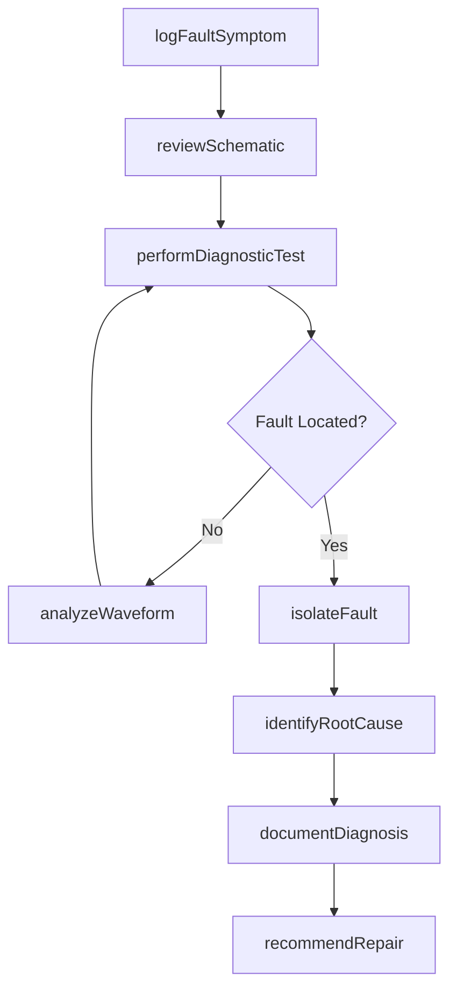
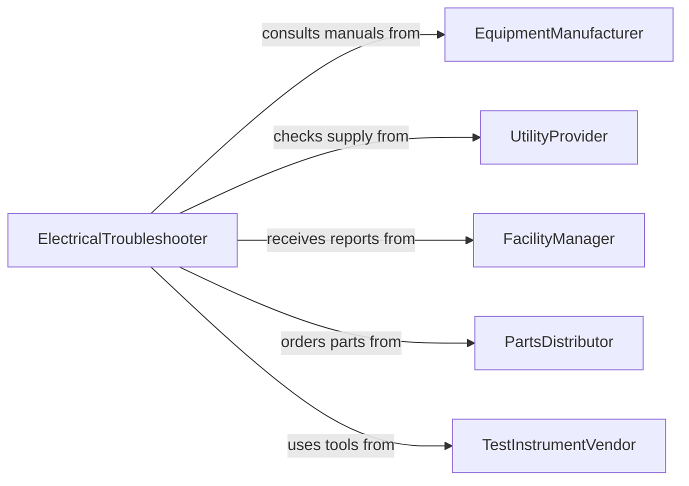

# Inspect Equipment to Locate Electrical Problems

> Business-as-Code definition for inspecting equipment to locate or identify electrical problems. Models the diagnostic workflow from symptom analysis through fault isolation and root cause determination.

## Overview

Inspecting equipment to locate or identify electrical problems involves diagnosing faults in motors, generators, transformers, control circuits, switchgear, and power distribution equipment. Technicians trace electrical paths, measure circuit parameters, analyze waveforms, and use diagnostic tools to isolate the source of malfunctions such as intermittent failures, voltage irregularities, ground faults, and overheating connections. This activity is central to minimizing unplanned downtime in manufacturing, utilities, commercial buildings, and transportation systems.

## Actors

| Actor | Description |
|-------|-------------|
| EquipmentManufacturer | Provides troubleshooting guides, wiring schematics, and technical support |
| UtilityProvider | Supplies incoming power and may be involved when problems originate upstream |
| FacilityManager | Reports equipment issues and authorizes electrical work |
| PartsDistributor | Supplies replacement electrical components, contactors, and fuses |
| InsuranceAdjuster | Evaluates electrical failure claims and requires diagnostic documentation |
| TestInstrumentVendor | Provides and calibrates diagnostic equipment used during inspections |

## Roles

| Role | Description |
|------|-------------|
| ElectricalTroubleshooter | Leads the diagnostic process to isolate and identify electrical faults |
| JourneymanElectrician | Performs hands-on testing, measurement, and fault tracing |
| ControlSystemsTechnician | Diagnoses issues in PLCs, variable frequency drives, and automated controls |
| MaintenanceSupervisor | Prioritizes diagnostic work orders and allocates technician resources |
| PowerQualityAnalyst | Evaluates incoming power conditions that may contribute to equipment problems |

## Entities

| Entity | Description |
|--------|-------------|
| EquipmentAsset | A specific piece of electrical equipment registered in the maintenance system |
| FaultSymptom | An observed behavior indicating an electrical problem such as tripping or overheating |
| DiagnosticReading | A measurement taken during troubleshooting including voltage, current, or resistance |
| FaultIsolationReport | Documentation of the diagnostic process and identified root cause |
| WiringSchematic | A diagram showing electrical connections and component layout |
| WorkOrder | A formal request authorizing diagnostic and repair activities |
| RepairRecommendation | A prescribed corrective action based on diagnostic findings |

## Actions

| Action | Description |
|--------|-------------|
| logFaultSymptom | Record the observed electrical problem symptoms and conditions |
| reviewSchematic | Examine wiring diagrams to understand circuit paths and component relationships |
| performDiagnosticTest | Execute targeted electrical measurements to narrow fault location |
| isolateFault | Determine the specific component, connection, or circuit causing the problem |
| analyzeWaveform | Examine oscilloscope captures to identify signal anomalies |
| identifyRootCause | Determine the underlying reason for the electrical failure |
| documentDiagnosis | Record the complete diagnostic process and findings |
| recommendRepair | Specify the corrective action needed to resolve the electrical problem |

## Events

| Event | Description |
|-------|-------------|
| faultSymptomLogged | An electrical problem has been reported and documented |
| schematicReviewed | Wiring diagrams have been analyzed for the affected equipment |
| diagnosticTestPerformed | Electrical measurements have been taken at target test points |
| faultIsolated | The specific source of the electrical problem has been identified |
| waveformAnalyzed | Signal captures have been examined for anomalies |
| rootCauseIdentified | The underlying cause of the electrical failure has been determined |
| diagnosisDocumented | The complete diagnostic process and findings have been recorded |
| repairRecommended | A corrective action has been prescribed for the identified fault |

## Searches

| Search | Description |
|--------|-------------|
| findOpenFaultReports | List equipment with unresolved electrical problem reports |
| getDiagnosticHistory | Retrieve past diagnostic readings and fault isolations for a piece of equipment |
| findRecurringFaults | Identify equipment experiencing repeated electrical problems |
| getWorkOrdersByPriority | List outstanding diagnostic work orders sorted by urgency |
| findEquipmentByFaultType | Locate equipment exhibiting a specific type of electrical fault |

## Workflow



## Actor Relationships



## Usage

### Calling Actions

```typescript
import { inspectEquipmentToLocateElectricalProblems } from '@headlessly/inspect-equipment-to-locate-electrical-problems'

const diagnostics = inspectEquipmentToLocateElectricalProblems()

// Log an observed fault symptom
const fault = await diagnostics.logFaultSymptom({
  equipmentId: 'MTR-CONV-207',
  symptoms: ['intermittentTripping', 'overheatingContactor'],
  reportedBy: 'operator-klee',
  observedAt: '2026-02-05T08:30:00Z'
})

// Perform targeted diagnostic measurements
const readings = await diagnostics.performDiagnosticTest({
  faultId: fault.id,
  tests: [
    { testPoint: 'motorTerminals', parameter: 'insulationResistance', value: 0.8, unit: 'megaohms' },
    { testPoint: 'contactorCoil', parameter: 'resistance', value: 145, unit: 'ohms' },
    { testPoint: 'overloadRelay', parameter: 'tripCurrent', value: 18.2, unit: 'A' }
  ]
})

// Isolate and identify root cause
await diagnostics.identifyRootCause({
  faultId: fault.id,
  rootCause: 'degradedMotorWindingInsulation',
  evidence: 'Insulation resistance below 1 megaohm at motor terminals',
  affectedComponent: 'motorStatorWinding'
})
```

### Event-Driven Automation

```typescript
// Escalate recurring faults for reliability review
diagnostics.rootCauseIdentified(async ({ equipmentId, rootCause }) => {
  const history = await diagnostics.getDiagnosticHistory({ equipmentId })
  const recentFaults = history.filter(h => h.rootCause === rootCause && h.age < 90)
  if (recentFaults.length >= 3) {
    await notify({
      to: 'reliability-engineering',
      message: `Recurring fault on ${equipmentId}: ${rootCause} reported ${recentFaults.length} times in 90 days`
    })
  }
})

// Auto-create work orders when faults are isolated
diagnostics.faultIsolated(async ({ faultId, equipmentId, component }) => {
  await createWorkOrder({
    type: 'electricalRepair',
    equipmentId,
    faultId,
    component,
    priority: 'high'
  })
})
```
