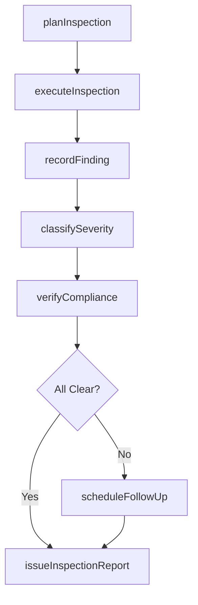
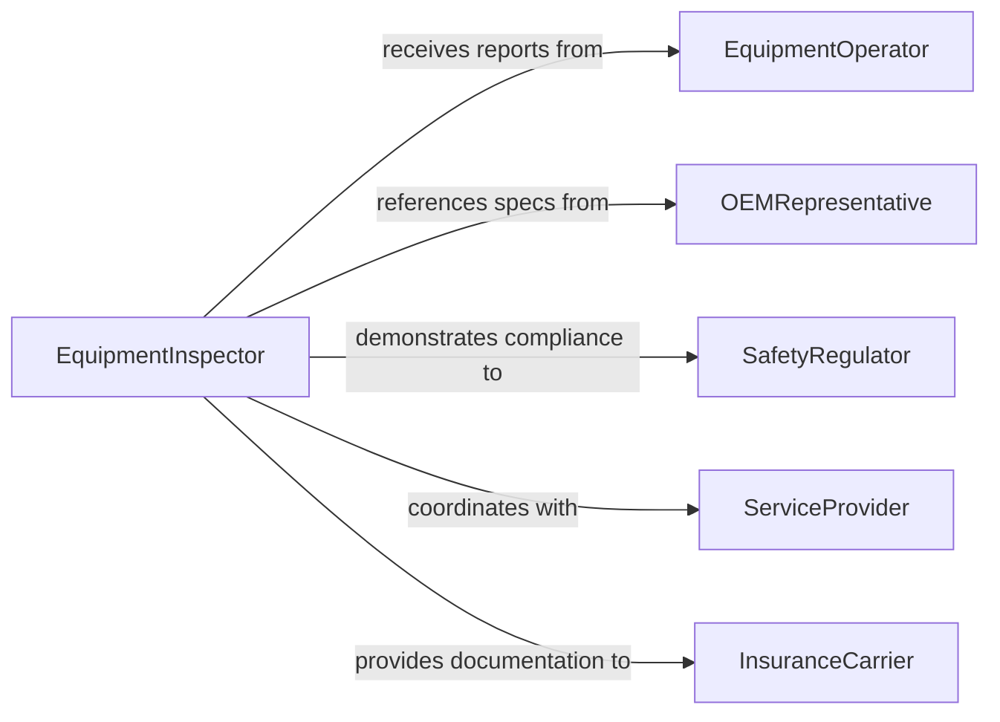

# Inspect Equipment Systems

> Business-as-Code definition for general equipment and systems inspection. Models the broad inspection process from pre-inspection planning through systematic examination, fault detection, compliance verification, and reporting.

## Overview

Equipment and systems inspection encompasses the routine and non-routine examination of mechanical, electrical, hydraulic, and pneumatic systems to verify operational readiness, safety compliance, and performance standards. Inspectors follow standardized checklists, use diagnostic tools, and apply industry knowledge to identify faults, inefficiencies, or degradation before they lead to failures. This generalized inspection activity applies across manufacturing, utilities, transportation, and commercial operations.

## Actors

| Actor | Description |
|-------|-------------|
| EquipmentOperator | Uses equipment daily and reports anomalies or concerns |
| OEMRepresentative | Provides technical specifications and warranty support |
| SafetyRegulator | Enforces equipment safety standards and mandates periodic inspections |
| ServiceProvider | Delivers specialized inspection or diagnostic services |
| InsuranceCarrier | Requires inspection documentation for coverage purposes |

## Roles

| Role | Description |
|------|-------------|
| EquipmentInspector | Performs hands-on examination and testing of equipment and systems |
| OperationsManager | Coordinates inspection schedules with production demands |
| SafetyOfficer | Ensures inspections meet occupational health and safety requirements |
| ReliabilityEngineer | Analyzes inspection data for failure pattern identification |

## Entities

| Entity | Description |
|--------|-------------|
| Equipment | A machine, device, or apparatus subject to inspection |
| System | An integrated group of components functioning together |
| InspectionRecord | Documented results of an equipment or system inspection |
| Checklist | Standardized list of inspection points and criteria |
| Finding | A specific observation, defect, or anomaly discovered during inspection |
| ComplianceStatus | Current regulatory compliance state of the inspected equipment |

## Actions

| Action | Description |
|--------|-------------|
| planInspection | Define scope, schedule, and resources for an equipment inspection |
| executeInspection | Perform the physical examination using checklists and diagnostic tools |
| recordFinding | Document a specific observation or defect identified during inspection |
| classifySeverity | Assign a severity level to each finding (informational, minor, major, critical) |
| verifyCompliance | Check equipment against applicable regulatory and safety standards |
| issueInspectionReport | Generate a formal report summarizing all findings and recommendations |
| scheduleFollowUp | Plan a re-inspection or corrective action verification |

## Events

| Event | Description |
|-------|-------------|
| inspectionPlanned | An equipment inspection has been scoped and scheduled |
| inspectionExecuted | The physical inspection has been completed |
| findingRecorded | A defect or observation has been documented |
| severityClassified | A finding has been assigned a severity level |
| complianceVerified | Equipment has been confirmed as meeting regulatory standards |
| reportIssued | The formal inspection report has been published |
| followUpScheduled | A re-inspection or verification has been planned |

## Searches

| Search | Description |
|--------|-------------|
| findEquipment | List equipment by type, location, status, or last inspection date |
| getFindings | Retrieve findings by severity, equipment, or date range |
| getComplianceStatus | Check compliance status of equipment or systems |
| getInspectionSchedule | Query upcoming and overdue inspections |

## Workflow



## Actor Relationships



## Usage

### Calling Actions

```typescript
import { inspectEquipmentSystems } from '@headlessly/inspect-equipment-systems'

const inspector = inspectEquipmentSystems()

// Plan an inspection
const plan = await inspector.planInspection({
  equipment: ['Conveyor-Line-4', 'Hydraulic-Press-7', 'Cooling-Tower-2'],
  checklist: 'quarterly-mechanical-v2',
  scheduledDate: '2026-03-20',
  assignee: 'inspector-martinez'
})

// Execute inspection and record findings
await inspector.executeInspection({
  planId: plan.id,
  findings: [
    { equipment: 'Conveyor-Line-4', item: 'belt-tension', status: 'pass' },
    { equipment: 'Hydraulic-Press-7', item: 'hydraulic-lines', status: 'fail', notes: 'Hairline crack on supply line' }
  ]
})

// Classify severity of the hydraulic line issue
await inspector.classifySeverity({
  findingId: 'FND-0042',
  severity: 'major',
  recommendedAction: 'Replace supply line before next production cycle'
})
```

### Event-Driven Automation

```typescript
// Escalate critical findings immediately
inspector.severityClassified(async ({ findingId, severity, equipment }) => {
  if (severity === 'critical') {
    await notify({
      to: 'operations-manager',
      message: `Critical finding ${findingId} on ${equipment} - immediate action required`
    })
  }
})

// Auto-lock equipment on compliance failure
inspector.complianceVerified(async ({ equipment, compliant }) => {
  if (!compliant) {
    await lockout.apply({
      equipment,
      reason: 'Failed compliance inspection',
      until: 'corrective-action-complete'
    })
  }
})
```
