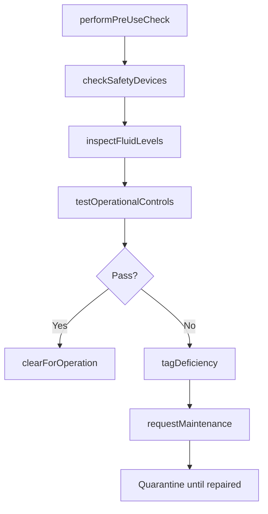
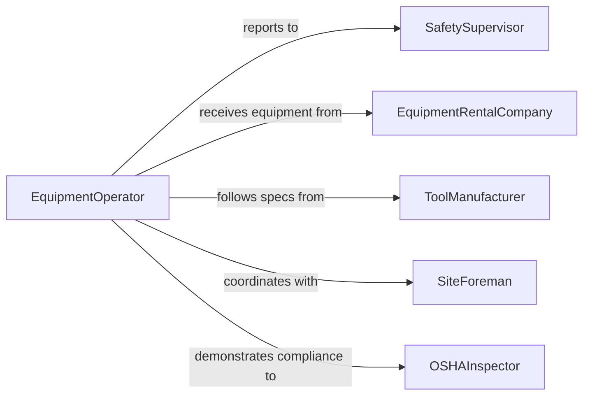

# Inspect Equipment Tools Be Used

> Business-as-Code definition for inspecting equipment and tools used in construction and excavation. Models the pre-use inspection process from daily walk-around checks through operational readiness verification, safety compliance, and clearance to operate.

## Overview

Inspecting construction and excavation equipment and tools ensures that heavy machinery, power tools, rigging, and hand tools are safe and operationally ready before use on job sites. Pre-use inspections are required by OSHA and industry standards to prevent equipment failures that could cause injuries, project delays, or property damage. Inspectors check structural integrity, fluid levels, safety devices, wear components, and operational controls according to manufacturer and regulatory requirements.

## Actors

| Actor | Description |
|-------|-------------|
| EquipmentRentalCompany | Provides leased equipment and is responsible for delivery condition |
| ToolManufacturer | Sets inspection standards, maintenance intervals, and safety specifications |
| OSHAInspector | Enforces workplace safety standards for construction equipment |
| GeneralContractor | Oversees job site operations and equipment deployment |
| SubcontractorCrew | Operates equipment and relies on inspection clearance |

## Roles

| Role | Description |
|------|-------------|
| EquipmentOperator | Performs daily pre-use inspections and operates the machinery |
| SafetySupervisor | Reviews inspection records and authorizes equipment for use |
| EquipmentManager | Manages the fleet, maintenance schedules, and tool inventory |
| SiteForeman | Coordinates equipment deployment and work assignments |

## Entities

| Entity | Description |
|--------|-------------|
| HeavyEquipment | Large machinery such as excavators, cranes, bulldozers, and loaders |
| PowerTool | Motorized hand tools such as saws, drills, and grinders |
| PreUseChecklist | Standardized inspection form for a specific equipment type |
| OperatorClearance | Authorization confirming equipment is safe to operate |
| DeficiencyTag | A tag or lockout applied to equipment that fails inspection |
| MaintenanceRequest | A service request generated from inspection findings |

## Actions

| Action | Description |
|--------|-------------|
| performPreUseCheck | Execute a standardized pre-use inspection on equipment or tools |
| checkSafetyDevices | Verify that guards, alarms, backup cameras, and lockouts function properly |
| inspectFluidLevels | Check hydraulic fluid, engine oil, coolant, and fuel levels |
| testOperationalControls | Verify that steering, braking, lifting, and emergency controls respond correctly |
| tagDeficiency | Apply a deficiency tag to equipment that fails inspection criteria |
| clearForOperation | Issue clearance authorizing equipment for use on the job site |
| requestMaintenance | Submit a maintenance request for identified issues |

## Events

| Event | Description |
|-------|-------------|
| preUseCheckCompleted | A daily pre-use inspection has been performed and recorded |
| safetyDevicesVerified | All safety systems have been confirmed functional |
| deficiencyTagged | Equipment has been tagged as unfit for operation |
| equipmentCleared | Equipment has been authorized for use on the job site |
| maintenanceRequested | A service request has been submitted for a deficient item |
| controlsTestPassed | Operational controls have been verified as responsive |
| equipmentQuarantined | Equipment with critical defects has been removed from service |

## Searches

| Search | Description |
|--------|-------------|
| findEquipment | List equipment by type, location, certification status, or assignment |
| getInspectionLogs | Retrieve pre-use inspection records by equipment, operator, or date |
| getDeficiencies | Query active deficiency tags by severity or equipment type |
| getClearedEquipment | Find equipment currently authorized for operation at a specific site |

## Workflow



## Actor Relationships



## Usage

### Calling Actions

```typescript
import { inspectEquipmentToolsBeUsed } from '@headlessly/inspect-equipment-tools-be-used'

const tools = inspectEquipmentToolsBeUsed()

// Perform daily pre-use check on an excavator
const check = await tools.performPreUseCheck({
  equipment: 'CAT-320F-Excavator',
  operator: 'operator-johnson',
  site: 'Highway-101-Bridge-Project',
  checklist: 'excavator-daily-v4'
})

// Check safety devices
await tools.checkSafetyDevices({
  checkId: check.id,
  items: [
    { device: 'backup-camera', status: 'pass' },
    { device: 'swing-alarm', status: 'pass' },
    { device: 'boom-limit-switch', status: 'fail', notes: 'Not engaging at max extension' }
  ]
})

// Tag the deficiency and request maintenance
await tools.tagDeficiency({
  equipment: 'CAT-320F-Excavator',
  deficiency: 'Boom limit switch not engaging',
  severity: 'critical',
  operationAllowed: false
})
```

### Event-Driven Automation

```typescript
// Halt operations when critical deficiency is found
tools.deficiencyTagged(async ({ equipment, severity, site }) => {
  if (severity === 'critical') {
    await notify({
      to: 'safety-supervisor',
      message: `${equipment} at ${site} has a critical deficiency - operation prohibited`
    })
  }
})

// Log clearance for compliance tracking
tools.equipmentCleared(async ({ equipment, operator, site }) => {
  await complianceLog.record({
    event: 'pre-use-clearance',
    equipment,
    operator,
    site,
    timestamp: new Date()
  })
})
```
