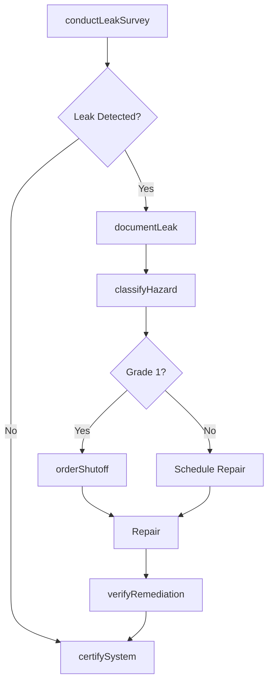
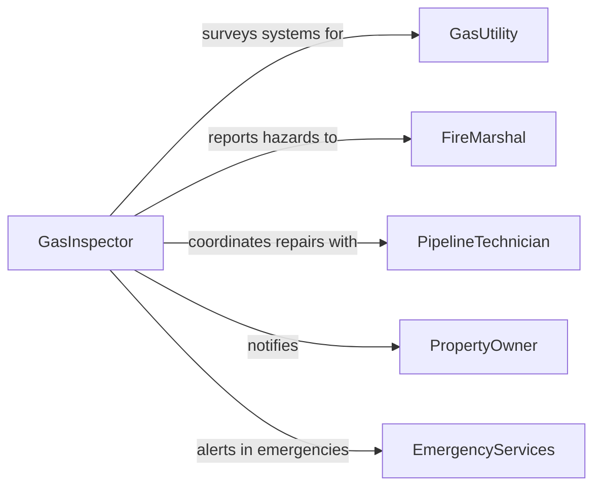

# Inspect Gas Systems Components Identify

> Business-as-Code definition for inspecting gas systems and components to identify leaks and potential hazards. Models the inspection lifecycle from leak detection surveys through pressure testing, hazard classification, and remediation verification.

## Overview

Gas system inspection involves examining pipelines, valves, regulators, meters, fittings, and appliance connections to detect leaks, corrosion, improper installations, and other hazards that could lead to explosions, fires, or toxic exposure. Inspectors use combustible gas indicators, pressure gauges, ultrasonic leak detectors, and soap-bubble tests to identify compromised components. This safety-critical activity is governed by codes such as NFPA 54 and DOT pipeline safety regulations.

## Actors

| Actor | Description |
|-------|-------------|
| GasUtility | Operates distribution infrastructure and responds to emergency leaks |
| PipelineOperator | Maintains transmission pipelines and compressor stations |
| FireMarshal | Enforces gas safety codes and investigates incidents |
| EquipmentManufacturer | Provides gas appliances, valves, and regulator specifications |
| PropertyOwner | Responsible for gas systems within private buildings or facilities |
| EmergencyServices | Responds to gas leak emergencies and evacuations |

## Roles

| Role | Description |
|------|-------------|
| GasInspector | Conducts leak surveys and system assessments using detection instruments |
| SafetyEngineer | Evaluates hazard levels and recommends corrective actions |
| PipelineTechnician | Performs hands-on testing and repairs on gas infrastructure |
| ComplianceOfficer | Ensures gas installations meet code requirements and maintain certifications |

## Entities

| Entity | Description |
|--------|-------------|
| GasSystem | A network of pipes, regulators, and appliances carrying natural gas or propane |
| LeakSurvey | A systematic inspection event using detection instruments |
| LeakReport | Documentation of a detected gas leak including location and severity |
| PressureTest | A controlled pressurization test to verify system integrity |
| HazardClassification | The risk rating assigned to a detected leak (Grade 1, 2, or 3) |
| RemediationRecord | Documentation of corrective actions taken to resolve a hazard |

## Actions

| Action | Description |
|--------|-------------|
| conductLeakSurvey | Perform a systematic survey using combustible gas indicators |
| performPressureTest | Apply controlled pressure to piping to verify integrity |
| classifyHazard | Assign a hazard grade to a detected leak based on severity and location |
| documentLeak | Record leak details including location, concentration, and environmental factors |
| orderShutoff | Issue an emergency or planned shutoff of gas supply |
| verifyRemediation | Confirm that corrective repairs have resolved the identified hazard |
| certifySystem | Issue compliance certification for an inspected gas system |

## Events

| Event | Description |
|-------|-------------|
| leakSurveyCompleted | A gas leak detection survey has been performed |
| leakDetected | A gas leak has been identified at a specific location |
| hazardClassified | A detected leak has been assigned a severity grade |
| pressureTestPassed | A piping section has passed an integrity pressure test |
| pressureTestFailed | A piping section has failed an integrity pressure test |
| shutoffOrdered | A gas supply shutoff has been initiated |
| remediationVerified | Corrective action has been confirmed effective |

## Searches

| Search | Description |
|--------|-------------|
| findGasSystems | List gas systems by location, type, or certification status |
| getLeakHistory | Retrieve past leak reports for a system or geographic area |
| getPendingHazards | Find unresolved hazards by grade or age |
| getSurveySchedule | Query upcoming and overdue leak survey schedules |

## Workflow



## Actor Relationships



## Usage

### Calling Actions

```typescript
import { inspectGasSystemsComponentsIdentify } from '@headlessly/inspect-gas-systems-components-identify'

const gas = inspectGasSystemsComponentsIdentify()

// Conduct a leak survey on a commercial building
const survey = await gas.conductLeakSurvey({
  location: '450 Industrial Blvd',
  system: 'natural-gas-distribution',
  instrument: 'combustible-gas-indicator',
  sections: ['main-service-line', 'interior-piping', 'appliance-connections']
})

// Document a detected leak
const leak = await gas.documentLeak({
  surveyId: survey.id,
  location: 'Meter riser connection',
  concentration: 2.5,
  unit: 'percent-LEL',
  environmentalFactors: ['enclosed-space', 'near-ignition-source']
})

// Classify the hazard
await gas.classifyHazard({
  leakId: leak.id,
  grade: 1,
  rationale: 'Leak in enclosed space near ignition source requires immediate action'
})
```

### Event-Driven Automation

```typescript
// Emergency response for Grade 1 leaks
gas.hazardClassified(async ({ leakId, grade, location }) => {
  if (grade === 1) {
    await gas.orderShutoff({ leakId, type: 'emergency' })
    await notify({
      to: 'emergency-services',
      message: `Grade 1 gas leak at ${location} - immediate shutoff ordered`
    })
  }
})

// Schedule follow-up surveys after remediation
gas.remediationVerified(async ({ systemId, leakId }) => {
  await gas.conductLeakSurvey({
    systemId,
    type: 'post-remediation-verification',
    linkedLeak: leakId,
    scheduledDate: addDays(new Date(), 30)
  })
})
```
