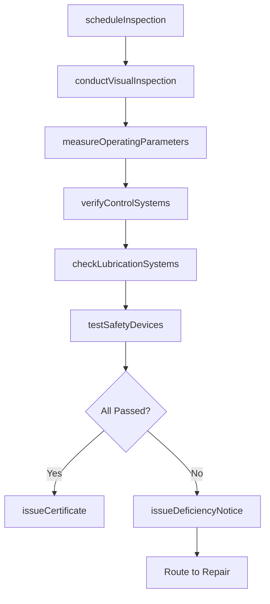
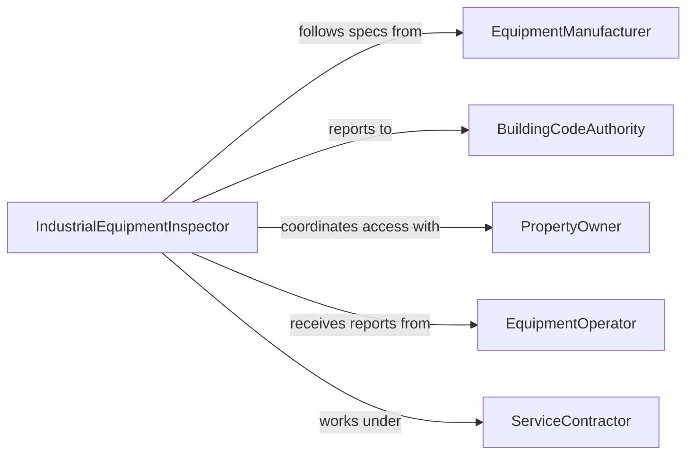

# Inspect Industrial or Commercial Equipment

> Business-as-Code definition for inspecting industrial and commercial equipment to ensure proper operation. Models the inspection process for heavy-duty machinery, HVAC systems, refrigeration units, elevators, and commercial processing equipment.

## Overview

Inspecting industrial or commercial equipment involves examining boilers, compressors, conveyors, elevators, escalators, HVAC systems, commercial refrigeration units, industrial ovens, and large-scale processing machinery to confirm they operate within manufacturer specifications and regulatory requirements. Inspectors verify operating pressures, temperatures, vibration levels, safety interlocks, and control system responses. This activity ensures equipment reliability in factories, warehouses, commercial buildings, hospitals, and retail environments where equipment failure can cause safety hazards, regulatory violations, or significant business disruption.

## Actors

| Actor | Description |
|-------|-------------|
| EquipmentManufacturer | Provides operating specifications, service bulletins, and warranty terms |
| BuildingCodeAuthority | Enforces mechanical, electrical, and fire code requirements for commercial equipment |
| PropertyOwner | Authorizes inspections and funds equipment maintenance |
| EquipmentOperator | Runs equipment daily and reports performance anomalies |
| ServiceContractor | Provides specialized inspection and maintenance under service agreements |
| InspectionAuthority | Certified third-party inspector for boilers, elevators, and pressure vessels |

## Roles

| Role | Description |
|------|-------------|
| IndustrialEquipmentInspector | Conducts thorough examination of commercial and industrial machinery |
| FacilitiesEngineer | Manages building systems and coordinates equipment inspection programs |
| MaintenancePlanner | Schedules inspections and aligns them with production or occupancy requirements |
| ComplianceOfficer | Ensures all inspections meet regulatory and insurance requirements |
| FieldServiceTechnician | Performs on-site inspections, adjustments, and minor repairs |

## Entities

| Entity | Description |
|--------|-------------|
| IndustrialEquipment | A commercial or industrial machine registered for periodic inspection |
| OperatingParameter | A measurable value such as pressure, temperature, or vibration level |
| InspectionReport | Formal documentation of findings, measurements, and compliance status |
| ServiceAgreement | A contract defining inspection scope, frequency, and responsible parties |
| DeficiencyNotice | A formal notification of equipment not meeting operational or safety standards |
| ComplianceCertificate | Documentation confirming equipment meets applicable codes and standards |
| PartsList | Components requiring replacement identified during inspection |

## Actions

| Action | Description |
|--------|-------------|
| scheduleInspection | Plan an inspection based on regulatory intervals or service agreements |
| conductVisualInspection | Examine equipment for visible wear, leaks, corrosion, and damage |
| measureOperatingParameters | Record pressures, temperatures, vibration, and noise levels |
| verifyControlSystems | Test thermostats, pressure switches, safety valves, and control logic |
| checkLubricationSystems | Inspect oil levels, grease points, and lubrication delivery mechanisms |
| testSafetyDevices | Verify operation of relief valves, limit switches, and emergency shutoffs |
| issueDeficiencyNotice | Formally document equipment that does not meet required standards |
| issueCertificate | Confirm equipment passes all inspection criteria and approve for operation |

## Events

| Event | Description |
|-------|-------------|
| inspectionScheduled | An equipment inspection has been placed on the calendar |
| visualInspectionCompleted | Physical examination of equipment has been finished |
| operatingParametersMeasured | Key operating values have been recorded and compared to specifications |
| controlSystemsVerified | Automated controls and safety logic have been tested |
| lubricationChecked | Lubrication systems have been examined and status documented |
| safetyDevicesTested | Relief valves and emergency mechanisms have been verified |
| deficiencyNoticeIssued | Equipment has been formally cited for failing to meet standards |
| certificateIssued | Equipment has been approved for continued operation |

## Searches

| Search | Description |
|--------|-------------|
| findEquipmentDueForInspection | List industrial or commercial equipment with upcoming inspection dates |
| getInspectionHistory | Retrieve past inspection reports for a specific piece of equipment |
| findOpenDeficiencies | Locate equipment with unresolved deficiency notices |
| getEquipmentByFacility | List all inspectable equipment at a specific location |
| findExpiringCertificates | Identify equipment whose compliance certificates are nearing expiration |

## Workflow



## Actor Relationships



## Usage

### Calling Actions

```typescript
import { inspectIndustrialOrCommercialEquipment } from '@headlessly/inspect-industrial-or-commercial-equipment'

const inspector = inspectIndustrialOrCommercialEquipment()

// Schedule an annual boiler inspection
const inspection = await inspector.scheduleInspection({
  equipmentId: 'BOILER-MAIN-001',
  equipmentType: 'steamBoiler',
  facilityId: 'plant-west',
  regulatoryInterval: 'annual',
  assignedTo: 'inspector-certified-dpatel'
})

// Measure operating parameters
await inspector.measureOperatingParameters({
  inspectionId: inspection.id,
  parameters: [
    { name: 'steamPressure', value: 148, unit: 'psi', maxAllowed: 150 },
    { name: 'waterTemperature', value: 365, unit: 'fahrenheit' },
    { name: 'stackTemperature', value: 425, unit: 'fahrenheit' },
    { name: 'vibration', value: 2.8, unit: 'mm/s' }
  ]
})

// Test safety devices
await inspector.testSafetyDevices({
  inspectionId: inspection.id,
  devices: [
    { name: 'pressureReliefValve', setPoint: 155, unit: 'psi', actuated: true },
    { name: 'lowWaterCutoff', triggered: true },
    { name: 'flameFailureSafeguard', responseTime: 4, unit: 'seconds', passed: true }
  ]
})
```

### Event-Driven Automation

```typescript
// Alert facility management when deficiency notices are issued
inspector.deficiencyNoticeIssued(async ({ equipmentId, deficiencyType, severity }) => {
  await notify({
    to: 'facilities-management',
    priority: severity === 'critical' ? 'urgent' : 'normal',
    message: `Deficiency on ${equipmentId}: ${deficiencyType} (${severity})`
  })
})

// Auto-renew inspection schedule when certificate is issued
inspector.certificateIssued(async ({ equipmentId, certificateExpiry }) => {
  await inspector.scheduleInspection({
    equipmentId,
    scheduledDate: certificateExpiry,
    inspectionType: 'recertification'
  })
})
```
