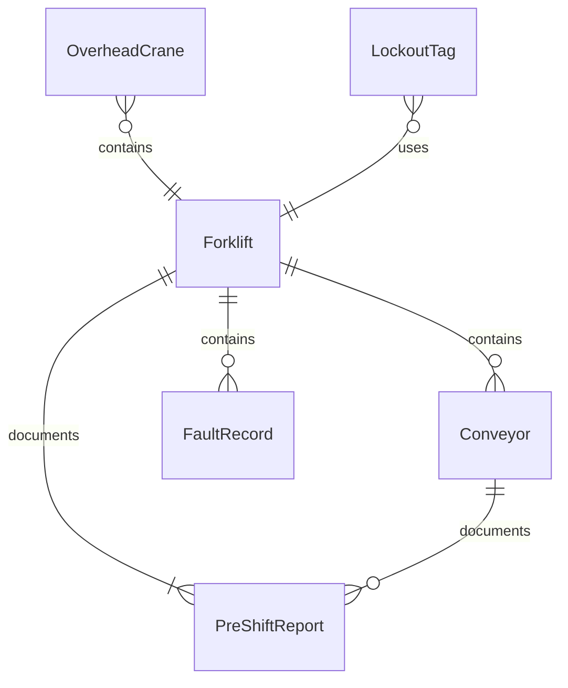
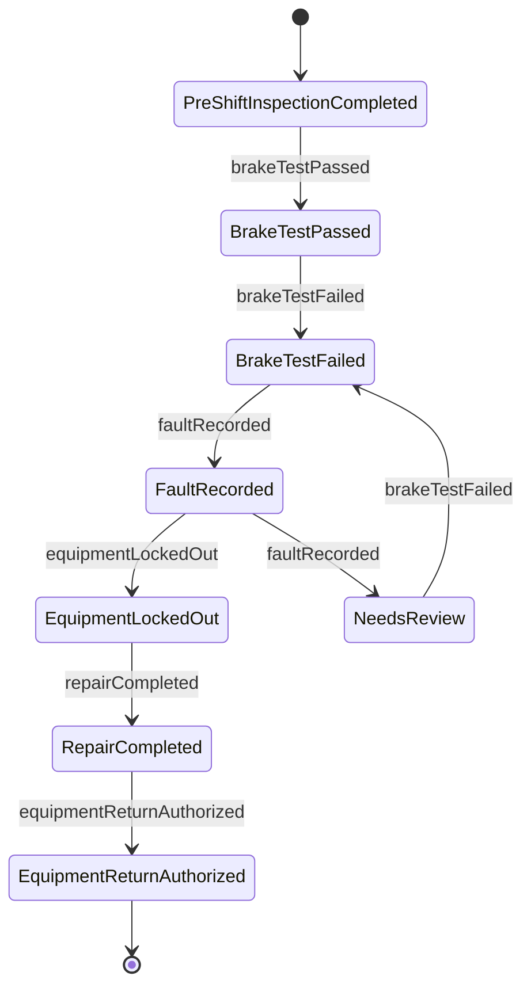
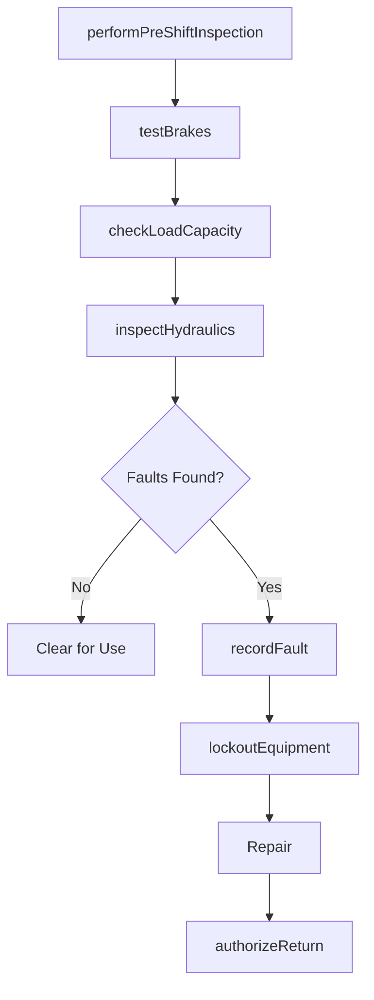
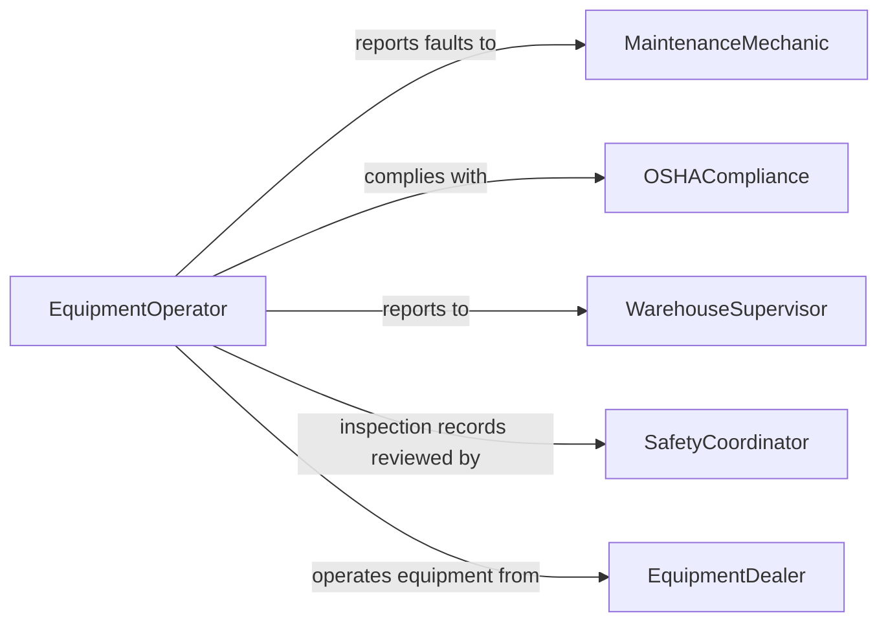

# Inspect Material-moving Equipment Detect Problems

> Business-as-Code definition for inspecting material-moving equipment to detect problems. Models the inspection process for forklifts, conveyors, cranes, hoists, and other material handling equipment from pre-shift checks through fault detection, hazard assessment, and return-to-service authorization.

## Overview

Material-moving equipment inspection covers the systematic examination of forklifts, pallet jacks, overhead cranes, hoists, conveyor systems, and automated guided vehicles to detect mechanical failures, safety hazards, and operational deficiencies. OSHA requires daily pre-shift inspections for powered industrial trucks, and overhead cranes must be inspected at regular intervals per ASME B30 standards. Inspectors evaluate structural components, hydraulic systems, braking mechanisms, load-handling attachments, and warning devices.

## Actors

| Actor | Description |
|-------|-------------|
| EquipmentDealer | Supplies material-handling equipment and provides warranty service |
| OSHACompliance | Enforces workplace safety regulations for material-moving equipment |
| InsuranceProvider | Requires inspection records for liability coverage |
| ThirdPartyInspector | Conducts annual or periodic certified inspections (e.g., crane load tests) |
| WarehouseClient | Depends on material-moving equipment for order fulfillment operations |

## Roles

| Role | Description |
|------|-------------|
| EquipmentOperator | Performs daily pre-shift inspections and reports anomalies |
| MaintenanceMechanic | Diagnoses and repairs identified equipment problems |
| WarehouseSupervisor | Manages equipment availability and enforces inspection compliance |
| SafetyCoordinator | Audits inspection records and manages the lockout/tagout program |

## Entities

| Entity | Description |
|--------|-------------|
| Forklift | A powered industrial truck used for lifting and transporting materials |
| Conveyor | A belt, roller, or chain system for continuous material movement |
| OverheadCrane | A crane system mounted on overhead rails for heavy lifting |
| PreShiftReport | Documented results of a daily operator pre-shift inspection |
| FaultRecord | A specific mechanical, electrical, or structural problem identified |
| LockoutTag | A safety tag applied to equipment removed from service |

## Actions

| Action | Description |
|--------|-------------|
| performPreShiftInspection | Execute the daily pre-shift checklist for material-moving equipment |
| testBrakes | Verify that service and parking brakes engage and hold properly |
| checkLoadCapacity | Inspect load-bearing components and verify rated capacity markings |
| inspectHydraulics | Examine hydraulic lines, cylinders, and fluid levels for leaks or degradation |
| recordFault | Document a specific equipment deficiency with details and severity |
| lockoutEquipment | Remove defective equipment from service using lockout/tagout procedures |
| authorizeReturn | Clear repaired equipment for return to active service |

## Events

| Event | Description |
|-------|-------------|
| preShiftInspectionCompleted | A daily pre-shift check has been performed and logged |
| brakeTestPassed | Braking systems have been verified as functional |
| brakeTestFailed | Braking systems did not meet operational standards |
| faultRecorded | An equipment problem has been identified and documented |
| equipmentLockedOut | Defective equipment has been removed from service |
| repairCompleted | A maintenance repair has been finished on locked-out equipment |
| equipmentReturnAuthorized | Repaired equipment has been cleared for active use |

## Searches

| Search | Description |
|--------|-------------|
| findEquipment | List material-moving equipment by type, location, or service status |
| getFaultHistory | Retrieve fault records by equipment, type, or date range |
| getLockedOutEquipment | Find all equipment currently under lockout/tagout |
| getInspectionCompliance | Check pre-shift inspection completion rates by operator or shift |

## Entity Relationships



## State Diagram



## Workflow



## Actor Relationships



## Usage

### Calling Actions

```typescript
import { inspectMaterialMovingEquipmentDetectProblems } from '@headlessly/inspect-material-moving-equipment-detect-problems'

const equipment = inspectMaterialMovingEquipmentDetectProblems()

// Perform daily pre-shift inspection on a forklift
const report = await equipment.performPreShiftInspection({
  equipment: 'Toyota-8FGCU25-Forklift',
  operator: 'operator-chen',
  shift: 'day',
  location: 'Warehouse-A'
})

// Test brakes
await equipment.testBrakes({
  reportId: report.id,
  serviceBrake: 'pass',
  parkingBrake: 'pass',
  notes: 'Both brakes responsive under load'
})

// Record a hydraulic fault
await equipment.recordFault({
  reportId: report.id,
  component: 'mast-hydraulic-cylinder',
  description: 'Slow drift when mast fully raised',
  severity: 'major'
})
```

### Event-Driven Automation

```typescript
// Auto-lockout on critical faults
equipment.faultRecorded(async ({ equipment: equipId, severity, component }) => {
  if (severity === 'critical') {
    await equipment.lockoutEquipment({
      equipment: equipId,
      reason: `Critical fault: ${component}`,
      lockoutType: 'immediate'
    })
  }
})

// Notify supervisor when equipment is returned to service
equipment.equipmentReturnAuthorized(async ({ equipment: equipId, repairedBy }) => {
  await notify({
    to: 'warehouse-supervisor',
    message: `${equipId} cleared for service after repair by ${repairedBy}`
  })
})
```
