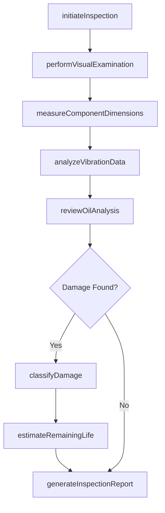
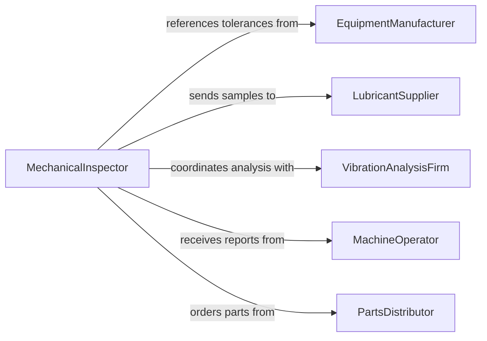

# Inspect Mechanical Equipment to Locate Damage or Wear

> Business-as-Code definition for inspecting mechanical equipment to locate damage, defects, or wear. Models the diagnostic inspection process from vibration analysis through component measurement and wear trend tracking.

## Overview

Inspecting mechanical equipment to locate damage, defects, or wear involves examining gears, bearings, shafts, seals, belts, chains, couplings, and structural components for signs of degradation that may lead to failure. Inspectors use techniques including visual examination, vibration analysis, ultrasonic testing, oil analysis, and precision measurement with micrometers and dial indicators. This activity supports predictive and condition-based maintenance strategies across manufacturing, mining, power generation, and transportation industries where mechanical failure can result in costly downtime, safety incidents, or cascading equipment damage.

## Actors

| Actor | Description |
|-------|-------------|
| EquipmentManufacturer | Provides wear limits, tolerance specifications, and replacement part numbers |
| LubricantSupplier | Supplies oils and greases and may perform oil analysis services |
| VibrationAnalysisFirm | Conducts specialized vibration monitoring and bearing condition assessment |
| MachineOperator | Reports unusual noises, vibrations, or performance changes during operation |
| PartsDistributor | Furnishes replacement bearings, seals, belts, and mechanical components |
| InspectionCalibrationLab | Certifies precision measurement instruments used during inspections |

## Roles

| Role | Description |
|------|-------------|
| MechanicalInspector | Conducts detailed examination of mechanical components for damage and wear |
| PredictiveMaintenanceAnalyst | Interprets vibration, oil analysis, and trend data to assess equipment condition |
| MaintenanceMechanic | Performs hands-on disassembly, inspection, and component measurement |
| ReliabilityEngineer | Analyzes wear patterns to optimize maintenance intervals and component selection |
| MaintenancePlanner | Schedules inspections and coordinates resource availability |

## Entities

| Entity | Description |
|--------|-------------|
| MechanicalComponent | A specific part such as a bearing, gear, or shaft subject to wear inspection |
| WearMeasurement | A recorded dimension or condition value compared against manufacturer tolerances |
| VibrationReading | Frequency and amplitude data from accelerometer-based monitoring |
| OilAnalysisReport | Laboratory results showing particle counts, viscosity, and contaminant levels |
| DamageClassification | A categorization of the type and severity of observed damage or wear |
| ComponentLifeEstimate | A projected remaining service life based on current wear trends |
| InspectionWorkOrder | A formal authorization to perform mechanical equipment inspection |

## Actions

| Action | Description |
|--------|-------------|
| initiateInspection | Begin a planned or condition-triggered mechanical inspection |
| performVisualExamination | Check for visible cracks, corrosion, deformation, and surface damage |
| measureComponentDimensions | Use precision instruments to check wear against tolerance limits |
| analyzeVibrationData | Evaluate frequency spectra to identify bearing, gear, or imbalance issues |
| reviewOilAnalysis | Interpret lubricant condition reports for wear metal and contamination trends |
| classifyDamage | Categorize observed damage by type, severity, and affected component |
| estimateRemainingLife | Project how long a component can continue operating before replacement |
| generateInspectionReport | Compile findings, measurements, and recommendations into a formal report |

## Events

| Event | Description |
|-------|-------------|
| inspectionInitiated | A mechanical inspection has been started |
| visualExaminationCompleted | Physical examination for visible damage has been finished |
| componentMeasured | A mechanical component has been measured and compared to tolerances |
| wearLimitExceeded | A component measurement has fallen outside acceptable wear tolerances |
| vibrationAnomalyDetected | Abnormal vibration patterns have been identified |
| oilAnalysisReviewed | Lubricant condition data has been evaluated |
| damageClassified | Observed damage has been categorized by type and severity |
| inspectionReportGenerated | A formal report of findings and recommendations has been completed |

## Searches

| Search | Description |
|--------|-------------|
| findComponentsNearWearLimit | List mechanical components approaching manufacturer-specified wear limits |
| getWearTrends | Retrieve measurement history showing dimensional changes over time |
| findEquipmentWithVibrationAlerts | Locate machinery with active vibration anomaly flags |
| getOilAnalysisHistory | Retrieve lubricant analysis reports for a specific machine |
| findEquipmentByDamageType | List equipment with a specific category of mechanical damage |

## Workflow



## Actor Relationships



## Usage

### Calling Actions

```typescript
import { inspectMechanicalEquipmentToLocateDamageOrWear } from '@headlessly/inspect-mechanical-equipment-to-locate-damage-or-wear'

const inspector = inspectMechanicalEquipmentToLocateDamageOrWear()

// Initiate inspection of a gearbox
const inspection = await inspector.initiateInspection({
  equipmentId: 'GEARBOX-LINE3-002',
  trigger: 'vibrationAlert',
  assignedTo: 'mech-rbrown'
})

// Measure component dimensions against tolerances
await inspector.measureComponentDimensions({
  inspectionId: inspection.id,
  measurements: [
    { component: 'inputShaftBearing', dimension: 'innerDiameter', measured: 50.08, nominal: 50.00, tolerance: 0.05, unit: 'mm' },
    { component: 'outputGear', dimension: 'toothThickness', measured: 6.72, nominal: 7.00, tolerance: 0.15, unit: 'mm' },
    { component: 'sealGroove', dimension: 'width', measured: 5.15, nominal: 5.00, tolerance: 0.10, unit: 'mm' }
  ]
})

// Classify damage and estimate remaining life
await inspector.classifyDamage({
  inspectionId: inspection.id,
  findings: [
    { component: 'outputGear', damageType: 'pittingWear', severity: 'moderate', coverage: '15percent' }
  ]
})

await inspector.estimateRemainingLife({
  inspectionId: inspection.id,
  component: 'outputGear',
  currentWear: 0.28,
  wearLimit: 0.50,
  wearRate: 0.04,
  wearRateUnit: 'mm/1000hours',
  estimatedHoursRemaining: 5500
})
```

### Event-Driven Automation

```typescript
// Alert maintenance when wear limits are exceeded
inspector.wearLimitExceeded(async ({ equipmentId, component, measured, limit }) => {
  await notify({
    to: 'maintenance-planning',
    priority: 'high',
    message: `${component} on ${equipmentId}: measured ${measured} exceeds limit ${limit}`
  })
})

// Auto-schedule replacement when remaining life is low
inspector.damageClassified(async ({ equipmentId, component, severity }) => {
  if (severity === 'severe') {
    await createWorkOrder({
      type: 'componentReplacement',
      equipmentId,
      component,
      priority: 'urgent'
    })
  }
})
```
