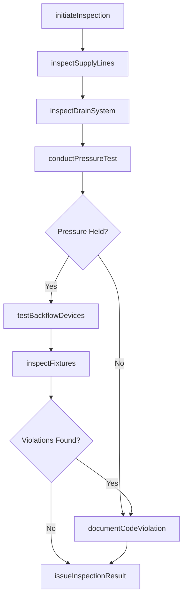
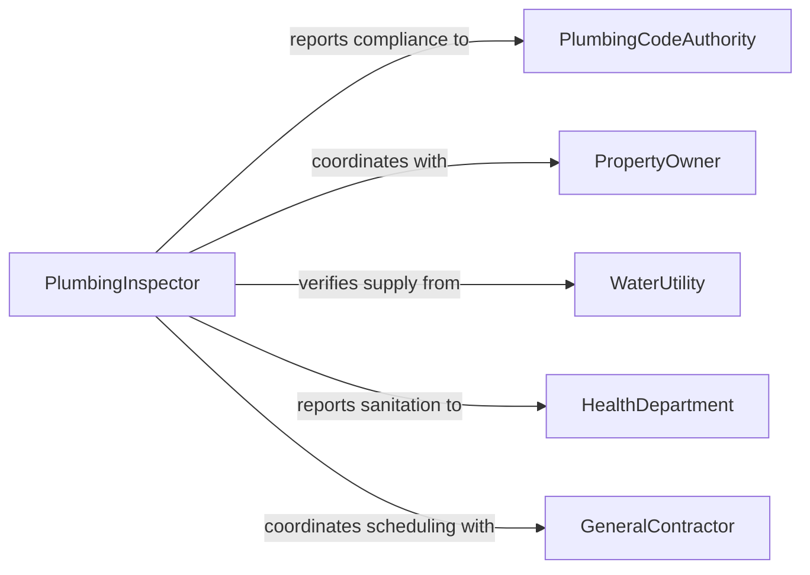

# Inspect Plumbing Systems or Fixtures

> Business-as-Code definition for inspecting plumbing systems and fixtures. Models the inspection workflow from visual pipe assessment through pressure testing, leak detection, and code compliance verification.

## Overview

Inspecting plumbing systems or fixtures involves examining water supply lines, drain-waste-vent piping, gas lines, backflow prevention devices, water heaters, fixtures, and sewer connections to verify proper operation and code compliance. Inspectors check for leaks, corrosion, improper slopes, inadequate venting, cross-connections, and insufficient water pressure. The activity applies to new construction inspections, periodic commercial building assessments, residential property evaluations, and industrial facility maintenance programs. Findings inform repair priorities and ensure public health protection through proper sanitation infrastructure.

## Actors

| Actor | Description |
|-------|-------------|
| PlumbingCodeAuthority | Enforces Uniform Plumbing Code or International Plumbing Code requirements |
| PropertyOwner | Authorizes inspections and is responsible for maintaining plumbing systems |
| WaterUtility | Supplies potable water and may require backflow prevention certification |
| HealthDepartment | Oversees sanitation requirements for food service and healthcare facilities |
| GeneralContractor | Coordinates plumbing inspections during construction or renovation projects |
| FixtureManufacturer | Provides specifications, installation guides, and warranty requirements |

## Roles

| Role | Description |
|------|-------------|
| PlumbingInspector | Conducts official plumbing system examinations and issues compliance findings |
| MasterPlumber | Performs detailed assessments and interprets complex plumbing system conditions |
| BuildingInspector | Evaluates plumbing as part of broader building condition assessments |
| FacilitiesMaintenanceLead | Manages ongoing plumbing inspection schedules for commercial properties |
| BackflowPreventionTester | Certified specialist who tests and certifies backflow prevention assemblies |

## Entities

| Entity | Description |
|--------|-------------|
| PlumbingSystem | The complete network of pipes, fixtures, and devices in a building or facility |
| Fixture | A sink, toilet, shower, faucet, or other end-use plumbing device |
| PipeSegment | A defined section of piping with material type, diameter, and location |
| PressureTestResult | Recorded values from hydrostatic or air pressure testing of pipe systems |
| LeakDetection | Documentation of identified leaks including location, severity, and cause |
| BackflowDevice | A cross-connection control assembly requiring periodic testing and certification |
| InspectionReport | Formal record of plumbing findings, code citations, and corrective requirements |

## Actions

| Action | Description |
|--------|-------------|
| initiateInspection | Begin a plumbing system inspection for a specific property or project phase |
| inspectSupplyLines | Examine water supply piping for leaks, corrosion, and proper support |
| inspectDrainSystem | Check drain and waste piping for slope, blockages, and venting adequacy |
| conductPressureTest | Perform hydrostatic or air pressure testing to verify pipe integrity |
| testBackflowDevices | Evaluate backflow prevention assemblies for proper operation |
| inspectFixtures | Examine individual fixtures for leaks, proper mounting, and flow rates |
| documentCodeViolation | Record specific plumbing code violations with citations and required corrections |
| issueInspectionResult | Finalize the inspection with a pass, conditional pass, or fail determination |

## Events

| Event | Description |
|-------|-------------|
| inspectionInitiated | A plumbing inspection has been started for a property |
| supplyLinesInspected | Water supply piping has been examined |
| drainSystemInspected | Drain, waste, and vent piping has been evaluated |
| pressureTestCompleted | Pipe system pressure testing has been performed |
| pressureTestFailed | Pipe system did not hold required test pressure |
| backflowDeviceTested | A backflow prevention assembly has been tested |
| codeViolationDocumented | A plumbing code violation has been formally recorded |
| inspectionResultIssued | A final pass or fail determination has been made |

## Searches

| Search | Description |
|--------|-------------|
| findPropertiesDueForInspection | List properties with upcoming or overdue plumbing inspections |
| getViolationHistory | Retrieve past code violations for a specific property |
| findOpenViolations | Locate properties with unresolved plumbing code violations |
| getBackflowCertifications | Check backflow device certification status across properties |
| findPressureTestResults | Retrieve pressure test records for a specific plumbing system |

## Workflow



## Actor Relationships



## Usage

### Calling Actions

```typescript
import { inspectPlumbingSystemsOrFixtures } from '@headlessly/inspect-plumbing-systems-or-fixtures'

const inspector = inspectPlumbingSystemsOrFixtures()

// Initiate a commercial building plumbing inspection
const inspection = await inspector.initiateInspection({
  propertyId: 'BLDG-COMM-415',
  inspectionType: 'annual',
  scope: ['supplyLines', 'drainSystem', 'backflow', 'fixtures'],
  assignedTo: 'inspector-mcheng'
})

// Conduct a hydrostatic pressure test on supply lines
const pressureTest = await inspector.conductPressureTest({
  inspectionId: inspection.id,
  system: 'domesticColdWater',
  testPressure: 150,
  unit: 'psi',
  holdDuration: 120,
  holdDurationUnit: 'minutes',
  pressureDrop: 0,
  result: 'pass'
})

// Inspect individual fixtures
await inspector.inspectFixtures({
  inspectionId: inspection.id,
  fixtures: [
    { location: 'restroom-1F-M', type: 'toilet', flowRate: 1.6, unit: 'gpf', condition: 'pass' },
    { location: 'kitchen-2F', type: 'sink', flowRate: 2.2, unit: 'gpm', condition: 'pass' },
    { location: 'janitor-closet-B1', type: 'mopSink', flowRate: null, condition: 'fail', note: 'Dripping supply valve' }
  ]
})
```

### Event-Driven Automation

```typescript
// Alert property owner when pressure tests fail
inspector.pressureTestFailed(async ({ propertyId, system, pressureDrop }) => {
  await notify({
    to: 'property-management',
    priority: 'high',
    message: `Pressure test failed on ${system} at ${propertyId}: ${pressureDrop} psi drop detected`
  })
})

// Track violation trends for portfolio management
inspector.codeViolationDocumented(async ({ propertyId, violationType, codeSection }) => {
  await notify({
    to: 'facilities-compliance',
    message: `Plumbing violation at ${propertyId}: ${codeSection} - ${violationType}`
  })
})
```
