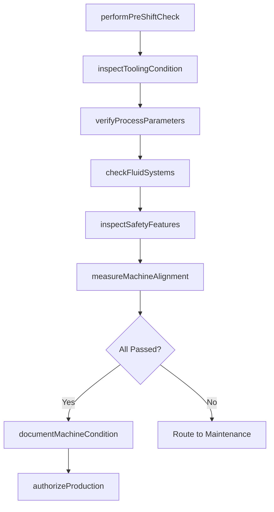
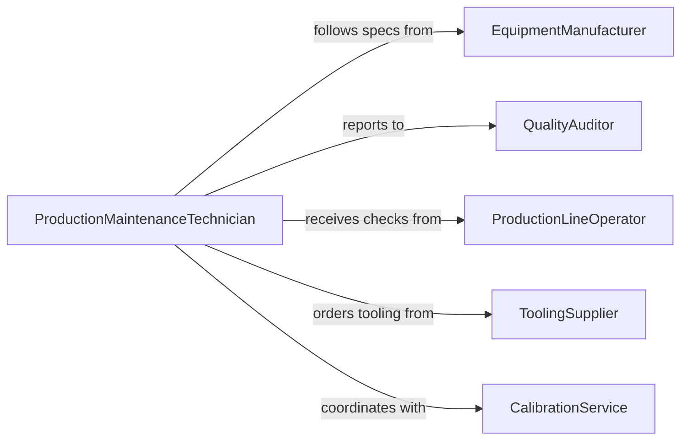

# Inspect Production Equipment

> Business-as-Code definition for inspecting production equipment. Models the inspection process from pre-shift checks through in-process monitoring and post-maintenance verification on manufacturing lines.

## Overview

Inspecting production equipment involves examining manufacturing machinery, assembly line stations, CNC machines, injection molders, presses, packaging systems, and process control instruments to ensure they are capable of producing output that meets quality specifications. Inspectors verify machine alignment, tooling condition, sensor calibration, fluid levels, filter cleanliness, and control system parameters. This activity is fundamental to maintaining product quality, reducing scrap rates, preventing unplanned line stoppages, and supporting continuous improvement programs in discrete and process manufacturing environments.

## Actors

| Actor | Description |
|-------|-------------|
| EquipmentManufacturer | Provides maintenance schedules, tooling specifications, and service documentation |
| QualityAuditor | Verifies that equipment capability meets product quality requirements |
| ProductionLineOperator | Uses equipment daily and performs pre-shift inspection checks |
| ToolingSupplier | Furnishes cutting tools, dies, molds, and wear components |
| CalibrationService | Certifies accuracy of sensors, gauges, and measurement devices on production lines |
| RegulatoryInspector | Audits equipment condition for industries with manufacturing regulations such as food or pharma |

## Roles

| Role | Description |
|------|-------------|
| ProductionMaintenanceTechnician | Conducts detailed equipment inspections and performs preventive maintenance |
| ProcessEngineer | Evaluates equipment capability and establishes inspection criteria |
| QualityControlInspector | Verifies that equipment conditions support product specification compliance |
| MaintenancePlanner | Schedules inspections around production runs to minimize downtime |
| ShiftSupervisor | Ensures pre-shift inspections are completed before production begins |

## Entities

| Entity | Description |
|--------|-------------|
| ProductionMachine | A registered piece of manufacturing equipment on a production line |
| ToolingSet | The cutting tools, dies, or molds installed on a machine for a specific product |
| InspectionChecklist | A standardized set of items to verify for each machine type |
| MachineConditionReport | A summary of equipment health based on inspection findings |
| ProcessParameter | A measurable setting such as speed, feed rate, temperature, or pressure |
| PreShiftCheckRecord | Documentation of operator-performed checks before starting production |
| DowntimeEvent | A recorded instance of production stoppage due to equipment issues |

## Actions

| Action | Description |
|--------|-------------|
| performPreShiftCheck | Execute operator-level inspection before starting a production run |
| inspectToolingCondition | Examine cutting tools, dies, or molds for wear, chipping, or damage |
| verifyProcessParameters | Confirm machine settings match required specifications for the current product |
| checkFluidSystems | Inspect coolant, hydraulic, and lubrication systems for levels and contamination |
| inspectSafetyFeatures | Verify guards, interlocks, and light curtains are functional |
| measureMachineAlignment | Check spindle runout, platen parallelism, and guide rail straightness |
| documentMachineCondition | Record findings and assign an overall readiness rating |
| authorizeProduction | Approve equipment for the next production run based on inspection results |

## Events

| Event | Description |
|-------|-------------|
| preShiftCheckCompleted | An operator has finished the pre-production inspection checklist |
| toolingConditionAssessed | Cutting tools or dies have been evaluated for wear and damage |
| processParametersVerified | Machine settings have been confirmed against product specifications |
| fluidSystemsChecked | Coolant, hydraulic, and lubrication levels have been inspected |
| safetyFeaturesInspected | Guards and interlocks have been tested |
| alignmentMeasured | Machine alignment values have been recorded |
| machineConditionDocumented | An overall equipment condition report has been generated |
| productionAuthorized | Equipment has been approved to begin or resume production |

## Searches

| Search | Description |
|--------|-------------|
| findMachinesDueForInspection | List production equipment with upcoming preventive inspection dates |
| getToolingWearHistory | Retrieve tooling condition data over time for a specific machine |
| findMachinesOutOfAlignment | Locate equipment with alignment values outside specifications |
| getDowntimeByEquipment | Retrieve production stoppage history linked to equipment issues |
| getPreShiftCheckStatus | View which machines have completed or are pending pre-shift inspections |

## Workflow



## Actor Relationships



## Usage

### Calling Actions

```typescript
import { inspectProductionEquipment } from '@headlessly/inspect-production-equipment'

const inspector = inspectProductionEquipment()

// Perform a pre-shift check on a CNC milling center
const check = await inspector.performPreShiftCheck({
  machineId: 'CNC-MILL-008',
  operator: 'op-tkim',
  items: [
    { item: 'spindleRunout', value: 0.005, unit: 'mm', limit: 0.010, status: 'pass' },
    { item: 'coolantLevel', status: 'pass' },
    { item: 'wayLubrication', status: 'pass' },
    { item: 'chipConveyor', status: 'pass' },
    { item: 'doorInterlock', status: 'pass' }
  ]
})

// Inspect tooling condition after a production run
await inspector.inspectToolingCondition({
  machineId: 'CNC-MILL-008',
  tooling: [
    { toolId: 'EM-10-4FL', type: 'endmill', wearLand: 0.12, maxWearLand: 0.30, unit: 'mm', status: 'acceptable' },
    { toolId: 'DRILL-8.5', type: 'drill', wearLand: 0.28, maxWearLand: 0.30, unit: 'mm', status: 'nearLimit' }
  ]
})

// Authorize production after successful inspection
await inspector.authorizeProduction({
  machineId: 'CNC-MILL-008',
  productId: 'PART-A7042',
  authorizedBy: 'shift-sup-jnelson'
})
```

### Event-Driven Automation

```typescript
// Alert when tooling is near wear limit
inspector.toolingConditionAssessed(async ({ machineId, tooling }) => {
  const nearLimit = tooling.filter(t => t.status === 'nearLimit')
  if (nearLimit.length > 0) {
    await notify({
      to: 'tooling-crib',
      message: `${machineId}: ${nearLimit.map(t => t.toolId).join(', ')} approaching wear limit`
    })
  }
})

// Track equipment-related downtime patterns
inspector.machineConditionDocumented(async ({ machineId, rating }) => {
  if (rating === 'poor') {
    await notify({
      to: 'maintenance-planning',
      message: `${machineId} rated 'poor' - schedule comprehensive maintenance`
    })
  }
})
```
